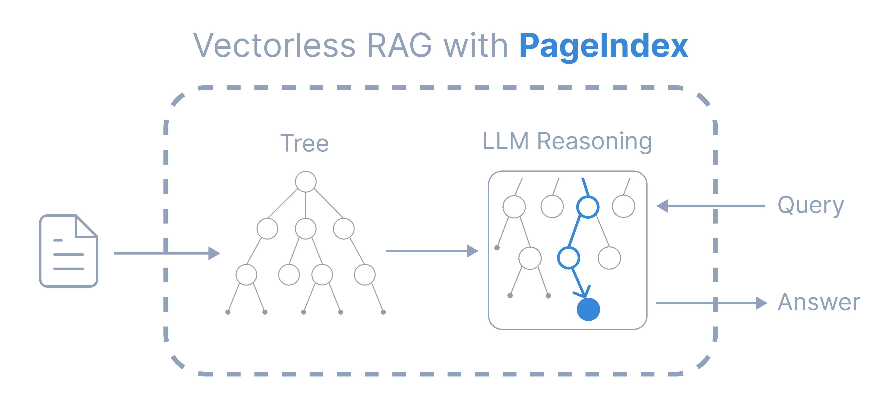

通过目录树索引

Github (4k stars): https://github.com/VectifyAI/PageIndex

https://github.com/Jimmycarroll2021/vectorless-RAG

https://github.com/satish860/vectorless

https://github.com/Jimmycarroll2021/vectorless-RAG

你是否对向量数据库检索长篇专业文档的准确性感到沮丧？传统的基于矢量的RAG依赖于语义相似性，而非真正的相关性。但相似性≠相关性——我们在检索中真正需要的是相关性，而这需要推理。在处理需要领域专业知识和多步骤推理的专业文档时，相似性搜索往往表现不足。

受AlphaGo启发，我们提出了PageIndex——一种无向量、基于推理的RAG系统，为长文档构建层级树索引，并在该索引上推理检索。它模拟了人类专家如何通过树状搜索导航和提取复杂文档知识，使大型语言模型能够通过思考和推理找到最相关的文档部分。它通过两个步骤进行检索：

生成文档索引的“目录”树结构索引
通过树搜索进行基于推理的检索

🧩 特征
与传统的矢量RAG相比，PageIndex具备以下特点：

无向量数据库：使用文档结构和大型语言模型推理进行检索，而非向量搜索。
无分块：文档被组织成自然的部分，而非人工块。
类人检索：模拟人类专家如何导航和提取复杂文档中的知识。
透明检索流程：基于推理的检索——可追溯且可解释。说再见了近似向量搜索（“vibe retrieval”）。
PageIndex 支持基于推理的 RAG 系统，在 FinanceBench 上实现了 98.7% 的准确率，展示了专业文档分析的顶尖表现（详情请参见我们的博客文章）。
