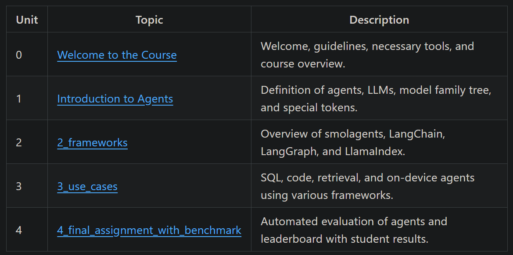

# 1. hugging face agent course

- Github (5.7k stars): https://github.com/huggingface/agents-course
- Course: https://huggingface.co/learn/agents-course/unit0/introduction
- Hugging Face Agents Course

# 2. 李宏毅agent课程

一堂课搞懂 AI Agent 的原理：https://www.youtube.com/watch?v=M2Yg1kwPpts

# 3. 微软agent入门课程

- Github(7.9k stars): https://github.com/microsoft/ai-agents-for-beginners

10节课，支持多语种，在translation文件夹下，同时有视频课程，提供jupyter

| **Lesson**                               | **Text & Code**                                    | **Video**                                                  | **Extra Learning**                                                                     |
|------------------------------------------|----------------------------------------------------|------------------------------------------------------------|----------------------------------------------------------------------------------------|
| Intro to AI Agents and Agent Use Cases   | [Link](./01-intro-to-ai-agents/README.md)          | [Video](https://youtu.be/3zgm60bXmQk?si=z8QygFvYQv-9WtO1)  | [Link](https://aka.ms/ai-agents-beginners/collection?WT.mc_id=academic-105485-koreyst) |
| Exploring AI Agentic Frameworks          | [Link](./02-explore-agentic-frameworks/README.md)  | [Video](https://youtu.be/ODwF-EZo_O8?si=Vawth4hzVaHv-u0H)  | [Link](https://aka.ms/ai-agents-beginners/collection?WT.mc_id=academic-105485-koreyst) |
| Understanding AI Agentic Design Patterns | [Link](./03-agentic-design-patterns/README.md)     | [Video](https://youtu.be/m9lM8qqoOEA?si=BIzHwzstTPL8o9GF)  | [Link](https://aka.ms/ai-agents-beginners/collection?WT.mc_id=academic-105485-koreyst) |
| Tool Use Design Pattern                  | [Link](./04-tool-use/README.md)                    | [Video](https://youtu.be/vieRiPRx-gI?si=2z6O2Xu2cu_Jz46N)  | [Link](https://aka.ms/ai-agents-beginners/collection?WT.mc_id=academic-105485-koreyst) |
| Agentic RAG                              | [Link](./05-agentic-rag/README.md)                 | [Video](https://youtu.be/WcjAARvdL7I?si=gKPWsQpKiIlDH9A3)  | [Link](https://aka.ms/ai-agents-beginners/collection?WT.mc_id=academic-105485-koreyst) |
| Building Trustworthy AI Agents           | [Link](./06-building-trustworthy-agents/README.md) | [Video](https://youtu.be/iZKkMEGBCUQ?si=jZjpiMnGFOE9L8OK ) | [Link](https://aka.ms/ai-agents-beginners/collection?WT.mc_id=academic-105485-koreyst) |
| Planning Design Pattern                  | [Link](./07-planning-design/README.md)             | [Video](https://youtu.be/kPfJ2BrBCMY?si=6SC_iv_E5-mzucnC)  | [Link](https://aka.ms/ai-agents-beginners/collection?WT.mc_id=academic-105485-koreyst) |
| Multi-Agent Design Pattern               | [Link](./08-multi-agent/README.md)                 | [Video](https://youtu.be/V6HpE9hZEx0?si=rMgDhEu7wXo2uo6g)  | [Link](https://aka.ms/ai-agents-beginners/collection?WT.mc_id=academic-105485-koreyst) |
| Metacognition Design Pattern             | [Link](./09-metacognition/README.md)               | [Video](https://youtu.be/His9R6gw6Ec?si=8gck6vvdSNCt6OcF)  | [Link](https://aka.ms/ai-agents-beginners/collection?WT.mc_id=academic-105485-koreyst) |
| AI Agents in Production                  | [Link](./10-ai-agents-production/README.md)        | [Video](https://youtu.be/l4TP6IyJxmQ?si=31dnhexRo6yLRJDl)  | [Link](https://aka.ms/ai-agents-beginners/collection?WT.mc_id=academic-105485-koreyst) |

# 3. 多 AI Agent 系统 - Crewai: 

本课程探讨了多 AI Agent 如何协作解决复杂问题。它涵盖了框架、协调策略和实际应用。

地址： https://www.deeplearning.ai/short-courses/multi-ai-agent-systems-with-crewai/

# 4. Prompt Engineering

由 AWS 提供，本课程深入探讨为 AI Agent 编写有效Prompt的方法，确保最佳性能和准确性。（有中文版）

地址： https://explore.skillbuilder.aws/learn/course/external/view/elearning/17763/foundations-of-prompt-engineering

# 5. LangGraph 基础课程

学习 LangGraph 的基础知识，这是一个构建基于 Graph 的 AI 系统的强大工具，包括基于 Agent 的架构。

地址： https://academy.langchain.com/courses/intro-to-langgraph

# 6. YouTube AI Agent 教程

这个全面的 YouTube 教程提供了从头开始构建 AI Agent 的实战指导，适合初学者和中级学习者。（ IBM Technology 提供）

地址： https://www.youtube.com/watch?v=gUrENDkPw_k&t=7s

# 7. AI Agent 学习平台

一门专注于利用大型语言模型创建用于各种应用的 AI Agent 课程。

地址： https://llmagents-learning.org/f24

# 8. AI-Agents-IN-LangGraph

又一个关于LangGraph的课程，深入探讨在 LangGraph 中集成 AI Agent，强调 AI 解决方案的可扩展性和鲁棒性。

地址： https://www.deeplearning.ai/short-courses/ai-agents-in-langgraph/

# 9. 英伟达 AI Agent 课程

探索英伟达针对特定应用设计高性能 AI Agent 的尖端技术。

地址：https://learn.nvidia.com/courses/course-detail?course_id=course-v1:DLI+S-FX-15+V1

# 10. AI Agent 设计模式（AutoGen）

本课程介绍了使用 AutoGen 简化自主 AI Agent 开发的设计模式。

地址：https://www.deeplearning.ai/short-courses/ai-agentic-design-patterns-with-autogen/

# 11. AI Agents Workflow（YouTube）

另一个不错的 YouTube 资源，它讨论了管理和扩展 AI Agent 的有效工作流程。（AWS Developers 提供）

地址： https://www.youtube.com/watch?v=kJEr7eFQSJw

# 12. LLM OS 中的 Agent Memory

关注 AI Agent 中的记忆概念，使它们能够随着时间的推移学习和适应，类似于操作系统。

地址： https://www.deeplearning.ai/short-courses/llms-as-operating-systems-agent-memory/

# 13. 构建基于 LlamaIndex 的 Agent RAG

使用 LlamaIndex 构建具有 AI Agent RAG 系统的实用指南。

地址： https://www.deeplearning.ai/short-courses/building-agentic-rag-with-llamaindex/

# 14. AI Agent 入门课程（YouTube）

又一个 AWS Developers 提供的课程，针对新手定制，视频以易于理解的方式阐述了 AI Agent 的基础概念。

地址： https://www.youtube.com/watch?app=desktop&v=2L_XE6g3atI

# 15. Serverless Agentic Workflow（Amazon Bedrock）

学习使用 Amazon Bedrock 部署 AI Agent 的 serverless 工作流程，强调成本效益和可扩展性。

地址：https://www.deeplearning.ai/short-courses/serverless-agentic-workflows-with-amazon-bedrock/

# 16. 微软官方的MCP教程

地址：
https://github.com/microsoft/lets-learn-mcp-python

# 教程的核心就是带你完成两个项目：
1. 🐍 Python 学习助手应用​​：交互式控制台程序，帮助用户学习 Python 概念（初/中/高级），提供个性化挑战、进度跟踪和提示。
2. ​​🧠 AI 研究学习 MCP 服务器​​：高级服务器，用于查找最新 AI/ML 研究论文、生成个性化学习计划和总结突破性发现。

# ​​教程包括：
1. Part 1：设置与核心概念 (15-20 分钟)
   - 安装 VS Code、Python 3.12+ 和 Python 扩展。
   - 学习 MCP 基础：协议定义、客户端-服务器架构。
   - 快速启动：运行 `python part-1-concepts.py`。

2. Part 2：使用 MCP 服务器 - Python 学习助手 (20-35 分钟)
   - 创建基础 MCP 服务器，集成提示（Prompts）和工具（Tools）。
   - 实现功能：
   - 交互式学习会话（示例：列表推导式挑战）。
   * 进度跟踪（`study_progress.json`）。
   * 个性化编码挑战（`beginner_exercises.json`）。

3. Part 3：构建 MCP 服务器 - AI 研究学习中心 (20-35 分钟)
   - 集成外部资源（如 ArXiv API）。
   - 实现功能：
   * `search_research_papers()`：按主题搜索论文。
   * `summarize_paper()`：生成摘要。
   * `create_study_plan()`：个性化学习路线。
   * 自动存储学习笔记至 GitHub。

# 参考

[1] 2025 年 13 门免费 AI Agent 课程资源, https://mp.weixin.qq.com/s/nGmNjQigEcGXwSS8yUKA4A