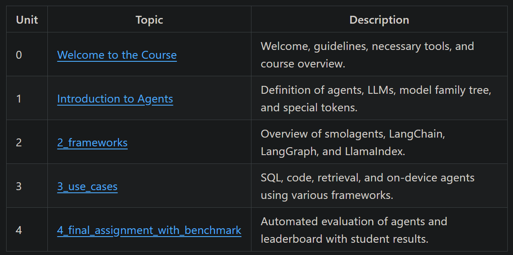

# 1. hugging face agent course

- Github (5.7k stars): https://github.com/huggingface/agents-course
- Course: https://huggingface.co/learn/agents-course/unit0/introduction
- Hugging Face Agents Course

# 2. 李宏毅agent课程

一堂课搞懂 AI Agent 的原理：https://www.youtube.com/watch?v=M2Yg1kwPpts

# 3. 微软agent入门课程

- Github(7.9k stars): https://github.com/microsoft/ai-agents-for-beginners

10节课，支持多语种，在translation文件夹下，同时有视频课程，提供jupyter

| **Lesson**                               | **Text & Code**                                    | **Video**                                                  | **Extra Learning**                                                                     |
|------------------------------------------|----------------------------------------------------|------------------------------------------------------------|----------------------------------------------------------------------------------------|
| Intro to AI Agents and Agent Use Cases   | [Link](./01-intro-to-ai-agents/README.md)          | [Video](https://youtu.be/3zgm60bXmQk?si=z8QygFvYQv-9WtO1)  | [Link](https://aka.ms/ai-agents-beginners/collection?WT.mc_id=academic-105485-koreyst) |
| Exploring AI Agentic Frameworks          | [Link](./02-explore-agentic-frameworks/README.md)  | [Video](https://youtu.be/ODwF-EZo_O8?si=Vawth4hzVaHv-u0H)  | [Link](https://aka.ms/ai-agents-beginners/collection?WT.mc_id=academic-105485-koreyst) |
| Understanding AI Agentic Design Patterns | [Link](./03-agentic-design-patterns/README.md)     | [Video](https://youtu.be/m9lM8qqoOEA?si=BIzHwzstTPL8o9GF)  | [Link](https://aka.ms/ai-agents-beginners/collection?WT.mc_id=academic-105485-koreyst) |
| Tool Use Design Pattern                  | [Link](./04-tool-use/README.md)                    | [Video](https://youtu.be/vieRiPRx-gI?si=2z6O2Xu2cu_Jz46N)  | [Link](https://aka.ms/ai-agents-beginners/collection?WT.mc_id=academic-105485-koreyst) |
| Agentic RAG                              | [Link](./05-agentic-rag/README.md)                 | [Video](https://youtu.be/WcjAARvdL7I?si=gKPWsQpKiIlDH9A3)  | [Link](https://aka.ms/ai-agents-beginners/collection?WT.mc_id=academic-105485-koreyst) |
| Building Trustworthy AI Agents           | [Link](./06-building-trustworthy-agents/README.md) | [Video](https://youtu.be/iZKkMEGBCUQ?si=jZjpiMnGFOE9L8OK ) | [Link](https://aka.ms/ai-agents-beginners/collection?WT.mc_id=academic-105485-koreyst) |
| Planning Design Pattern                  | [Link](./07-planning-design/README.md)             | [Video](https://youtu.be/kPfJ2BrBCMY?si=6SC_iv_E5-mzucnC)  | [Link](https://aka.ms/ai-agents-beginners/collection?WT.mc_id=academic-105485-koreyst) |
| Multi-Agent Design Pattern               | [Link](./08-multi-agent/README.md)                 | [Video](https://youtu.be/V6HpE9hZEx0?si=rMgDhEu7wXo2uo6g)  | [Link](https://aka.ms/ai-agents-beginners/collection?WT.mc_id=academic-105485-koreyst) |
| Metacognition Design Pattern             | [Link](./09-metacognition/README.md)               | [Video](https://youtu.be/His9R6gw6Ec?si=8gck6vvdSNCt6OcF)  | [Link](https://aka.ms/ai-agents-beginners/collection?WT.mc_id=academic-105485-koreyst) |
| AI Agents in Production                  | [Link](./10-ai-agents-production/README.md)        | [Video](https://youtu.be/l4TP6IyJxmQ?si=31dnhexRo6yLRJDl)  | [Link](https://aka.ms/ai-agents-beginners/collection?WT.mc_id=academic-105485-koreyst) |

# 3. 多 AI Agent 系统 - Crewai: 

本课程探讨了多 AI Agent 如何协作解决复杂问题。它涵盖了框架、协调策略和实际应用。

地址： https://www.deeplearning.ai/short-courses/multi-ai-agent-systems-with-crewai/

# 4. Prompt Engineering

由 AWS 提供，本课程深入探讨为 AI Agent 编写有效Prompt的方法，确保最佳性能和准确性。（有中文版）

地址： https://explore.skillbuilder.aws/learn/course/external/view/elearning/17763/foundations-of-prompt-engineering

# 5. LangGraph 基础课程

学习 LangGraph 的基础知识，这是一个构建基于 Graph 的 AI 系统的强大工具，包括基于 Agent 的架构。

地址： https://academy.langchain.com/courses/intro-to-langgraph

# 6. YouTube AI Agent 教程

这个全面的 YouTube 教程提供了从头开始构建 AI Agent 的实战指导，适合初学者和中级学习者。（ IBM Technology 提供）

地址： https://www.youtube.com/watch?v=gUrENDkPw_k&t=7s

# 7. AI Agent 学习平台

一门专注于利用大型语言模型创建用于各种应用的 AI Agent 课程。

地址： https://llmagents-learning.org/f24

# 8. AI-Agents-IN-LangGraph

又一个关于LangGraph的课程，深入探讨在 LangGraph 中集成 AI Agent，强调 AI 解决方案的可扩展性和鲁棒性。

地址： https://www.deeplearning.ai/short-courses/ai-agents-in-langgraph/

# 9. 英伟达 AI Agent 课程

探索英伟达针对特定应用设计高性能 AI Agent 的尖端技术。

地址：https://learn.nvidia.com/courses/course-detail?course_id=course-v1:DLI+S-FX-15+V1

# 10. AI Agent 设计模式（AutoGen）

本课程介绍了使用 AutoGen 简化自主 AI Agent 开发的设计模式。

地址：https://www.deeplearning.ai/short-courses/ai-agentic-design-patterns-with-autogen/

# 11. AI Agents Workflow（YouTube）

另一个不错的 YouTube 资源，它讨论了管理和扩展 AI Agent 的有效工作流程。（AWS Developers 提供）

地址： https://www.youtube.com/watch?v=kJEr7eFQSJw

# 12. LLM OS 中的 Agent Memory

关注 AI Agent 中的记忆概念，使它们能够随着时间的推移学习和适应，类似于操作系统。

地址： https://www.deeplearning.ai/short-courses/llms-as-operating-systems-agent-memory/

# 13. 构建基于 LlamaIndex 的 Agent RAG

使用 LlamaIndex 构建具有 AI Agent RAG 系统的实用指南。

地址： https://www.deeplearning.ai/short-courses/building-agentic-rag-with-llamaindex/

# 14. AI Agent 入门课程（YouTube）

又一个 AWS Developers 提供的课程，针对新手定制，视频以易于理解的方式阐述了 AI Agent 的基础概念。

地址： https://www.youtube.com/watch?app=desktop&v=2L_XE6g3atI

# 15. Serverless Agentic Workflow（Amazon Bedrock）

学习使用 Amazon Bedrock 部署 AI Agent 的 serverless 工作流程，强调成本效益和可扩展性。

地址：https://www.deeplearning.ai/short-courses/serverless-agentic-workflows-with-amazon-bedrock/

# 16. 微软官方的MCP教程

地址：
https://github.com/microsoft/lets-learn-mcp-python

# 教程的核心就是带你完成两个项目：
1. 🐍 Python 学习助手应用​​：交互式控制台程序，帮助用户学习 Python 概念（初/中/高级），提供个性化挑战、进度跟踪和提示。
2. ​​🧠 AI 研究学习 MCP 服务器​​：高级服务器，用于查找最新 AI/ML 研究论文、生成个性化学习计划和总结突破性发现。

# ​​教程包括：
1. Part 1：设置与核心概念 (15-20 分钟)
   - 安装 VS Code、Python 3.12+ 和 Python 扩展。
   - 学习 MCP 基础：协议定义、客户端-服务器架构。
   - 快速启动：运行 `python part-1-concepts.py`。

2. Part 2：使用 MCP 服务器 - Python 学习助手 (20-35 分钟)
   - 创建基础 MCP 服务器，集成提示（Prompts）和工具（Tools）。
   - 实现功能：
   - 交互式学习会话（示例：列表推导式挑战）。
   * 进度跟踪（`study_progress.json`）。
   * 个性化编码挑战（`beginner_exercises.json`）。

3. Part 3：构建 MCP 服务器 - AI 研究学习中心 (20-35 分钟)
   - 集成外部资源（如 ArXiv API）。
   - 实现功能：
   * `search_research_papers()`：按主题搜索论文。
   * `summarize_paper()`：生成摘要。
   * `create_study_plan()`：个性化学习路线。
   * 自动存储学习笔记至 GitHub。

# 17. Agentic AI Crash Course

Github链接如下：https://github.com/aishwaryanr/awesome-generative-ai-guide/tree /main/free_courses /agentic_ai_crash_course

麻省理工学院和牛津大学在 GitHub 上免费发布了价值2500美金的Agent 人工智能课程。（白嫖2500美金）

课程主要内容（10篇阅读课程+12个视频讲座）：

1. AI Agent 到底是什么？（Agent 的定义、和普通聊天式 AI 的区别）

2. Agentic 系统的 4 种类型（不同自治程度/架构范式，怎么选）

3. AI 的“工具”是什么？（Tool/Function Calling、API 接入、工具链）

4. Agentic RAG（RAG + Agent 的结合：检索→推理→行动）

5. MCP（Model Context Protocol）（上下文/工具/数据对接的新协议思路）

6. 规划 & 推理模型（Planning + Reasoning：让 Agent 会“先想再做”）

7. 记忆（Memory）（短期/长期记忆、偏好、状态、跨会话上下文）

8. 多智能体系统（Multi-Agent）（分工协作、协调机制、扩展性）

9. 真实世界系统拆解（生产级 Agent 系统怎么搭、坑在哪里）

10. 经验总结 & 未来趋势（关键教训、下一步会往哪走）

# 18. Learn Claude Code

54.4k stars

Learn Claude Code 项目（12 节课从零搭 Agent）：github.com/shareAI-lab/learn-claude-code

中文学习网站：
- learn-claude-agents.vercel.app/zh
- 可访问：https://learn.shareai.run/zh/

Anthropic「Building Effective Agents」：anthropic.com/research/building-effective-agents

# 19. Agent-Learning-Hub

- Agent-Learning-Hub: https://github.com/datawhalechina/Agent-Learning-Hub
- https://datawhalechina.github.io/Agent-Learning-Hub/

仓库还附了一份 Project Ladder，从 Level 1 的 Calculator Agent 到 Level 11 的 Production Harness，每级对应一个可运行项目。

Level 1-3 练基础：工具调用、搜索与引用、RAG。Level 4-6 进真实工程：code review agent、browser agent、Claude Code-like nano agent。Level 7-11 做架构：gateway、skill pack、multi-agent 协作、个人 agent、production harness。

# 20. 微软生成式AI课程 

- Github (119k stars): https://github.com/microsoft/generative-ai-for-beginners

Microsoft 开源了一份 21 节课的完整课程 —— 从生成式 AI 基础概念，到 RAG、AI Agent、模型微调、图像生成、向量数据库，覆盖生成式 AI 应用开发的全链路。

119k Star， 50+ 语言翻译，每一节课都有视频 + 代码 + 阅读材料。这是一套真正的开发者课程。

# 21. AI Engineering from Scratch

- 项目地址 （52k stars）：https://github.com/rohitg00/ai-engineering-from-scratch
- 在线课程：https://aiengineeringfromscratch.com
- 中文翻译 （1k stars）：https://github.com/fancyboi999/ai-engineering-from-scratch-zh 

AI Engineering from Scratch：503 节课，20 个阶段，从线性代数到自主多 Agent 系统

这个课程最难得的是完整性——它把 AI 工程的每一个环节都覆盖了：

数学基础
- 线性代数：矩阵运算、特征值分解
- 微积分：梯度下降、链式法则
- 概率统计：贝叶斯推断、最大似然估计
核心算法
- 手写 Tokenizer（BPE、WordPiece）
- 实现 Self-Attention（不用 PyTorch）
- 从零构建 Transformer
- 实现 RLHF 训练循环
Agent 系统
- Tool Calling 协议实现
- 持久化记忆系统（Agent Memory）
- 多 Agent 协作框架
- Swarm Intelligence 群体智能
生产部署
- MCP Server 开发
- Skill 打包与分发
- Capstone 综合项目

# 22. Easy-Vibe

Easy-Vibe 不是又一个编程教程。它是把「AI 时代人人都会编程」这句话，真正做成了可执行的学习路径。10K Star，Datawhale 出品，适合转给身边想学但不知道怎么开始的零基础朋友。

GitHub：https://github.com/datawhalechina/easy-vibe

在线阅读：https://datawhalechina.github.io/easy-vibe/welcome.html

# 23. WorkBuddy 实战蓝皮书

- Github (3.2k stars): https://github.com/AlephAITech/WorkBuddyGuide
- 官网: workbuddy.homes/
 
从第一项任务，到一支 AI 团队

这不是官方功能说明书的改写，而是一本以真实任务为主线的实战读本。先完成安装和第一项工作，再进入移动办公、知识管理、专业诊断、内容自动化和多 Agent 团队，最后把一次成功变成团队可复用的工作系统。

# 24. ms-cookbook 魔搭紫皮书

- Github (396 stars): https://github.com/modelscope/ms-cookbook
- 官网: modelscope.cn/active/ms-cookbook
- 魔搭紫皮书｜ModelScope Cookbook：面向开发者的开源模型应用实战指南，覆盖模型选型、推理、微调、评测、RAG、Agent 与 AIGC，从跑通第一个模型到构建实际应用。

《ModelScope Cookbook》是一本实用的开源指南，教你如何在实际应用中使用开源AI模型。它将模型选择、推断、数据准备、微调、评估和应用开发整合为一个结构化的学习资源。

一个有用的模型应用始于实际决策：哪个模型适合任务，需要什么硬件，如何适应你的数据，以及如何判断结果。该手册将这些决策与可运行的示例连接起来，使用EvalScope、ms-swift、DiffSynth和Ollama等工具，以及RAG和Agent工作流。

目标是帮助开发者从最初成功的推理，逐步发展到可以复现、评估和改进的应用。示例包括企业知识问答、语音助手、客户服务质量分析、健身教练、产品形象创建和生产线检查。

# 参考

[1] 2025 年 13 门免费 AI Agent 课程资源, https://mp.weixin.qq.com/s/nGmNjQigEcGXwSS8yUKA4A