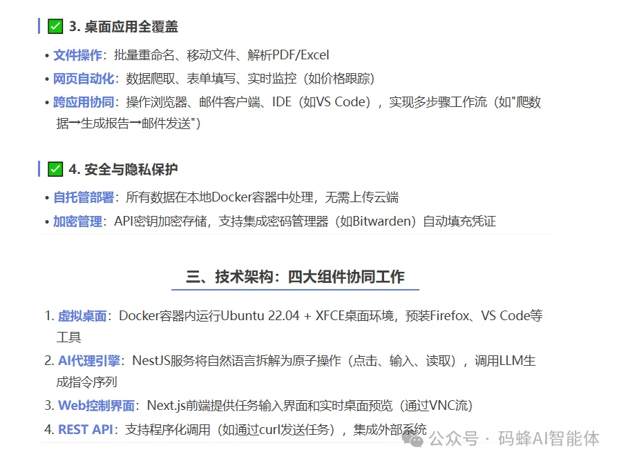

# OpenManusWeb
https://github.com/YunQiAI/OpenManusWeb

# mcp-playwright
https://github.com/executeautomation/mcp-playwright.git

核心功能
• 让 LLM 具备浏览器自动化能力：通过 MCP 连接 LLM，让 AI 能够直接操作网页。适用于 Claude、GPT-4o、DeepSeek 等大语言模型。
• 支持与网页交互：支持常见的网页操作，包括点击按钮、填写表单、滚动页面等。
• 截取网页截图：可以通过 Playwright MCP Server 获取网页的屏幕截图，分析当前页面的 UI 和内容。
• 执行 JavaScript 代码：支持在浏览器环境中运行 JavaScript，与网页进行更复杂的交互。
• 集成便捷工具：支持 Smithery 和 mcp-get 等工具，简化安装和配置过程。

# bytebot

GitHub项目地址：https://github.com/bytebot-ai/bytebot

官方文档：https://www.bytebot.ai/

# 星辰 AgentRPA（面向流程自动化的 RPA 系统）
- Github (3k stars): https://github.com/iflytek/astron-rpa
- 讯飞出品

# 参考

[1] 告别加班！开源 Bytebot：AI24 小时做报表理文件，一句话搞定自动化！https://mp.weixin.qq.com/s/WDaqYuLruRwpRmnosx3Ztw