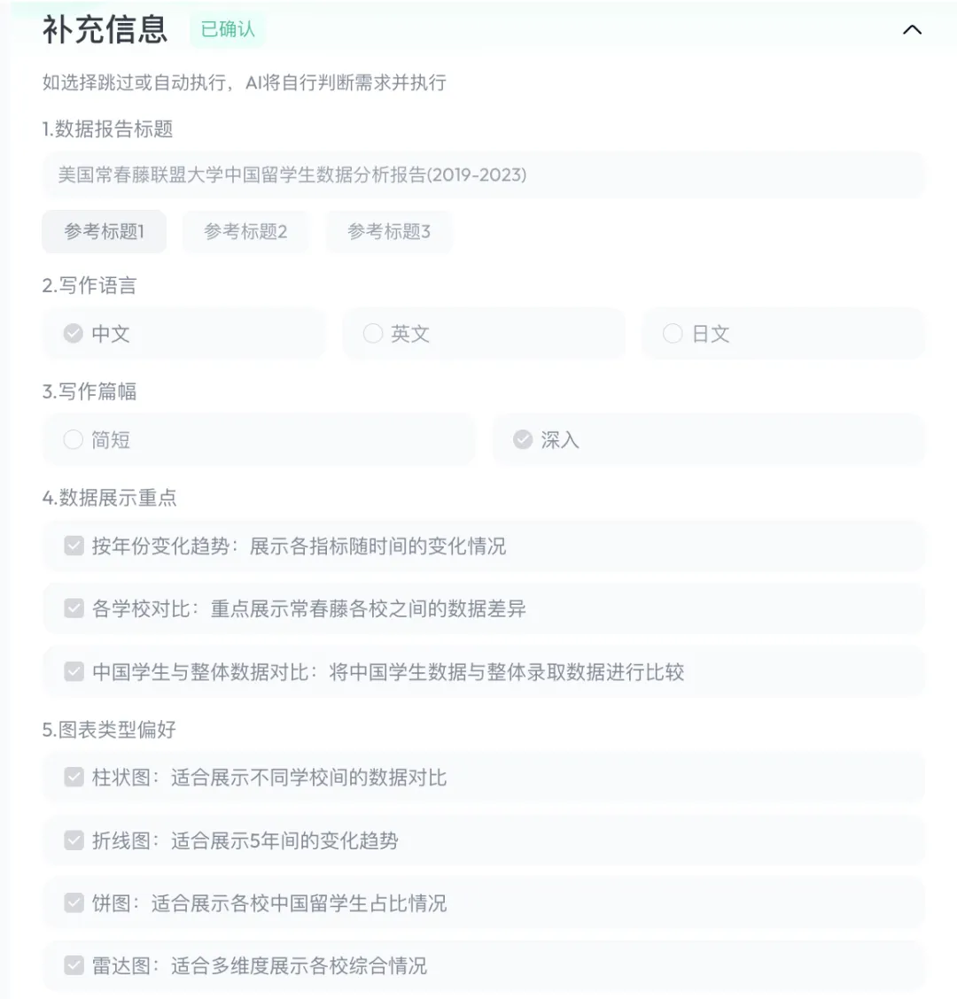

# 1. Skywork AI | 发布Super Agent

截至目前，Super Agent性能已经超越Manus、OpenAI Deep Research，在通用AI助手能力测试基准GAIA上排名第一。

现有Agent产品仍面临不少挑战：

挑战一，生成结果常常结构不完整、可用性差，难以满足真实办公需求；在办公场景下，我们的产出往往是doc文档、PPT演讲稿、Excel表格等office大件，我们「希望通过Agent生成的分析文档、PPT、数据表格等稍作修改就可以直接用」，但实际我们需要对Agent生成的内容做重新的归纳总结排版才能得到想要的结果。

挑战二，复杂的提示词技巧，交互门槛高，普通用户使用体验不佳，尤其是当涉及一些分析报告、数据归纳的时候，有时候即使是专业人员也不确定自己真正想要的结果是什么样的。当面对此类问题的时候，我们「希望Agent能够在任务规划的关键节点具备交互能力」，即让用户决策Agent的行动，这可以让用户更好理解Agent行为，从而提高对整个Agent系统生成内容的信任度。

挑战三，联网搜索能力虽普遍具备，但多数产品仅提供链接跳转，缺乏真正的信息溯源机制，内容可信度难以保障。相信很多小伙伴会遇到这种情况：模型给的引用链接和实际上下文内容完全不符，这对于行业调研、数据分析、银行金融等应用场景的影响是致命的，如何降低模型幻觉，实现检索知识的溯源同样是AI Agent面临的重大挑战。

针对这些行业挑战，Skywork推出的Super Agent展示出了差异化优势，它凭借“「可交付的office（docs、sheets、slides）办公成果」、「个性化澄清表单」以及「全链路内容精准溯源」的三重优势，成功突破了行业瓶颈，重构了用户与智能Agent的连接方式，真正让“人人都能高效使用大模型”成为现实。

Super Agent独创的【个性化澄清表单】极大降低了用户的使用门槛——用户只需提出一个模糊的问题，「系统便自动生成澄清选项，帮助用户快速聚焦所需内容方向与风格」，即便是初次使用者，也能轻松获得高质量结果。如下图详细展示自动澄清表单提示功能：

「发起任务后，AI会分析意图，补充收集信息」

# 2. Cursor

Claude Code 指南： claude-code-guide - 免费 - 指令全 - 新手进阶都适用

亮点

覆盖 Claude CLI 安装、配置、API Key 设置等全流程

详细讲解每个命令和参数，包含 REPL、One-Shot、Session、Config 等模式

MCP 工具集成和权限系统实操，支持自动化、CI/CD、项目协作等高级用法

https://github.com/zebbern/claude-code-guide      

**消息排队 (Queued messages)**

现在，Agent 还在忙活当前任务的时候，你就可以给它安排下一个活儿了。

直接输入你的指令，发送就行，它会自动进入排队。一旦进入队列，你还可以调整任务顺序，不用干等着，直接让它接着干。

**记忆功能 (Memories) 正式上线**

记忆功能 (Memories) 现在正式发布了。

从 1.0 版本以来，提升了记忆生成的质量，优化了编辑器里的界面，还加入了用户审批机制，后台生成的记忆需要你同意才会保存，保证你对它的信任。

**PR 索引和搜索 (PR indexing & search)**

Cursor 现在索引和总结 PR (Pull Request) 的能力，就跟它处理文件一样强。

你可以按语义搜索老的 PR，或者直接把某个 PR、issue、commit、分支抓到上下文里。

这还包括了相关的 GitHub 评论、BugBot 的审查记录和 Slack 里的 Agent 支持，让事后复盘或者追溯问题快得多。

**语义搜索 Embedding 模型升级**

代码库搜索现在更准了，因为我们换了新的 embedding 模型。

我们也重新调整了提示词，让搜索结果更干净、更聚焦。

# 参考

[1] Skywork AI | 发布Super Agent，一站式搞定写作、开发、分析与创意内容生成, https://mp.weixin.qq.com/s/DcNDCNCKY88Y69DZB79tww
[2] Cursor 1.2 更新！Agent 更会规划+支持排队，Pro 套餐限制：突发额度用完，要么等冷却要么付费。https://mp.weixin.qq.com/s/kIa5lkMTvUqxIUlKn5J0LA