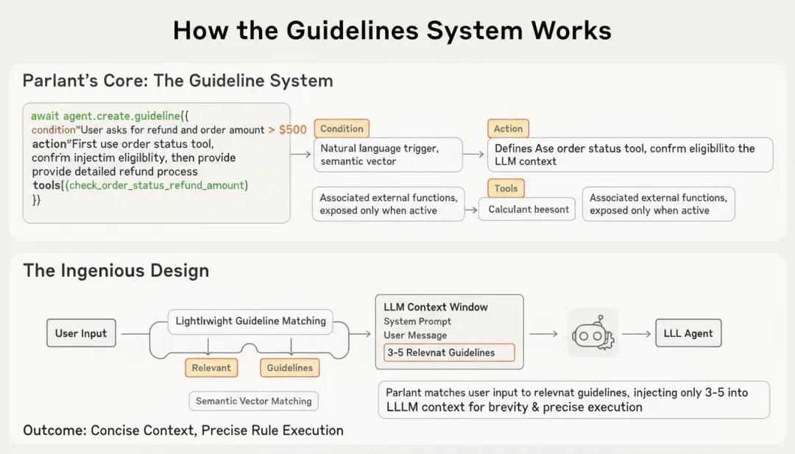

https://github.com/emcie-co/parlant


相比LangChain / LlamaIndex 等传统框架只能静态一股脑注入所有上下文，Parlant可以通过动态规则注入、自我批判机制以及条件化工具调用，让agent变得可控可解释。

那么，Parlant是如何设计的，我们如何将其结合Milvus用于生产级agent？本文将一一解释。


传统框架的不足与Parlant的创新
传统的几百条规则、几十个工具与demo式饱和式上下文注入，往往在小规模测试中表现还不错，但在生产环境中就会立刻暴露三个致命问题：

规则冲突无法解决：当多条规则同时适用时，LLM会随机选择或混合执行，导致行为不可预测。例如，一个电商Agent同时面对"VIP用户优先处理"和"高额订单需要二次确认"两条规则时，执行优先级完全依赖模型的随机性。

边缘情况覆盖不足：你无法预知所有可能的用户输入组合。当遇到训练数据中罕见的场景时，Agent会退化到通用回复模式，丢失业务特异性。

调试与优化成本高昂：当Agent行为出现问题时，你无法确定是哪条规则失效了，只能重新调整整个系统提示，然后再次进行全量测试。

针对以上问题，Parlant引入了动态规则注入：将规则定义与规则执行分离，通过动态匹配机制确保只有最相关的规则被注入到LLM上下文中。

这个设计理念类似于现代Web框架中的路由系统——你不会在每个请求中加载所有路由处理器，而是根据URL动态匹配对应的处理逻辑。

具体来说，Parlant的核心是Guidelines系统，每条指南包含三个要素：

```python
await agent.create_guideline(
    condition="用户询问退款且订单金额超过500元",
    action="先调用订单状态检查工具，确认是否符合退款条件，然后提供详细的退款流程说明",
    tools=[check_order_status, calculate_refund_amount]
)
```

Condition（条件）：用自然语言描述触发场景，Parlant会将其转换为语义向量进行匹配。

Action（行动）：明确定义Agent应该如何响应，这部分会在条件匹配时被注入到LLM上下文。

Tools（工具）：关联的外部函数，只有在指南激活时才会暴露给Agent。

这个设计的精妙之处在于：Parlant在每次用户输入时，会先进行一次轻量级的指南匹配过程，只将相关的3-5条指南注入到LLM上下文中。这样既保持了上下文的简洁性，又确保了规则的精准执行。




在此基础上，Parlant还引入了自我批判机制作为双重保险，来提升规则遵循的一致性与可控性。其流程分为三步走：

生成候选回复：基于匹配的指南和对话上下文生成初步回复

合规性检查：将候选回复与激活的指南进行对比，验证是否完全遵循

修正或确认：如果发现偏差，触发修正流程；如果符合要求，输出最终回复

此外，传统Agent框架会将所有可用工具暴露给LLM，从而导致两个问题：一是上下文膨胀，二是工具误用。Parlant通过将工具与指南绑定，实现了条件化执行：

# 参考

[1] 比LangChain强在哪？Parlant × Milvus动态规则告别agent失控, https://mp.weixin.qq.com/s/kFWlFTcMBmHLgNioKnjsqA