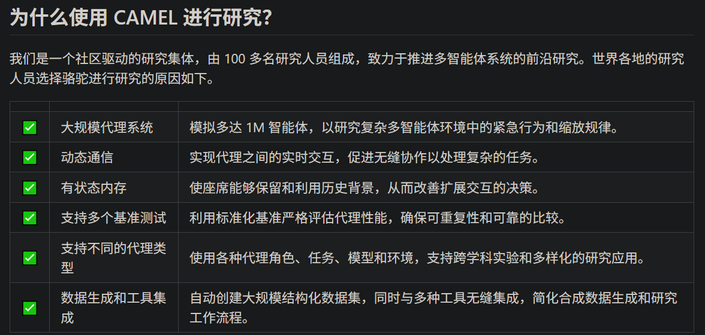

- Github (14.6k stars): https://github.com/camel-ai/camel?utm_source=chatgpt.com

🐫 CAMEL 是一个开源社区，致力于寻找代理的缩放规律。我们相信，大规模研究这些代理可以为了解它们的行为、能力和潜在风险提供宝贵的见解。为了促进该领域的研究，我们实施并支持各种类型的代理、任务、提示、模型和模拟环境。

CAMEL 框架设计原则
🧬 可进化性
该框架使多智能体系统能够通过生成数据和与环境交互来不断发展。这种演变可以由具有可验证奖励的强化学习或监督学习来驱动。

📈 可扩展性
该框架旨在支持拥有数百万代理的系统，确保大规模的高效协调、沟通和资源管理。

💾 状态性
代理维护有状态内存，使它们能够与环境执行多步骤交互并有效地处理复杂的任务。

📖 代码即提示
每一行代码和注释都作为代理的提示。代码应该编写清晰易读，确保人类和代理都能有效地解释它。

