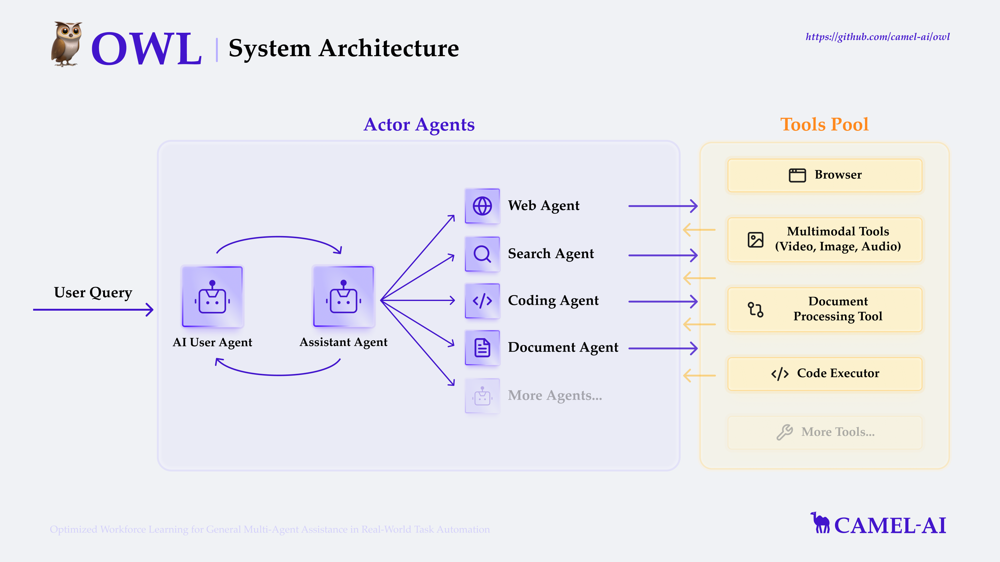
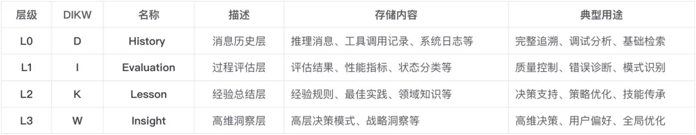

# 1. Multi-Agent-GPT
   - Github (110 stars): https://github.com/YangXuanyi/Multi-Agent-GPT
   - 基本功能
     - 单轮/多轮聊天
     - 多模态信息展示与交互
     - Age
     - 工具
       - Web searching  
       - Image generation
       - Image caption
       - audio-to-text
       - text-to-audio
       - Video caption
     - RAG 
       - 私有数据库
       - 离线部署

# 2. Qwen-Agent
   - Github (1.4k stars): https://github.com/QwenLM/Qwen-Agent
   - built upon Qwen1.5, featuring Function Calling, Code Interpreter, RAG, and Chrome extension.

# 3. OpenAGI

github:https://github.com/agiresearch/OpenAGI

OpenAGI是一个前沿的开源人工通用智能（AGI）研究平台，巧妙地将专业化小模型与高级学习机制相结合，致力于执行并优化特定的高级任务，如情感分析和图像去模糊化。该平台代表了AI研究的最新进展，通过精心设计的系统架构来提升智能任务的处理质量。

主要特征:
- 专家模型集成: OpenAGI结合了针对特定任务的精细化专家模型，从而针对每个任务提供最合适的解决方案。
- 强化学习的应用: 平台采用了基于任务反馈的强化学习（RLTF）方法，此举让模型通过持续学习提高其性能。
- 动态工具选择: 根据任务需求的上下文，OpenAGI可以动态地选取最适合的工具，包括但不限于ChatGPT、LLaMa2等大型语言模型（LLM），以及其他专业模型。

运作机制:
- 在OpenAGI平台上，每项任务开始时，系统首先评估其性质和需求。
- 接着，它从汇聚的专家模型库中选取一个或多个适合解决该问题的模型。
- 任务执行过程中，强化学习机制基于任务反馈不断迭代和调整模型输出，确保输出质量逐步提升。

OpenAGI的多模型和学习方法之融合，不仅为特定AI任务提供了精准的解决方案，还在持续学习和自我改进的过程中，为实现更高阶的智能任务处理设置了新的标准。这个平台展现了开源AGI研究的动力和可能性，是探索未来人工智能潜力的有力工具。

# 4. TaskWeaver

github：https://github.com/microsoft/TaskWeaver

TaskWeaver是一个专为构建大型语言模型（LLM）驱动的自主代理而设计的先进框架，这一架构深刻理解代码的重要性，并以代码作为连接用户需求和功能实现的关键。它具备将用户的复杂请求有效转化为可执行代码的能力，并在这个过程中创新性地将用户定义的插件作为函数进行动态调用。

核心特性:
- 代码转换: 通过LLM，TaskWeaver可以将用户请求转换成高效的执行代码，把纯文字描述的功能需求实体化为程序命令。
- 丰富的数据结构: 框架支持多样化的数据结构，为不同类型的任务提供强大的数据处理能力。
- 插件系统: 用户定义的插件可以轻松集成，成为执行任务时可调用的模块，极大地提升了框架的适用性和灵活性。
- 动态插件选择: 根据任务的需求，框架能动态地选择合适的插件，确保任务执行的优化和个性化。
- LLM编码能力: 利用大型语言模型处理复杂逻辑，编写符合逻辑的严谨代码。
- 集成领域知识: TaskWeaver集成了特定领域的知识示例，这使得它能够对特专业领域进行更加细致的编程。
- 安全执行保障: 平台确保所有生成的代码都在一个安全的环境中执行，避免安全隐患。

TaskWeaver的开发哲学是代码至上。通过允许用户以最直观的方式定义功能需求，并将其转化为精确的代码，这个框架打通了用户意图与软件功能间的直接通路。

TaskWeaver对大型语言模型的编码实力和领域知识的综合应用，确保了在执行用户请求的同时，能够维持代码的结构性和安全性，从而为自主AI代理的构建提供了一个强大且可靠的解决方案。

# 5. MetaGPT

github：https://github.com/geekan/MetaGPT

MetaGPT是一个先进的开源AI代理框架，它巧妙地模拟了传统软件公司的操作架构。该框架通过将GPT代理分配到不同角色—产品经理、项目经理和工程师—推动他们协同工作，解决用户定义的编程难题。

主要特征和优势:
- 模拟专业角色: MetaGPT赋予代理特定的开发团队角色，确保每个步骤都能得到专业处理。
- 中等难度任务处理: 目前MetaGPT擅长执行中等难度的任务，比如编程经典的贪吃蛇游戏或创建基本的实用程序。
- 成本效益: 使用OpenAI的API，集成MetaGPT生成一个完整项目的费用非常合理，大约为2美元。

MetaGPT通过为GPT分配不同的职能角色，从产品经理到架构师，再到项目经理和工程师，形成一个高效协作的实体。这种多代理框架不仅重现了通常由软件公司提供的所有标准操作流程，还使这些流程可访问并容易操控。

实现流程:
- 实现用户需求: 仅需简单的需求描述输入，MetaGPT就能够自动生成用户故事、进行竞争分析、明确需求、设计数据结构和API等各个开发阶段的必需品。
- 发展潜力: 虽然目前主要集中在中等复杂度任务，但MetaGPT所展示的潜力预示着它可能会迅速发展，并最终处理更复杂的编程挑战。
- MetaGPT呈现了开源AI技术如何仿照传统软件开发流程，带来效率和成本优势，为广大开发者和企业提供了一个有前途的工具，用于在未来的软件开发中实现节约成本、提高效率的目标。

# 6. AutoGen

github: https://github.com/microsoft/autogen

创新的开源代理工具AutoGPT由托兰·布鲁斯·理查兹创建，自2023年3月发布后就广受欢迎。它被设计为一款强大的工具包，旨在帮助用户构建和运行自定义的AI代理，以适应各式各样的项目需求。

实用性与便捷性

- 多功能性: 平台允许用户仅通过输入目标或任务，便可自能力主生成缘分解为一系列子任务，具备执行如网站创建、社交媒体内容生产、电子邮件撰写至营销副本等多项任务的能力。
- 语言能力: 它甚至可以胜任翻译工作，展现AI语言模型的多语种威力。

AutoGPT并不仅仅是技术的集合，它巧妙地将AI技术融入人们的工作和项目中，提供解决方案，加速任务执行进程，极大提高效率。未来，AutoGPT旨在引领个人和企业更便捷地进入智能化时代，创新工作模式，开启智能代理和人类协作的新篇章

# 7. SuperAGI

github：https://github.com/TransformerOptimus/SuperAGI

SuperAGI，一个比AutoGPT更灵活和用户友好的开源AI代理平台，被设计成一个全能发射台，它包含了搭建、维护和运行个性化AI代理所需的全部元素。通过其独有的云环境，用户得以在云端测试和优化各式功能，增强了实用性和可访问性。

核心特征和优势:
- 易用性: SuperAGI的图形用户界面（GUI）让开发和管理代理更直观、简便。
- 技术支持: 多个人工智能模型与向量数据库的融合为数据存储和检索带来革新。
- 洞察力: 性能洞察工具提供有助于优化AI代理性能的关键数据。
- 扩展性: 通过插件市场连接至广泛的应用程序和服务，例如Google Analytics，扩充了代理的功能性。

此外，SuperAGI极大丰富了自主AI代理的运行环境。通过动作控制台，开发者可以轻松管理多个代理，输入指令和配置权限变得前所未有的简单。用户还能通过代理活动页面实时监测AI的行动，从而确保所有操作都在预期的轨迹上顺利进行。

从任务管理到数据收集，再到内容生成和代码编写，乃至更为专业化的领域分析，SuperAGI携其独特的特性和功能，展现了在挑选适合特定项目需求的解决方案时所能考虑的多元化选择。

SuperAGI不仅仅带来AI技术的革新，它为手头的项目加速，为特定的挑战找到解决的途径，最终为用户打开进入高效、智能化工作流程的大门。

# 8. Transformers 智能体 2.0

https://huggingface.co/docs/transformers/v4.41.2/pipeline_tutorial

⇒ 🎁 在现有智能体类型的基础上，我们新增了两种能够 根据历史观察解决复杂任务的智能体。

⇒ 💡 我们致力于让代码 清晰、模块化，并确保最终提示和工具等通用属性透明化。

⇒ 🤝 我们加入了 分享功能，以促进社区智能体的发展。

⇒ 💪 全新的智能体框架性能卓越，使得 Llama-3-70B-Instruct 智能体在 GAIA 排行榜上超越了基于 GPT-4 的智能体！

# 9. OpenAI Swarm

https://github.com/openai/swarm

Swarm：用于构建、协调和部署多智能体（multi-agent）系统的框架，由OpenAI Solutions团队管理。Swarm是一个符合工效（ergonomic）、轻量级的多智能体协调框架。

# 10. Agno

Github (18.9k stars): https://github.com/agno-agi/agno
- 快得离谱：创建智能体只要2微秒（0.000002秒），比LangGraph快10000倍
- 百变金刚：支持文本/图片/音频/视频全模态处理
- 自由组合：不用绑定特定AI模型，想用GPT-4还是Claude随你换
- 团队作战：能同时指挥多个智能体协作，像复仇者联盟一样分工配合

# 11. Smolagents

Github (11.6k stars): https://github.com/huggingface/smolagents

huggingface.co/docs/smolagents

huggingface出品

轻量级设计

整个核心逻辑才1000行代码，却并不影响功能的完整性。

轻松接入OpenAI、Anthropic等其他任何LLM。

配合HuggingFace Hub的工具生态，有无限扩展能力。

Code Agent机制

不同于传统的工具调用方式，它让AI直接通过代码来执行动作。

这种方式能减少30%的模型调用，性能还更好。

考虑到代码执行的安全问题，还提供了安全解释器和沙盒环境。

帮助处理琐碎但重要的底层工作

比如代码格式的统一性、解析器的配置等

可以用全套框架，也可以只取需要的部分来用

# 12. Owl

Github (9.3 stars): https://github.com/camel-ai/owl

OWL: Optimized Workforce Learning for General Multi-Agent Assistance in Real-World Task Automation

🏆 OWL achieves 58.18 average score on GAIA benchmark and ranks 🏅️ #1 among open-source frameworks! 🏆



# 13. OpenAI Agent框架

发布事件：2025-03-13

- Agents Blog: https://openai.com/index/new-tools-for-building-agents
- Built-in tools: https://platform.openai.com/docs/guides/tools?api-mode=responses
- Responses API: https://platform.openai.com/docs/api-reference/responses
- Agents SDK项目：https://github.com/openai/openai-agents-python
- Computer Using Agent项目：https://github.com/openai/openai-cua-sample-app

- 内置工具（Built-in tools）：包括网页搜索、文件搜索以及电脑使用（Computer Use）
- Responses API ：新的响应API，将 Chat Completions API 的简单性与 Assistants API 的工具使用功能相结合，用于构建Agents
- Agents SDK：协调Single-Agent和Multi-Agent工作流程
- 监控工具：集成可观察性工具跟踪和检查Agent工作流程的执行情况

其中：Agents SDK是开源的，并且还开源了一个Computer Using Agent项目

# 14. Rowboat

Github (1.4k stars): https://github.com/rowboatlabs/rowboat.git

🔥 Rowboat 三大核心优势
1. 🚀 AI Copilot 自动生成工作流
- 只需输入需求（如“搭建一个外卖公司客服助手，处理订单状态和缺货问题”），Rowboat 自动生成多智能体协作逻辑，省去手动编排时间。
2. 🧩 模块化工具集成（MCP 协议）
- 支持连接 MCP 服务器，轻松导入外部工具（如天气查询、数据库操作），让智能体具备真实业务能力。
3. ⚡ 一键部署，无缝集成
- 提供 HTTP API 和 Python SDK，5 行代码即可嵌入现有系统，支持企业级高并发调用。

# 15. AutoAgent

登顶GAIA全球评测，成本直降50%碾压商业巨头

AutoAgent是将智能体开发过程从传统的编程模式转变为一种自然语言驱动的自动化过程。
- 通过模拟现代计算机操作系统的工作方式，将复杂的智能体开发任务分解为多个模块化的组件
- 通过自然语言接口实现这些组件之间的交互和协调。

https://arxiv.org/pdf/2502.05957

https://github.com/HKUDS/AutoAgent

# 16. RDAgent

https://arxiv.org/pdf/2404.11276

https://arxiv.org/pdf/2407.18690

https://github.com/microsoft/RD-Agent

https://rdagent.readthedocs.io/en/latest/introduction.html

推出RDAgent的目的在于：打造一个工业研发过程的自动化助手，专注于数据驱动场景，通过提出新想法和实施它们来简化模型和数据的开发。

RDAgent由两个关键部分组成：

- （R）esearch代表通过提出新想法积极探索，
- （D）evelopment代表实现这些想法。


在数据挖掘过程中，可以将数据驱动分解成以下动作：

- 首先，提出一个idea假设。例如，像RNN这样的模型结构可以捕获时间序列数据中的模式
- 然后，将idea变成可操作的实验。例如：挖掘金融数据包含时间序列模型
- 第三，搜索与实验相关的数据，将实验实现为代码。例如：pytorch代码
- 最后，执行代码以获得数据反馈。例如：指标、损失曲线等

通过上述步骤，数据挖掘专家能从反馈中学习，并在下一次迭代中改进

# 17. Chat2Graph

作为首个全面践行「图原生」理念的智能体系统，Chat2Graph 开源并发布了首个可用版本（v0.1.0）(链接：https://github.com/TuGraph-family/chat2graph/releases/tag/v0.1.0)

关注仓库：https://github.com/TuGraph-family/chat2graph

项目文档：https://chat2graph.vercel.app/


系统的核心组件有：

- 图系统层：构建了面向图系统的统一抽象，使用图数据库服务统一管理，并支持未来更多图计算系统的扩展。
- AI 系统层：构建 AI 基础设施抽象，如智能体框架、RAG、记忆工具、模型服务工具等，提供智能体能力基建和生态扩展。
- 存储服务层：存储智能体的持久化数据，包括元数据、记忆、知识、文件等。
- 推理机：提供 LLM 服务封装、推理增强、工具调用等基础能力。
- 工作流：负责智能体内部的算子（Operator）编排与SOP抽象，定义智能体工作流程。
- 记忆系统：构建分层的知识精练体系，负责智能体系统的信息存储、检索，包括记忆管理、知识库、环境等。
- 工具库：基于图谱的方式描述工具和智能体行动的关联关系，实现工具的自动化管理和推荐。
- 智能体：智能体系统执行单元的统一抽象，使用角色定义（Profile）描述工作职责，使用工作流描述工作流程。主要包括 Leader 智能体和 Expert 智能体两大类型。
- 自动化：系统智能体化能力的抽象，「Less Structure」理念的实践手段。包括自动的任务规划、工作流生成、工具库优化、知识精练、资源调度等能力。
- 系统集成：提供 Web UI、Restful API、SDK 的集成方式，通过 YAML 一键配置智能体系统，方便开发者快速接入 Chat2Graph 的能力。

协作当前更多的还是强调多个智能体之间的互动，处理任务、资源的动态分配和调度。不论是采用「单主动-多被动」的统一 Leader 协调方式，还是多个 Expert 自由通信的自主方式。亦或采用单进程的串行处理，还是使用远程通信的并发处理。多智能体系统的协作机制都要处理以下几个关键问题：

- 任务分配：将拆分好的子任务合理地分配到对应的智能体执行。
- 执行容错：任务执行结果的评估与反思，并能通过重试自动恢复。
- 重新规划：对不合理的任务拆分的容错能力，能适时的请求重新规划流程。
- 结果交付：能通过合理的协作，对任务产出物生成、加工、优化，交付预期结果。
- 资源调度：通过调度优化资源的使用，降低时间、空间、Token 开销，提升质量。


相比 Workflow 的「静态」属性多一些，更侧重规范化流程，JobGraph 的「动态」属性则多一些，更侧重任务的灵活性以及能力扩展。尤其是类似 A2A 协议定义了智能体交互的规范，更需要良好的协作机制，通过引入更开放的生态，扩展系统边界，提升解题能力。

**记忆系统**

Chat2Graph 借鉴了 DIKW （链接：https://en.wikipedia.org/wiki/DIKW_pyramid）金字塔模型，从信息的内容角度出发将记忆划分为四层结构。



分层记忆系统引入的多级信息抽象，允许我们能从更精细的粒度对知识进行管理。

- 知识精练（Knowledge Refinement）：原始知识经过逐级的处理、分析、抽象、压缩，形成更高层次的知识，扩展知识生产的能力。
- 知识下钻（Knowledge Drilling）：在使用高维知识的同时，还可以按需下钻低维知识，让推理上下文粗中有细，强化知识消费的能力。
- 知识延拓（Knowledge Expansion）：表示同层级知识关联的构建和召回，通过特定方法丰富知识上下文。典型代表是 RAG（检索增强生成）。


最新的 G-Memory （链接：https://arxiv.org/abs/2506.07398）的研究与我们的分层记忆系统的理念不谋而合，它设计了三层图结构来管理记忆：

- 交互图（Interaction Graph）：存储细粒度的智能体间的通信日志，提供事实依据。
- 查询图（Query Graph）：记录任务节点（含状态）以及语义相似或关联的任务关系，并与交互图链接。
- 洞见图（Insight Graph）：存储从多次成功或失败的交互中提炼出的、具有普适性的经验和教训。

我们甚至可以通过一个 YAML （链接：https://github.com/TuGraph-family/chat2graph/blob/master/app/core/sdk/chat2graph.yml）文件完整的描述多智能体系统的能力，而不需要复杂的硬编码。


我们认为，「推理」、「记忆」、「工具」是对 AI 工程三大基石「模型」、「数据」、「计算」的工程化表达，同时「规划 & 协作」、「知识 & 环境」、「行动 & 战略」是对「推理」、「记忆」、「工具」的进一步抽象，而它们都可以使用 Graph 统一表达，分别对应「任务图谱」、「知识图谱」、「工具图谱」，甚至在未来这三张 Graph 还可以进一步融合，这便是我们对「Graph for AI 软件工程」的整体理解。


# 18. CWIC Flow

与传统聊天机器人解决方案不同，CWIC Flow 协调多个专业智能体——这些智能体具备工具、技能和记忆能力——为客户提供高度上下文化和可操作的洞察。这一架构上的飞跃使 Clearwater 在行业广泛采用此类范式之前就处于领先地位，展示了一个 Multi-Agent 人工智能系统。

# 19. unbody

WebSite：https://unbody.io/

Github：https://github.com/unbody-io/unbody

Unbody 采用 Apache 2.0 许可证，其技术架构的设计堪称精妙。它将系统分为四个主要层级，每个层级都有其独特的功能和职责。

感知层：这是数据进入系统的第一站。它负责摄入各种格式的原始数据，如文本、图像、音频等，并进行初步的解析和处理。例如，对于文本数据，感知层会进行分词、语义分析等操作；对于图像数据，则会进行特征提取和识别。这些处理后的数据将被转换为向量形式，以便后续的处理和存储。

记忆层：在这里，结构化的知识得到了妥善的保存。它利用向量数据库和持久存储解决方案，确保数据的安全存储和高效检索。向量数据库特别适合存储和查询高维向量数据，这对于 AI 应用来说是非常重要的。例如，当你需要根据相似性查询某些数据时，向量数据库能够在毫秒级时间内返回结果。

推理层：这是 Unbody 的智能核心。它负责生成内容、调用函数以及规划行动。基于感知层传来的向量化数据，推理层利用深度学习模型和各种算法，进行复杂的推理和决策。例如，它可以生成自然语言文本、预测数据趋势、识别图像中的物体等。

行动层：推理层产生的结果通过行动层暴露给外部世界。行动层提供了多种接口，包括 API、SDK 和触发器等。开发者可以通过这些接口，将 AI 的能力集成到自己的应用中。例如，一个移动应用可以通过调用 Unbody 的 API，获取智能推荐内容；一个 Web 应用可以使用 SDK 来实现用户认证和数据同步。

# 20. MasterAgent

作为全球首款L4级智能体产品、全国产化智能体代表——MasterAgent的最大亮点在于，它本质上不是AI Agent，而是AI Agent的开发引擎，或者说，接近于一种「创造智能的智能」。

# 21. Agently

Agently 是一个帮助开发者快速构建 AI Agent原生应用的开发框架，它让开发者能够以极其简单的方式在代码中使用和构建 AI Agent。

Github (1.4k stars): https://github.com/AgentEra/Agently

- 简单易用 ：Agently 提供了极其简单的 API，让开发者能够快速上手，轻松构建 AI Agent应用。
- 插件增强 ：Agently 支持通过插件来增强 AI Agent的功能，开发者无需重建整个Agent，只需添加所需的插件即可。
- 灵活扩展 ：Agently 的架构设计灵活，支持多种扩展方式，满足不同场景下的应用需求。

# 22. LangGraph

Github (17.4k stars): https://github.com/langchain-ai/langgraph

LangGraph 是一个用于使用LLM构建有状态、多Agent应用程序的开源框架，它将工作流程结构化为图，其中每个节点代表一个特定的任务或功能，使开发者能够对应用程序的流程和状态进行细粒度的控制。

- 基于图的工作流程 ：LangGraph 将任务作为图中的节点，使决策过程更加灵活，支持迭代和复杂的任务流程。
- 有状态Agent ：Agent能够在不同任务之间保留上下文和记忆，使多步骤的交互更加流畅自然，为用户提供更好的体验。
- 精确控制 ：开发者可以对Agent的行为和工作流程进行精细的调整和定制，满足特定的应用需求。
- 无缝集成 ：LangGraph 与 LangChain 和 LangSmith 无缝协作，为开发者提供了更强大的工具、监控和优化功能，提升了开发效率和应用性能。

# 23. Youtu-agent

- Github(1.5k stars): https://github.com/Tencent/Youtu-agent


AIGC开源项目推荐-腾讯智能体框架Youtu-agent Youtu-agent 是一个灵活、高性能的框架，用于构建、运行和评估自主智能体。除了在基准测试中名列前茅，该框架还提供了强大的智能体能力，例如数据分析、文件处理和深度研究

核心概念

智能体（Agent）：一个配置了提示词、工具和环境的大语言模型。
工具包（Toolkit）：智能体可以使用的封装工具集。
环境（Environment）：智能体操作的世界（例如，浏览器、shell）。
上下文管理器（ContextManager）：一个可配置模块，用于管理智能体的上下文窗口。
基准（Benchmark）：一个针对特定数据集的封装工作流，包括预处理、执行和判断逻辑。

核心功能

基于openai-agents构建：利用 openai-agents SDK 作为基础，我们的框架继承了 streaming、tracing 和 agent-loop 能力，确保了与 responses 和 chat.completions API 的兼容性，无缝适应 gpt-oss 等多样化模型。
完全异步：这实现了高性能和高效执行，尤其有利于高效的评估。
追踪与分析系统：除了 OTEL，我们的 DBTracingProcessor 系统提供了对工具调用和智能体轨迹的深入分析。

自动智能体生成

Youtu-agent的突出优势在于其自动化生成智能体及其配置的能力。在其他框架中，定义特定任务的智能体通常需要编写代码或是精心设计提示词，而Youtu-agent采用基于 YAML 的简洁配置方案，实现了高效自动化：内置的“元智能体”与用户对话并捕获需求，然后自动生成并保存配置。

# 24. Parlant

项目地址：https://github.com/emcie-co/parlant

官方文档：https://www.parlant.io/docs/quickstart/installation

AI Agent最大的痛点是什么？不听话。

Stop building AI agents that ignore your instructions" ， 这句话精准击中了每个AI开发者的痛处。

你花时间写了详细的系统提示词，测试环境运行完美，一到生产环境就开始自由发挥。用户问A，它答B，关键时刻还会胡编乱造。这是所有AI开发者都遇到过的问题。

Parlant这个开源框架专门解决这个问题。它提出与其指望LLM自觉遵守规则，不如从框架层面确保合规执行。

核心差异

传统方法是你通过写Prompt规则然后希望按预期执行，而Parlant是定义清晰的指导原则并通过上下文匹配保证执行。

对比代码：

```python
# 传统方式：希望LLM听话
system_prompt = "你是助手，请遵循这些规则..."

# Parlant方式：确保执行
await agent.create_guideline(
    condition="用户询问退款",
    action="先检查订单状态判断是否符合退款条件",
    tools=[check_order_status],
)
```

主要功能模块

- Guidelines（行为准则）定义的规则会被上下文匹配和强制执行。不是装饰性的提示词，是真正的行为控制机制。
- Journeys（对话流程）当用户偏离预设对话路径时，系统能自动调整和引导，确保对话朝目标方向进行。
- Playground（调试环境）提供完整的测试和调试界面，可以实时观察Agent的决策过程。
- Widget（生产界面）即插即用的聊天UI组件，可以直接集成到任何Web应用中。
- Tool Integration（工具集成）将外部API、数据库或后端服务绑定到特定的交互事件上，确保工具调用的准确性。
- Explainability（可解释性）每个决策都有详细的执行日志，可以追溯为什么触发了某个准则。

适用场景

这个框架特别适合对AI可靠性要求极高的场景：

- 金融服务：合规优先设计，内置风险管控
- 医疗健康：支持HIPAA标准，保护患者数据
- 电商平台：大规模客服自动化，订单处理流程
- 法律科技：精确的法律指导，文档审查辅助

小结

Parlant走上了与其它框架不一样的路，与其期待大模型的指令遵从能力提高，不如从框架规则角度出发解决现实困境。在一些金融场景中已经落地，摩根大通的AI团队负责人评价："目前见过最优雅的对话AI框架，用Parlant开发是种享受。” 它的定位不再是一个快速生成演示的AI Wrapper，而是能够解决生产环境AI可控性问题的基础设施。

但同时它这种模式或许也将会是模型下一次迭代的牺牲品，不论如何，想要在现阶段落地严肃场景的开发者们尝试尝试。

# 25. Xagent

- Github (8.5k stars): https://github.com/OpenBMB/XAgent


# 26. agent-zero

项目仓库：https://github.com/agent0ai/agent-zero

这个架构的精妙之处在于：层次化任务分解：复杂任务可以被分解给多个子Agent，每个Agent专注于自己的子任务资源共享：所有Agent共享同一套工具、记忆和知识库动态扩展：可以随时添加新的工具、扩展或知识，无需修改核心代码

# 27. DeepAgents

- Github (4.8k stars): https://github.com/langchain-ai/deepagents
langchain开源

Deep Agents是LangChain生态下的新成员，专为更自主、长期运行的智能体设计。与传统智能体不同，它能处理耗时数周的任务（比如写10万行代码），且能灵活调用工具（平均一次任务调用50+种工具）。简单说，它是智能体的“强化版”，目标是取代人类完成深度工作。

🔧 它有哪些“超能力”？
文件系统自由访问
智能体可以直接读写你的电脑文件，不用把所有信息塞进提示词里。比如让它整理项目文档，它会自动创建文件夹、保存草稿，再也不怕“上下文窗口爆满”。

子代理（Subagents） delegation
遇到复杂任务时，主智能体会“派个小助手”去专门处理。比如让你写论文，它可以分出一个“文献综述智能体”和“实验分析智能体”，各自独立工作后再汇总结果，完全不干扰主思路。

内置规划工具（Planning Tool）
像人类一样先列计划再执行！比如让它开发一个APP，它会先拆解成“需求分析→UI设计→后端开发→测试”等步骤，再一步步推进，而非想到哪做到哪。

开箱即用的工具集
自带文件操作、Shell命令执行等原子工具，配合详细提示词，能实现无限可能——从自动运维服务器到生成研究报告，一切皆有可能。

# 28. 蚂蚁-agentUniverse

- Github (1.9k stars): https://github.com/agentuniverse-ai/agentUniverse
- 蚂蚁出品

agentUniverse 是一个基于大型语言模型的多代理框架。它为构建单个代理提供了灵活且易于扩展的功能。agentUniverse 的核心是一套丰富的多智能体协同模式组件（作为协同模式工厂），让智能体在解决不同领域的问题时，能够履行各自的职责，最大限度地发挥自己的能力;同时，agentUniverse 专注于领域体验的整合，帮助您将领域体验顺利融入智能体的工作中。 🎉🎉🎉


# 29. Eigent

- Github (2.5k stars):  https://github.com/eigent-ai/eigent

Eigent 是全球首个多代理 Workforce 桌面应用，赋能您构建、管理和部署定制的 AI 劳动力队伍，将最复杂的工作流程转化为自动化任务。

我们的系统基于CAMEL-AI备受赞誉的开源项目，引入了多代理劳动力，通过并行执行、定制和隐私保护提升生产力。

⭐ 100% 开源 - 🥇 本地部署 - 🏆 MCP 集成
✅ 零设置——无需技术配置
✅ 多代理协调——处理复杂的多代理工作流程
✅ 企业功能 - 单点登录/访问控制
✅ 本地部署人员
✅ 开源
✅ 自定义模型支持
✅ MCP集成

# 30. OxyGent

- Github (1.7k stars):  https://github.com/jd-opensource/OxyGent
- 京东

1. 项目概述
OxyGent 是一个开源框架，将工具、模型和代理整合成模块化的 Oxy。OxyGent 赋予开发者透明的端到端流水线，使多智能体系统的构建、运行和演进变得无缝且无限可扩展。

2. 核心特征
🏎️ 高效开发

OxyGent 是一个模块化多智能体框架，让你能够以前所未有的效率构建、部署和发展 AI 团队。其标准化的Oxy组件像乐高积木一样可快速组装代理，同时支持热插拔和跨场景重用——所有这些都通过干净的Python接口实现，无需繁琐的配置。
🤝 智能协作

该框架通过动态规划范式增强协作，智能体能够智能拆解任务、协商解决方案并实时适应变化。与僵化的工作流程系统不同，OxyGent的代理能够自然应对突发挑战，同时保持对每项决策的全面审计性。
🕸️ 弹性架构

在底层，弹性架构支持任何代理拓扑——从简单的ReAction到复杂的混合规划模式。自动化依赖映射和可视化调试工具使得优化分布式系统性能变得容易。
🔁 持续演变

每一次互动都成为学习的机会——这要归功于内置的评估引擎，自动生成训练数据。您的经纪人通过知识反馈循环不断提升，同时保持完全透明。
📈 可扩展性

扩展遵循梅特卡夫定律——OxyGent的分布式调度器实现线性成本增长，同时实现协作智能的指数级提升。该系统能够轻松处理任何规模的领域优化和实时决策。
最新版本的OxyGent（2025年7月15日）在GAIA中获得59.14分，当前顶级开源系统OWL获得60.8分。

# 参考

[1] Multi-Agent-GPT: 一款基于RAG和agent构建的多模态专家助手GPT，https://mp.weixin.qq.com/s/C3ZnnxzmGqF8lXir9B9-BQ
[2] 5个顶级开源Agent框架，你必须知道！，https://mp.weixin.qq.com/s/zf_BSlcmTgNKLbVu8Tq8Qg
[3] 授权调用: 介绍 Transformers 智能体 2.0, https://mp.weixin.qq.com/s/C2Yd3tBUTdSPEOcdhcr0TQ
[4] 18.9K 星推荐！这个 Python 库让开发 AI 智能体像搭积木一样简单, https://mp.weixin.qq.com/s/Vk238RASp9ULnDDYMerRew
[5] 3.4K Star 港大开源AutoAgent登顶GAIA全球评测，成本直降50%碾压商业巨头, https://mp.weixin.qq.com/s?__biz=MzkzNjgwNzMwNQ==&mid=2247485549&idx=1&sn=ff87c3ba29b538a37b73d3fa9848acac&scene=21#wechat_redirect
[6] 微软发布：工业级Agent落地方案RDAgent, https://mp.weixin.qq.com/s?__biz=MzkzNjgwNzMwNQ==&mid=2247484346&idx=1&sn=c55cab4835761d9f6589f2b067c0284a&scene=21#wechat_redirect
[7] 技术前沿之Graph+Agent：Chat2Graph如何重构GraphRAG范式？https://mp.weixin.qq.com/s/TKev6oPft5I1VOlXqHwONQ
[8] Agent Zero：重新定义AI Agent的有机生长框架——从"预设工具"到"自我进化"的范式革命, https://mp.weixin.qq.com/s/BqqNyCuD9uyaGfSMFhPXWg