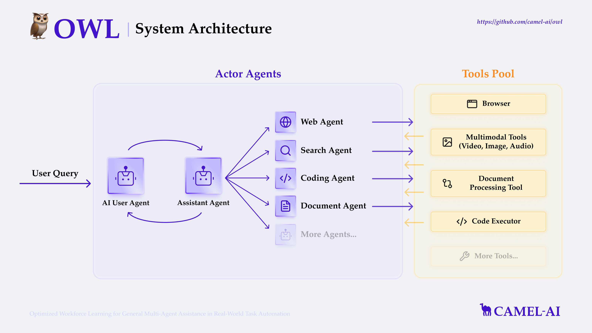

# 1. Multi-Agent-GPT
   - Github (110 stars): https://github.com/YangXuanyi/Multi-Agent-GPT
   - 基本功能
     - 单轮/多轮聊天
     - 多模态信息展示与交互
     - Age
     - 工具
       - Web searching  
       - Image generation
       - Image caption
       - audio-to-text
       - text-to-audio
       - Video caption
     - RAG 
       - 私有数据库
       - 离线部署

# 2. Qwen-Agent
   - Github (1.4k stars): https://github.com/QwenLM/Qwen-Agent
   - built upon Qwen1.5, featuring Function Calling, Code Interpreter, RAG, and Chrome extension.

# 3. OpenAGI

github:https://github.com/agiresearch/OpenAGI

OpenAGI是一个前沿的开源人工通用智能（AGI）研究平台，巧妙地将专业化小模型与高级学习机制相结合，致力于执行并优化特定的高级任务，如情感分析和图像去模糊化。该平台代表了AI研究的最新进展，通过精心设计的系统架构来提升智能任务的处理质量。

主要特征:
- 专家模型集成: OpenAGI结合了针对特定任务的精细化专家模型，从而针对每个任务提供最合适的解决方案。
- 强化学习的应用: 平台采用了基于任务反馈的强化学习（RLTF）方法，此举让模型通过持续学习提高其性能。
- 动态工具选择: 根据任务需求的上下文，OpenAGI可以动态地选取最适合的工具，包括但不限于ChatGPT、LLaMa2等大型语言模型（LLM），以及其他专业模型。

运作机制:
- 在OpenAGI平台上，每项任务开始时，系统首先评估其性质和需求。
- 接着，它从汇聚的专家模型库中选取一个或多个适合解决该问题的模型。
- 任务执行过程中，强化学习机制基于任务反馈不断迭代和调整模型输出，确保输出质量逐步提升。

OpenAGI的多模型和学习方法之融合，不仅为特定AI任务提供了精准的解决方案，还在持续学习和自我改进的过程中，为实现更高阶的智能任务处理设置了新的标准。这个平台展现了开源AGI研究的动力和可能性，是探索未来人工智能潜力的有力工具。

# 4. TaskWeaver

github：https://github.com/microsoft/TaskWeaver

TaskWeaver是一个专为构建大型语言模型（LLM）驱动的自主代理而设计的先进框架，这一架构深刻理解代码的重要性，并以代码作为连接用户需求和功能实现的关键。它具备将用户的复杂请求有效转化为可执行代码的能力，并在这个过程中创新性地将用户定义的插件作为函数进行动态调用。

核心特性:
- 代码转换: 通过LLM，TaskWeaver可以将用户请求转换成高效的执行代码，把纯文字描述的功能需求实体化为程序命令。
- 丰富的数据结构: 框架支持多样化的数据结构，为不同类型的任务提供强大的数据处理能力。
- 插件系统: 用户定义的插件可以轻松集成，成为执行任务时可调用的模块，极大地提升了框架的适用性和灵活性。
- 动态插件选择: 根据任务的需求，框架能动态地选择合适的插件，确保任务执行的优化和个性化。
- LLM编码能力: 利用大型语言模型处理复杂逻辑，编写符合逻辑的严谨代码。
- 集成领域知识: TaskWeaver集成了特定领域的知识示例，这使得它能够对特专业领域进行更加细致的编程。
- 安全执行保障: 平台确保所有生成的代码都在一个安全的环境中执行，避免安全隐患。

TaskWeaver的开发哲学是代码至上。通过允许用户以最直观的方式定义功能需求，并将其转化为精确的代码，这个框架打通了用户意图与软件功能间的直接通路。

TaskWeaver对大型语言模型的编码实力和领域知识的综合应用，确保了在执行用户请求的同时，能够维持代码的结构性和安全性，从而为自主AI代理的构建提供了一个强大且可靠的解决方案。

# 5. MetaGPT

github：https://github.com/geekan/MetaGPT

MetaGPT是一个先进的开源AI代理框架，它巧妙地模拟了传统软件公司的操作架构。该框架通过将GPT代理分配到不同角色—产品经理、项目经理和工程师—推动他们协同工作，解决用户定义的编程难题。

主要特征和优势:
- 模拟专业角色: MetaGPT赋予代理特定的开发团队角色，确保每个步骤都能得到专业处理。
- 中等难度任务处理: 目前MetaGPT擅长执行中等难度的任务，比如编程经典的贪吃蛇游戏或创建基本的实用程序。
- 成本效益: 使用OpenAI的API，集成MetaGPT生成一个完整项目的费用非常合理，大约为2美元。

MetaGPT通过为GPT分配不同的职能角色，从产品经理到架构师，再到项目经理和工程师，形成一个高效协作的实体。这种多代理框架不仅重现了通常由软件公司提供的所有标准操作流程，还使这些流程可访问并容易操控。

实现流程:
- 实现用户需求: 仅需简单的需求描述输入，MetaGPT就能够自动生成用户故事、进行竞争分析、明确需求、设计数据结构和API等各个开发阶段的必需品。
- 发展潜力: 虽然目前主要集中在中等复杂度任务，但MetaGPT所展示的潜力预示着它可能会迅速发展，并最终处理更复杂的编程挑战。
- MetaGPT呈现了开源AI技术如何仿照传统软件开发流程，带来效率和成本优势，为广大开发者和企业提供了一个有前途的工具，用于在未来的软件开发中实现节约成本、提高效率的目标。

# 6. AutoGen

github: https://github.com/microsoft/autogen

创新的开源代理工具AutoGPT由托兰·布鲁斯·理查兹创建，自2023年3月发布后就广受欢迎。它被设计为一款强大的工具包，旨在帮助用户构建和运行自定义的AI代理，以适应各式各样的项目需求。

实用性与便捷性

- 多功能性: 平台允许用户仅通过输入目标或任务，便可自能力主生成缘分解为一系列子任务，具备执行如网站创建、社交媒体内容生产、电子邮件撰写至营销副本等多项任务的能力。
- 语言能力: 它甚至可以胜任翻译工作，展现AI语言模型的多语种威力。

AutoGPT并不仅仅是技术的集合，它巧妙地将AI技术融入人们的工作和项目中，提供解决方案，加速任务执行进程，极大提高效率。未来，AutoGPT旨在引领个人和企业更便捷地进入智能化时代，创新工作模式，开启智能代理和人类协作的新篇章

# 7. SuperAGI

github：https://github.com/TransformerOptimus/SuperAGI

SuperAGI，一个比AutoGPT更灵活和用户友好的开源AI代理平台，被设计成一个全能发射台，它包含了搭建、维护和运行个性化AI代理所需的全部元素。通过其独有的云环境，用户得以在云端测试和优化各式功能，增强了实用性和可访问性。

核心特征和优势:
- 易用性: SuperAGI的图形用户界面（GUI）让开发和管理代理更直观、简便。
- 技术支持: 多个人工智能模型与向量数据库的融合为数据存储和检索带来革新。
- 洞察力: 性能洞察工具提供有助于优化AI代理性能的关键数据。
- 扩展性: 通过插件市场连接至广泛的应用程序和服务，例如Google Analytics，扩充了代理的功能性。

此外，SuperAGI极大丰富了自主AI代理的运行环境。通过动作控制台，开发者可以轻松管理多个代理，输入指令和配置权限变得前所未有的简单。用户还能通过代理活动页面实时监测AI的行动，从而确保所有操作都在预期的轨迹上顺利进行。

从任务管理到数据收集，再到内容生成和代码编写，乃至更为专业化的领域分析，SuperAGI携其独特的特性和功能，展现了在挑选适合特定项目需求的解决方案时所能考虑的多元化选择。

SuperAGI不仅仅带来AI技术的革新，它为手头的项目加速，为特定的挑战找到解决的途径，最终为用户打开进入高效、智能化工作流程的大门。

# 8. Transformers 智能体 2.0

https://huggingface.co/docs/transformers/v4.41.2/pipeline_tutorial

⇒ 🎁 在现有智能体类型的基础上，我们新增了两种能够 根据历史观察解决复杂任务的智能体。

⇒ 💡 我们致力于让代码 清晰、模块化，并确保最终提示和工具等通用属性透明化。

⇒ 🤝 我们加入了 分享功能，以促进社区智能体的发展。

⇒ 💪 全新的智能体框架性能卓越，使得 Llama-3-70B-Instruct 智能体在 GAIA 排行榜上超越了基于 GPT-4 的智能体！

# 9. OpenAI Swarm

https://github.com/openai/swarm

Swarm：用于构建、协调和部署多智能体（multi-agent）系统的框架，由OpenAI Solutions团队管理。Swarm是一个符合工效（ergonomic）、轻量级的多智能体协调框架。

# 10. Agno

Github (18.9k stars): https://github.com/agno-agi/agno
- 快得离谱：创建智能体只要2微秒（0.000002秒），比LangGraph快10000倍
- 百变金刚：支持文本/图片/音频/视频全模态处理
- 自由组合：不用绑定特定AI模型，想用GPT-4还是Claude随你换
- 团队作战：能同时指挥多个智能体协作，像复仇者联盟一样分工配合

# 11. Smolagents

Github (11.6k stars): https://github.com/huggingface/smolagents

huggingface.co/docs/smolagents

huggingface出品

# 12. Owl

Github (9.3 stars): https://github.com/camel-ai/owl

OWL: Optimized Workforce Learning for General Multi-Agent Assistance in Real-World Task Automation

🏆 OWL achieves 58.18 average score on GAIA benchmark and ranks 🏅️ #1 among open-source frameworks! 🏆

# 13. OpenAI Agent框架

发布事件：2025-03-13

- Agents Blog: https://openai.com/index/new-tools-for-building-agents
- Built-in tools: https://platform.openai.com/docs/guides/tools?api-mode=responses
- Responses API: https://platform.openai.com/docs/api-reference/responses
- Agents SDK项目：https://github.com/openai/openai-agents-python
- Computer Using Agent项目：https://github.com/openai/openai-cua-sample-app

- 内置工具（Built-in tools）：包括网页搜索、文件搜索以及电脑使用（Computer Use）
- Responses API ：新的响应API，将 Chat Completions API 的简单性与 Assistants API 的工具使用功能相结合，用于构建Agents
- Agents SDK：协调Single-Agent和Multi-Agent工作流程
- 监控工具：集成可观察性工具跟踪和检查Agent工作流程的执行情况

其中：Agents SDK是开源的，并且还开源了一个Computer Using Agent项目

# 参考

[1] Multi-Agent-GPT: 一款基于RAG和agent构建的多模态专家助手GPT，https://mp.weixin.qq.com/s/C3ZnnxzmGqF8lXir9B9-BQ
[2] 5个顶级开源Agent框架，你必须知道！，https://mp.weixin.qq.com/s/zf_BSlcmTgNKLbVu8Tq8Qg
[3] 授权调用: 介绍 Transformers 智能体 2.0, https://mp.weixin.qq.com/s/C2Yd3tBUTdSPEOcdhcr0TQ
[4] 18.9K 星推荐！这个 Python 库让开发 AI 智能体像搭积木一样简单, https://mp.weixin.qq.com/s/Vk238RASp9ULnDDYMerRew
