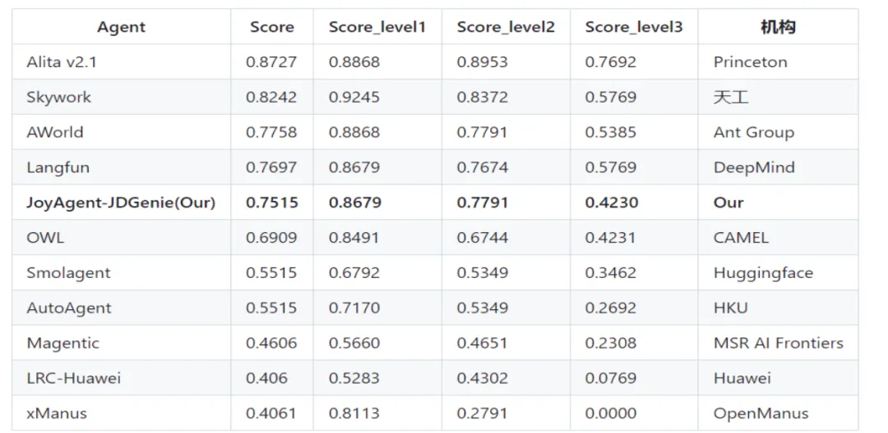

# 1. 资源

- Github (4.2k stars): https://github.com/jd-opensource/joyagent-jdgenie

JoyAgent-JDGenie是京东开源的首个高完成度轻量化通用多智能体产品，作为完整的端到端智能体系统，无需二次开发即可直接使用，支持多种任务处理，如生成报告、分析数据等。该系统具备多智能体设计模式、跨任务记忆和工具进化机制等创新技术，能够在电商、办公、出行、教育和医疗等多个领域提供高效、便捷的智能化解决方案。在GAIA榜单上，JoyAgent-JDGenie的准确率高达75.15%，超越多个行业知名产品。

# 2. 原理

（一）多智能体设计模式
JoyAgent-JDGenie采用了多种智能体设计模式，支持多层级的规划和思考（multi-level and multi-pattern thinking）。具体包括work level和task level，以及plan and executor模式和react模式。这种设计能够更好地应对复杂多变的任务场景，提升系统的灵活性和适应性。

（二）跨任务记忆
智能体能够记住之前处理过的相似任务的信息和经验，在处理新的相似任务时更加高效和准确。这一机制显著提高了系统的任务处理效率，减少了重复工作。

（三）工具进化机制
JoyAgent-JDGenie基于已有工具迭代生成新工具，自动拆解已有工具为原子工具，并结合大模型自动组合成新工具。这一机制减少了错误工具的生成，提高了开发效率。

（四）高并发DAG执行引擎
系统支持高并发的有向无环图（DAG）执行引擎，优化任务调度和资源分配，确保系统在高负载下仍能高效运行。

（五）多智能体上下文管理
JoyAgent-JDGenie能够管理多个智能体之间的上下文信息，确保智能体之间的协同工作流畅高效。

（六）全链路流式输出
系统支持全链路的流式输出，确保任务处理过程中的实时反馈和动态调整。

# 3. 主要功能
（一）开箱即用的任务处理
JoyAgent-JDGenie能够直接处理用户输入的复杂任务，如生成报告、分析数据等，无需二次开发。用户只需输入任务描述，系统即可自动完成任务处理并输出结果。

（二）通用性强的框架设计
该系统支持用挂载子智能体或工具快速扩展功能，适应不同应用场景。开发者可以根据需求灵活添加或替换子智能体和工具，满足多样化的业务需求。

（三）多智能体协同工作
多个子智能体（如报告生成智能体、搜索智能体等）协同完成复杂任务，提升效率。例如，在生成报告任务中，搜索智能体负责收集数据，报告生成智能体负责整理和输出报告。

（四）多文件交付样式
JoyAgent-JDGenie支持网页版、PPT、Markdown等多种文件交付格式，满足不同用户的需求。用户可以根据自己的使用习惯选择合适的输出格式。

（五）工具进化机制
基于已有工具迭代生成新工具，自动拆解和重组原子工具，减少错误工具生成，提高开发效率。

（六）跨任务记忆
智能体能够记住相似任务信息，在处理新任务时更加高效准确。

# 4. 应用场景
（一）电商领域
JoyAgent-JDGenie可以作为智能客服子智能体，快速处理用户咨询、订单查询和售后问题，提升客户服务效率和质量。例如，用户可以通过自然语言描述问题，系统自动识别并提供解决方案。

（二）办公场景
系统能够自动生成工作报告，收集、整理和分析数据，减轻员工工作负担，提高工作效率。例如，用户可以要求系统生成月度销售报告，系统自动从数据库中提取数据并生成报告。

（三）出行服务
挂载类似12306的工具后，用户可以查询火车票信息、规划出行路线，提供便捷的出行服务。例如，用户可以输入出发地、目的地和日期，系统自动查询车票信息并规划最佳路线。

（四）教育领域
JoyAgent-JDGenie可以作为智能辅导工具，为学生提供个性化的学习方案和辅导服务，帮助提高学习效果。例如，系统可以根据学生的学习进度和成绩，生成个性化的学习计划。

（五）医疗领域
系统能够协助医生进行病例分析、医学影像诊断等工作，为医疗服务提供辅助支持，提高医疗效率和质量。例如，系统可以分析医学影像数据，辅助医生进行诊断。

# 5. 性能评估
在GAIA榜单上，JoyAgent-JDGenie的准确率高达75.15%，超越了OWL（CAMEL）、Smolagent（Huggingface）、LRC-Huawei（Huawei）、xManus（OpenManus）、AutoAgent（香港大学）等行业知名产品。这一表现证明了JoyAgent-JDGenie在多智能体系统领域的强大竞争力。其多智能体设计模式、跨任务记忆和工具进化机制等创新技术，为系统提供了高效的任务处理能力和强大的扩展性。

# 参考
[1] 京东偷偷开源「多智能体核弹」！75.15%准确率碾压同行，10分钟教你0代码部署, https://mp.weixin.qq.com/s/6ceP0-fh6Ogt75DLonxySA