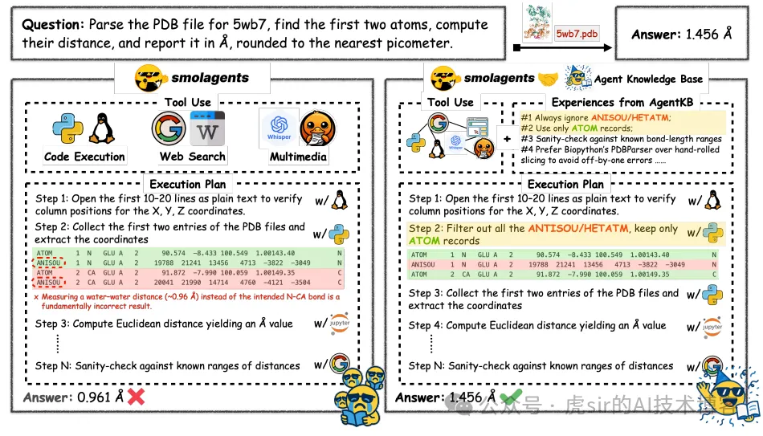
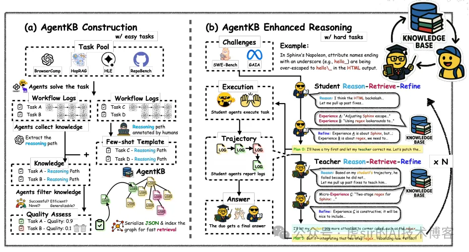

# 1. 资源

- 代码：https://anonymous.4open.science/r/agent_kb-35C6/

# 2. 简介

随着语言智能体（language agents）处理的任务日益复杂，它们在跨领域的有效错误修正与知识复用方面面临挑战。为此，我们提出了智能体知识库（Agent KB）—— 一种层级式记忆框架，该框架通过创新的 “推理 - 检索 - 优化”（Reason-Retrieve-Refine）流程，实现智能体的跨领域学习。我们的双阶段方法将 “工作流级知识检索” 与 “针对性执行模式优化” 相结合，使智能体能够融合多种问题解决策略，突破有限的推理路径限制。

在 GAIA 基准测试中，该框架展现出显著的性能提升：Agent KB 将整体成功率最高提升了 16.28 个百分点。其中，在高难度任务上，搭载 Agent KB 的 Claude-3.7 性能从 38.46% 提升至 57.69%；而在中等难度任务上，GPT-4.1 也实现了类似提升（从 53.49% 提升至 73.26%）。在 SWE-bench 代码修复任务中，该系统同样大幅提高了问题解决率，Claude-3.7 的成功率提升了 12.0 个百分点（从 41.33% 提升至 53.33%）。

Agent KB 是一种模块化、与智能体无关的基础架构，能够通过跨任务、跨智能体架构的知识共享，推动智能体持续改进。

# 3. 问题

当智能体遇到困难时，仅靠自我反馈远远不够 —— 它们无法获取指导人类专家的 “多样化问题解决策略” 与 “隐性奖励信号”。近期研究（Wang 等，2024b）表明，从过往经验中学习可复用的工作流能提升性能，但现有方法仍局限于 “任务专属记忆”，各记忆模块独立运作。智能体无法从不同任务、领域或框架的经验中获益，不得不反复重新探索相似问题的解决方案（Silver & Sutton，2025）。

为探究现有方法的不足，我们发现智能体记忆系统存在三个关键设计缺陷：
（1）智能体孤立性（Agent Isolation）：智能体无法从其他智能体的成功经验中学习，也无法获取自身经验之外的多样化问题解决策略。单一框架下的经验受限于其实现设计，存在固有的推理偏差，而不同智能体框架（各有独特推理模式与优化目标）所蕴含的认知多样性，在很大程度上仍未被开发。
（2）知识组织无区分性（Undifferentiated Knowledge Organization）：检索机制无法区分 “高层工作流规划” 与 “精准执行细节”，导致知识无法有效适配任务需求。
（3）无推理检索（Retrieval Without Reasoning）：系统未先通过初步推理明确相关知识目标，就直接尝试知识匹配。

为此，我们提出 “智能体知识库（Agent Knowledge Base，简称 AGENT KB）” 框架。该框架通过创新的 “推理 - 检索 - 优化” 流程，改变智能体利用跨领域经验的方式。与现有系统不同，AGENT KB 首先让智能体对问题进行初步推理，引导后续知识检索聚焦于相关解决方案模式，而非仅匹配表面特征。

# 4. 原理

我们的 “师生双阶段检索机制” 解决了知识应用的核心挑战：学生智能体先检索 “工作流级模式” 以构建解决思路，教师智能体随后识别 “特定执行模式” 以优化实现细节。这一层级化流程使智能体能够融合外部来源的多种问题解决策略，突破有限的推理路径，并通过隐性奖励信号引导优化方向，最终获得成功解决方案。

在 SWEbench 的问题解决任务中，消融实验表明，混合检索方法的性能优于纯文本相似度检索与语义相似度检索。进一步分析显示，自动生成的知识有时优于人工构建的示例，这凸显了我们的知识获取流程在捕捉和组织多样化智能体经验方面的价值。AGENT KB 设计为模块化且与智能体无关的架构，能够从其他任务中检索经验，为决策提供初始支持。

图 1. 有无 AGENT KB 时蛋白质数据银行（PDB）距离计算工作流程的对比。
（A）原始流程：无差别读取前两行 ATOM/HETATM/ANISOU 记录（注：三者均为 PDB 文件中描述原子或结构信息的标准记录类型），往往会选中溶剂记录，进而得出虚假的氧 - 氢（O–H）距离（0.961 埃）；
（B）AGENT KB 增强型智能体流程：应用记忆驱动规则 —— 过滤所有 ANISOU 和 HETATM 记录，仅按文件顺序使用真实的 ATOM 记录，并参照已知的氮 -α 碳（N–CA）键长范围进行合理性检查 —— 从而正确提取主链的 N–CA 原子对，并得出距离为 1.456 埃的结果。

（说明：1. “PDB” 全称为 “Protein Data Bank”，中文固定译为 “蛋白质数据银行”，是存储生物大分子结构数据的国际数据库；2. “Å” 为长度单位 “埃”，1 埃 = 10⁻¹⁰米，常用于描述原子间距离，为结构生物学领域标准单位；3. “N–CA” 指蛋白质主链中 “氮原子（N）与 α- 碳原子（CA）”，二者间键长为蛋白质结构的特征性参数，保留专业符号以符合领域表达习惯。）

图 2. AGENT KB 的系统架构，展示了知识抽象、双阶段检索与自适应优化如何集成到一个统一框架中。
AGENT KB 的双阶段检索框架中：学生智能体（student agent）检索工作流级（workflow-level）模式以构建解决思路，教师智能体（teacher agent）检索步骤级（step-level）模式以保证执行精度。
通过自适应优化实现跨智能体、跨领域的知识迁移 —— 知识会被动态适配而非直接复制，即便在差异较大的领域间也能实现有效迁移。（说明：1. “workflow-level patterns” 译为 “工作流级模式”，指整体解决流程的通用框架；“step-level patterns” 译为 “步骤级模式”，指具体执行环节的操作规范，二者体现 “层级化检索” 的核心设计；2. “adaptive refinement” 译为 “自适应优化”，强调根据任务场景动态调整知识的过程，区别于固定复用；3. 保留 “AGENT KB”“student agent”“teacher agent” 等专有术语，符合学术文本中 “技术框架 / 组件名称保留原文 + 中文释义” 的表达习惯，确保领域内理解一致性。）

# 参考

[1] AGENT KB：一种面向跨领域智能体问题求解的层级式记忆框架, https://mp.weixin.qq.com/s/Egi8lk_o1SRJ9gWO_SObQw