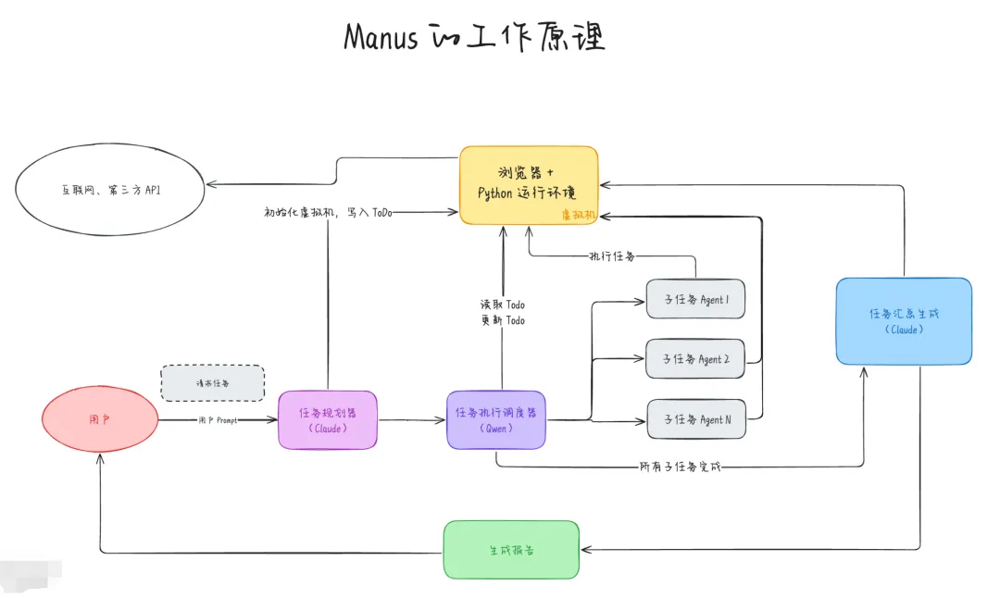
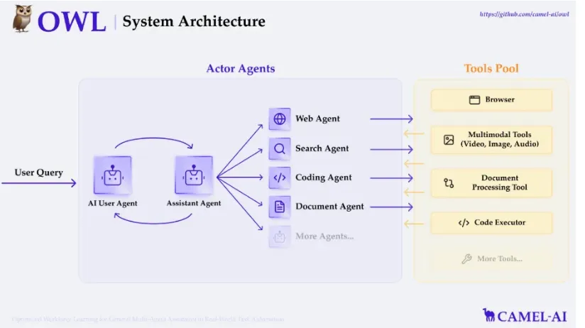
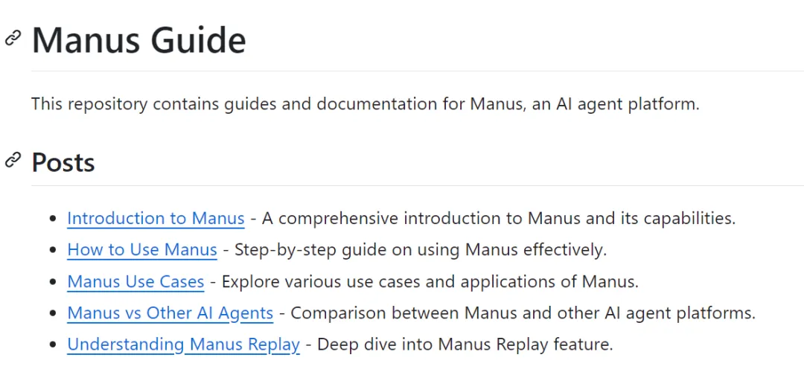
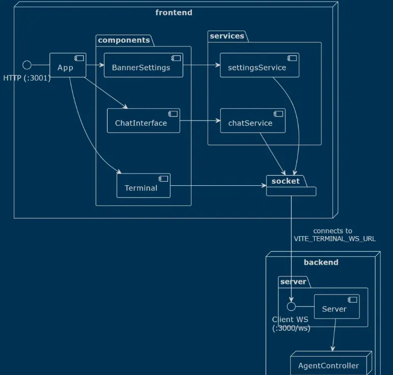

# 1. 简介

作为一款“全能 AI 智能体”，Manus 能够独立完成从简单查询到复杂项目的各种任务，无需用户持续介入。用户只需给出简单的指令，无需具备 AI 专业知识，便能获得优质的结果。

# 2. OpenManus 开源项目

Github 地址：https://github.com/mannaandpoem/OpenManus

几个的00后开发者仅用短短3个小时就打造出了 OpenManus 项目的初版。与原版 Manus 不同，后者拥有专属的云端服务器，并使用了复杂的工具以及自训练模型；而 OpenManus 则创新性地让 AI 智能体直接操控用户的个人电脑，使得普通人也能轻松体验 AI 控制电脑的奇妙之处。

从技术角度来看，OpenManus 采用了经典的 ReAct 智能体架构设计模式，它能够基于当前状态进行决策，使得上下文和记忆管理变得简单便捷。该项目依赖于四个主要工具：
- 第一、PythonExecute 用于执行 Python 代码并与电脑系统互动；
- 第二、FileSaver 负责将文件保存到本地；
- 第三、BrowserUseTool 能够操控浏览器；
- 第四、GoogleSearch 则负责执行网络搜索任务。

为了发挥项目的最大潜力，建议使用 Claude-3.5-Sonnet 或 Claude-3.7-Sonnet 大模型。

# 3. OWL 开源项目

- Workflow 复制计划 Github 地址：https://github.com/camel-ai/camel/issues/1723
- Ubuntu Toolkit复制计划Github 地址：https://github.com/camel-ai/camel/issues/1724
- Memory Toolkit复制计划Github 地址：https://github.com/camel-ai/camel/issues/1725

CAMEL AI 团队对 Manus 视频进行了详尽的分析，并对其技术路径进行了逆向工程，进而启动了一个深入的复制计划。他们将 Manus 的核心工作流程分解为六个关键阶段：

首先，他们启动了 Ubuntu 容器，为 AI 智能体构建了一个远程工作环境；

其次，执行知识召回，引用之前学习的内容；

紧接着，连接到数据源，包括数据库、网络硬盘和云存储等；

然后，将数据挂载到 Ubuntu 系统中；

之后，自动生成 todo.md 文件，规划任务和待办事项；

最后，利用 Ubuntu 的工具链和外部工具来完成整个流程的任务。

OWL 项目并不满足于简单的复制，他们还计划整合之前开发的 CRAB 技术，以实现跨平台、多设备、全场景的远程操作，旨在打造一个功能全面的开源“Manus Pro Max”。

# 4. Manus 教程开源项目

Github 地址：https://github.com/hodorwang/manus-guide

一位细心的开发者精心打造了一个 Manus 指南仓库，其中包含了极为全面的使用手册。无论你是想了解 Manus 的基础信息，寻找详尽的操作指南，探索多样化的应用场景，或是比较 Manus 与其他 AI 智能体的不同，甚至是深入理解 Manus 的 Replay 功能，这个仓库都能为你提供所需。此外，文档提供了中英文双语支持，对初学者极为友好。

# 5. Computer Use 开源项目

Github 地址：https://github.com/anthropics/anthropic-quickstarts/tree/main/computer-use-demo

别光关注 Manus，Claude 官方推出的 Computer Use 示例程序同样趣味十足。它能够构建一个完全由 AI 操控的虚拟操作系统，用户可以通过浏览器与 AI 进行互动，并且能够实时观察到 AI 的系统界面。

这个示例程序的仓库支持使用 Docker 直接运行，其中包含了一套轻量级的虚拟环境，涵盖了浏览器、操作系统和本地文件等元素。

# 6. OpenHands 开源项目

GitHub 地址：https://github.com/All-Hands-AI/OpenHands

OpenHands 核心定位：“让 AI 智能体成为全栈开发者”。

通过 AI 驱动的智能体平台，帮助开发者减少代码编写工作量，提升开发效率。

第一、技术架构

在安全与效率之间找到平衡，通过以下设计亮点实现高效开发与安全保障。

第二、系统设计亮点

Docker 沙箱运行时

基于定制化镜像（docker.all-hands.dev/openhands:0.27）构建隔离环境。

支持资源配额控制（CPU/内存限制）、操作审计日志、环境快照回滚。

三层镜像构建体系

版本标签（Versioned Tag）：基础功能镜像（如oh_v0.9.3_nikolaik）。

锁定标签（Lock Tag）：依赖固化镜像（哈希值标识）。

源码标签（Source Tag）：实时代码同步镜像（开发调试专用）。

插件化扩展

内置Jupyter内核、浏览器控制、API网关等模块。

开发者可自定义插件，灵活扩展功能。

OpenHands 致力于通过 AI 技术革新软件开发流程，让开发者专注于更重要的任务，同时确保开发环境的安全性和可扩展性。

# 参考

[1] 5大开源 Manus 复刻项目全景解析, https://mp.weixin.qq.com/s/2XCqGvtq5K9qR8927tdveA