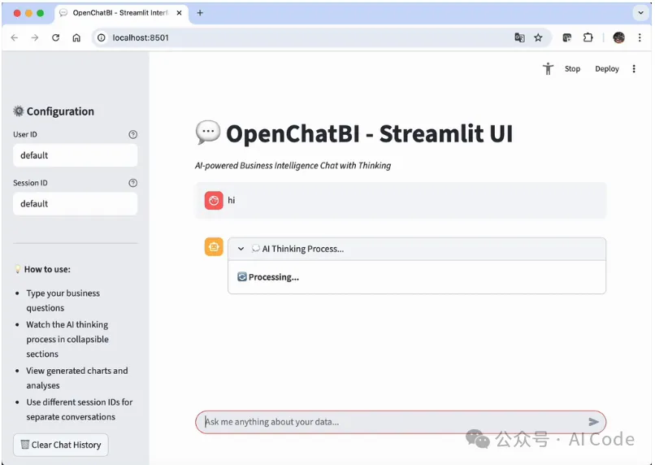
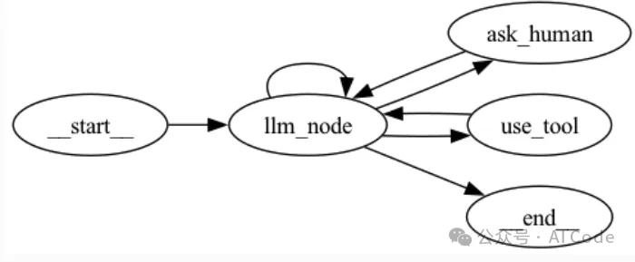
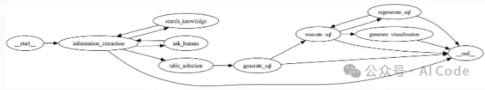

- Github (312 stars): https://github.com/zhongyu09/openchatbi

OpenChatBI 是一款开源的、基于聊天功能的智能商业智能 (BI) 工具，它由大型语言模型驱动，旨在帮助用户通过自然语言对话查询、分析和可视化数据。OpenChatBI 构建于 LangGraph 和 LangChain 生态系统之上，提供支持自然语言到 SQL 转换和简化数据分析的聊天代理和工作流。

核心功能
自然语言交互：通过自然语言提问获取数据分析结果
自动生成 SQL：利用先进的 text2sql 工作流、模式链接和精心组织的提示工程，将自然语言查询转换为 SQL 语句。
数据可视化：生成直观的数据可视化图表（通过 Plotly）
数据目录管理：自动发现并索引数据库表结构，支持灵活的目录存储后端，轻松维护表和列的业务说明，并优化提示。
时间序列预测：内部部署的预测模型，可以称为工具。
代码执行：执行 Python 代码以进行数据分析和可视化
交互式问题解决：当信息不完整时，主动向用户询问更多背景信息
持久记忆：基于LangGraph检查点的会话管理和用户特征记忆
MCP 支持：通过配置与 MCP 工具集成
知识库集成：结合基于目录的知识检索和外部知识库检索（通过 MCP 工具）来回答复杂问题
Web UI 界面：提供 2 个示例 UI：使用 Gradio 和 Streamlit 的简单 Web 界面和流式 Web 界面，易于与其他 Web 应用程序集成。
架构概述
OpenChatBI采用模块化架构，并明确划分了各个关注点：

LangGraph 工作流：使用状态机对复杂的多步骤流程进行核心编排
目录管理：支持多种存储后端的灵活数据目录系统
Text2SQL Pipeline：高级自然语言到 SQL 转换，支持模式链接
代码执行：用于数据分析的沙盒式 Python 执行环境
工具集成：用于人机交互和知识检索的可扩展工具系统
持久内存：基于 SQLite 的会话状态管理
技术栈
框架：LangGraph、LangChain、FastAPI、Gradio/Streamlit
大型语言模型：Azure OpenAI (GPT-4)、Anthropico Claude、OpenAI GPT 模型
数据库：Presto、Trino、MySQL（支持 SQLAlchemy）
代码执行：本地 Python、受限 Python、Docker 容器化
开发环境：Python 3.11+，以及现代工具（Black、Ruff、MyPy、Pytest）
存储：SQLite 用于会话检查点，文件系统目录存储
代理图

Text2SQL图

# 参考

[1] OpenChatBI:AI驱动的智能BI工具, https://mp.weixin.qq.com/s/StaCojVRTxqMPtkPryYE1Q