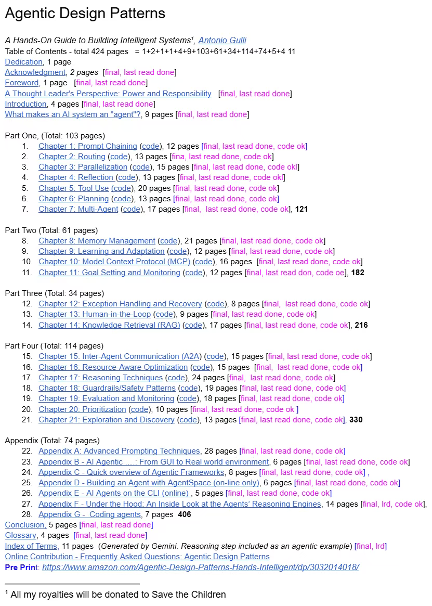

近日，谷歌资深工程主管、杰出工程师 Antonio Gulli 在网上公开发布了自己的新书《Agentic Design Patterns（智能体设计模式）》。

https://docs.google.com/document/d/1rsaK53T3Lg5KoGwvf8ukOUvbELRtH-V0LnOIFDxBryE/preview?tab=t.0#

# 参考

[1] 谷歌大神出手，免费发布《智能体设计模式》，AI Agent开发的终极秘籍, https://mp.weixin.qq.com/s/L8M8tb7AksTMiMJ_kJfnkg