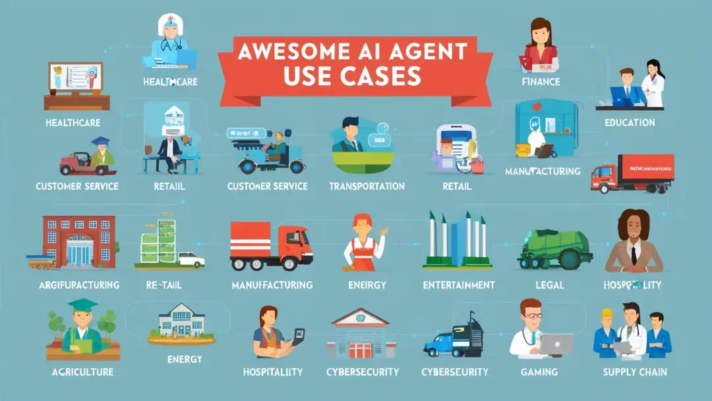
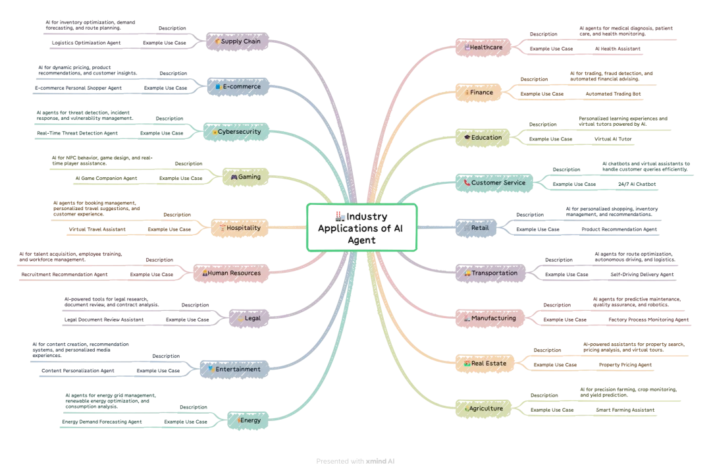

# 1. 500 AI Agents

详情见:https://github.com/ashishpatel26/500-AI-Agents-Projects?tab=readme-ov-file

这老兄收集了500个开源的智能体应用，涵盖健康，金融，教育，零售各个行业，不同的开发框架也做了分类，是我们学习和开发智能体参考的好帮手，enjoy it!

# 参考

[1] 分享500个开源的AI Agent智能体, https://mp.weixin.qq.com/s/fDdhOFR92Axgbesd8iY-IQ