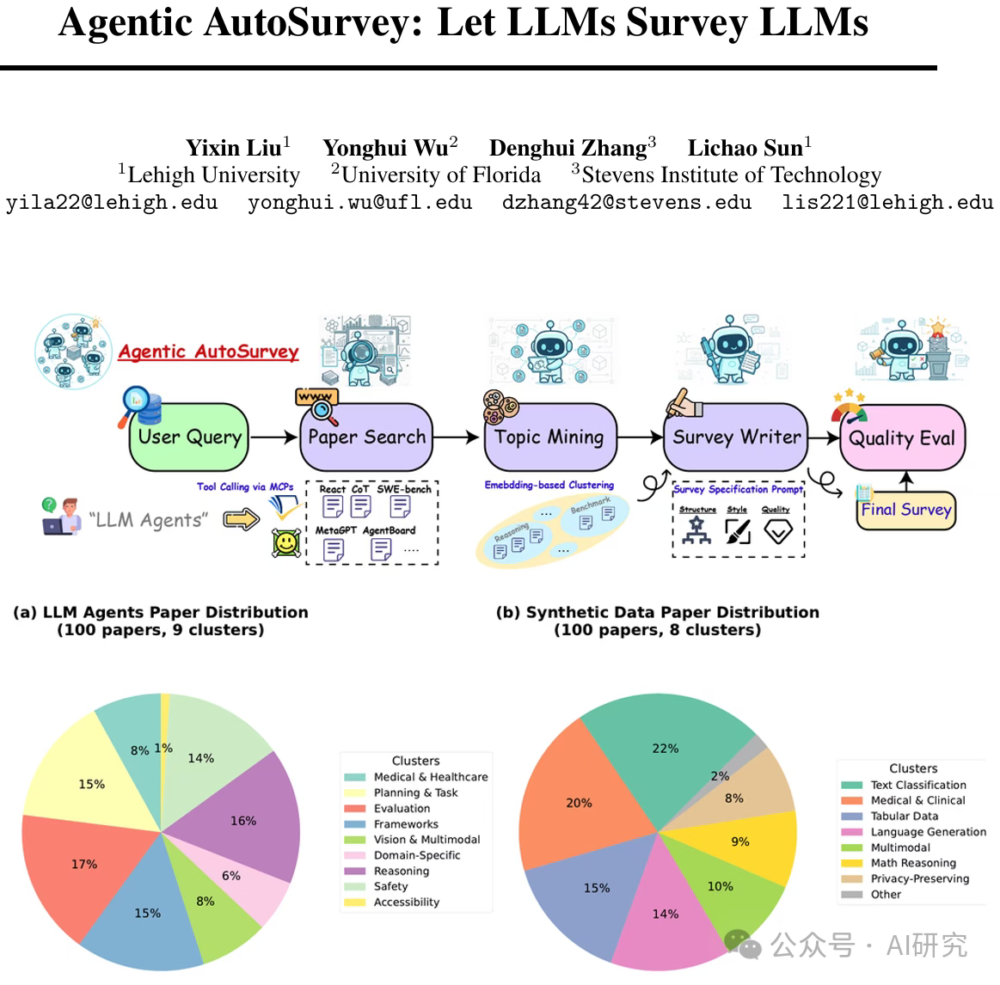

Agent-as-Data-Analyst（2509.23988, 见图1）：复旦等机构，提出智能数据分析代理的五大设计目标和多模态技术框架。
Agentic AutoSurvey（2509.18661, 见图2）：里海大学等，多智能体框架自动生成文献综述，评分达8.18超越传统方法。
SLR Evaluation Copilot（2509.17240, 见图3）：卡塔尔大学等，基于PRISMA指南的多智能体系统评估系统性文献综述质量。
Governed By Agents（2509.16676, 见图4）：GIK研究所，探讨智能体AI对计算基础设施架构和治理模式的重塑影响。
Time Series Reasoning（2509.11575, 见图5）：台湾交大等，时间序列推理智能体的三种拓扑结构分类与应用框架。
AIssistant（2509.12282, 见图6）：汉诺威大学等，人机协作的科学论文撰写智能体框架。
Agentic Reinforcement Learning（2509.02547, 见图7）：布朗大学等，LLM强化学习从序列生成向自主决策智能体的范式转变。
Scientific LLMs（2508.21148, 见图8）：加州理工等，科学大语言模型的数据中心化发展路径与智能体前沿。
Re4 Framework（2508.20729, 见图9）：中科院，四阶段逻辑链的科学计算智能体框架。
Multi-Agent MARL in ITS（2508.20315, 见图10）：阿布贾大学等，智能交通系统中多智能体强化学习的全面调研。
Agentic Reasoning Frameworks（2508.17692, 见图11）：北京交大等，LLM智能体推理框架的系统性分类与场景应用分析。
Language to Action（2508.17281, 见图12）：达尔文大学等，LLM作为自主智能体和工具使用者的发展综述。
Deep Research Agents（2508.12752, 见图13）：香港城大等，自主研究智能体的四阶段深度研究管道框架。

# 参考

[1] Agent研究爆发了！一个月居然出了13篇综述。。。https://mp.weixin.qq.com/s/G1LhCB-Q-bLyXh-OkpQX-Q