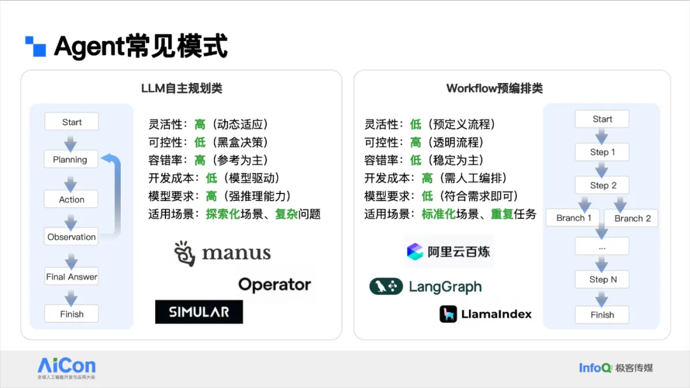
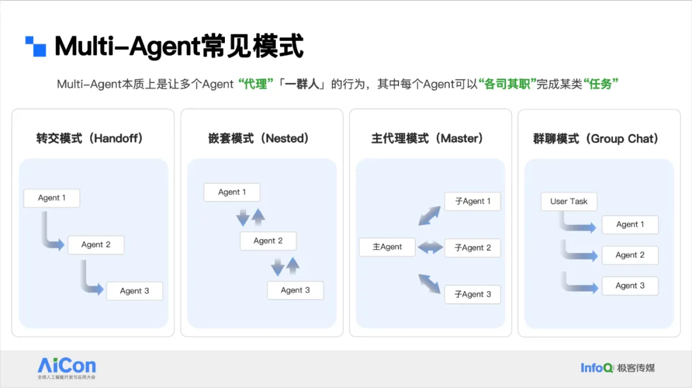

大模型自主规划类的典型代表就是前段时间非常火的 manus，你给它问题或需求，它帮你自动做规划，拆解执行，然后观察反思，再进行下一步的规划分解，直到最后把任务完成，将结论反馈给客户。

这种模式的好处是它有非常高度的灵活性，可以动态适应环境的变化，而且容错率较高，一旦出现问题它会自我纠正。你也可以查看它的结果，但它的可控性会比较低，因为很多时候它其实有自己的一套逻辑思维在运作，所以很多时候我们想干预它反而并不那么容易。

这种 Agent 适用于探索类、复杂类的问题，就是说我自己也不知道这个问题怎么解决的情况下，你先给我搞一版，这种情况就非常适合大模型自主规划类的 Agent。

但我们 ToB 领域在落地的时候有非常多的可控性要求，就是我要求它必须按照我的要求一步一步来完成，这种情况就非常适合用 Workflow 的预编排类 Agent。它的灵活性相对低一些，因为它需要我们预定义流程。但它的可控性就会高很多，因为它的每一步执行都是非常清晰可见的。

所以它非常适合标准化场景、重复的重要任务、周期性任务。这一类的典型有我们阿里云的百炼，还有像 LangGraph 这样通过预编排流程来实现的 Agent。

在 Agent 模式的基础上，我们也有非常多的 Multi-Agent 多智能体的体系。这类体系常见的有转交模式，A 执行完给 B，B 执行完给 C。有嵌套模式，A 调 B，B 调 C，然后 C 再逐步回溯到 B，再回溯到 A，实际上像堆栈的运行状态一样是嵌套式的。

另外还有主代理模式，也可以叫做监管者模式或 Supervisor 模式，它通过主 Agent 跟客户交流，主 Agent 在背后会根据需求去调用各种子 Agent 完成任务。最后一种就是群聊模式，比如说我的任务扔到群里，群有很多 Agent 讨论或者争论，最后给我结论或组合的方式来回复我。

# 参考

[1] 阿里云客服Agent业务提效实践：灵活可控的落地方法论, https://mp.weixin.qq.com/s/P-wOYCAkp08QnC4UE0MpCw