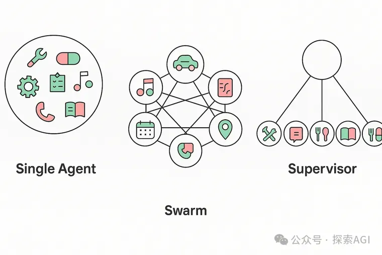
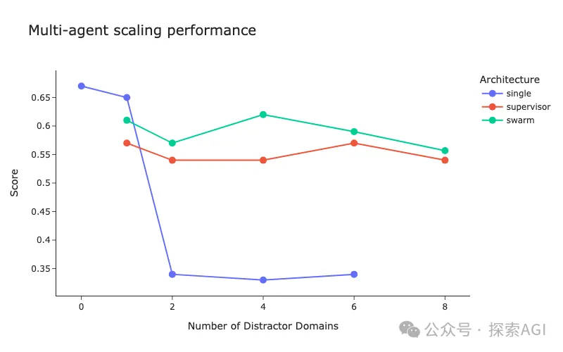
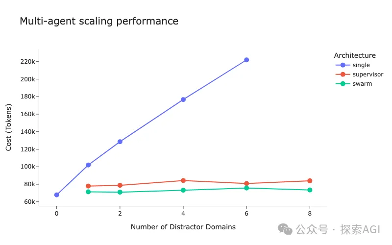
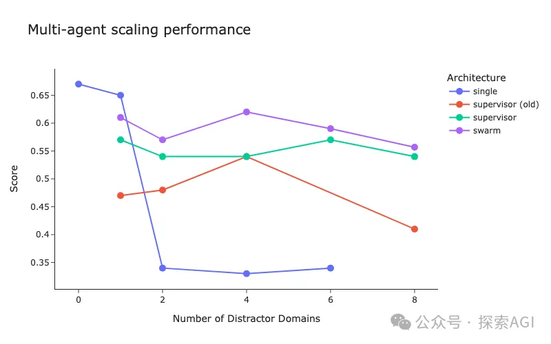

# 资源

- langgraph-supervisor代码：https://github.com/langchain-ai/langgraph-supervisor-py
- langraph帮助文件：https://langchain-ai.github.io/langgraph/concepts/memory/

# 1. 三大主流架构

1. 单智能体 (Single Agent): 一个 Agent 掌握所有工具和指令，独自处理所有任务。这是评测的baseline。
2. 群聊模式 (Swarm): 每个子智能体都知道彼此的存在，可以直接“接力”工作。谁拿到控制权，谁就负责干活，直到它把任务交棒给下一个。
3. 主管模式 (Supervisor): 一个中心化的“主管”Agent 负责接收用户需求，然后把任务分配给相应的“员工”子智能体。员工干完活，必须把结果汇报给主管，只有主管能跟用户沟通。

# 2. LangChain评测

LangChain 的实验设置方式是，他们在一个真实的零售场景任务基础上，故意加入了家居、医疗、汽车等多个无关的干扰领域，每个领域都有一堆工具和知识。目的就是为了看看在复杂、充满噪音的环境下，哪个架构最能打。

## 2.1 性能

结论非常清晰：随着干扰domain增多，单智能体的性能出现了断崖式下跌。 当有两个以上的干扰域时，它基本就废了。

而 Swarm 和 Supervisor 架构则表现出了极强的鲁棒性，性能基本不受影响。这证明了在复杂场景下，多智能体架构的必要性。有趣的是，Swarm 的表现略微优于 Supervisor。

## 2.2 成本

从成本看，单智能体的 Token 消耗随着干扰增多而线性爆炸。而 Swarm 和 Supervisor 则非常稳定。

但这里也能看到，Supervisor 的成本始终高于 Swarm。为什么呢？

其实很容易理解，在 Supervisor 模式里，子智能体不能直接和用户说话，所有信息都得经过主管“转述”一遍。这一来一回，不仅增加了 Token 消耗，还可能因为主管的“转述”而出错，这也是它性能稍低于 Swarm 的原因。

## 2.3 被“优化”过的Supervisor 架构才是完全体

所以，是不是觉得 Supervisor 架构又贵又容易出错，不如 Swarm 好呢？

LangChain 表示， Supervisor 初始版本，性能烂到爆。但是经过一系列优化之后，可以获得更好的结果！ 下图的 old_supervisor 是初始版本。

最后，如何让 Supervisor 架构变得好用？

主要做了三件事：

- 移除交接消息， 主管在分配任务时，会产生一些路由逻辑和决策信息。在初始版中，这些信息会一股脑塞给子智能体。优化后，这些“废话”被移除，子智能体的上下文变得干净，让它能更专注于核心任务。
- 增加“转发”工具，为了解决传输的损耗问题，他们给了主管一个 forward_message 工具。当子智能体生成了完美的回复后，主管可以直接调用这个工具“原文转发”，而不是自己去复述一遍，大大减少了信息失真。
- 优化工具命名， 主管分配任务本质上也是一种 Tool Calling。他们测试了不同的工具命名方式（比如 delegate_to_agent vs transfer_to_agent），选择了最不容易产生歧义的表达。

这些优化，已经集成到了langgraph-supervisor 包里。https://github.com/langchain-ai/langgraph-supervisor-py

# 3. 总结

在需要扩展和应对复杂场景时，单智能体模式是非常脆弱的，可以尝试多智能体架构，可扩展性、可维护性和鲁棒性上优势巨大。

Supervisor 是最通用、最灵活的架构， 虽然 Swarm 看起来性能和成本更好，但它要求每个子智能体都互相知晓，这在接入第三方Agent或构建复杂系统时几乎不可能。而 Supervisor 架构对子智能体的要求最低，耦合度也最低，最具普适性。

# 参考

[1] LangChain官方实测：多智能体架构怎么选？https://mp.weixin.qq.com/s/gvPAHxRIQF1HtzitSnH5gw