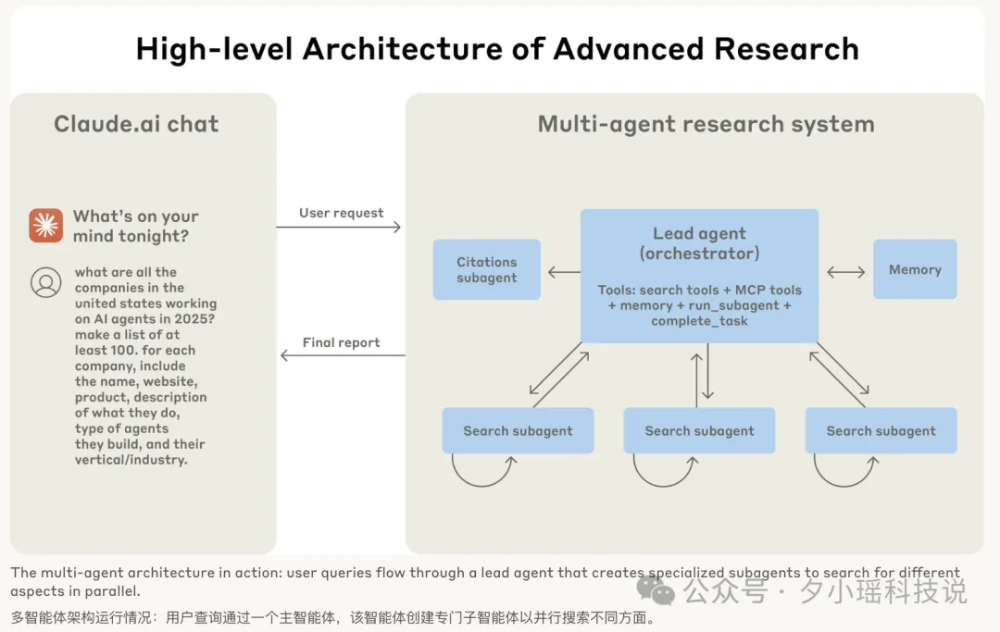
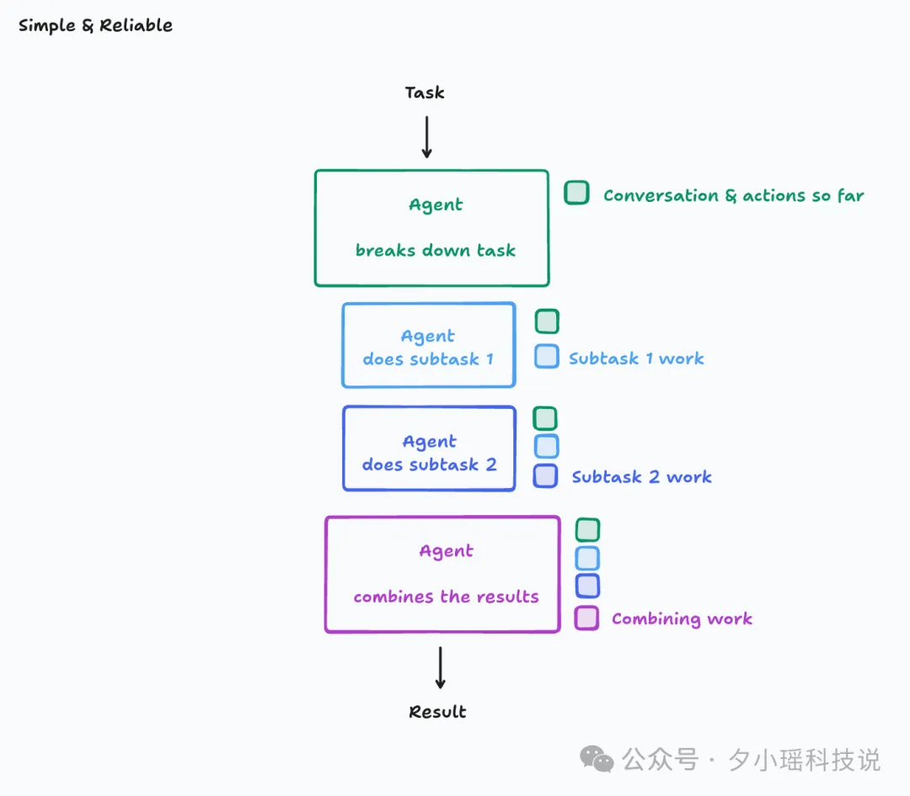

# 背景

多智能体到底该不该建？

Anthropic 的《How we built our multi-agent research system》、Cognition 的《Don’t Build Multi-Agents》与 LangChain 的《How and when to build multi-agent systems》三篇文章不谋而合地聚焦这一问题。

正方 Anthropic 团队发布了文章《How we built our multi-agent research system》，表达立场：“多智能体值得，而且已经在生产环境跑通”，并且详细阐述了构建多智能体系统的经验和可行性。

反方 Cognition 团队（Devin 的母公司）发表了《Don’t Build Multi-Agents》，虽然不是全盘否定多智能体系统理念，但是确实“吐槽”他们多智能体系统研发路上的遇到的血与泪，以及现有模式的弊端。

**正方 Anthropic：为什么“该建”**
- 业务需求：面向开放式研究查询，单代理容易卡在 context 窗口与串行搜索瓶颈。
- 架构：Lead Agent 负责规划与分工，随需动态生成 Sub-agents 并行检索，再由 Citation Agent 标注引用，闭环交付。
- 效果：在内部 BrowseComp/自研评测里，多智能体架构成功率提升 ~90%，但代价是巨量 token 与复杂运维。

而且还给出了八条经验，核心是降低协调复杂度与观察可调试性。

**Cognition：为什么“先别建”**

痛点来源：Devin 要写可运行代码，任何上下文不一致都会直接编译/逻辑出错。

遵循两大原则

- Share context — 子代理必须拿到完整决策链，而不仅是任务文本；
- Actions carry implicit decisions — 并行写入时冲突几乎难以自动调解。

替代方案：

- 单线程长上下文代理；
- 或引入专门“小模型”做上下文压缩，把长历史摘要后再续写。

结论：今天的多智能体更适合“读多写少”的任务；写代码这种强一致任务，单体可靠性 > 并行吞吐

一个代表“大模型工具链 + 搜索”用例，另一个代表“AI 编程”用例——恰好覆盖当前最热门的两条 Agent 落地路线。

看似碰撞，其实共识多过分歧，两家的核心都把“Context Engineering”视作决定性难题，只是在研究检索与代码生成这两类任务上的权衡点不同。

**Langchain文章**

而 LangChain 随后也发表了一篇综述《How and when to build multi-agent systems》，指出两家其实都强调同一件事——什么时候、怎样传递上下文，把两篇打擂台的文章折中成一条共识路线。

# Anthropic 正方陈述

背景：Anthropic 近期升级了 Claude ，现在的 Claude 可以通过访问互联网、Google Workspace 等数据源，自主搜索信息来完成复杂的任务。

基于此能力，Anthropic 面向研究场景，研发了一套多智能体系统，是一种基于“协调者-工作者”模式的典型多智能体架构：

- 主智能体（Lead Agent ，协调者）：负责整个研究流程的规划和协调。
- 子智能体（ Sub-agents ，工作者）：根据主智能体的指示，并行执行特定的研究任务。

工作流程：

- 接收查询并规划： 当用户提交一个研究查询时，主智能体首先分析查询内容，并制定一个详细的研究策略或计划。
- 创建并分配任务： 主智能体根据计划，创建多个专门的子智能体，并为每个子智能体分配具体的、可并行执行的研究任务。这个计划会被保存在系统的内部记忆（Memory）中，即使在处理大量信息导致上下文超出限制时，也能保持研究方向的一致性。
- 并行搜索与评估： 每个子智能体独立行动收集信息。例如，在研究“2025 年 AI 智能体公司”时，不同的子智能体可能同时搜索市场预测、公司新闻、技术报告等，并且评估搜索结果的有效性将收集到的信息返回给主智能体。
- 信息综合与迭代： 主智能体接收并综合所有子智能体返回的信息。根据这些信息，主智能体判断是否已经收集到足够回答查询的内容。如果需要更多信息，它可以调整策略、创建新的子智能体或让现有子智能体进行更深入的搜索，形成一个迭代循环，直到信息充分。
- 生成引用与最终报告： 一旦主智能体认为研究完成，所有收集到的结果会被传递给一个专门的引用智能体（CitationAgent）。这个智能体负责梳理所有的原始资料，精确地找出每项信息或主张的出处。

Anthropic 团队还介绍了为什么要在研究任务中使用多智能体系统：

开放式与动态的研究任务非常适合： 研究工作往往是探索未知，很难提前规划好所有步骤。研究过程是动态的，后续步骤常常依赖于先前的发现（即“路径依赖”）。好的研究者会根据发现调整方向，追寻新的线索。这种灵活性是线性、固定流程难以做到的。多智能体特别适合这种任务，因为它们可以在多轮交互中自主运行，根据中间结果调整策略。
并行搜索更高效： 搜索的本质是从海量信息中提炼关键见解。通过让多个子智能体同时在各自独立的工作空间（上下文窗口）中搜索信息，系统能并行处理更多数据。每个子智能体专注于不同方面或使用不同工具，减少了路径依赖，确保研究更全面和独立。它们将提炼出的重要信息再汇总给主智能体。
多体协作 > 单体力量： 就像人类社会通过集体协作变得更强大一样，多智能体系统也能提升 AI 的整体能力。即使单个智能体很聪明，协同工作的群体往往能完成更复杂的任务。
根据 Anthropic 的内部测试显示，由一个强大的 Claude Opus 智能体作为主导，配合多个 Claude Sonnet 子智能体组成的系统，在研究任务中的表现比单个 Claude Opus 智能体高出 90.2%。

然而，多智能体强大的能力也伴随着显著的成本：

高昂的 Token 消耗： 一个智能体完成任务通常比简单的聊天交互消耗约 4 倍的 Token，而多智能体系统甚至可能消耗约 15 倍的 Token。
不适合高依赖性任务： 多智能体系统并不适合所有类型的任务。特别是一些要求所有智能体共享完全相同的实时信息，或者智能体之间的步骤高度依赖、需要频繁和紧密协调的任务，目前多智能体系统难以胜任。
与单智能体系统相比，多智能体系统最显著的挑战在于协调复杂度的急剧增加。Anthropic 团队提炼出了一些关键提示的原则和经验：

有效的提示词，必须理解智能体如何处理信息，通过模拟其工作流程，能发现问题所在（如过度工作、搜索无效、工具选择错误），从而更有针对性地改进提示词。
明确分派任务： 主智能体向子智能体分配任务时，必须提供详细指令，包括目标、输出格式、工具使用指南和任务边界。指令模糊会导致重复工作、信息遗漏或误解任务。
根据任务复杂度调整工作量： 智能体难以自行判断任务难度，因此需要将“规模调整规则”嵌入提示词中。明确指导主智能体应根据查询复杂度（简单、对比、复杂）创建多少子智能体和执行多少次工具调用，避免资源浪费。
工具设计与选择至关重要： 智能体能否高效完成任务，很大程度上取决于它能否选择并正确使用工具。工具需要清晰的用途描述，并且提示词应包含工具选择的策略指导（如优先使用专业工具、匹配工具与意图），避免智能体因工具问题而失败。
赋能智能体自我改进： 高级模型（如 Claude 4）能诊断自身失败原因并提出改进建议。构建“工具测试智能体”等机制，让智能体自动测试和优化工具描述，能显著提升未来任务效率（如优化后的工具可使任务时间减少 40%）。
遵循从宽到窄的搜索策略： 模仿人类专家研究过程，先进行广泛搜索了解概况，再逐步聚焦细节。提示词应引导智能体避免一开始就使用过于具体的查询。
引导思维过程（CoT）： 利用思维链（Chain of Thought, CoT）等技术，让智能体先规划、再执行。主智能体用 CoT 规划整体研究方法和资源分配；子智能体用 CoT 评估搜索结果并优化后续步骤。这能提升指令遵循、推理能力和整体效率。
并行化提升速度： 复杂研究任务涉及多来源探索。通过让主智能体并行启动多个子智能体，以及让子智能体并行使用多个工具，可以将复杂查询的研究时间大幅缩短（高达 90%）。
除了怎么构建，如何评估多智能体系统的效果同样是新课题。Anthropic 分享了他们的经验：

快速小样本测试： 开发早期用少量案例快速迭代，高效发现重大问题。
利用 LLM 作为评判者： 对无唯一答案的研究成果，用 LLM 根据标准进行自动化、可扩展的评分。
结合人工评估： 人工测试能捕捉自动化遗漏的边缘问题和微妙偏差（如偏好低质来源）。
与一次性回答不同，Agent 可能长时间运行、调用多个工具，其状态在过程中不断变化。如果中途出现错误，中断整个流程不仅代价高昂，而且令用户对产品失去信心，对于开发者也很难回答“Agent 为什么没找到明显信息？是查询关键词不佳，还是工具使用失败？”，所以必须考虑工程和可靠性问题：

智能体有状态且长时间运行，微小错误会累积，需要具备从错误点恢复的能力。
智能体的动态和非确定性使调试困，需要全面的生产跟踪和诊断根源。
持续运行的复杂系统需逐步部署策略（如彩虹部署）以防中断现有任务。

# Cognition 反方陈述

如果你只是初级的开发构建，已经有现成的资源协助你搭建基础框架。但要构建真正可投入生产的应用，则另当别论。核心是把 Context Engineering 做好。

好多人知道 Prompt Engineering，也就是提示词工程，它只是为 LLM 优化任务描述，把任务做好。Context Engineering 是 Prompt Engineering 的进阶版，是让系统在长时间、多轮、动态过程中自动管理上下文，这才是头号要紧工作。

他们认为，常见的任务分解-子智能体并行-结果合并模式（类似于 Anthropic 描述的多智能体协作框架）在实践中存在严重问题。

所以便提出了第二个原则：

每一步操作都暗含假设；多个智能体若依据冲突假设行动，结果必然混乱。

Cognition 的这两条原则，几乎把当下主流多智能体框架“一票否决”。

最终他们倾向于构建单线程线性智能体等架构，因为这类结构能更好地保持任务的整体一致性和可控性。

虽然这样的模式保障了上下文是连续的，但是，对于包含大量子任务的大型任务，一定会会导致上下文窗口溢出。

Cognition 指出，所以有必要增加一个压缩模型，额外用小模型把历史对话与行动压成关键摘要，供后续步骤引用。（这正是 Cognition 已经实践过的方案）

Cognition 团队还提供了几个现实世界案例来佐证其观点：

Claude Code 的子任务智能体： 尽管会生成子任务，但这些子智能体通常不并行工作，也不负责实际写代码，只回答特定问题。原因是它们缺乏主智能体的完整上下文，无法进行更复杂的任务。并行运行时，因缺乏共享上下文，可能产生冲突回应。

编辑应用模型（包括早期 Devin）： 这种模式让大模型生成编辑指令，由小模型执行。但小模型常因指令歧义而误解意图，导致错误。

# Langchain观点

LangChain 的研究团队在分析了正反双方关于大语言模型应用的观点后，发现尽管表面上看论点对立，但实际存在许多共通之处，可以提炼两大共同见解：

- 上下文工程（Context Engineering）至关重要。
- 侧重“读取”（Read）的多智能体系统比侧重“写入”（Write）的更容易构建。

Anthropic 的 Claude 研究系统很好地例证了这一点：尽管包含读写，但多智能体部分主要负责研究（读取），而最终的报告合成（写入）则由一个主智能体集中处理，避免了协作写作引入的不必要复杂性。

在智能体评估方面，LangChain 与 Anthropic 的理念高度重合，长跑式 Agent 需要持久化执行、细粒度日志与自动/人工混合评测。LangChain 的 LangSmith 提供了用来做追踪、调试、LLM-as-judge、人类打分的现成能力。

最后，LangChain 研究团队总结，只有当任务价值高、信息面宽且可高度并行时，多智能体的 Token “烧钱”才划算。典型就是广域信息研究，而大部分代码任务还不够“宽”。

总之，LangChain 把两家文章折中成一条共识路线，先把 Context Engineering 做稳，再判断任务是“读多还是写多”，再选单体或多体架构，并用 LangGraph/LangSmith 之类基础设施把可靠性与评估做到生产级。

# 参考

[1] 多智能体到底该不该建？Anthropic、Cognition 与 LangChain 的三种解法, https://mp.weixin.qq.com/s/Zoln_5MsawDAy_-yaa2vaw