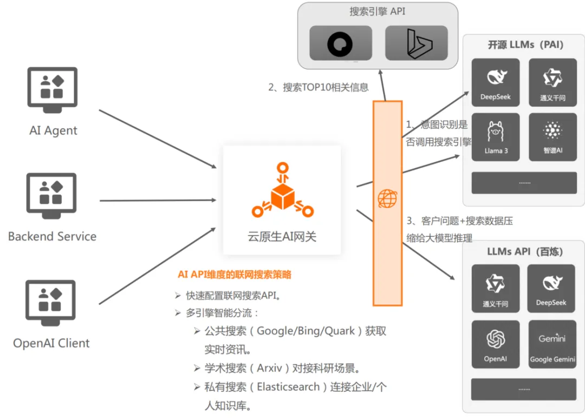
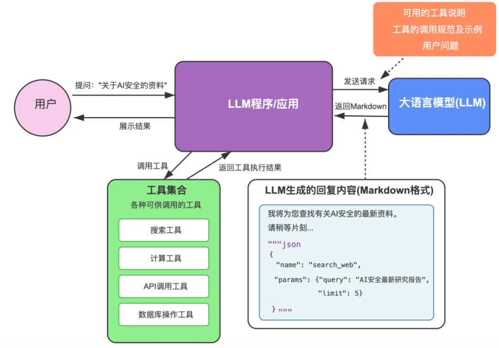

# 简介

在行业内，曾出现过一种较为混乱的现象，即所有基于大模型的聊天机器人都被统称为 AI 智能体，也就是 AI Agent。无论是角色扮演类的应用程序，还是通过流程编排形成的大模型工作流，亦或是能够自主决策并运用工具完成任务的真正的 AI Agent，都被一概而论地归为 AI 智能体，这种做法其实是一种误区，也反映出了一种懒惰的态度。如今，很多人都在说2025年是 AI 智能体的元年，那么，澄清 AI 智能体的真正含义就显得尤为必要。

AI 智能体是基于大模型构建的智能程序，它具备记忆能力，能够自主进行推理和规划工具的使用，从而有效地解决问题。简而言之，AI 智能体 = 大模型 + 自主规划  + 使用工具 + 记忆。

基于大模型的特性，AI 智能体可以通过自然语言与用户进行交互，因此，聊天成为了我们使用 AI 智能体时最直观感受到的交互方式。

下面剖析 AI 智能体的5种关键技术。

# AI 智能体5种关键技术

**1、关键技术一：多轮对话与记忆**

拥有记忆能力，就意味着它能够记住与你过往的聊天以及互动经历。正因如此，当你昨晚和你的 AI 伴侣聊得热火朝天，第二天醒来时，它也不会问你“你是谁？你想要做什么？”之类的问题。

要让 AI 智能体实现记忆能力，一种简单的方法就是把之前的聊天记录附加在提示词里。然而，很快就会面临新的问题，那就是随着聊天记录的增多，很容易导致大模型上下文超出 token 限制，无法继续生成内容。于是，后续又发展出了诸如仅取最近 N 次聊天记录、仅取与当前问题相关的聊天记录等手段。

但仅靠记忆能力来支持人机之间进行连续的多轮对话是远远不够的，因为如果只是说而不做，那也不能称之为真正的 AI 智能体。

**2、关键技术二：使用工具**

所以它必须得懂得运用工具。所谓的使用工具，就是去访问各种资源，调度数据接口等。例如，我们常见到的一种 AI 聊天的形态--联网搜索，你可以把它看成是一种使用工具的能力，AI 将你的问题和该问题在网络上相关的部分内容结合起来，让大模型为你生成答案。

话又说回来，能使用工具的就是 AI 智能体了吗？我们来比较一下元宝联网搜索的自动模式和手动模式。

在元宝里面，你只要勾选了联网的手动模式，每次你提问它都会先联网查询再给你回答，而联网的自动模式会先判断你这个问题需不需要更多辅助它解决的信息，需要了再去联网搜索，不需要就直接回答。同样是使用工具，但手动模式表现出来的是固定的工作模式，而自动模式的做法是 AI 智能体的模式，它有自己的自主规划和反思过程，这是 AI 智能体的另一个重要特征。

**3、关键技术三：Function Calling**

回到工具使用这个话题，大模型究竟是如何使用工具的呢？我们都知道，大模型本质上是一个文本模型，它只能输出文本内容。所以，实际上所谓的使用工具，只是大模型在文本中说明要使用什么工具。随后，基于 LLM 的应用程序会解释这段文本，找到其中关于使用工具的信息，并按照大模型的指示来执行工具的调用，如下图所示：

在上图中，我们给大模型输入的提示词内容主要包括以下几方面：

可用的工具说明，涵盖工具的功能、接受的参数明细等详细信息。

工具的调用规范及示例，通过对工具调用的规范进行详细说明，并运用 fewshot（少量样本学习）的技术来给大模型提供一些学习的例子。

用户问题，最后附上用户的提问内容。

当大模型进行回复时，会依据提示词中的工具调用规范返回实际的工具使用描述。在上图中，是一串 JSON 格式的配置数据，表达了要调用 search_web 这个工具，其中包含 query 和 limit 两个参数。

后来，这种教导大模型如何返回工具使用命令的工作，被 OpenAI 率先预训练到大模型内部，并将这个功能命名为 Function Calling。训练到大模型里就意味着不需要再通过提示词来指导大模型使用工具了，而只需告知大模型你有哪些工具可用即可。在 OpenAI 的接口中，通过 tools 来指定可用的工具集。

再后来的事情大家应该都很清楚了，主流的大模型纷纷效仿 OpenAI，先后都支持了 Function Calling 功能。

**4、关键技术四：MCP**

MCP（Model Context Protocol）是由 Anthropic（Claude 的母公司）在2024年底提出的一种大模型上下文协议，旨在让 AI 智能体能够更便捷地发现和使用来自各个地方的工具，从而拓展 AI 智能体能够完成的任务范围。其最初的落地场景是在 Claude 的桌面端应用中，Claude 借助 MCP 协议实现对用户计算机文件的读写操作以及对用户电脑的其他操作。

随着 AI 智能体的逐渐流行，MCP 也迅速走红，如今已然呈现出“无 MCP 不 AI 智能体”的局面，国内外众多大模型厂商纷纷加入支持 MCP 的行列，MCP 已然成为事实上的 AI 智能体工具使用标准。

关于 MCP 与大模型 Function Calling 的关系，常常存在误解，有人认为 MCP 是来替代 Function Calling 的。但实际上，Function Calling 和 MCP 是处于不同层面的概念，甚至可以说，它们是紧密配合的关系。如果一个大模型不具备 Function Calling 或类似的能力，那么它就无法使用 MCP。

Function Calling 是大模型返回调用工具指令的能力，而 MCP 是 AI 智能体在工程侧具体执行调用工具的手段，一个是“说”，一个是“做”。

在 MCP 出现之前，AI 智能体在收到大模型的 Function Calling 指令后，需要通过各种不同的方法去调用外部的资源和服务，比如：自己实现读写文件、查询数据库、调用搜索接口等，这些方法差异很大，开发过程漫长且成本高昂。

而 MCP 的出现，统一了工程侧调用工具的规范。服务的厂商按照 MCP Server 的标准提供服务，AI 智能体的程序只需统一使用 call_tool 这个 MCP Client 的功能来执行调用，从而大大节省了工具适配的工作量。

所以，MCP 并非用来替代 Function Calling 的，而是为了帮助工程侧更高效地调用外部工具。Function Calling 是使用工具的基础能力，MCP 则为 AI 智能体连接世界打开了一扇大门，两者的强强联合才是提效的关键所在。

**5、关键技术五：自我规划与反思**

之前提到过，如果只是无差别地使用工具，而不经过事先思考，那么这种 LLM 应用就不能被称为 AI 智能体。自主规划、反思以及自我批评，是 AI 智能体模拟人类工作方式的体现，也是 AI 智能体的核心要素。

第一、规划：思维链（CoT）

思维链（Chain of Thought，简称 CoT；Wei 等人于2022年提出）已经成为提升大模型处理复杂任务性能的事实上的标准提示词技术。通过引导大模型“逐步思考”，将任务拆解为多个更小、更简单的子步骤，从而提升大模型的输出性能。CoT 不仅将庞大的任务转化为可管理的分步流程，而且在像 DeepSeek R1 这类推理大模型中，还为理解大模型的推理过程提供了透明化的解读路径。

除了思维链，类似的思路还有思维树（Tree of Thoughts，ToT）和思维图（Graph of Thoughts，GoT）。它们都对 CoT 进行了扩展，在特定的应用场景中均有显著的提升。然而，在实际应用中，CoT 无疑是绝对的主流。

第二、反思：ReAct

反思能力使得 AI 智能体具备了迭代出可用答案的可能性。AI 智能体通常不止一次调用 LLM 和工具，每一次采取行动调用工具后，都需要经过反思来确定是否做好了，如果不够好，接下来该怎么做。

ReAct（Reasoning and Acting，由 Yao 在2023年提出）思考框架，它指导 AI 智能体通过思考、行动、观察的循环来完成任务。AI 智能体接到任务后的工作流程大致如下：

思考（thought）：要解决该问题，下一步需要采取什么行动。

行动（action）：大模型输出行动指令，让 AI 智能体调用外部工具。

观察（observation）：把工具执行的结果反馈给大模型进行观察。

回答（answer）：如果工具执行的结果已经能得到答案，组织语言进行回答。 

继续循环：如果目前得到的信息仍无法作答，进入下一次循环，继续思考并使用工具。

这看起来是不是很像我们人类的 PDCA（Plan Do Check Act）循环的翻版？

ReAct 模式是当下 AI 智能体领域事实上的工作模式，包括基于 OpenAI Function Calling 实现的 AI 智能体在内，背后也是同样的工作模式。只不过，使用内置的 Function Calling 的方式，不需要额外提供提示词来指导模型行动罢了。

总之，AI 智能体通过自主规划、反思与迭代等核心要素，模拟人类的工作方式，能够更高效地解决问题。工具使用是 AI 智能体的重要能力之一，Function Calling 和 MCP 等技术的发展，进一步提升了 AI 智能体的工具使用效率和实用性。

# 参考

[1] AI 智能体系统5大关键技术剖析, https://mp.weixin.qq.com/s/n95Ai28jZoZDDBWu5gB_Wg