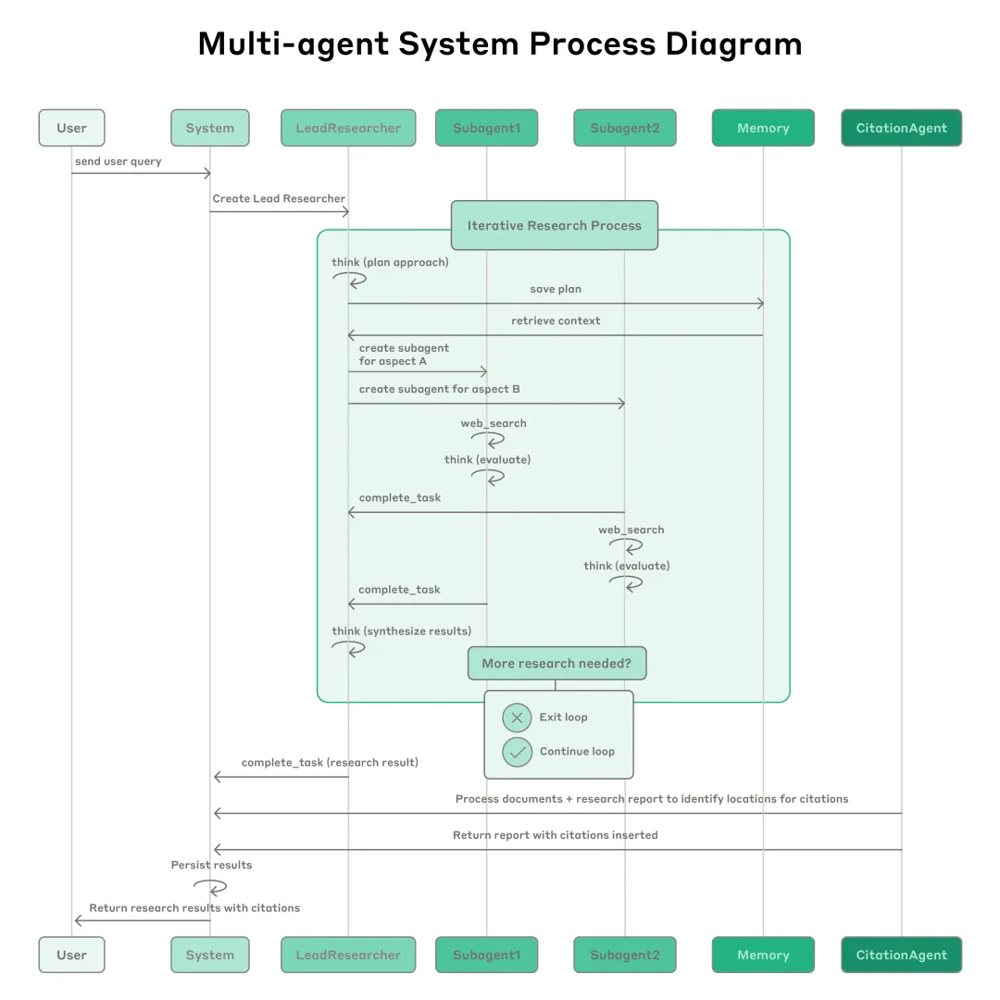
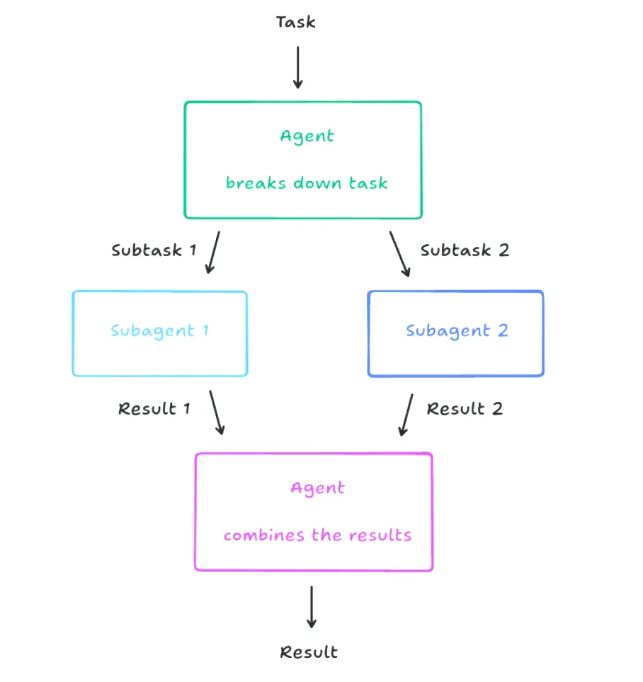

AI 智能体架构设计阶段三、Muti Agent

为突破单 AI 智能体的局限性，多 AI 智能体生态系统应运而生。在此阶段，摒弃了对单一“全能型” AI 智能体的依赖，转而构建由多个专业 AI 智能体构成的协作网络。各 AI 智能体专注于特定领域或任务，通过任务分发与协同合作，共同攻克复杂的综合性任务。以 MetaGPT 开源项目为例，这类典型的多 AI 智能体系统通过明确 AI 智能体角色、通信协议及协作机制，实现了复杂任务的自动化分解与高效执行。在软件开发场景中，可分别设置产品经理 AI 智能体负责需求分析、架构师 AI 智能体负责系统设计、程序员 AI 智能体负责代码实现以及测试工程师 AI 智能体负责质量保证，它们协同作业，贯穿整个软件开发生命周期。

多 AI 智能体系统具备以下核心优势：

任务聚焦：单个 AI 智能体专注于特定任务（比如：搜索或图表生成），相较于多工具选择，效率更高。

独立优化：可单独优化单个 AI 智能体，而不影响整体流程。

问题拆解：将复杂问题拆分为可处理的子任务，交由专业 AI 智能体处理。

特别地，在多 AI 智能体系统中，人类可作为特殊类型的 AI 智能体参与协作，其价值独特且不可替代：

专业判断：在关键决策节点，人类凭借丰富经验和领域知识，提供更可靠的判断与指导。

质量把控：人类可审核验证 AI 智能体的输出结果，确保其满足业务需求和质量标准。

异常处理：当 AI 智能体遭遇复杂难题时，人类可介入并提供解决方案。

持续优化：人类通过观察 AI 智能体表现，识别系统不足，并调整优化 AI 智能体能力边界与工作流程。

比如：在 Manus 项目中，系统会在关键节点暂停，进一步确认人类需求，等待人类确认或修正。这种人机协同模式，既保障了自动化效率，又确保了输出质量的可控性。“Human in the loop”的设计理念，使多 AI 智能体系统在保持高效自动化的同时，充分借助人类智慧与经验，实现更可靠、高质量的任务完成。

# 参考

[1] AI 智能体架构设计3阶段演进和3大关键技术对比剖析, https://mp.weixin.qq.com/s?__biz=MzIzODIzNzE0NQ==&mid=2654454116&idx=1&sn=5d48ccf3a66975a9a07ce7ca194249c6&chksm=f2ff05d2c5888cc42027819d0d136f5c655e2d1bd55f9c2f91fcf96f99499dd851c8a4c77490&cur_album_id=3670347606858678275&scene=190#rd
