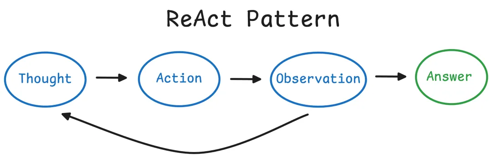
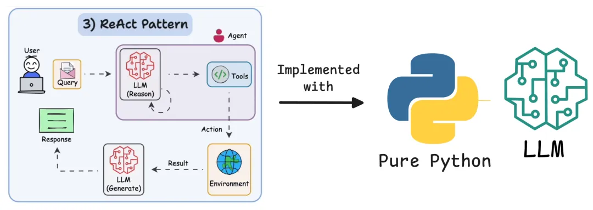
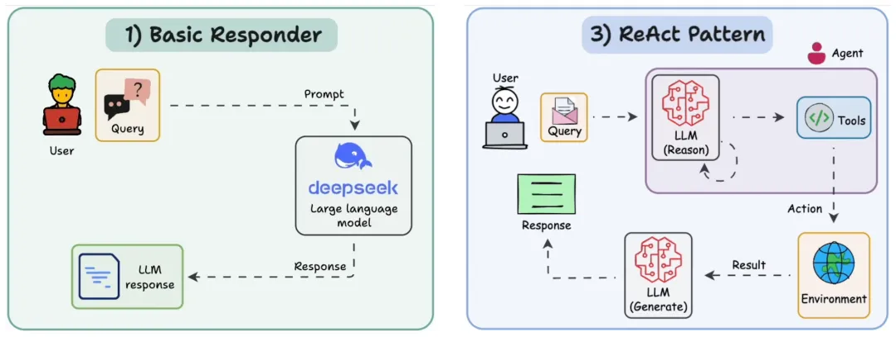
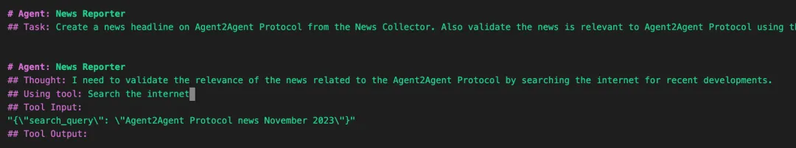
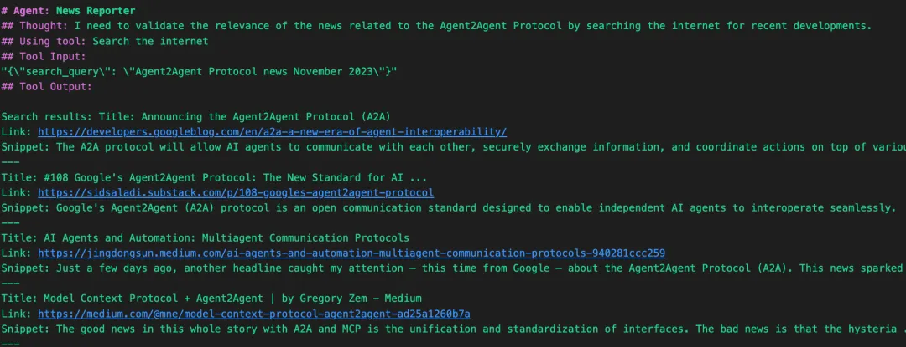
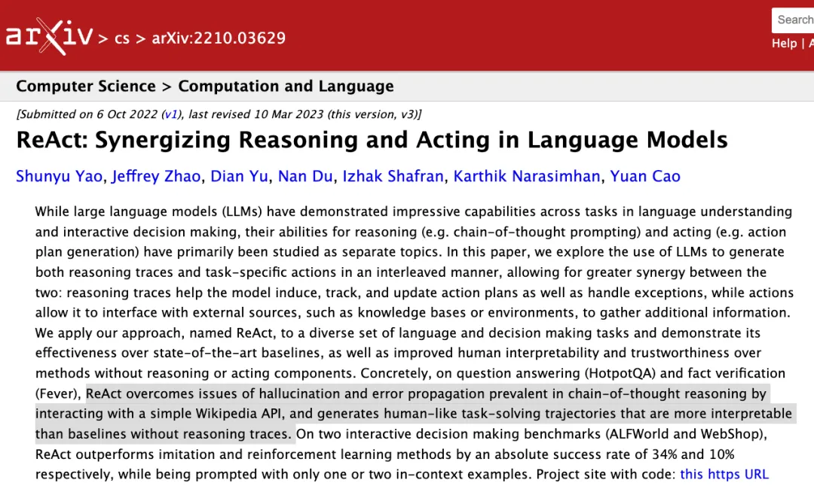
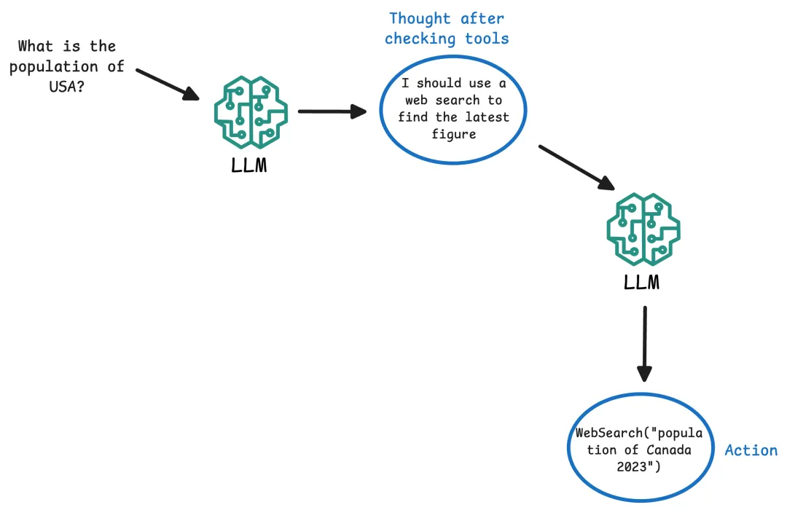
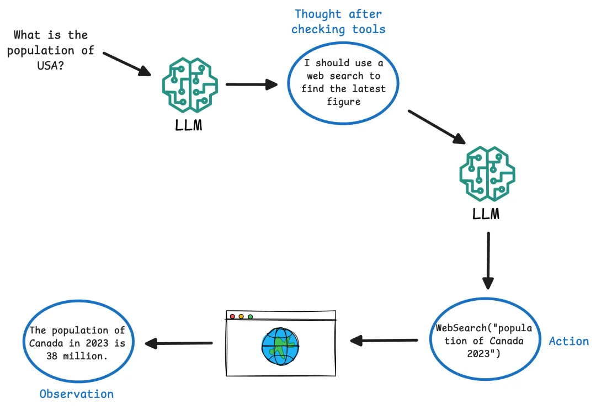
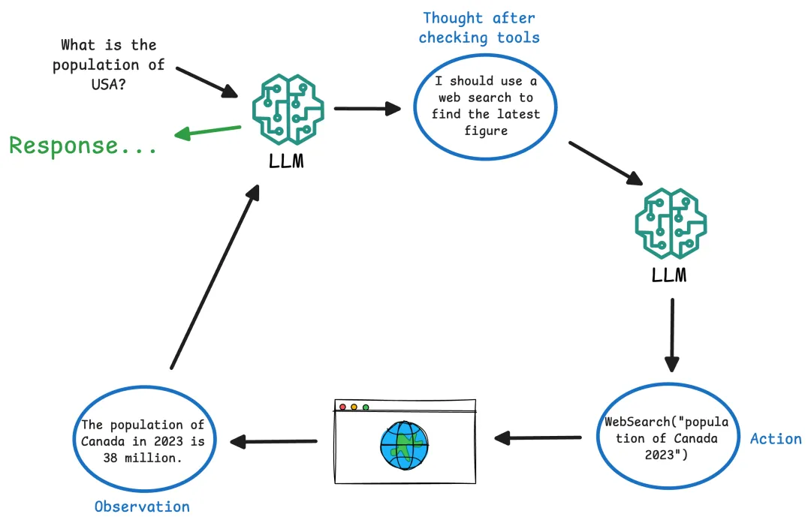
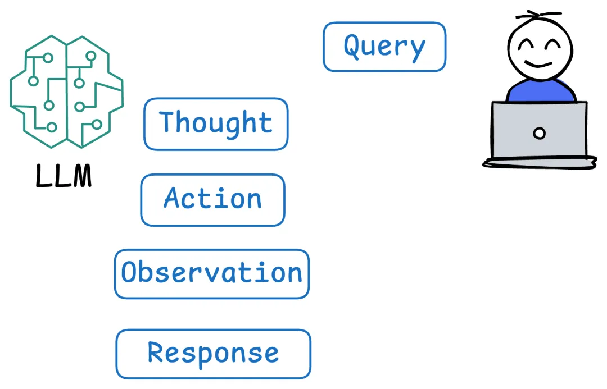

# 简介

构建 AI 智能体的过程，已经被像 LangChain、Spring AI Alibaba 等开发框架大大简化了，然后这些框架往往隐藏了驱动 AI 智能体运行的底层逻辑，比如：ReAct（Reasoning and Acting），让大模型（LLM）思考问题，并使用工具对任务采取行动。但很多时候，仅依赖预包装的库而不了解它们的内部工作原理，可能会导致困惑。

下面的例子就展示了 AI 智能体在产生回应之前，会经历一系列的思考活动。

在本文中，我们将通过深入剖析 ReAct 架构设计模式，来揭开这个过程的神秘面纱，从而我们获得了对 AI 智能体行为的完全控制，使其更容易进行优化和故障排除。

# ReAct 架构设计剖析
**1、ReAct 架构设计模式描述**

ReAct（即推理和行动）是一种 AI 智能体的架构设计范式，AI 智能体使用链式推理和工具使用行动来综合运用。

与其一步到位地生成直接答案，ReAct 智能体会逐步思考，并且可以在最终确定答案之前执行中间行动（比如：查找某件事或计算一个值）。

为了更清楚地了解这一点，让我们来思考一下 ReAct 架构设计模式是如何工作的。

**2、ReAct 示例描述**

考虑在一个多智能体系统中构建的一个 AI 智能体的输出：

在上面的例子中，我们看到了一个使用 ReAct 范式执行任务的新闻报道 AI  智能体的实时追踪。该 AI 智能体被要求创建一个与“Agent2Agent协议”相关的新闻标题。然而，它并没有急于下结论，而是如其结构化的追踪所示，逐步推理。

接下来我们拆解一下：

- AI 智能体角色：新闻报道者--这个 AI 智能体专门负责策划和验证新闻内容。
- Task：该 AI 智能体被指示生成一个新闻标题，并确保它与Agent2Agent协议相关。 
- Thought：该 AI 智能体首先内部推理，它应该通过快速搜索关于该协议的最新更新来验证信息。这是 ReAct 周期中的推理部分。 
- Action：它接着使用一个标记为“搜索互联网”的工具，传递一个结构化的 JSON 输入，查询内容为：“Agent2Agent 协议新闻 2023年11月”。这是 AI 智能体利用外部工具收集现实世界数据的行动步骤。

Tool Output：它包含了搜索工具检索到的结果--可能是新闻片段、文章摘要或相关网址。 这展示了将结构化思考和外部行动结合起来的力量：AI 智能体不仅仅依赖大模型的内部知识，而是通过工具进行事实核查。

这是一个例子，说明了 ReAct 模式是如何鼓励 AI 智能体行为的透明性、准确性和可验证性：对于那些需要处理真实世界信息的系统来说，这可是非常重要。

你可以想象，在多智能体系统中进一步扩展这个架构设计模式：一个新闻收集者收集原始信息，一个事实验证者检查可靠性，而这个新闻报道者构建标题，所有这些都通过推理和基于工具的行动进行异步协调。

**3、为什么 ReAct 如此重要？**

ReAct 被引入作为一个重大步骤，使基于 LLM 的 AI 智能体更加可靠和强大。

通过让大模型解释其思考过程并通过工具核实事实，我们减少了幻觉和错误传播等问题。

Yao 等人最初的 ReAct 研究表明，这种方法可以通过让大模型检索真实信息（比如：查询维基百科）来核实其事实，从而克服问答中的幻觉。

它还提高了 AI 智能体决策过程的透明度，因为我们可以检查推理链以进行调试或评估可信度。

总体而言，ReAct 架构设计模式将一个被动的 LLM 变成了一个积极的问题解决者，它可以分解复杂任务并与外部数据源互动，就像一个自主助手一样。

这也解释了为什么它几乎在所有的 AI 智能体框架中都被广泛使用。实际实现可能会有所不同，但一切都与 ReAct 架构设计模式衍生出来的东西有关。

ReAct 工作流程如下：

命令 LLM 逐步操作， 

清晰地将思考与行动分开， 

确保工具的确定性输入输出行为， 

并产生可检查或调试的可追溯推理链。 

# 2. 推理 + 行动：ReAct 智能体的工作原理

ReAct 智能体在一个思考→行动→观察的循环中运行，直到它找到解决方案或最终答案为止。

这类似于人类解决问题的方式：

我们思考要做什么，执行一个行动（比如：查找某件事或进行计算）， 观察结果，然后将其纳入我们的下一个思考中。

 ReAct 框架使用提示词工程来强制执行这种结构化的方法，交替大模型的思考和行动/观察。

下面是一个 AI 智能体中 ReAct 循环的逐步分解：

Thought：AI 智能体（由 LLM 驱动）分析用户的查询和内部上下文，并以自然语言产生一个推理步骤。这通常不会显示给最终用户，但它是 AI 智能体规划的一部分。例如：“问题要求一个国家的人口；我应该使用网络搜索来找到最新数字。”

Action：根据思考，AI 智能体决定要执行的外部工具或操作。它输出一个规定的格式来表示行动。例如：行动：WebSearch（"2023年加拿大人口"）。AI 智能体本质上是通过名称“调用”一个函数（工具），通常带有一些输入参数。

Observation：AI 智能体的环境（我们的代码）执行请求的行动，并将结果（观察）返回给 AI 智能体。例如，网络搜索工具可能会返回：“观察：2023年加拿大人口为3800万。”这个观察结果被输入到 AI 智能体的上下文中。

AI 智能体带着新信息回到第一步（另一个思考）。它将用新数据进行推理。在我们的例子中，它可能会想：“现在我有了人口数字；我可以回答问题了。”

这个思考/行动/观察循环重复进行，允许 AI 智能体在需要时链接多个工具使用（搜索，然后可能是一个计算，然后另一个搜索等）。最终，AI 智能体决定它可以回答用户。在这一点上，它不是输出一个行动，而是输出一个最终答案（有时在格式中标记为答案：或最终答案）。在整个过程中，AI 智能体保持对话和它自己的中间步骤，这就是记忆的功能。

每个思考和观察都可以被添加到对话上下文中，以便 LLM 记住到目前为止它已经做了什么。

这对于连贯性至关重要。最终结果是，AI 智能体有效地规划其方法，混合推理和行动。

这种动态方法比僵化的脚本或单轮回应要灵活得多。它允许处理不可预见的子任务，类似于人类在出现新信息时调整计划的方式。

需要注意的是，所有这些“思考”和“行动”注释并不是 LLM 的神奇特性：它们来自我们如何提示大模型。

正如我们稍后将看到的，我们明确地指导大模型以这种结构化的方式格式化其回应。换句话说，ReAct 是通过精心设计的提示词模板和解析逻辑实现的，而不是通过任何内置的 LLM 能力。

LLM 是通过我们给它的例子和指令被引导表现得像一个推理和行动的 AI 智能体。

# 参考

[1] AI 智能体 ReAct 架构设计模式剖析, https://mp.weixin.qq.com/s?__biz=MzIzODIzNzE0NQ==&mid=2654454269&idx=1&sn=d9021ae7d45bf869dbc8192151d9df66&chksm=f2ff054bc5888c5d889b62491ac1483c35338c424f886893dbe2736d3d09952b5d81051bb8d5&cur_album_id=3670347606858678275&scene=190#rd