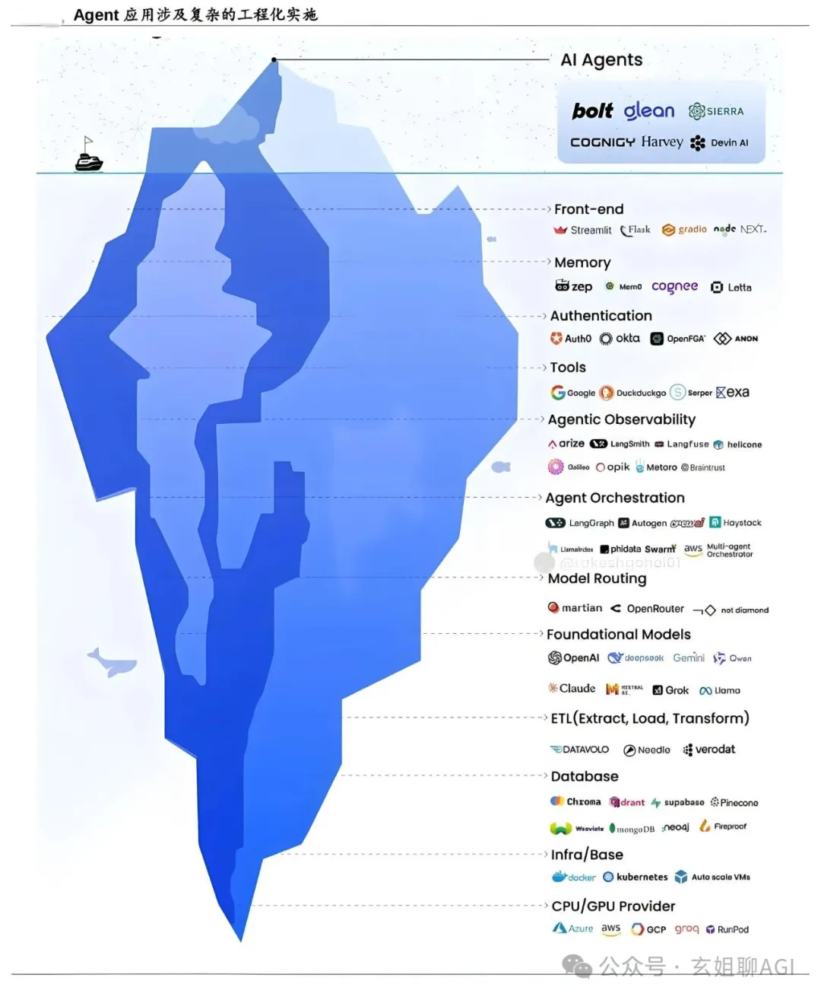

# 1. 简介

越来越多企业已经落地 AI 智能体应用，我们会不约而同的发现，AI 智能体应用在企业落地 90% 的工作都是工程架构设计（软件工程），只有 10% 是真正的 AI 大模型。

AI 智能体在企业落地中的每一个组件都是模块化的，而且逐步达成到了行业标准：比如：LangChain、Spring AI Alibaba 开发编排框架，MCP 通信交互协议等等，这些构成了 AI 智能体的生态系统。

AI 智能体应用落地的生态系统包含14层，从下到上分别为：CPU/GPU 提供商层、基础设施/基础层、数据库、ETL（提取、加载、转换）层、基础模型层、模型路由层、AI 智能体协议层、AI 智能体编排层、AI 智能体认证层、AI 智能体可观测层、工具层、认证层、记忆层、前端层等。

# 2. AI 智能体生态系统架构设计剖析
0、AI 智能体生态系统总体架构设计

AI 智能体生态系统总体架构设计包含14层，从下到上分别为：CPU/GPU 提供商层、基础设施/基础层、数据库、ETL（提取、加载、转换）层、基础模型层、模型路由层、AI 智能体协议层、AI 智能体编排层、AI 智能体认证层、AI 智能体可观测层、工具层、认证层、记忆层、前端层等。

1、第一层：CPU/GPU 提供商层

这些公司为 AI 智能体提供强大的计算能力，用于训练、推理和低延迟的执行。

包括硬件厂商英伟达 GPU、谷歌 TPU、华为昇腾系列，以及公有云厂商 Azure、Google Cloud Platform（GCP）、阿里云、腾讯云、华为云等。

2、第二层：基础设施/基础层

像容器和编排工具这样的基础设施，确保 AI 智能体能够可扩展、可靠且分布式地部署。

包括 Docker、Kubernetes、Kserve、Knative、Auto Scale VMs。

3、第三层：数据层

AI 智能体需要快速访问的数据系统，用于存储记忆、检索上下文以及在结构化和向量化数据中进行实时决策。

包括 Milvus、Chroma、Pinecone、Neo4j、MongoDB、Elasticsearch、PGVector、MySQL 等。

4、第四层：ETL（提取、加载、转换）层

这些平台从各种来源收集原始数据，并将其转换成 AI 智能体可以使用的格式。

包括 Datavolo、Noodle.ai、Verodata 等。

5、第五层：基础模型层

包括大型和小型语言模型（LLMs 和 SLMs），它们构成了 AI 智能体的认知核心，支持推理、对话和行动。

包括 GPT、DeepSeek、Qwen、Claude、Grok、Llama 等大模型，以及 Yolox、PaddleOCR 等小模型。

6、第六层：模型路由层

根据成本、延迟和输出质量，将任务分配给最适合的模型，从而提高效率。

包括 Martian、OpenRouter、Higress、Not Diamond 等。

7、第7层：AI 智能体协议层

定义 AI 智能体之间的交互和通信方式。像 MCP、A2A、AG-UI、ANP、ACP 这样的协议，有助于结构化的多 AI 智能体协作和上下文管理。

8、第8层：AI 智能体编排层

使 AI 智能体能够执行工作流、与其他 AI 智能体交互，并在工具和环境中进行协调。

包括 Spring AI Alibaba、LangGraph、Autogen、LlamaIndex、Swarm、Eino 等。

9、第九层：AI 智能体认证层

处理 AI 智能体在可信生态系统内的安全身份、访问控制和基于角色的权限。

包括 AWS AgentCore Identity、Azure Entry Agent ID 等。

10、第十层：AI 智能体可观测层

通过遥测、日志、反馈循环和分析来跟踪 AI 智能体的行为，以便持续改进和调试 AI 智能体。

包括 LangSmith、Langfuse、Arize、OpenTelemetry、Helicone、Opik 等。

11、第十一层：AI 智能体工具层

AI 智能体使用的 API、搜索和外部工具，用于获取实时数据、自动化决策或跨领域集成。

包括 Google Search、DuckDuckGo、Sorper、Exa 等。

12、第十二层：认证层

通过安全的身份验证和用户访问控制层来保护 AI 智能体的操作。

包括 Auth0、Okta、OpenFGA、ANON 等。

13、第十三层：记忆层

存储之前的交互和上下文知识，帮助 AI 智能体随着时间的推移进行个性化和适应。

包括 Zep、Mem0、Letta、Cgnee 等。

14、第十四层：前端层

用户与 AI 智能体无缝交互的 UI 组件，比如： Web 应用和聊天界面。

包括 Streamlit、Flask、gradio、NEXT 等。

总之，以上就是 AI 智能体应用在企业落地的生态系统，可以根据企业总的业务场景灵活选择每层中的工具和技术，但是并不是所有列出的技术都需要用来构建一个有效的 AI 智能体应用中。

# 参考

[1] AI 智能体企业落地，其实90%都是工程架构设计，只有10%才是真正的 AI 大模型, https://mp.weixin.qq.com/s/YFWJ82Tqbedq7CEy8hptGQ