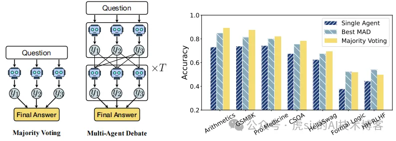

 Title:《Debate or Vote: Which Yields Better Decisions in Multi-Agent Large Language Models?》
 

图1 多数投票 vs. MAD                     图2：多数投票是MAD的主要贡献者

多数投票几乎承担了所有提升性能的工作，这也解释了我们的实证发现。

我们的主要贡献与研究意义总结如下：

- 我们通过在 7 个代表性基准测试集上的评估，全面证明 “多数投票” 与 “多智能体辩论” 的性能相当；并进一步将研究扩展到更通用的多智能体辩论场景，包括 “更大、能力更强的智能体”“异质智能体群体” 以及 “开放式自然语言任务”。
- 我们提出了新的理论框架：揭示了多数投票的成功概率，并将多智能体辩论严格刻画为鞅过程。该框架为未来研究理解多智能体辩论系统奠定了原则性基础。
- 我们的理论分析表明 “仅靠辩论无法超越多数投票”；通过设计 “在辩论轮次中保留正确回应” 的策略，我们实现了多智能体辩论性能的显著提升，为 “有效改进多智能体辩论系统” 的未来研究提供了方向。

多数投票的性能仍与多智能体方法相当。这表明，我们的结论不仅限于小规模模型，在大参量大语言模型中同样成立。

# 参考

【1】辩论还是投票：多智能体大语言模型中哪种方式能做出更优决策？https://mp.weixin.qq.com/s/oelIDoHc2uhZCOx1WP3AHQ