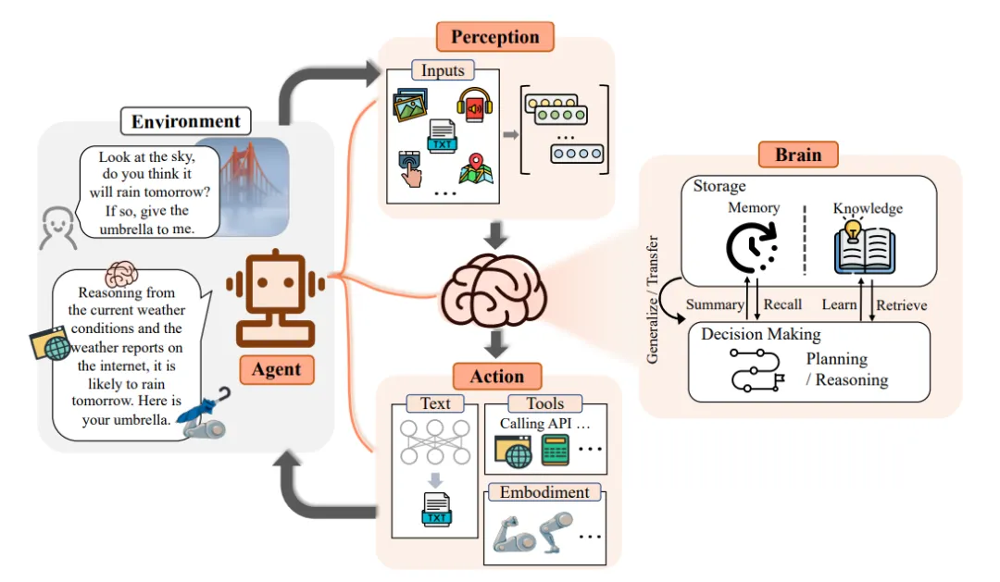

# 1. 简介

# 2. 详解

什么是LLM Agent？大模型Agent是一种构建于大型语言模型（LLM）之上的智能体，它具备环境感知能力、自主理解、决策制定及执行行动的能力。

Agent是能够模拟独立思考过程，灵活调用各类工具，逐步达成预设目标。在技术架构上，Agent从面向过程的架构转变为面向目标的架构，旨在通过感知、思考与行动的紧密结合，完成复杂任务。

大模型Agent由规划、记忆、工具与行动四大关键部分组成，分别负责任务拆解与策略评估、信息存储与回忆、环境感知与决策辅助、以及将思维转化为实际行动。

1. 规划（Planning）：
    - 定义：规划是Agent的思维模型，负责拆解复杂任务为可执行的子任务，并评估执行策略。
    - 实现方式：通过大模型提示工程（如ReAct、CoT推理模式）实现，使Agent能够精准拆解任务，分步解决。

2. 记忆（Memory）：
   - 定义：记忆即信息存储与回忆，包括短期记忆和长期记忆。
   - 实现方式：短期记忆用于存储会话上下文，支持多轮对话；长期记忆则存储用户特征、业务数据等，通常通过向量数据库等技术实现快速存取。

3. 工具（Tools）：

    - 定义：工具是Agent感知环境、执行决策的辅助手段，如API调用、插件扩展等。
    - 实现方式：通过接入外部工具（如API、插件）扩展Agent的能力，如ChatPDF解析文档、Midjourney文生图等。

4. 行动（Action）：

    - 定义：行动是Agent将规划与记忆转化为具体输出的过程，包括与外部环境的互动或工具调用。
    - 实现方式：Agent根据规划与记忆执行具体行动，如智能客服回复、查询天气预报、AI机器人抓起物体等。

# 3.  LLM Agent + RAG

什么是LLM Agent + RAG？RAG技术为LLM Agent提供了额外的知识来源。传统的LLM虽然能够从大规模文本数据中学习到丰富的语言知识和模式，但它们在处理特定领域或需要专业知识的问题时可能表现不足。
通过引入RAG，LLM Agent能够在需要时查询外部知识库，如专业数据库、学术论文、行业报告等，从而增强其知识广度和深度。

如何实现财报分析Agent？通过集成大型语言模型（LLM）、检索增强生成（RAG）技术、自动化数据处理与分析工具，以及定制化的任务规划与执行流程，构建一个能够自动收集财报数据、进行深度分析并生成报告的智能代理系统。

财报分析Agent，自动化完成数据收集、分析与报告生成，具体步骤包括需求分析、架构设计、Prompt设计、数据获取、RAG检索、LLM处理、报告生成等。

需求分析：

明确财报分析Agent的目标和功能需求，包括支持的财报类型、分析维度、报告格式等。

确定用户群体及其需求，例如财务人员、管理层、投资者等。

架构设计：

设计Agent的整体架构，包括Prompt设计模块、数据获取模块、RAG检索模块、LLM应用模块、报告生成模块等。

确定各模块之间的接口和交互方式，确保数据流和控制流的顺畅。

Prompt设计模块：

设计合理的Prompt模板，以引导LLM模型更好地理解用户问题和意图。

通过不断优化Prompt设计，提高Agent的回答质量和用户体验。

数据获取模块：

开发数据获取脚本或接口，负责自动从指定的网站（如证券交易所、公司官网、财经新闻网站等）抓取财报数据和其他相关信息。

对收集到的数据进行清洗、格式化、去重等预处理工作，确保数据质量。

RAG检索模块：

整理历史财报分析报告、行业报告、会计准则等资料，构建财报知识库。

使用RAG技术对知识库进行索引和优化，允许Agent在回答财报分析问题时，能够从其知识库中检索相关的文档和片段。

LLM处理模块：

将LLM模型与RAG技术集成，配置模型参数和检索策略。

利用LLM模型的强大语言理解和生成能力，对经过RAG检索增强的问题进行理解和回答。

报告生成模块：

设计报告模板和格式化规则，确保生成的报告符合用户需求和规范。

使用自然语言处理技术对报告初稿进行润色、校对和优化，提高报告的可读性和准确性。

集成图表、表格等可视化工具，增强报告的数据呈现效果。
# 参考

[1] 一文彻底搞懂大模型 - Agent（智能体）, https://mp.weixin.qq.com/s/YIlVumGxSxQPXlxIldBypQ