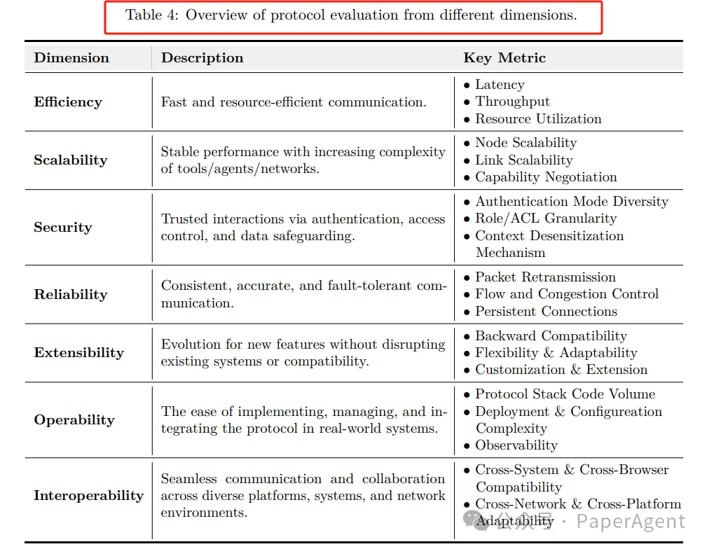

# 资源

A Survey of AI Agent Protocols: https://arxiv.org/pdf/2504.16736

对现有的LLM AI Agent通信协议进行了系统性的概述，并将其分为四大类，以帮助用户和开发者为特定应用场景选择最适合的协议。


# 1. AI Agent协议的发展

AI Agent协议的定义：代理协议是标准化框架，定义了代理之间以及代理与外部系统之间结构化通信的规则、格式和程序。与传统交互机制（如API、GUI或XML）相比，协议在效率、操作范围、标准化和AI原生性方面具有显著优势。


```text
代理协议的作用：

互操作性：允许不同架构的异构代理系统无缝协作。

标准化交互：确保代理能够轻松集成和扩展其功能，通过纳入新工具、API或服务。

安全性和治理：提供内置机制以管理代理行为，确保在明确定义的安全操作参数内运行。

降低开发复杂性：通过抽象化交互逻辑，减少代理开发的复杂性，使开发者能够专注于增强核心代理功能。

促进集体智能：通过标准化通信渠道共享见解和协调行动，使分布式代理系统能够实现单一架构无法实现的结果。
```

# 2. 二、AI Agent协议分类框架

提出了一个二维分类框架，将协议分为上下文导向型（Context-Oriented Protocols）和代理间通信型（Inter-Agent Protocols），并进一步细分为通用型（General-Purpose）和特定领域型（Domain-Specific）。


**1、上下文导向型协议**

面向上下文的协议主要解决AI代理与外部工具或数据源之间的交互问题，帮助代理获取必要的上下文信息以完成任务。这类协议进一步分为：

```text
1.1 General-Purpose Protocols

MCP（Model Context Protocol）：由Anthropic提出，是一个通用的上下文获取协议，允许AI代理通过标准化的方式与外部资源（如数据、工具和服务）进行交互。它采用客户端-服务器架构，将工具调用与LLM响应解耦，提高了数据安全性和隐私性。

1.2 Domain-Specific Protocols

agents.json：由WildCardAI提出，是一个基于OpenAPI标准的开源机器可读合同格式，专门用于将传统API与AI代理桥接，支持网站声明AI兼容接口、认证方案和多步工作流。
```

**2、Agent间通信协议**

面向代理间交互的协议专注于代理之间的协作和通信，以解决更复杂的任务。


```text
2.1 General-Purpose Protocols

ANP（Agent Network Protocol）：由开源社区开发，旨在实现不同代理之间的互操作性，构建一个开放、安全、高效的协作网络。它支持跨域代理通信，采用去中心化身份认证机制。

A2A（Agent2Agent Protocol）：由Google提出，专注于企业内部代理之间的复杂问题解决和协作，支持异步工作流和多模态交互。

AITP（Agent Interaction & Transaction Protocol）：由NEAR基金会提出，支持代理之间的安全通信、协商和价值交换，特别适用于跨信任边界的交互。

AConP（Agent Connect Protocol）：由Cisco提出，定义了调用和配置代理的标准接口。

AComP（Agent Communication Protocol）：由Al and Data提出，旨在标准化代理之间的通信，促进自动化和协作。

Agora：由牛津大学提出，是一个元协议，允许代理根据上下文采用不同的通信协议。

2.2 Domain-Specific Protocols

LMOS（Language Model Operating System）：由Eclipse基金会提出，旨在构建一个互联网代理生态系统，支持代理的发现、交互和互操作性。

Agent Protocol：由AI Engineer Foundation提出，定义了控制台与AI代理之间的通信标准。

LOKA：由CMU提出，是一个去中心化的框架，用于建立知识型代理之间的信任和伦理协调。

PXP（Predict and eXplain Protocol）：由BITS Pilani提出，专注于人机交互中的双向可解释性。

CrowdES：由GIST.KR提出，用于机器人代理之间的交互，模拟真实的人群动态。

SPPs（Spatial Population Protocols）：由利物浦大学提出，用于解决匿名机器人之间的分布式定位问题。
```


# 3. 案例分析

通过一个具体的用例——计划从北京到纽约的五天旅行——来比较和分析四种不同的AI代理协议：MCP、A2A、ANP和Agora：


**1.  MCP: 单个代理调用所有工具**

适用于任务定义明确且外部服务接口稳定的场景，但不适用于动态环境。

```text
工作流程：

用户向MCP Travel Client提出旅行计划请求。

MCP Travel Client直接调用Flight Server、Hotel Server和Weather Server，分别获取航班、酒店和天气信息。

各服务返回信息后，MCP Travel Client聚合所有响应，生成完整的旅行计划。
```

**2. A2A: 企业内部的复杂协作**

适合企业内部多个专业代理直接通信的场景，依赖于稳定的内部基础设施和高效的代理间数据交换。

```text
工作流程：

用户向A2A Travel Planner提出旅行计划请求。

A2A Travel Planner将任务分配给各个专业代理（如Flight Agent、Hotel Agent、Weather Agent）。

各代理直接相互通信，获取所需信息（例如Flight Agent直接从Weather Agent获取天气信息）。

各代理将结果返回给A2A Travel Planner，由其汇总最终结果。
```

**3. ANP: 跨领域代理协议**

适合跨组织协作的场景，需要清晰的协议和安全机制。

```text
工作流程：

用户向ANP Travel Planner提出旅行计划请求。

ANP Travel Planner将任务分配给不同组织的代理（如Flight Agent、Hotel Agent、Weather Agent）。

各代理通过跨组织协议进行交互（例如Flight Agent与Weather Agent跨组织交互）。

各代理将结果返回给ANP Travel Planner，由其汇总最终结果。
```

**4. Agora: 自然语言到协议生成**

专注于用户交互，将自然语言转换为结构化协议，适合需要高效用户交互的场景。

```text
工作流程：

用户提出自然语言请求（如“规划从北京到纽约的五天旅行”）。

Agora通过自然语言理解模块解析用户请求，提取关键信息（如出发地、目的地、持续时间、预算）。

协议生成模块将这些信息转换为标准化协议（如Flight Protocol、Hotel Protocol、Weather Protocol）。

协议分发模块将协议分发给相应的专业代理（如Flight Agent、Hotel Agent、Weather Agent）。

各代理根据协议响应，返回结果。
```




# 参考

[1] 4大类AI Agent协议框架全面综述, https://mp.weixin.qq.com/s/NdmFcbg7eEJ-hHf6j_iDXg