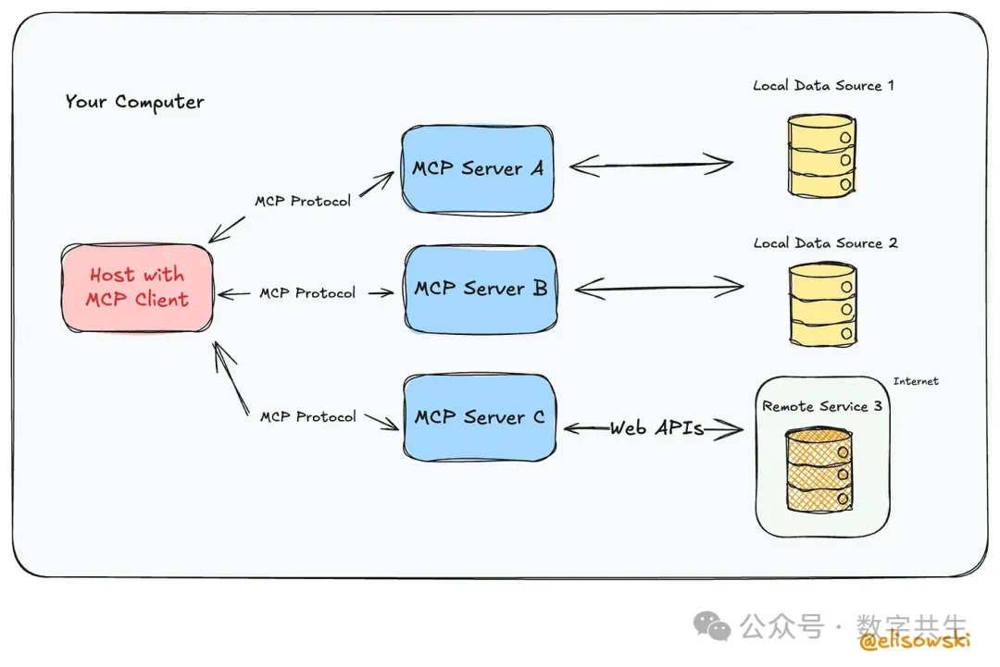
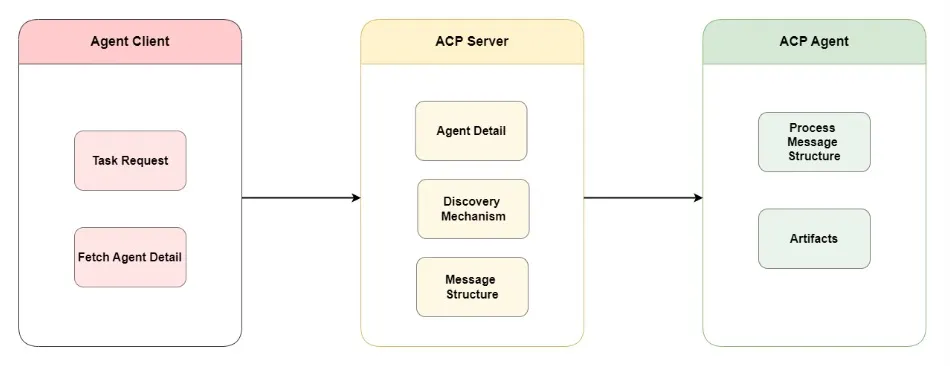
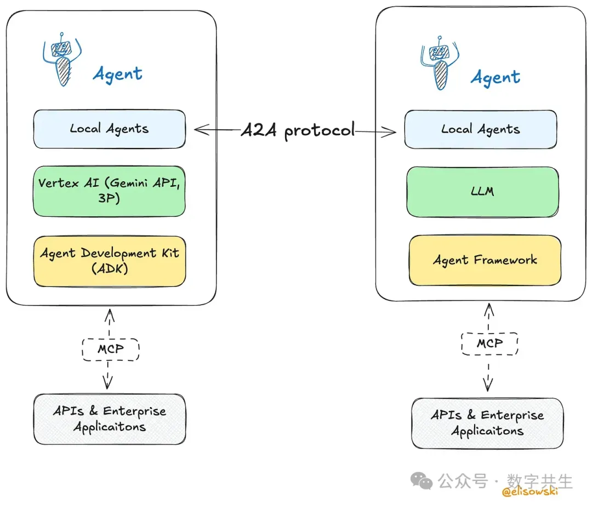
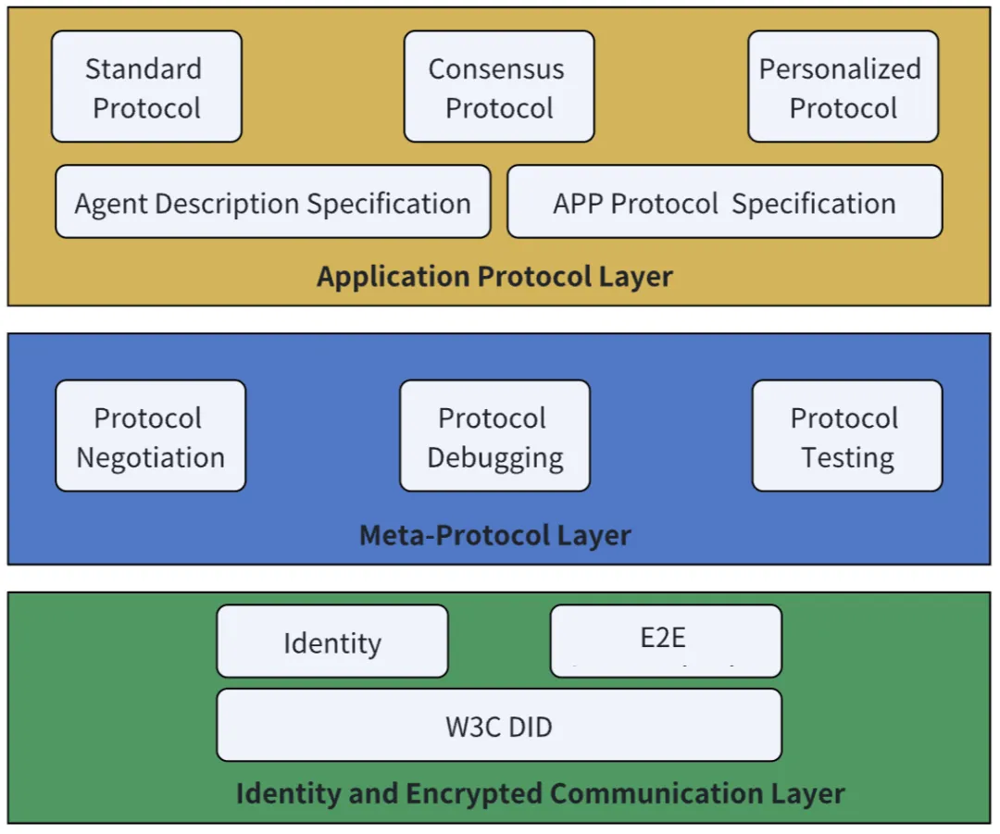
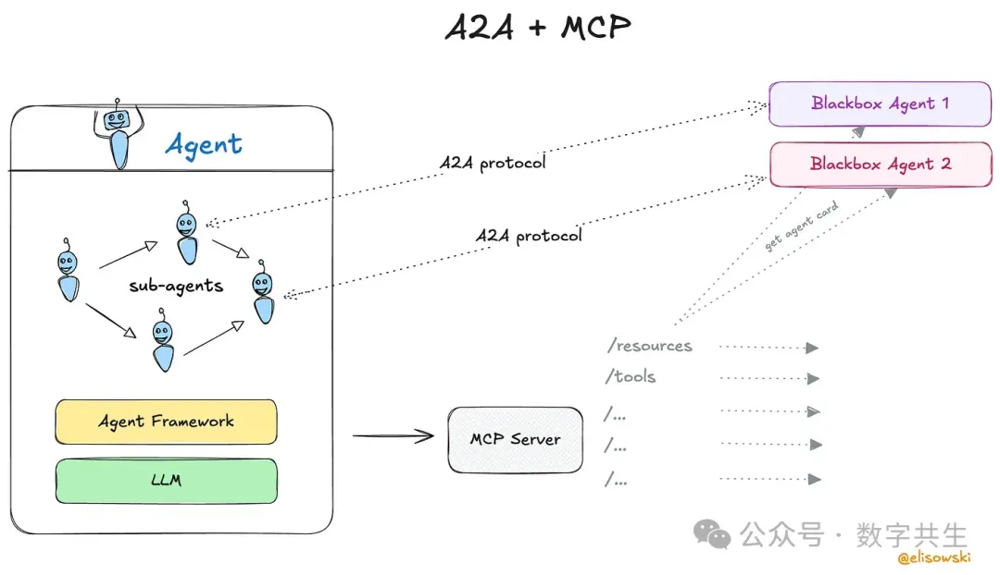

# 1. MCP（模型上下文协议）是什么?

它是由Anthropic推出的模型上下文协议（Model Context Protocol，简称MCP），为大型语言模型（LLMs）定义了一套标准化实时上下文接口，用于提供结构化输入数据。

核心功能

1. 上下文数据注入

    MCP允许将外部资源（如文件、数据库记录或API响应）直接注入到提示词或工作内存中。所有数据均通过标准化接口传输，使LLM能够保持轻量化与整洁性。

2. 函数路由与调用
   
   该协议支持模型动态调用工具。开发者可注册诸如searchCustomerData（查询客户数据）或generateReport（生成报告）等能力，LLM即可按需调用。这相当于为AI配备了一个可插拔工具箱，而无需将工具硬编码到模型内部。
   
3. 提示词编排

   MCP能智能组装关键上下文，而非将所有细节塞入提示词。这种模块化实时构建方式，实现了：
   - 更精准的上下文选择
   - 更少的token消耗
   - 更优质的输出结果

实现特性

- 基于HTTP(S)协议运行，使用JSON格式的能力描述符
- 模型无关设计-任何具备兼容运行时的LLM均可接入符合MCP标准的服务端
- 兼容企业级认证标准（如OAuth2、mTLS）及API网关

工程应用场景
1. LLM与企业内部API集成
    通过MCP实现对企业结构化业务数据的安全访问（只读或交互式），避免直接暴露原始API端点
2. 企业级智能体赋能
    为自主智能体动态注入运行时上下文，支持从Salesforce、SAP或内部知识库等工具实时获取信息
3. 动态提示词构建
    根据用户会话状态、系统运行状态或任务管道逻辑，智能定制提示词内容

# 2. ACP（智能体通信协议）是什么？

MCP代表模型上下文协议(Model Context Protocol)。它让Claude这样的AI能突破自

智能体通信协议（Agent Communication Protocol，简称ACP）是由BeeAI与IBM联合提出的开放标准，旨在为同一本地或边缘环境中运行的AI智能体提供结构化通信、服务发现与协同调度能力。
与面向云端的A2A协议或MCP等上下文路由协议不同，ACP专为本地优先的实时智能体编排设计，具有以下核心特性：
极低网络开销
支持共享运行时的深度集成

协议设计与架构

ACP定义了一个去中心化智能体运行环境，其核心架构如下：

1.智能体自描述体系
每个智能体通过本地广播/发现层，主动宣告其身份标识、能力集与实时状态

2.事件驱动通信机制
智能体间通过事件消息交互，通常基于本地总线或进程间通信（IPC）系统实现

3.可选运行时控制器

智能体行为编排

运行遥测数据聚合

执行策略强制实施

ACP智能体通常以轻量化无状态服务或容器的形式运行，共享同一通信基座（communication substrate）。

实现特性
1.低延迟环境专优设计
适用于本地化智能体编排、机器人控制、离线边缘AI等场景
多协议适配支持
2.可通过以下方式实现：
gRPC协议
ZeroMQ消息队列
自定义运行时总线
3.本地主权保障
无需依赖云端服务
免除外部服务注册
4.智能任务路由
支持通过能力类型标注与语义描述符实现自动化任务分配

工程应用场景
1.边缘设备多智能体协同
支持无人机集群、物联网节点组或机器人舰队等场景下的分布式智能体编排
2.本地优先的LLM系统
协调模型调用、传感器输入与动作执行的端到端流程
3.去中心化自主运行环境
实现无需云端中枢的智能体自主协同

简言之，ACP为模块化AI系统提供了一个运行时本地协议层-优先考虑低延迟协调、高弹性和可组合性。它天然适合那些云优先协议难以适用的隐私敏感型、自主化或边缘优先的部署场景。

# 3. A2A（智能体间通信协议）是什么？

由Google推出的智能体间通信协议（Agent-to-Agent Protocol，简称A2A）是一套跨平台规范，旨在实现AI智能体在异构系统间的通信、协作与任务委派。

与ACP的"本地优先"定位或MCP的工具集成层不同，A2A专注于横向互操作性-通过标准化不同厂商/运行环境的智能体间的能力交换与工作流协调机制，实现开放网络下的无缝协作。

协议概述
A2A采用基于HTTP的通信模型，将每个智能体视为可互操作的服务单元。各智能体会公开一份机器可读的"智能体卡片"（Agent Card）-采用JSON格式描述其身份标识、能力集、通信端点及认证要求等元数据。
基于该机制，智能体可实现：
程序化相互发现
任务与角色协商
消息/数据/流式更新的交互
A2A原则上不限定传输层协议，但当前规范以HTTPS+JSON-RPC 2.0作为核心交互机制。

核心组件
智能体卡片（Agent Cards）：描述智能体能力、端点、支持的消息类型、认证方法和运行时元数据的JSON文档。
A2A客户端/服务器接口：每个智能体既可以作为客户端（任务发起者），也可以作为服务器（任务执行者），或者同时兼具两种角色，从而实现动态任务路由和协商。
消息与数据交换：支持包含上下文的多部分任务、通过SSE实现的流式输出，以及文件或知识块等持久化数据。
用户体验协商：智能体能够根据下游智能体的能力，自适应地调整消息格式、内容粒度和可视化呈现方式。

安全架构
基于OAuth 2.0和API密钥的授权机制
能力限定端点-智能体仅暴露声明交互所需的函数接口
支持"不透明"运行模式-隐藏内部逻辑同时公开可调用服务

实现特性
原生Web设计：基于HTTP、JSON-RPC及标准Web安全协议构建
模型无关性：兼容任何实现该协议的智能体系统（LLM或其他类型）
支持任务流式传输与轻量级多轮协作

工程应用场景
1.跨平台智能体生态系统：实现不同团队或厂商开发的智能体间安全互操作
2.云原生AI环境中的分布式智能体编排（如Vertex AI、LangChain、HuggingFace Agents等平台）
3.多智能体协作框架：例如跨多个系统（CRM、HR、IT等智能体）的企业级AI工作流

协议对比一览表

| 特性         | MCP                                | ACP                    | A2A                           |
| ------------ | ---------------------------------- | ---------------------- | ----------------------------- |
| 主要焦点     | 为大语言模型注入上下文             | 代理的本地协调         | 跨平台的代理通信              |
| 架构         | 客户端-服务器（主机/服务器模式）     | 去中心化，本地运行时    | 基于HTTP的客户端/服务器，含代理卡片 |
| 范围         | 垂直集成（工具→模型）               | 本地优先的代理运行时    | 水平集成（代理↔代理）         |
| 发现机制     | 服务器上的工具注册表                | 本地广播/运行时注册    | 通过HTTP(S)的代理卡片         |
| 传输协议     | HTTP(S), JSON                     | IPC, ZeroMQ, gRPC（灵活） | JSON-RPC 2.0 over HTTPS       |
| 安全模型     | 应用层认证、OAuth2、范围化API       | 运行时沙箱、私有网络安全 | OAuth2、范围化端点暴露         |
| 最佳适用场景 | 需要外部数据/工具的LLM应用          | 边缘AI、嵌入式系统、离线代理 | 跨平台的多代理工作流         |
| 示例用例     | 将LLM连接到内部API                 | 设备上多个小型代理的协调 | 分布式企业代理协作            |

# 4. ANP：Web智能体的未来
在当前所有的代理协议中，代理网络协议 (ANP) 最符合主动推理和空间网络的要求。ANP 建立在分布式标识符 (distributed identifiers，DIDs) 和 JSON-LD 链接数据之上，它允许智能体在语义上描述自己，在全局范围内发现彼此，并进行对等通信。

我们做一个简单的类比，想象一个全球性的，安全的AI 智能体在线市场，ANP 为智能体提供了 id (如数字护照) 和规则，以发现彼此，证明他们的身份，并公开和安全地协作。协议本身会携带身份信息、身份验证信息，目前主要是使用W3C的DID方案，一个智能体可以用自己的身份信息，与其他所有的智能体进行交互，不必在其他智能体平台申请账号。ANP采用了去中心化的身份安全通信，基于关联数据的语义建模，通过开放注册表或搜索索引智能体的描述进行发现。

ANP的核心概念是Interface，包括自然语言接口和结构化接口，将智能体交互方式的定义下放到了Interface中，支持自主发现、去中心化身份验证和语义推理，虽然 ANP 目前不支持像 rgm 这样的预测或分层推理体系结构，但是它的基础设施可以提供传输和发现层的智能体。

ANP的智能体描述则是基于JSON-LD和http://schema.org，这是语义网的技术，具体可以参考《从语义网到知识图谱》一文。其目的是提高两个智能体对信息理解的一致性。ANP采用的是语义网的Linked-Data技术，目标是构建一个便于AI访问和理解的AI原生数据网络。

同样，ANP可能缺乏共享的全局上下文和空间网络提供的事务性知识图谱。它能够连接智能体，但不连接它们的环境。这或许是空间网络开始接管的地方。

# 5. 互补还是竞争？

A2A与MCP的关系

A2A和MCP并非相互竞争-它们解决的是智能体AI难题中完全不同的环节，实际上二者能完美互补。

可以这样理解：MCP是让AI智能体接入现实世界的协议。它为智能体提供文件、API、数据库等结构化上下文的访问能力，无论是获取实时销售数据还是生成定制报告，MCP负责处理与工具和数据的连接。A2A则是智能体间的协作层。它提供统一语言和规则体系，使不同厂商开发、运行在不同平台上的智能体能够相互发现、任务委派和协作协商。

简而言之：MCP连接AI与工具，A2A连接AI与AI
二者共同构成了构建智能协作系统的模块化基础架构。

ACP的定位
ACP则采用了完全不同的技术路径，它专注于本地优先的智能体协同-无需云端支持。与基于HTTP和网络发现机制的A2A不同，ACP让智能体在共享运行时环境中直接发现并通信。

这种设计特别适合以下场景：
带宽受限或需要低延迟（如机器人控制、设备端助手）
注重隐私，需全程离线运行的场景
无网络环境（如工厂车间、边缘节点等）
ACP并非要与A2A竞争，而是填补了另一个细分需求。但在某些严格管控的环境中，ACP可能完全替代A2A-因为它摒弃了云原生协议的开销，直接在本地高效完成任务。

# 6. 融合还是分裂？

随着这些协议被更多团队采用，未来可能呈现几种发展态势：

1. 理想情况：走向融合。设想一个统一的智能体平台-A2A负责智能体间通信，MCP管理工具和数据接入，而ACP式运行时则专攻边缘/离线场景。所有组件无缝协作，开发者无需关心底层协议的具体分工。
2. 最坏情况：走向分裂。不同厂商推行各自的A2A或MCP变种，最终陷入混乱-就像早期Web服务时代，没有大量胶水代码就无法互联互通。
3. 折中方案：开源工具和中间件可能成为救星。这些项目将作为智能体与协议间的适配层，既通过统一API为开发者屏蔽差异，又能在底层根据智能体运行环境自动转换协议。

# 7. 智能体间通信协议的思考

在一定意义上，A2A 和 MCP 是互补的，它们解决的是AI 智能体完全不同的部分，而且它们实际上可以配合得非常好。可以把 MCP 看作是让AI 智能体接入世界的协议， MCP使智能体能够访问文件、 api 和数据库，基本上就是他们做一些有用的事情所需要的所有结构化上下文。无论是提取实时销售数据还是生成自定义报告，MCP 都处理与工具和数据的连接。A2A 是智能体开始合作的地方，A2A 为他们提供了一种共享的语言和一套规则来发现彼此、委派任务、协商他们如何一起工作ーー即使他们是由不同的供应商构建或运行在不同的平台上。

简单而言，MCP 连接AI和工具，而A2A 连接 AI 和其他 AI，它们共同构成了构建智能协作系统的强大模块基础。

ACP采用了完全不同的方法。这完全是本地优先代理协调的问题，不需要云服务。ACP 不使用 HTTP 和基于 web 的发现，而是允许代理在共享运行时内部相互查找和通信。这非常适用于带宽有限或者需要低延迟 (比如机器人技术或者设备上的助手) 的场景, 或者隐私级别很高，以及在没有互联网的环境中部署 (例如，工厂车间、边缘节点)。

ACP 并非试图与 A2A 竞争，它只是填补了一个不同的利基市场。但是在一些设置中，特别是在严格控制的环境中，ACP 可能完全取代 A2A，因为它跳过了 web 本地协议的开销，只是在本地完成工作。

ANP 则像是充满了互联网情怀方法，实现智能体在互联网上的连接与协作。ANP的最大价值在于社区对未来智能体互联网的设想，是社区独特的互联网理念（连接即权力），以及DID+语义网的技术路线。这可能是ANP演进的核心动力。

MCP/ACP/A2A 使用注册表或服务描述符 (如代理卡) 来公布代理功能。每个协议都定义了自己的发现方法，通常需要一个已知的目录或端点。ANP 更进一步，通过 JSON-LD 和 did 实现去中心化发现，使代理具有自主身份和开放 web 上的语义可见性。

| 特性   | MCP                     | ACP                   | A2A                          | ANP                         |
| ---- | ----------------------- | --------------------- | ---------------------------- | --------------------------- |
| 功能聚焦 | 面向大模型的上下文注入             | 智能体的本地协作              | 跨平台的智能体通信                    | 跨平台跨网络的智能体通信                |
| 通信模型 | 客户机/服务器（host/server 模型） | 去中心化的本地运行时            | 基于 HTTP 的客户机/服务器，采用智能体 Cards | 基于 HTTP 的客户机/服务器，采用 JSON-LD |
| 应用范围 | 垂直集成（模型调用工具）            | 本地优先的智能体运行时           | 智能体之间的水平集成                   | 开放网络中智能体之间的水平集成             |
| 发现机制 | 在服务器上的工具注册              | 本地广播/运行时注册            | HTTP 上的 A2A.json             | HTTP 上的智能体-descriptions     |
| 传输协议 | HTTP(s), JSON           | IPC, ZeroMQ, gRPC（灵活） | HTTP(s), JSON-RPC2.0         | HTTP(s), JSON-LD            |
| 安全模型 | App 层验证，OAuth2，有范围的 API | 运行时沙箱，私有网络的安全性        | OAuth2，受限的开放端点               | W3C DID 技术构建去中心化的身份认证       |
| 适用场景 | 大模型应用访问外部数据或外部工具        | 边缘智能，嵌入式系统，离线智能体      | 跨平台多智能体工作流                   | 跨网络跨平台的多智能体工作流              |
| 用例   | 大模型连接一组内部的 API          | 设备内的多个小智能体协调          | 企业级分布式智能体的协作                 | 互联网分布式智能体的协作                |

# 参考

[1] 每个AI工程师都应了解的A2A、MCP与ACP核心要义, https://mp.weixin.qq.com/s/je-hpec5m_fvBq0svpEBTw
[2] 智能体间协作的"巴别塔困境"如何破解？解读Agent通信4大协议：MCP/ACP/A2A/ANP, https://mp.weixin.qq.com/s/5udbNJFIt1lN_Lkx31-otw