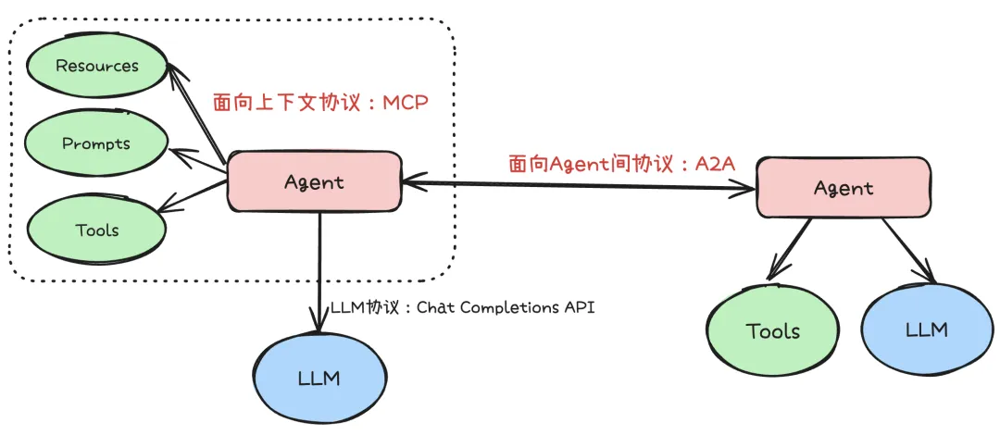

# AI 智能体3大关键技术对比剖析

AI 智能体3大关键技术、Function Calling、MCP、A2A

Function Calling 解决 AI 智能体调用外部工具的能力；MCP 解决了 AI 智能体和下游异构数据的统一通信的能力；A2A 解决了 AI 智能体之间相互统一通信的能力；下面对这3大关键技术深度对比剖析。

# 第一、Function Calling 和 MCP 的核心区别

一句话总结：Function Calling 是大模型提供的一种能力，而 MCP 是一个跨模型、跨工具的统一交互标准。MCP 里的工具调用是基于 Function Calling 能力实现的，对于工具来说，MCP 和 Function Calling 是依赖关系。但 MCP 除了工具外，还有 Prompts、Resources 等其他上下文的定义。

Function Calling：

定义：Function Calling 是大模型提供的一种基础能力，允许大模型根据自然语言指令自动调用预定义函数，实现与外部工具的连接。

特点：它并非统一标准，不同厂商（比如： OpenAI、百度文心）对其接口格式、参数定义等有独立实现。这导致工具需要针对不同模型重复适配，类似各品牌手机自有充电接口的碎片化问题。

MCP（模型上下文协议）：

定义：MCP 是一个跨模型、跨工具的统一交互标准，不仅规范了工具调用（如函数描述、参数格式），还整合了 Prompts、资源管理等上下文体系。

目标：MCP 的目标是成为 AI 生态的“USB-C”，让工具只需按统一协议封装一次，即可在多模型中通用，大幅降低跨平台适配成本。

尽管 MCP 试图通过标准化解决碎片化问题，但其落地面临多重障碍：

生态成熟度不足：MCP 应用市场虽有超 1.3 万个工具（MCP Server），但多数存在配置复杂、实现不规范、同质化严重等问题，真正能直接用于生产环境的少之又少，开发者常因适配成本高而选择直接调用 API。

企业基建冲突：若团队已有统一的工具调用体系（比如：自研 AI 智能体框架、API 网关），MCP 的协议层可能被视为冗余，现有基建已实现工具管理、监控等功能，引入 MCP 反而增加运维负担，类似服务网格在成熟基建中难以落地的困境。

通用协议的场景局限：MCP 的标准化设计难以满足金融、工业等垂直领域的定制需求（比如：安全审计、数据隔离），此时直接开发专用工具链反而更高效。

总结：Function Calling 是大模型连接外部世界的“能力基石”，而 MCP 是推动跨生态协同的“协议桥梁”。MCP 的价值在于跨模型通用工具的快速构建（比如：无代码配置场景），但其局限性也表明，它并非万能。企业需根据自身基建成熟度和场景需求选择方案：已有完善工具链的团队可优先复用现有体系，而致力于构建开放 AI 生态的开发者，则可借助 MCP 实现“一次开发、多端运行”的规模化效应。未来，MCP 需通过分层设计（基础规范 + 行业扩展）、质量认证体系等提升实用性，才能在碎片化与标准化的平衡中找到更广阔的应用空间。

# 第二、MCP 和 A2A 的关系

从协议分层来说，MCP 和 A2A 并非互斥，而是分层协同。MCP 主要解决“ AI 智能体如何用好工具”，通过标准化工具接口，极大提升了工具复用和生态兼容性。而 A2A 则解决“多个 AI 智能体如何协作”，通过标准化 AI 智能体间通信，推动了多 AI 智能体系统的互操作和协作创新。在实际系统中，常见的模式是：

单个 AI 智能体通过 MCP 协议调用各类工具，获得外部能力。

多个 AI 智能体通过 A2A 协议互相发现、分工协作，协同完成复杂任务。

但换个思路，我们可以将“工具”视为一种低自主性 AI 智能体。这类“工具型 AI 智能体”专注于执行高度特化的任务，其行为模式更接近于传统的 API 调用，输入输出明确，决策空间有限。反过来，一个复杂的“AI 智能体”也可以被看作是一种高自主性“工具”。特别是当这个 AI 智能体能够理解和生成自然语言，处理复杂上下文，并自主规划和执行多步骤任务时，它就成了一个可以被其他系统或 AI 智能体调用的强大“能力单元”。这么看来，MCP 和 A2A 也可能是竞争的关系。

从这个角度看，MCP 协议（面向上下文，强调 AI 智能体如何使用工具）和 A2A 协议（面向 AI 智能体间协作）的界限正在变得模糊。如果工具的输入输出本身就是自然语言，或者工具本身具备了一定的“智能”和“状态”，那么调用一个“工具”和与一个“ AI 智能体”协作在交互模式上可能非常相似。这意味着，未来这两类协议可能会进一步融合，形成一个更统一的框架，既能规范 AI 智能体如何利用外部能力（无论是简单的 API 还是复杂的“工具型 AI 智能体”），也能协调多个高自主性 AI 智能体之间的协作，最终实现一个更加无缝和高效的 AI 智能体生态系统。

# 第三、实际应用案例

假设 AI 智能体需要完成一个“规划 5 天北京到巴黎旅行”的任务，使用 MCP 和使用 A2A 都可以实现：

MCP：像个大总管。一个中央 AI 智能体 (MCP Travel Client) 负责调用所有外部服务（机票、酒店、天气），然后汇总信息生成计划。优点是简单可控，缺点是中心化依赖高，不易扩展。

A2A：像个部门协作。任务被分配给专门的 AI 智能体（交通、住宿、活动），这些 AI 智能体可以直接相互沟通（比如：机票 AI 智能体直接问天气 AI 智能体获取信息），也可以和用户进行沟通（比如：机票 AI 智能体完成初筛之后询问用户是否满足需求，对用户给出的建议进行迭代修改），这种方式更灵活，适合企业内复杂协作。

# 第四、实际项目中的选择

在实际项目中，选择 MCP 还是 A2A，亦或是未来可能出现的其他协议，都需要根据项目的具体需求、团队的技术栈、以及期望实现的 AI 智能体交互模式进行综合考量。

MCP：

适用场景：当需要 AI 智能体作为工具执行者，关注明确的输入和输出，且交互流程相对固定时，MCP 的结构化和工具导向特性会更具优势。它强调的是 AI 智能体如何高效、规范地使用外部工具，补充模型上下文。

优点：简单可控，适合标准化工具调用。

缺点：中心化依赖高，不易扩展。

A2A：

适用场景：当需要多个 AI 智能体进行复杂协作、对话式交互和任务共同完成时，A2A 更合适。A2A 关注的是 AI 智能体之间的消息传递（Messages）、状态同步以及最终的输出制品（Artifacts）。

优点：灵活，适合复杂协作和动态协商。

缺点：实现复杂，需要更多的协调和管理。

总结：协议本身没有绝对的好坏之分，选择 MCP 还是 A2A，亦或是未来可能出现的其他协议，都需要根据项目的具体需求、团队的技术栈、以及期望实现的 AI 智能体交互模式进行综合考量。这与我们在微服务架构设计中面临的选择类似：是选择基于 TCP 二进制流的 RPC，还是基于 HTTP/2 的 gRPC，亦或是更为通用的 HTTP RESTful API？每种协议都有其特定的优势和适用场景，关键在于找到最契合当前业务和技术目标的那个。

# 参考

[1] AI 智能体架构设计3阶段演进和3大关键技术对比剖析, https://mp.weixin.qq.com/s?__biz=MzIzODIzNzE0NQ==&mid=2654454116&idx=1&sn=5d48ccf3a66975a9a07ce7ca194249c6&chksm=f2ff05d2c5888cc42027819d0d136f5c655e2d1bd55f9c2f91fcf96f99499dd851c8a4c77490&cur_album_id=3670347606858678275&scene=190#rd
