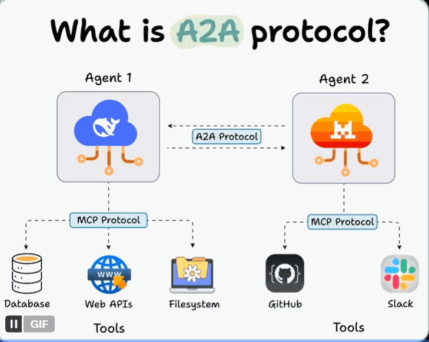
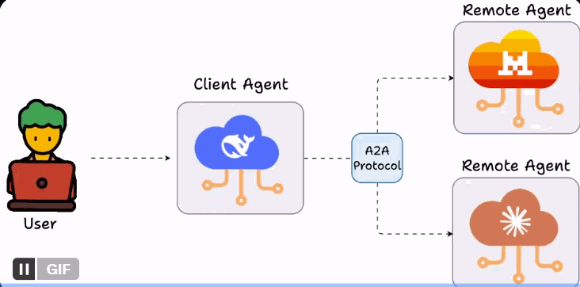
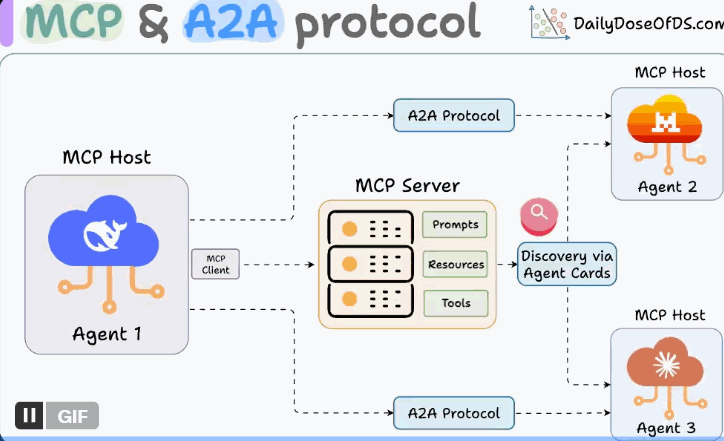
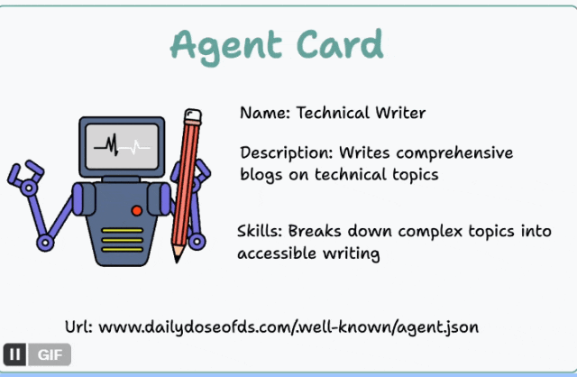
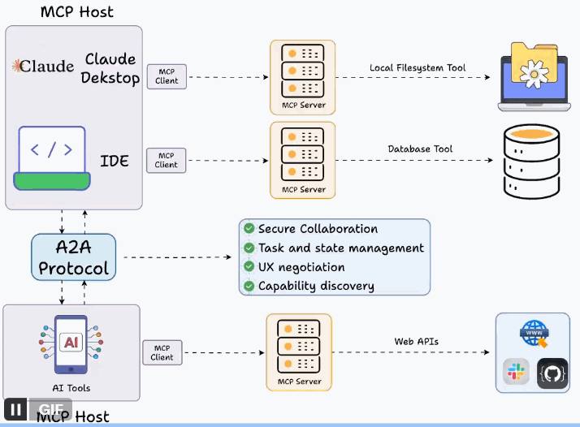
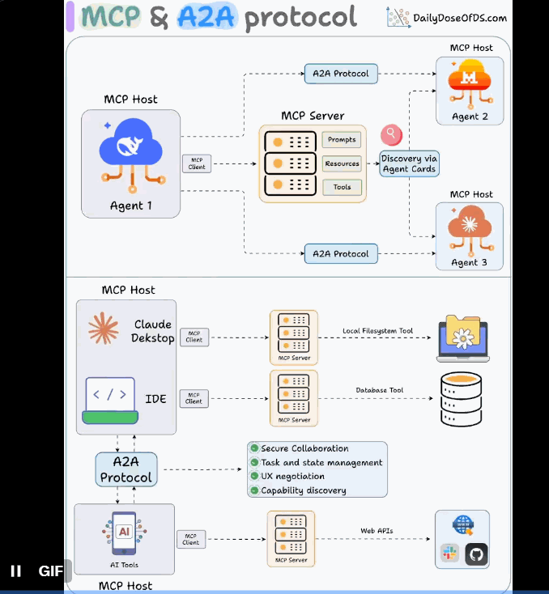

# A2A

A2A，全称 Agent2Agent。它能让多个 AI Agent 一起协同处理任务，但又不用直接共享各自的内部记忆、思考过程或者工具。

它们之间不“交底”，而是通过交换上下文、任务进度、指令和数据来进行沟通。

# A2A 和 MCP 怎么配合？

AI 应用可以把支持 A2A 的 Agent 当作一个 MCP 资源来看。

这些 Agent 会有个“身份证”，叫 Agent Card (后面会说)。

这样一来，连接到 MCP 服务器的 AI Agent，就能发现可以合作的新 Agent，然后通过 A2A 协议跟它们连上。

# Agent Card (Agent 的身份证)

支持 A2A 的远程 Agent，必须发布一个 JSON 格式的 Agent Card。

这个“身份证”上详细写了它的能力和认证方式。

客户端 (比如你的 AI 助手) 就靠这个“身份证”，来找到并跟最适合某个任务的 Agent 进行沟通。

# A2A 特色

安全协作：不共享内部状态，更安全。

任务和状态管理：能管理复杂的任务流程。

UX 协商：能协商用户体验细节。

能力发现：能发现其他 Agent 的能力。

跨框架协作：不同框架开发的 Agent 也能一起工作。

最关键的是，它还能跟 MCP 集成。

虽然 A2A 现在还很新，但给 Agent 之间的协作定个标准，挺好的。

就像 MCP 给 Agent 和工具之间的互动定了标准一样。

# 参考

[1] https://mp.weixin.qq.com/s?__biz=MzkyMzY1NTM0Mw==&mid=2247506636&idx=1&sn=70317e2dc62d00ef11ce7815b922aafc&scene=21&poc_token=HACHjGijQDy8jhq7whEaLX8XJ6k1ouO4cj7a_ddm