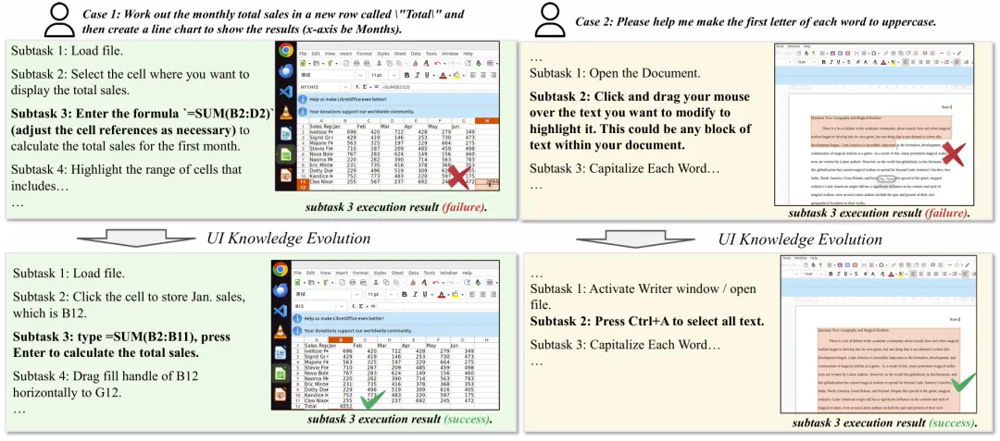
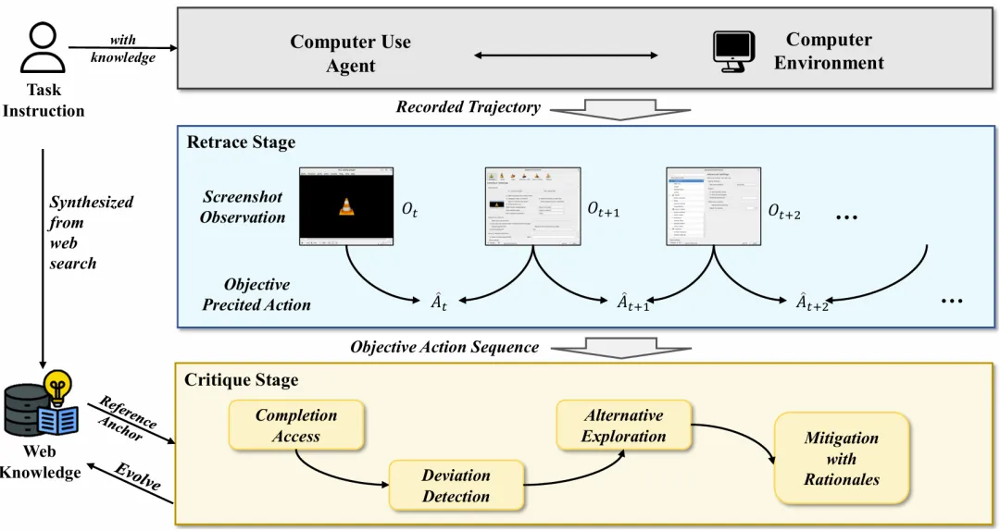
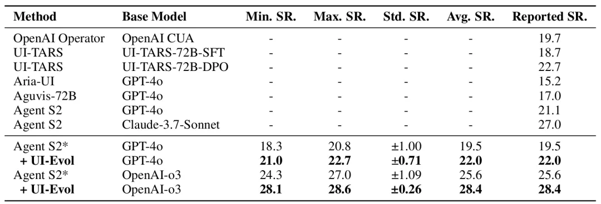

# 资源

- 论文链接：https://arxiv.org/abs/2505.21964
- UI-Evol: Automatic Knowledge Evolving for Computer Use Agents

# 问题

在当前计算机使用智能体（Computer Use Agent）的开发中，外部知识扮演着至关重要的角色。然而，微软亚洲研究院的研究员们发现了一个关键的“知识-执行”鸿沟，即所检索到的知识往往未能有效地转化为实际的任务执行。调查分析显示，即使提供给智能体（agent）90%的正确知识，其执行任务的成功率也只有41%。这一差距暴露出一个深层问题：尽管智能体拥有相关知识，但在真实的计算机使用环境中，这些知识却难以被有效应用，导致任务完成率低下，知识与行动之间存在明显的脱节。也就是说，智能体虽“知其然”，却未必能“行其是”。

通过实验，研究员们进一步发现，现阶段 Computer Use Agent 执行任务的成功率存在较强的随机性，严重影响用户的实际体验。这种不稳定行为既降低了任务的成功率，还阻碍了智能体在真实环境中的部署与应用。

为了弥合“知识-执行”差距，研究员们提出了 UI-Evol 方法。作为一个即插即用的模块，UI-Evol 可用于自主的图形用户界面（GUI）知识进化，从而提升 Computer Use Agent 在真实世界任务中的执行力与可靠性。在 OSWorld 测试基准上，UI-Evol 以同等的基础模型刷新了最高成功率。相关论文已被 ICML 2025 Computer Use Workshop 接收。

# 方案

图1：尽管外部知识理论上是正确的，但并不能被有效利用到实际环境中（左上和右上部分）。经过 UI-Evol 后的知识更加符合实际环境（左下和右下部分）。

**回溯与批判：知识进化的两个关键阶段**

UI-Evol 模块包含两个核心阶段。第一个阶段是“回溯阶段”（retrace stage），其主要功能是从实际的智能体与环境交互中提取“忠实客观的动作序列”。这意味着 UI-Evol 能够记录并理解智能体在执行任务时所采取的具体、有效的步骤。

第二个阶段是“批判阶段”（critique stage）。在此阶段，系统会将回溯阶段提取出的动作序列与外部参考进行比对分析，从而修正、完善现有知识。这种“回溯+批判”的两阶段方法可以确保智能体所获得的知识不仅是理论上正确的，而且能够在实际交互中有效执行。

图2：UI-Evol 分为两个阶段，通过实际的智能体与环境交互的轨迹来更新外部知识，使其符合实际交互环境。

# 实验验证：让智能体更稳定、更可预测

研究员们在 OSWorld 基准测试上对 UI-Evol 进行了全面的实验，并使用了最先进的智能体 Agent S2。实验结果显示，UI-Evol 既显著提升了任务性能，更重要的是，它还解决了一个之前被忽视的问题——Computer Use Agent 存在“高行为标准差”。这意味着在 UI-Evol 的帮助下，智能体在执行任务时的行为模式变得更加稳定且可预测。

由此可见，UI-Evol 大幅提高了智能体的可靠性，带来了计算机使用任务上卓越的性能表现。这些成果验证了 UI-Evol 在提升智能体实际应用能力和稳定性方面的有效性。

# 参考

[1] UI-Evol: 让智能体“知行合一”, https://mp.weixin.qq.com/s/Ez_sJi3krb0wl4S0Bkr03A