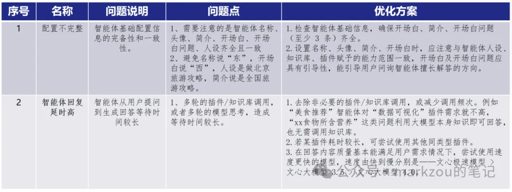
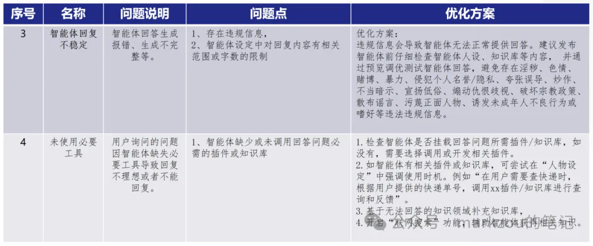

# 1. 智能体配置调优

## 1.1 提示词及调优方案

## 1.2 5类调优方法

1. 复杂环境（Complex Environment）
现状：LLM聊天机器人通常运行在封闭环境中，仅依赖文本输入，缺乏对真实世界的感知和操作能力。

改进方法：

引入真实环境交互：

将聊天机器人接入动态环境（如网页、操作系统、移动设备等），让其能够感知和操作外部世界。

例如，通过API调用或模拟器，让模型在真实或近似真实的环境中执行任务。

处理动态上下文：

开发能够在环境变化中持续更新状态的模型，使其能够处理长期任务和多步骤操作。
参考案例：SWE-bench（代码环境）、WebArena（网络环境）、OSWorld（操作系统环境）。

2. 多源指令（Multi-source Instructor）
现状：LLM聊天机器人主要依赖单一的人类文本指令，缺乏多源信息整合能力。

改进方法：

整合多源指令：让模型能够接收和处理来自多个渠道的指令，包括：

自我反思：通过记录和分析自身行为，主动调整策略。

多智能体协作：与其他智能体或用户协作，完成复杂任务。

层次化指令：在多智能体系统中，接收来自不同层级的指令。

开发混合指令处理机制：结合人类指令、环境反馈和自我生成的指令，提升模型的自主性和适应性。

参考案例：ScienceAgentBench（科学环境中的多源指令）、MultiAgentBench（多智能体协作）。

3. 动态反馈（Dynamic Feedback）
现状：LLM聊天机器人主要依赖对话历史或人工纠正，缺乏实时、多维度的反馈机制。

改进方法：

引入多模态反馈：让模型能够接收来自环境的多种反馈形式，包括：

指标分析：通过量化指标（如任务完成率、资源消耗）评估行为。

风险评估：识别潜在错误或风险，动态调整策略。

环境奖励：根据环境反馈调整行为，例如在游戏或科学实验中。

构建闭环反馈系统：让模型能够根据反馈实时调整行为，并在多轮交互中持续优化。

参考案例：ST-WebAgentBench（安全性和风险评估）、WebVoyager（动态网页交互反馈）。

4. 多模态感知（Multimodal Perception）
现状：LLM聊天机器人主要处理文本输入，缺乏对图像、音频等多模态数据的理解能力。

改进方法：

整合多模态输入：开发能够处理文本、图像、音频、视频等多种输入形式的模型架构。

跨模态融合：通过多模态预训练或任务迁移，提升模型在复杂场景中的感知和推理能力。

应用场景扩展：在需要多模态理解的任务中部署模型，例如网页导航（视觉+文本）、移动设备操作（图像+文本）。

参考案例：VideoWebArena（视频+网页任务）、VisualAgentBench（视觉驱动的多模态任务）。

5. 高级能力（Advanced Capability）
现状：LLM聊天机器人主要擅长文本生成，缺乏规划、记忆、自我反思等高级认知能力。

改进方法：

增强规划能力：

引入链式思考（Chain of Thought, CoT）或树状思考（Tree of Thought, ToT）策略，提升多步推理能力。

在任务中加入明确的规划阶段，例如行程安排、代码调试等。

参考案例：PlanBench（规划能力评估）、FlowBench（工作流规划）。

引入长期记忆：

开发能够存储和检索长期信息的记忆模块，支持跨会话的任务完成。

在对话中加入上下文管理和记忆检索机制。

参考案例：LongMemEval（长期记忆评估）、LTM-Benchmark（动态记忆更新）。

提升自我反思能力：

设计能够分析自身错误并自我修正的机制，例如通过模拟器或人类反馈进行迭代改进。

在任务中加入显式的反思阶段，例如代码调试或科学实验优化。

参考案例：ReflectionBench（自我反思评估）、LLM-Evolve（动态反馈驱动的改进）。

强化工具交互能力：

提升模型对API、工具和外部服务的调用能力，支持复杂任务的分解和执行。

在训练中加入工具使用的真实场景，例如数据科学任务或移动设备操作。

参考案例：ToolBench（工具调用评估）、MobileAgentBench（移动设备工具交互）。

# 参考

[1] 如何分析和调优AI智能体, https://mp.weixin.qq.com/s/3WPNNq5Y631T6sYKrLn_gQ
[2] 交大&华为联手：AI智能体进化的五种关键能力, https://mp.weixin.qq.com/s/2LGM_MoaDRZ8sVbOnloafQ
[3] https://arxiv.org/pdf/2506.11102