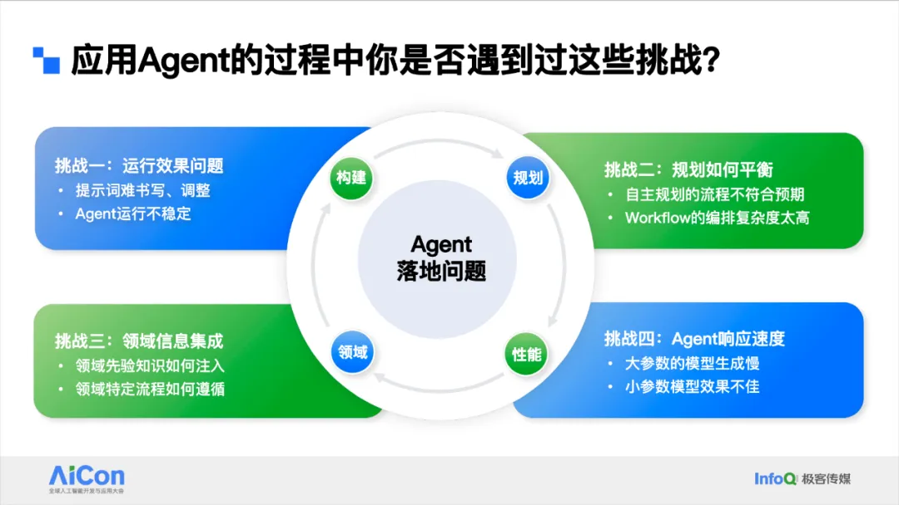
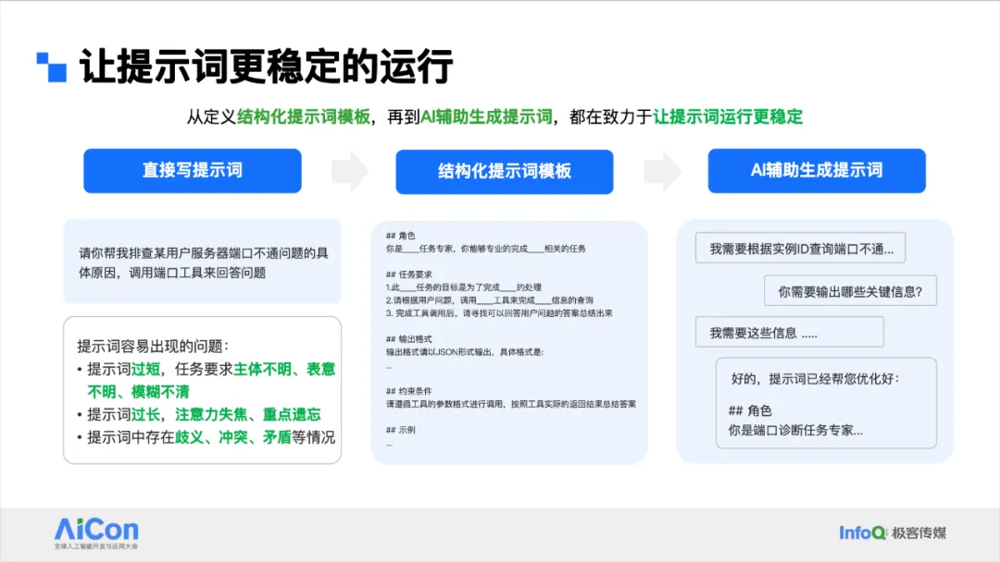
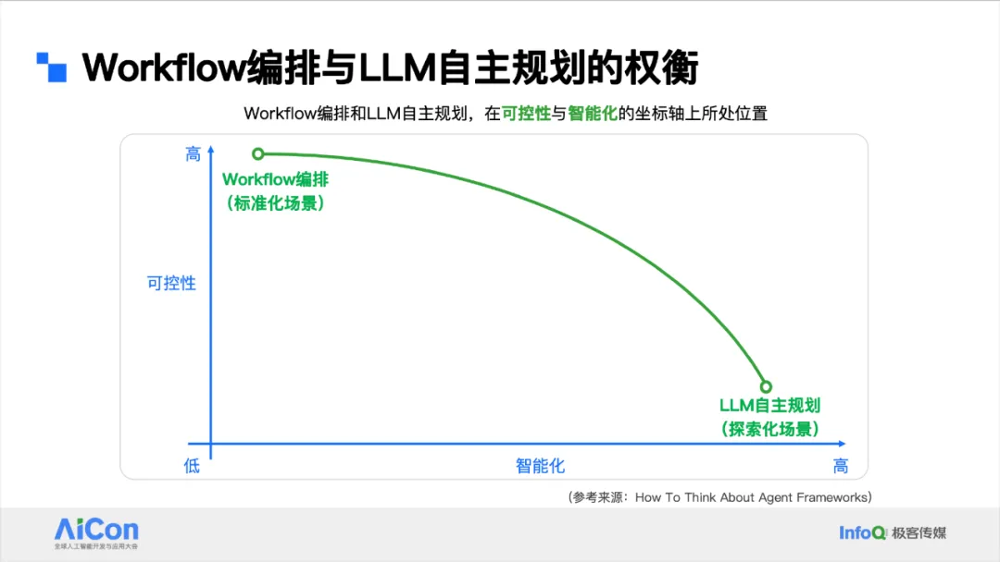
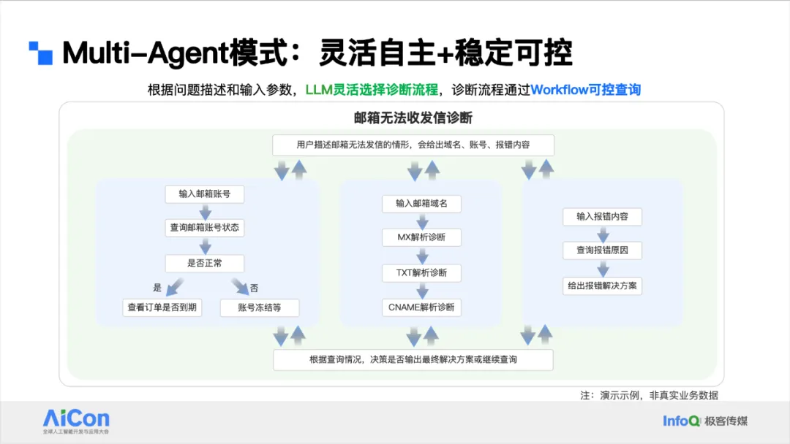
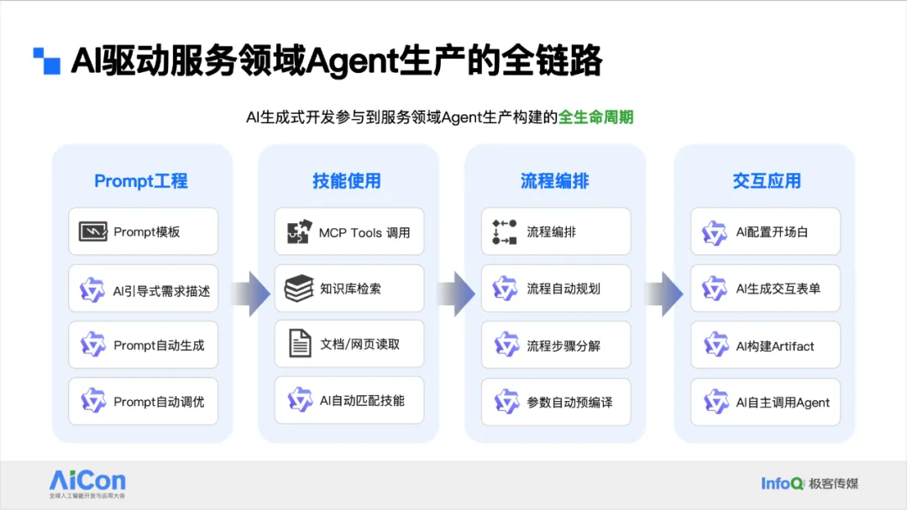
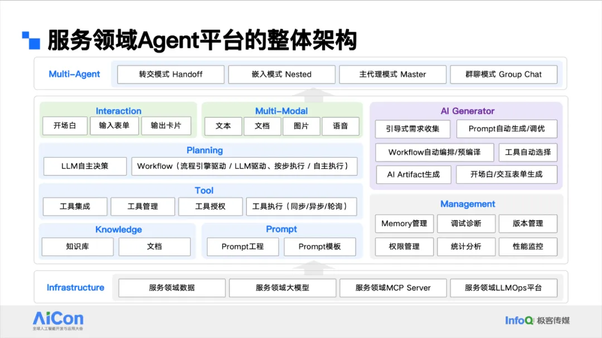
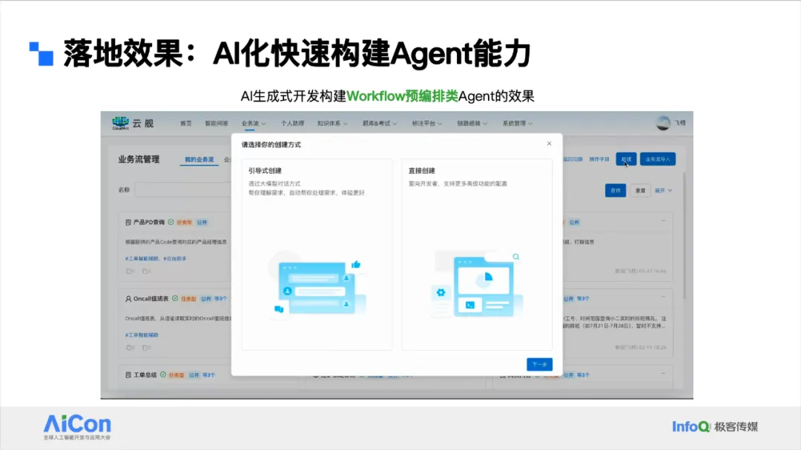

第一个问题是运行效果。提示词并不是很好写，有的提示词写出来像小作文一样非常长，非常复杂，它有一定门槛，并不是那么简单写得出来的。写完之后，提示词在运行过程中有可能会不稳定，你要去调优它，就导致 Agent 不稳定，这也是最痛的一点。

第二个痛点，我们有两种类型的 Agent，分别是大模型整体驱动和 Workflow 预编排的类型。前者的模式是非常不可控的，我可能预期是这样子运行，但它自己规划后变成了另外的方向，完全走偏，这是很有可能的。

但 Workflow 的方式又要去编排，可能非常低效，可能一些客服同学要好几天才能搞出 Workflow，怎样规划平衡的问题也是痛点。

第三个挑战就是领域知识怎么注入。因为大家用的很多模型都是通用模型，怎样把领域知识注入进来，是非常痛的点。

第四点就是 Agent 的响应速度问题。大参数的模型效果还不错，但非常慢，尤其是带有思考的推理模型要很长时间。小参数的模型速度非常快，但效果又一般。

我们来一个个解决。首先看第一个问题。提示词不稳定的问题主要因为提示词不是太好写，你直接写很容易出现这些问题，过短、主体不明、过长、注意力失焦，导致模型运行过程中可能顾头不顾尾，有些指令遵循，有些不遵循，或者遗忘重点。

甚至有些时候会出现提示词的前后矛盾，你可能自己没有意识到，导致模型理解起来有困难。它就会在运行过程中一会儿遵循你的第一条，一会儿遵循你的第二条，导致不稳定，这是非常痛的问题。

我们的解法是首先提供一套提示词模板。这个模板经过大量调试、测试，运行过程中已经比较稳定了。然后让业务同学尽量遵循这个模板来写提示词，这就比较稳定了。

但我们后来发现这个方式也有问题，很多时候他们过于套用模板了，或者模板有好几套，你也不知道用哪套。写的过程中也会出现一些跟模板冲突的问题等等。

最后我们的方法是用 AI 来辅助提示词调优， AI 帮你写一版，你来确认，如果有问题，你可以及时跟 AI 提出来去调，然后 AI 可以帮你调优。比如说冲突的部分 AI 是可以检测出来的，它可以告诉你这其中某些信息是有问题的，我帮你优化成这样子可能会好一点。

因为最懂大模型的是大模型自己，所以你可以通过这种方式跟它沟通，告诉它需求，让它把提示词整理出来，再让它自己去运行提示词来看到底效果好不好。

第二点是 Workflow 和大模型自主规划的权衡问题。我画了一张图，是说越智能化的东西它可控性越低，越个性化可控性高的东西，智能化越低。

其实这张曲线里的中间点也是可以存在的。那么怎么样去平衡它？我们来看一些在客服领域的常见场景，第一个是订单财务类。像这种标准化场景，比如说我要去查订单有没有过期，或者我要计算有没有该退订的一些费用，该怎样给客户回复，这些都是要标准化的，如果你让大模型深度参与很容易出现幻觉。像排班类问题也是一样，管理同学要定时看一下到底哪个同学没有按时上班，不要出现拖班之类的情况。

这里的定时提醒我们也要严格按照排班表去推送，如果出现幻觉，遗漏了某些同学，导致他没有上班，这个问题也是非常麻烦的。所以像这些场景，我们为了尽量避免出现这些问题，就通过 Workflow 的方式实现。

但另一类场景，比如说 RDS 实例异常诊断，有非常多的客户来咨询问题时就一句话，说我的 RDS 运行非常缓慢，我的实例有异常，我的 SQL 跑半天才跑完，这个描述非常模糊，但可能用户也不能给出更多信息了，因为这确实是我们要进入仔细看的。

比如说到底你的会话连接数有没有异常，你的 QPS 有没有异常，你的内存、MySQL 是不是都有可能导致这个问题？既然它的可能性非常之多，你很难通过 Workflow 去容纳所有可能性。

如果你要编排 Workflow 出来，可能要非常庞大，而且可能会出现一些矛盾或者问题，导致你可能很容易崩溃掉。这种情况就非常适合用大模型自主决策，你只要给它几个大的方向，比如说这几个方向你排查一下，然后模型有很多时候自己内部训练过这些语料，它知道排查 RDS 异常时大概是哪几个维度，就可以通过我们的 API 去诊断，然后自主决策要分析哪些问题。

它不一定全部诊断一遍，它可能根据诊断结果就定位出来可能的原因，然后一步步走下去，这就非常适合用大模型自主规划。

还有一种场景是 Agentic RAG。我们有非常多的中长尾，尤其是长尾产品，我们其实不一定有知识，但是有相应的用户文档或手册。

我们不一定有非常高质量的知识，但又要解决这些问题，就可以用 RAG 来让大模型自主生成 query，搜索完了后自主检查搜索结果是否符合预期，然后自主去调整，进行类似于 deep search 的搜索，最终找到合理的答案。这也非常适合大模型自主规划模式。

在上面的曲线图里其实我们还可以有中间状态，就是大模型与 Workflow 可以结合。比如邮箱诊断这个场景，可能客户会说我邮箱无法收发信了，有的用户会把邮箱账号发过来，有的用户会把邮箱域名发过来，有的用户只会把报错发过来，或者只会说这么一句话，其实可能性非常多。

但我们排查邮箱账号的状态和域名状态，还有报错的时候，我们没办法穷举，所以我们就做了一些中间状态的 Workflow，然后让模型自主决策调度，灵活性就非常高，就是外部灵活内部可控的样子。

我们在 Workflow 这块也有非常多的演化路径。首先我们在探索 Workflow 时，最开始的一版，我们为了降低用户编排 Workflow 的复杂度，其实是让用户用自然语言编排的。就是你用自然语言描述你的流程，然后帮你生成图，然后让大模型按照流程图一步一步执行，完成这个任务。

结果发现这样的方法成本很低，但运行速度太慢，全部走完一遍要很长时间，因为每个环节都要大模型决策。

所以后来为了提升速度和稳定性，我们就做了第二种，就是代码和大模型混排，中间某些部分你可以用代码，有些部分可以用大模型来编排，然后让规则引擎来驱动。

但我们发现虽然这样速度快了，但只能从头支撑到尾，如果中间过程出现一些客户的问题，发生了转移或者跳转，我们没办法做非常灵活的控制。

于是我们演化出第三种方法，自然语言编排加大模型自主规划。也就是说我们不让大模型自己做全部规划，我们会把这张流程图作为参考信息给大模型去做类似 RAG 的自动规划，结果发现效果更灵活一些，这三种我们目前是并存的，具体用哪一种，根据我们的场景可以自己选型。

另外一个话题是领域数据集成和响应速度优化的问题。领域数据集成这块主要的方法是动态加载一些 Prompt，Prompt 里你可以把一些领域数据背景通过动态 Web 的方式加载进来，另外你可以通过引入一些外部技能，让模型自主选择是不是要调工具或者知识库的文档。实在搞不定的情况下，我们可以训练领域大模型来注入领域知识。

为了提高响应速度，我们用把一些中间过程预编译成代码或者参数的方式来提高效率。第二点就是通过各种加速推理方法，比如模型量化、KV Cache 优化等来提高速度。

第三点就是降低模型参数量，如果这是高频场景，或 Function call，那就非常适合小参数模型，用大模型去蒸馏小参数模型，也可以提高速度。

我们在 Agent 这块也是训练一些模型的。首先我们会构造领域数据源，源来自多个地方，比如说我们的领域知识库和文档，还有一些 SOP 标准工具的 API，以及我们各领域产研提供的一些 MCP 措施，包括阿里云的 OpenAPI。接下来我们会汇总清洗，构造成语料，包括单步、多步、反问澄清、Multi-Agent 调用的，和条件判断、场景拒识，然后给模型去做 SFT 或 RL。

评估的方式也有多种，比如说工具选择准确率、动作执行准确率、参数提取准确率，以及模型生成回复的效果评估。

线上推理阶段，包括规划、动作、观察反思，最后生成，并给用户提供 Agent 调优路径。我们可以先通过大模型自主决策的方式构建原型，通过提示词工程调优一版，看形态是否符合业务需要。

如果效果不好，第二步拆解 Workflow，构造更加复杂的 Workflow，来提高它的稳定性或速度与可控性。

Workflow 如果搞不定，比如说我这个地方需要灵活，又要可控，我们就拆解 Multi-Agent 来做指令设计，然后端到端测试。

最后如果实在搞不定，某些环节可能要做模型调优，确定训练任务，寻找构造确定的训练数据，然后做相应的训练。这个成本是随之上升的，但效果也是随着你成本的上升在不断提升。

平台架构图如下。最底下是我们的基础设施，在此基础上我们有 Knowledge 和 Prompt，管理 Knowledge 是我们的重要一环。然后有各种措施的集成。Planning 有自主的也有多种风格 Workflow 规划。

再往上，我们有各种交互和多模态。管理部分，我们有 Memory 管理，Agent 之间可以通过 Memory 共享。然后我们有调试诊断、版本管理，你可以回溯到某一版，防止出现线上的不稳定。你可以灰度、授权、统计分析。

比较重要的一块是 AI Generator。里面的很多信息，你可以手动编排，同时也有 AI 生成的方式来编排。最后我们也支持多种 Multi 模式。

下面展示几个 Demo。第一个就是大模型自主规划的，我们可以选择引导式，然后选择任务型，就是大模型自主规划。我可以写 Prompt 写需求，它帮我分析这个需求要做哪些事情，然后生成需求文档。你这个需求其实可以写得非常简单，然后你来确认这个需求文档是不是你要的。

它会根据需求文档自动寻找 MCP tools，然后你去圈选你要使用的那些工具，避免混淆。选完之后我们构建 Prompt，它会自动写结构化的 Prompt，包括怎么调用插件，怎样输出，包括一些约束条件和一些示例，极大简化了我们的业务同学去写提示的难度。然后我们选模型，可以调试，比如说我要诊断邮箱的问题，然后邮箱发送信了，你通过这个域名解析角度来分析一下。

邮件发出去后，我们的模型它自动列了几项，我要检查这几项，然后自己去写代码，调用我们的工具去执行代码，然后一步步诊断。最后全部查完，它会总结出可能的结论，这就是非常高效了。

原来我们的客服同学要去查这几项，最起码得半个小时过去。现在我先给一版去看一下有没有问题，当然过程中也可能会有些地方不是那么的完美，但绝对能提高我们的效率。

第二个 Demo 是 Workflow。我们也做了 Workflow 的编排，也是一样引导式创建，然后选择加速性，就是我们规则引擎驱动的 Workflow。

然后我写简单的业务流程，比如先输入用户识别 ID，然后判断我的 ECS 是哪种付费类型，如果是包年包月就输出什么，如果是按量付费怎么输出，它会把整理成需求文档。然后我们点击下一步，寻找 tools，我们发现有能够查付费类型的 tools，然后去创建，就开始构建 Prompt。

我们的 Prompt 也是流程化的 Prompt，然后把 Prompt 转换成流程图。

之所以要做这一步，是因为我们有的时候 Prompt 也不一定完全是准的，还需要人工再确认一道，确认后把图生成出来。这个图是可以看的，也可以去调，也可以去运行。运行的时候它就告诉我这是什么样的服务器类型，逻辑是一样的，哪怕复杂的上百步的也是这么个逻辑。

最后一个 Demo，我们通过 AI 的方式辅助生成了一些 Artifact。比如说域名信息展示，如果我们展示过程全是文字，看起来很痛苦，就可以通过表格的方式展示。我们也可以通过这种方式让模型自动生成图表，来渲染 MySQL 中 QPS 的图。

这些东西原来都是需要我们研发去做成工具，做成非常复杂的交互，然后让用户去用的。现在我们的客服业务同学只需要简单写写需求，我们自动生成 Prompt，自动去转换，变成可以真正落地的一些效果。

# 参考

[1] 阿里云客服Agent业务提效实践：灵活可控的落地方法论, https://mp.weixin.qq.com/s/P-wOYCAkp08QnC4UE0MpCw