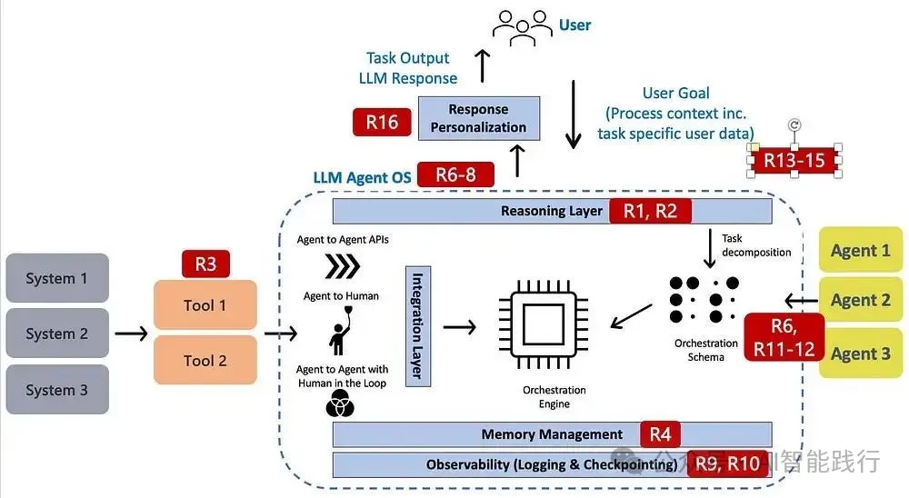
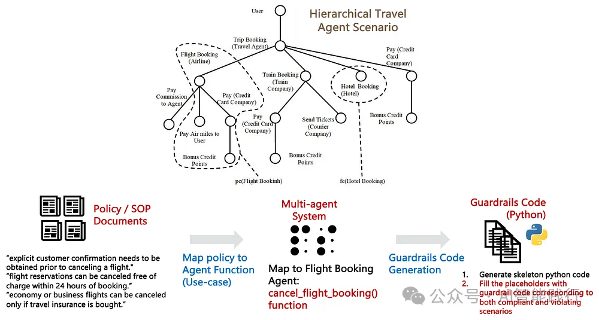

# 1. 问题

```text
OWASP 白皮书：智能AI — 威胁和缓解措施，2025年。
IBM 白皮书：智能AI中的责任和风险问题，2025年。
R1-15指的是[1]中确定的风险。括号()中的是[2]中确定的相应风险。R16：基于角色的偏见等是相当有趣的，它在[2]中被确定，但在[1]中缺失。

R1：不一致和欺骗行为（动态欺骗）
R2：意图破坏和目标操纵（目标不一致）
R3：工具滥用（工具/API滥用）
R4：内存中毒（智能体持久性）
R5：级联幻觉攻击（级联系统攻击）
（安全漏洞）

R6：特权妥协
R7：身份欺骗和冒充
R8：意外RCE和代码攻击
（运营弹性）

R9：资源过载
R10：否认和不可追踪性
（多智能体勾结）

R11：多智能体系统中的恶意智能体
R12：智能体通信中毒
R13：人类对多智能体系统的攻击
（人类监督）

R14：人类操纵
R15：压倒人类在环路中
R16：（基于角色的偏见）
```



# 2. 解决方法

我们提出了一种基于政策驱动的智能体用例安全护栏生成的3步方法（如图5所示）：

1. 以离线方式将政策映射到相关智能体/工具。
2. 以政策验证代码的形式为映射的智能体生成安全护栏。
3. 在运行时在智能体调用之前调用安全护栏。这作为一种预防措施，确保智能体/工具不违反任何政策。如果发生违规，会提示智能体反思并调整其策略。



图5：旅行预订智能体的自动安全护栏生成（作者制图）

```text
3.1 将政策映射到智能体函数
映射算法包括以下步骤：

提示大型语言模型（LLM）为每个智能体提取适用政策列表。
为每个政策添加描述，并包括原始政策文档中的引用——以确立政策基础并最小化幻觉。
将复杂政策分解为更小的原子政策，特别是条件由逻辑OR连接的情况。这包括通过合并相同和/或重叠的政策来删除重复的政策。
为每个政策生成正面（合规）和负面（违规）示例。这些示例有助于澄清歧义，并确保实际实施阶段的一致性。
3.2 安全护栏生成算法
该算法主要包括两个步骤：

首先生成政策"骨架"代码，包括数据类型、智能体函数的Python类定义，以及安全护栏的（占位符）空存根。
提示大型语言模型（LLM）生成安全护栏代码（动态地）填充占位符存根，使其具有功能性政策验证代码。正面（合规）和负面（违规）示例被转换为指导安全护栏生成的个别验证测试——由政策到智能体映射器提供的政策解释驱动——下面代码块中的示例生成提示。
```

```text
ounter(lineounter(lineounter(lineounter(lineounter(lineounter(lineounter(lineounter(lineounter(lineounter(lineounter(lineounter(lineounter(lineounter(lineounter(lineounter(lineounter(lineounter(line
Generate unit tests in Python for a guardrail to validate policy-agent function 
compliance with enterprise policy constraints
The guardrail goal is to validate the function argument data, 
and raise an exception if it violates the policy constraints.

Test Generation Rules:
- Each policy has multiple compliant and violation examples.
- For each compliant example, generate a validation function.
- If an exception occurs in the agent function under test, 
log it and propagate the exception up.
- For each violation example, generate a validation function.
- If the expected exception was not raised, the test should log a failure 
message mentioning that the test case did not raise an exception.

- For each generated test, add a comment linking the function to the relevant 
policy it is validating.
- Each failure message in the log should describe the test scenario that failed, 
the expected and actual outcomes.
```

# 参考

[1] AI智能体的安全护栏, https://mp.weixin.qq.com/s/XwW5K6xa_0C0tnBh0Cz3oQ