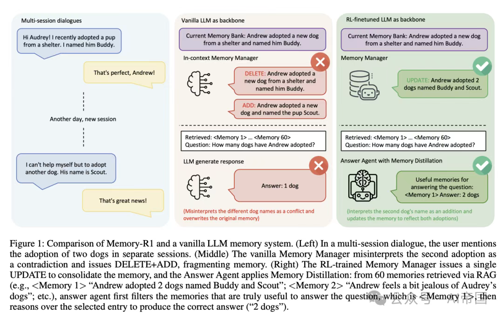
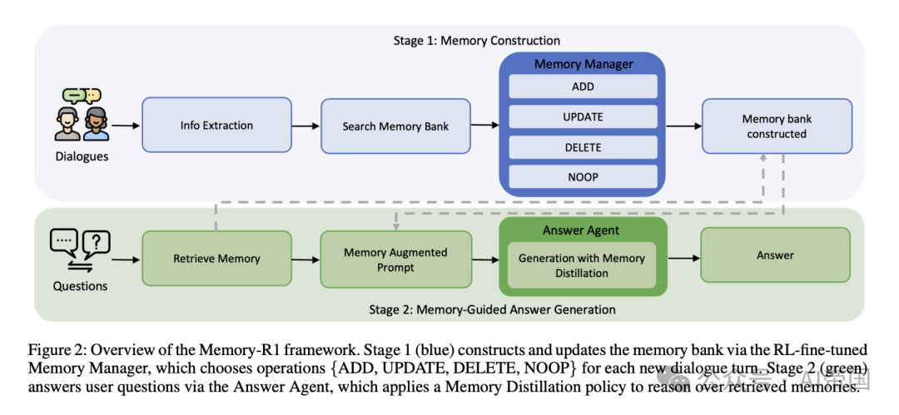
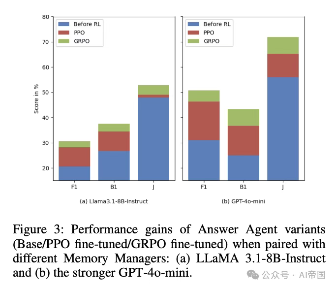
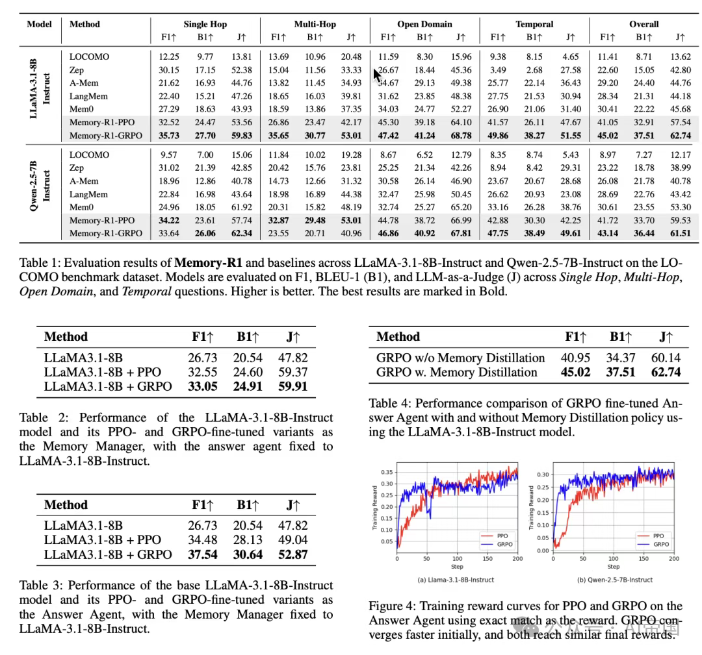

# 1. 资源

- Memory-R1: Enhancing Large Language Model Agents to Manage and Utilize Memories via Reinforcement Learning
- https://arxiv.org/abs/2508.19828
- 2025.8.27

# 2. 原理

论文(Memory-R1: Enhancing Large Language Model Agents to Manage and Utilize Memories via Reinforcement Learning)展示了强化学习如何增强LLM的agent和记忆能力。Memory-R1：一个教会LLMagent决定记住什么以及如何使用记忆的框架。两个经过强化学习微调的组件协同工作：记忆管理器学习对外部存储进行CRUD风格的操作，答案agent在回答前通过"记忆蒸馏"过滤检索到的记忆。

通过强化学习进行主动记忆控制 记忆管理器在RAG步骤后选择ADD（添加）、UPDATE（更新）、DELETE（删除）或NOOP（无操作），并相应地编辑条目；使用PPO或GRPO训练时以下游QA正确性作为奖励，无需为每次编辑提供标签。

选择性使用长历史记录 答案agent检索多达60个候选项，执行记忆蒸馏以保留重要内容，然后生成答案。强化学习微调比静态检索提高了答案质量。

数据高效训练 仅使用152个QA对进行训练和结果驱动的奖励，Memory-R1在LOCOMO上取得了巨大收益，突出显示有效的记忆行为可以在最少监督下学习。SOTA的结果 在LLaMA-3.1-8B和Qwen-2.5-7B骨干网络上，GRPO变体在F1、BLEU-1和LLM作为评判者的分数方面都达到了最佳整体性能，超越了Mem0、A-Mem、LangMem和LOCOMO基线。

分离收益的消融研究 强化学习单独改善了两个组件；记忆蒸馏进一步提升了答案agent。当与更强的记忆管理器配对时，收益会复合。有趣的是，这种方法在不同骨干网络上都有很好的泛化性。

# 参考

[1] Memory-R1：强化学习驱动的LLM agent记忆管理系统, https://mp.weixin.qq.com/s/5xQHKECNzx-BYfNgQEo4Hw