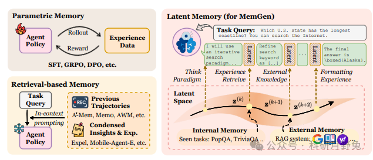
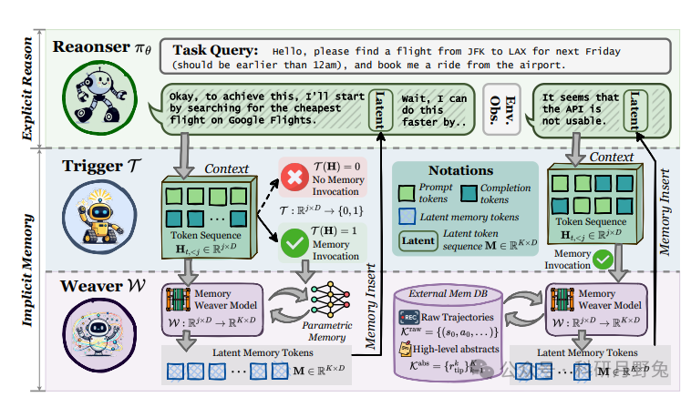
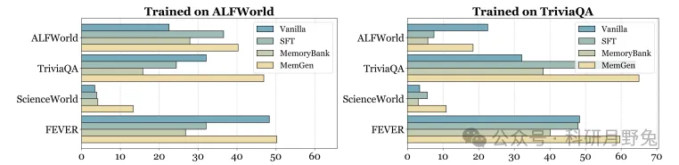
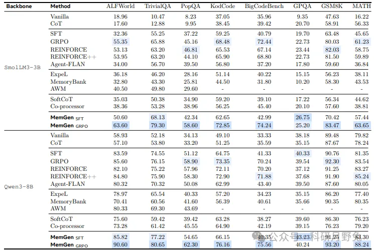

# 1. 资源

题目：MemGen: Weaving Generative Latent Memory for Self-Evolving Agents

论文地址：https://arxiv.org/pdf/2509.24704

代码地址：https://github.com/KANABOON1/MemGen

创新点
MemGen 为大型语言模型（LLM）代理提供了一种类似人类认知的记忆能力，能够动态地在推理过程中插入生成的记忆。该框架包括两个核心组件：记忆触发器（Memory Trigger）和记忆编织器（Memory Weaver）。

MemGen 超越了现有的参数化记忆和基于检索的记忆范式。参数化记忆通过直接调整模型参数来内化经验，但这种方法会导致灾难性遗忘；基于检索的记忆将经验外部化到结构化数据库中，但其有效性依赖于上下文工程，且无法实现真正内化的记忆。MemGen 通过生成潜在记忆序列，既避免了灾难性遗忘，又实现了与推理核心深度融合的记忆能力。

# 2. 原理

方法
本文提出了一种名为MemGen（Memorization Generator）的动态生成记忆框架，旨在为大型语言模型（LLM）代理提供类似人类认知的记忆能力。该框架的核心在于通过记忆触发器（Memory Trigger）和记忆编织器（Memory Weaver）两个组件，实现推理与记忆的紧密交织。记忆触发器通过强化学习训练，能够根据代理的推理状态智能地决定何时调用记忆；记忆编织器则根据当前状态生成机器原生的潜在记忆序列，以增强推理能力。这种设计使得代理能够在推理过程中动态地回忆和增强潜在记忆，形成推理与记忆紧密交织的循环。

MemGen框架概览

本图展示了MemGen框架的整体结构和工作流程。在该框架中，LLM代理的核心推理模块（Reasoner）保持不变，而MemGen通过两个关键组件——记忆触发器（Memory Trigger）和记忆编织器（Memory Weaver）——来增强代理的记忆能力。记忆触发器作为一个轻量级的LoRA适配器，附着在推理模块上，负责监控代理的推理状态，并在适当的时机决定是否调用记忆编织器。记忆编织器同样是一个LoRA适配器，它在被触发时接收当前的推理状态作为刺激，生成一个潜在的记忆序列，该序列被插入到推理模块的隐藏状态中，从而丰富推理过程。图中还展示了记忆触发器的激活策略，即仅在句子边界（由特定的分隔符标记）处激活，以提高推理效率。此外，图中描绘了记忆编织器如何将内部参数化知识与外部检索到的信息相结合，生成综合性的潜在记忆，进一步提升代理的推理能力。

不同方法在GSM8K测试集上的性能比较

本图展示了在GSM8K测试集上，使用不同方法（包括无微调、硬训练、模糊训练和软训练）的性能比较。图中比较了这些方法在单次采样成功率（Pass@1）和32次采样成功率（Pass@32）上的表现。从图中可以看出，无微调方法在Pass@1上表现较差，而硬训练方法虽然在Pass@1上有所提升，但在Pass@32上提升有限。相比之下，模糊训练和软训练方法在Pass@32上表现更好，这表明它们能够更好地保留模型的多样性，使得在多次采样时有更高的概率得到正确答案。此外，图中还展示了不同训练方法在不同模型（如Qwen2.5-1.5B和SmolLM3-3B）上的性能差异，可以看出，对于较大的模型，软和模糊训练方法在Pass@32上的优势更为明显。这进一步证明了这些方法在提高模型采样多样性方面的优势，尤其是在需要多次采样来提高成功率的任务中。

MemGen在不同数据集上的泛化研究

本图展示了MemGen在不同数据集上的泛化能力。具体来说，研究者们在GSM8K数据集上训练了MemGen，并在GSM8K、KodCode、ScienceWorld和FEVER这四个数据集上进行了评估。图中比较了四种不同的方法：无微调（Vanilla）、监督微调（SFT）、基于检索的记忆系统（MemoryBank）和MemGen。从图中可以看出，无微调方法在所有数据集上的表现都较差，而监督微调（SFT）方法在训练数据集（GSM8K）上表现较好，但在其他未见过的数据集上性能显著下降。基于检索的记忆系统（MemoryBank）在训练数据集上也有一定的提升，但在未见过的数据集上同样面临性能下降的问题。相比之下，MemGen不仅在训练数据集上取得了较好的性能，而且在其他未见过的数据集上也表现出有效的性能提升，显示出较强的跨领域泛化能力。

实验

本表展示了在多个基准测试中，不同方法（包括无微调、监督微调（SFT）、强化学习方法（如GRPO）、基于检索的记忆系统（如MemoryBank、ExpeL、AWM）以及本文提出的MemGen方法）的性能对比。从表中可以看出，无微调方法在大多数数据集上的性能较差，而监督微调（SFT）方法在某些数据集上有所提升，但在其他数据集上仍然面临性能瓶颈。基于检索的记忆系统（如MemoryBank、ExpeL、AWM）在某些数据集上表现较好，但在跨领域泛化方面存在局限性，尤其是在未见过的数据集上性能下降明显。相比之下，MemGen方法在所有数据集上都表现出显著的性能提升，尤其是在需要多次采样来提高成功率的任务中（如Pass@32指标），MemGen的性能优势更为明显。具体来说，MemGen在ALFWorld数据集上比SFT方法提高了约17.76%的准确率，在KodCode数据集上提高了约33.61%的准确率，在TriviaQA数据集上提高了约32.92%的准确率。这些结果表明，MemGen不仅在单次采样成功率（Pass@1）上表现良好，而且在多次采样成功率（Pass@32）上也具有显著优势，这归功于其能够更好地保留模型的多样性，使得在多次采样时有更高的概率得到正确答案。

# 参考

[1] MemGen：一次内生agent memory的有效尝试, https://mp.weixin.qq.com/s/xbTtnic-rj84yBmhuWnS1Q