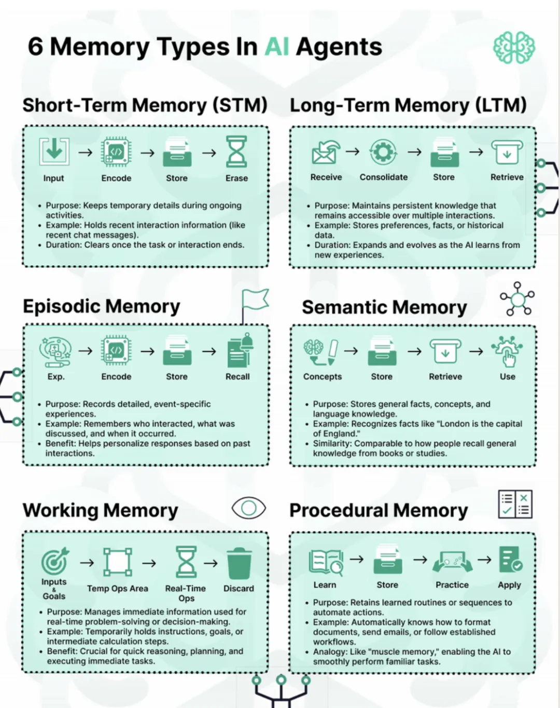

我觉得分类分的还可以，但是太浅了，于是就着它的逻辑，仔细得写了一下在不同的记忆层，该如何设计和选型
先从流程，作用，实力和持续时间的这4个维度来解释一下这几种记忆：
1. 短期记忆（Short-Term Memory, STM）

 流程：Input（输入）→ Encode（编码）→ Store（存储）→ Erase（清除）

 作用：在进行活动时保持临时细节，类似于我们在对话中临时记住的信息。

 示例：保存最近的交互信息，比如刚刚发送的聊天内容。

 持续时间：任务或对话结束后即被清除，不会保留。

2. 长期记忆（Long-Term Memory, LTM）

 流程：Receive（接收）→ Consolidate（整合）→ Store（存储）→ Retrieve（提取）

 作用：维持持久的知识，跨多次交互都能访问这些知识。

 示例：保存偏好设置、事实知识、历史数据等。

 持续时间：会随着AI不断学习新信息而增加和演变。

3. 情节记忆（Episodic Memory）

 流程：Experience（体验）→ Encode（编码）→ Store（存储）→ Recall（回忆）

 作用：记录详细的、事件性的经历。

 示例：记住是和谁互动（这个不见的“who”代表的是user，也可能是agent）、讨论了什么、何时发生等。

 好处：有助于AI根据过往经历，个性化地回应当前请求。

4. 语义记忆（Semantic Memory）

 流程：Concepts（概念）→ Store（存储）→ Retrieve（提取）→ Use（使用）

 作用：保存事实、概念、语言等一般知识，防止常识性幻觉

 示例：知道“伦敦是英国的首都”这种事实。

 特性：类似于人类从书本或知识学习中获得并提取的常识。

5. 工作记忆（Working Memory）

 流程：Inputs & Goals（输入和目标）→ Temp Ops Area（暂存操作区）→ Real-Time Ops（实时操作）→ Discard（丢弃）

 作用：处理即时信息，便于现场决策和解决问题。

 示例：临时保存指令、目标或计算步骤。

 好处：对即时推理、计划和执行任务至关重要。

6. 程序性记忆（Procedural Memory）

 流程：Learn（学习）→ Store（存储）→ Practice（练习）→ Apply（应用）

 作用：保留已学会的操作和流程，可自动化执行。

 示例：自动知道如何格式化文档、发邮件或跟随既有流程。

 类比：“肌肉记忆”，让AI能流畅地完成熟悉的任务。

以上六种记忆类型，分别服务于AI在不同场景下的存储、处理和应用：从即时、临时的信息处理，到持久、自动化的技能与知识运用。

但是这个概念要是落到纸面上其实还有很多工作要做吧，最起码得知道用啥存储组件吧，或者数据格式推荐？

那我们继续。

下面我根据上面这个图，整一个面向LLM Agent的存储设计建议，目的是能说明 6 类记忆各自应选用的存储类型、数据格式、关键组件及设计要点。

线说思路核心：  

1) 根据记忆的寿命（瞬时 ， 短期 ， 长期）、读写频率、访问延迟需求选介质；  

2) 根据查询方式（键值检索 ， 语义相似度 ， 结构化查询 ， 顺序重放）选数据库模型；  

3) 最好能用统一的记忆编排层抽象读写接口，屏蔽底层异构存储差异。

我就不按上面的顺序来写了啊，咱们就从短长开始设计，这样看着逻辑性强一点。

1. 短期记忆 (Short-Term Memory, STM)  

• 典型访问特征：生命周期 = 一次对话/任务，毫秒级读写，键值直取，不需要持久化。  

• 推荐组件的话呢？  

   首选：进程内缓存（Python Dict、Go map）或轻量化 KV 内存数据库（Redis、Dragonfly）。  

   高并发多实例可用 Redis Cluster + TTL 到期删除。  

• 数据模型/格式  

   结构简单：

{conversation_id: [{role, content, ts}]}
 或者直接token 缓存。  

   若需少量向量召回，可把 embedding 作为 field 存 Hash/JSON 里，或附带到本地 Faiss index（RAM），有钱Faiss可以上GPU，但是其实也没太大必要。

• 设计要点  

   TTL 必须 小于 上下文窗口时间，其实这个挺好理解，如果你TTL设置得太长，超过了当前任务/对话上下文窗口，那么旧的短期记忆有可能被下一轮新的对话或任务意外挂载和复用，导致“前一个用户/任务”的内容泄露进来（典型的“越权存取”风险）  

   关闭持久化 (AOF/RDB) 以获得极低延迟；  

  同步删除：对话结束立即 DEL / EXPIRE 0。

2. 工作记忆 (Working Memory)  

• 定义：Agent 正在推理时的scratchpad。持续几秒～几分钟，需要频繁更新、顺序遍历。  

• 推荐组件  

  直接放在 LLM 的 Prompt 构造器里（临时 Python 对象 / JS 对象）；  

 如需多人协作或 DAG 工作流，可用内存流数据库（Materialize、RisingWave）或流框架（Kafka + ksqlDB）暂存。  

• 数据模型  

JSON/Dict：

{"goal": "...", "current_step": 3, "intermediate_results": [...]}  

• 设计要点  

  可随时丢弃原则；  

  若任务超长，用 Write-Ahead Log 落盘到本地 SSD 防节点故障。

  这俩没啥特别可解释的

3. 情节记忆 (Episodic Memory)  

• 定义：带时间戳的交互事件流，需要按语义＋时间检索。  

• 推荐组件（Hybrid Store）  

  1-事件日志：Append-only 列式或时序库  Apache Iceberg / Parquet on S3、ClickHouse、TimescaleDB，这东西太多了，要我就clickhouse了，因为简单，但是特别要注意时间上下文的，可能还得去找专门的TSDB来搞

  2-语义索引：向量数据库 Milvus / Weaviate / pgvector / Pinecone。  

• 数据模型  

  基表的设计example：event_id, agent_id, user_id, timestamp, text, meta(json)

  向量表：event_id, embedding VECTOR(768看你处理的数据业务形态，768就是个建议值) + HNSW/IVF 索引  

• 设计要点  

  双写：事件落盘时同步写入向量库；  

  支持 “who/when/what” 过滤（涉及时间，事件和角色） + 近似向量检索；  

  定期离线合并老分区、分层存储 (hot ↔ cold)。

4. 语义记忆 (Semantic Memory)  

• 定义：事实、概念、知识图谱，强调结构化关系和可推理。  

• 推荐组件  

  知识图谱：RDF 三元组库 (Blazegraph, Virtuoso) 或图数据库 (Neo4j, TigerGraph)；  

  补充全文/向量：Elasticsearch + KNN（有没有估计能差点意思）、或者同上向量库。  

• 数据模型  

  三元组：(entity, relation, entity)

  为每个实体存 description, embedding，支持 embedding 相似度 + Cypher（图）/SPARQL（EDF） 查询，当然也可以加上BM25座个hyberid，最后再rerank。  

• 设计要点  

  明确本体 / schema；  

  版本化知识 (snapshot + diff) 以便回溯；  

  支持批量导入（主要是产业和公司内部文档这些玩意，对，还有wiki）。

 

5. 长期记忆 (Long-Term Memory, LTM)  

• 定义：用户偏好、持久配置、历次学习成果的总汇，需要可扩展、持久、多模式查询。  

• 推荐组件（分层架构）  

  结构化偏好：PostgreSQL / MySQL  

  大文件/文档：对象存储 (S3类的)  

   语义检索：统一指向上面的向量库（可与情节/语义共用集群省点钱）。  

• 数据模型  

  偏好表：user_id, key, value(jsonb), updated_at  

  文档索引：doc_id, s3_uri, summary, embedding  

• 设计要点  

  多租户隔离、如果有强烈的compliance需求，那上面GDPR 啥的也可以在这个基础上建设，总而言之就是不能混用了；  

  写放大：批量 consolidate 后写，减少频繁小更新；  

  定期迁移冷数据到低成本存储 ，比如类Glacier的纯冷层，但是我其实还时更推荐放在温层里面进行存储，虽然长期记忆不见的总能用到，但是一旦用到，折腾Glacier还是挺麻烦的，另外一个必须做的工作就是，长期记忆的定期summary，短期记忆可以周期性的汇总形成长期记忆，长期记忆也可以定期汇总形成超长期记忆，来避免context和storage的双重上限压力。

6. 程序性记忆 (Procedural Memory)  

  

• 定义：可复用的技能 / 工作流 / 宏；更新频次低、读频次高，需要版本控制和安全审计。  

• 推荐组件  

   Git 仓库 (GitLab / GitHub Enterprise或者任何企业里面用的仓库，愿意用啥都行) + CI；  

  若技能用 DSL/JSON 表示，可再加文档数据库 (MongoDB) 缓存可解析的 AST；  

  运行时加载：在容器或函数服务等serverless服务中按需调用。  

• 数据模型  

  代码 / YAML / BPMN 文件；  

 元数据表：skill_id, name, version, checksum, entry_point, permissions.  

• 设计要点  

  版本标签+语义化发布 (SemVer)；  

  审批/回滚链路；  

  延迟加载 + 本地 LRU 缓存，保证首调用体验。 

跨层 Memory Orchestrator 设计要点  

1) 统一 API：store(memory_type, data, **meta)、retrieve(memory_type, query)  

2) 读写策略：  

   • 写入时自动路由到对应存储；  

   • 读取时支持级联：先 STM 到LTM 到 语义 / 图谱。  

3) 安全合规：数据分级、加密 at-rest + in-transit，PII 脱敏。  

4) 指标观测：每层暴露 QPS、延迟、命中率，Prometheus + Grafana。

5) 弹性伸缩：冷热分层、Auto-Scaling、备份与灾难恢复策略。  

如果按着我以上的设计来经营你的Agent记忆系统，那肯定既能保证超低延迟的对话体验，又能让 Agent 正确的调用长短期记忆的知识，演化技能，而且复杂度相当高，为了做AI自动化，手动创建了极其精密和复杂的存储系统，就又可以借机会招人了，创造了就业机会图片

# 参考

[1] 如何设计Agent的记忆系统, https://mp.weixin.qq.com/s/r18U5y0MKZjhhZnnGqEJRA
