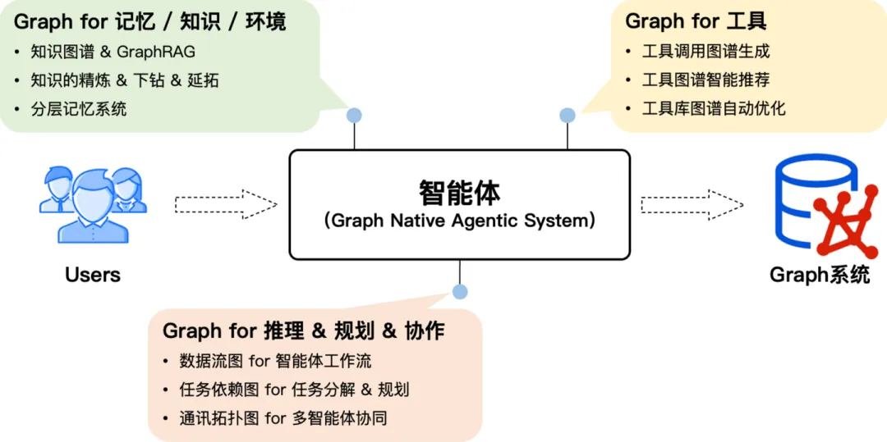
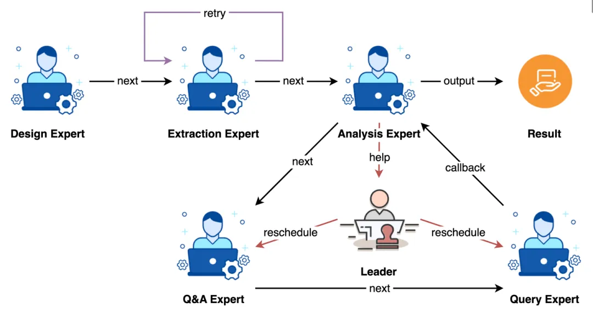
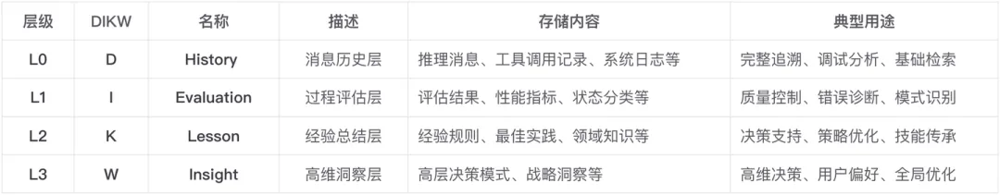
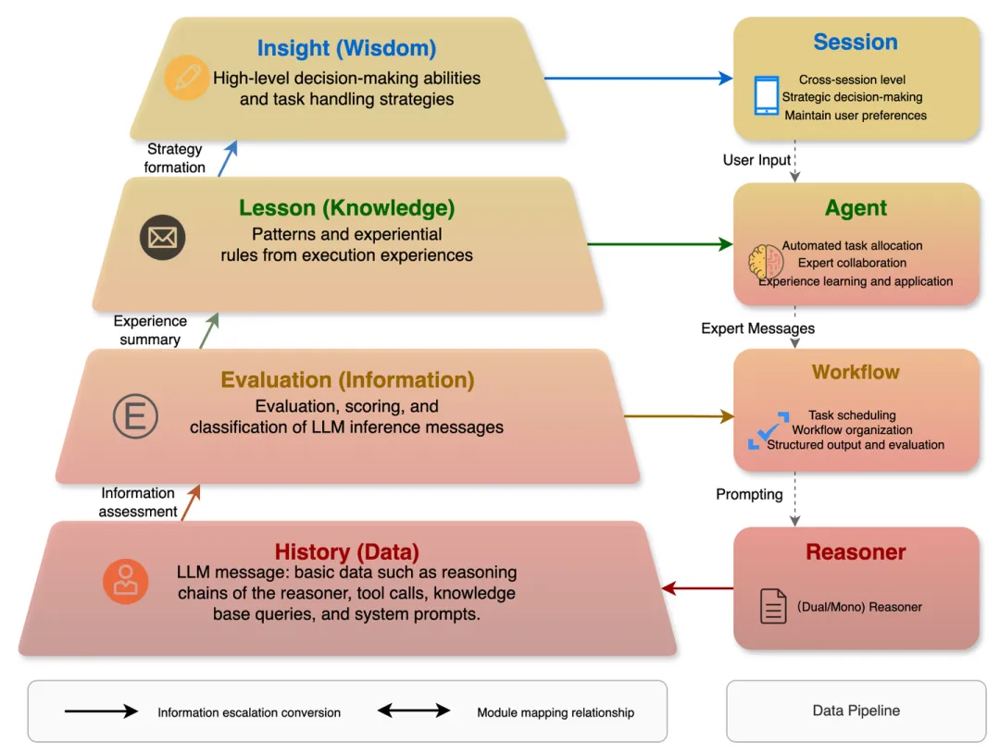
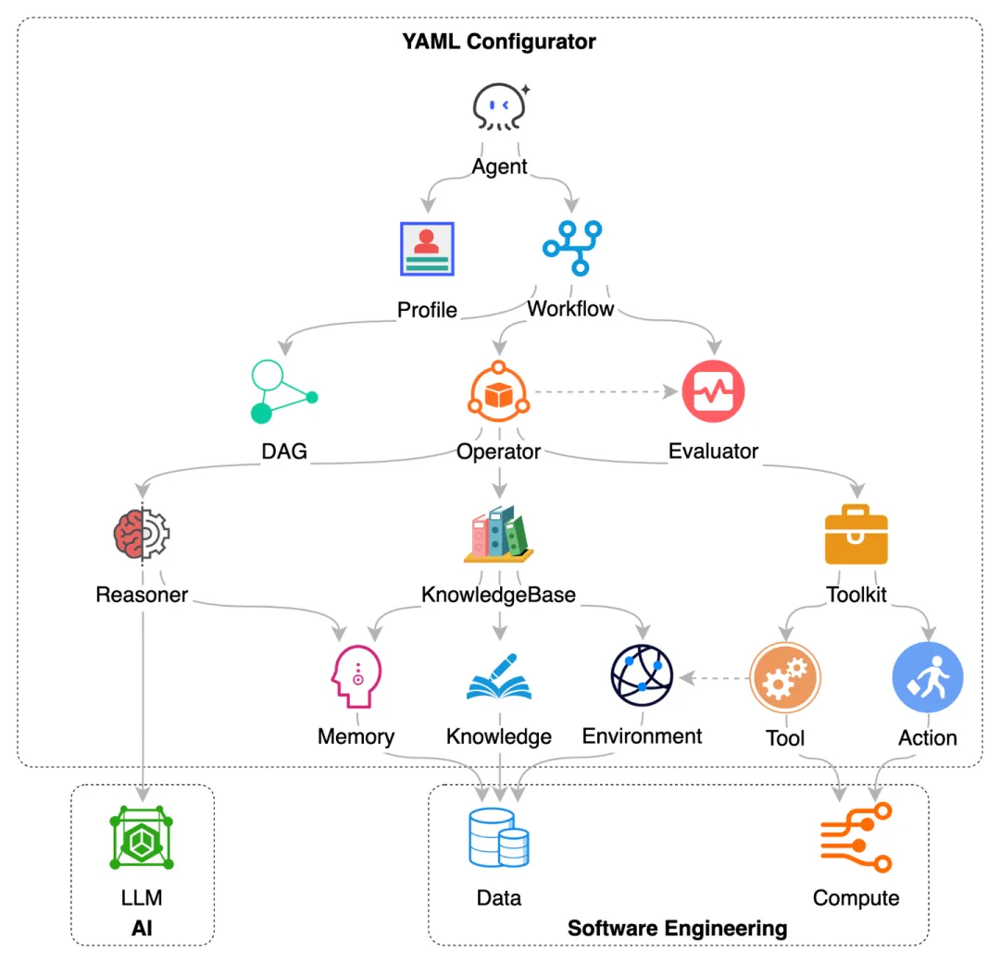
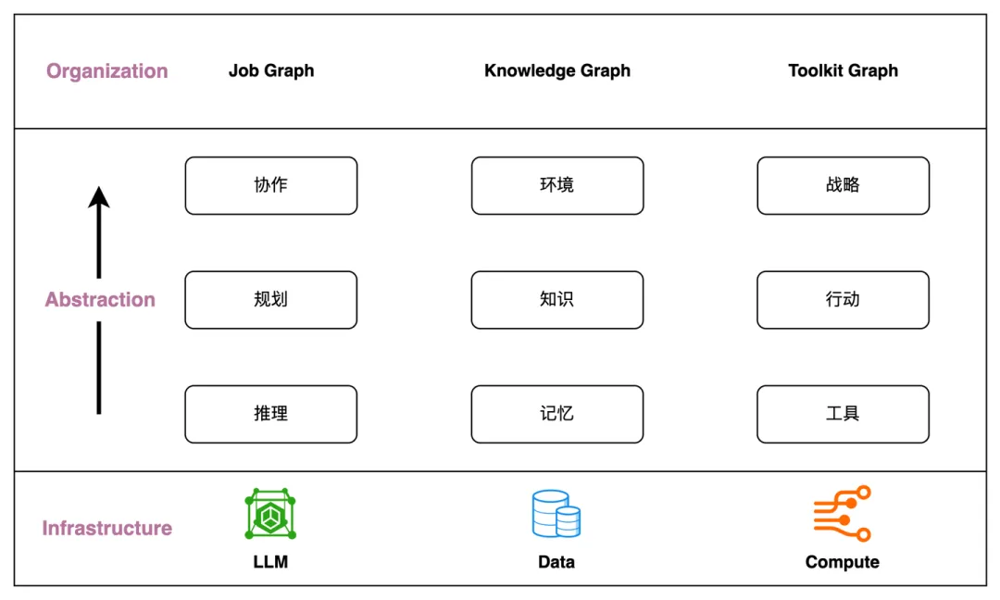
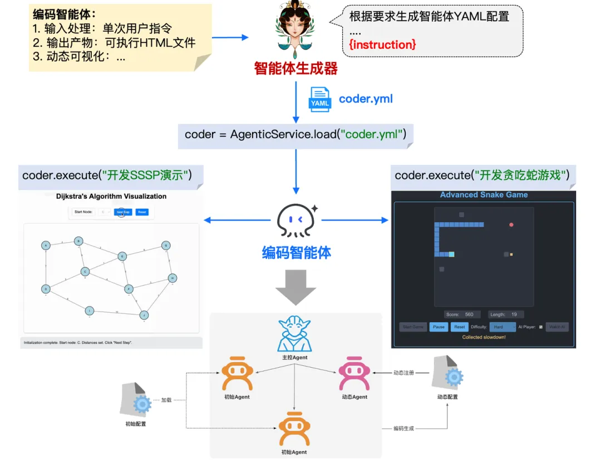
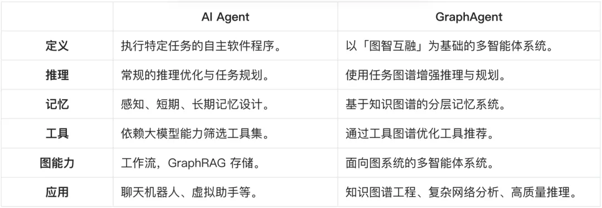

作为首个全面践行「图原生」理念的智能体系统，Chat2Graph 开源并发布了首个可用版本（v0.1.0）(链接：https://github.com/TuGraph-family/chat2graph/releases/tag/v0.1.0)

关注仓库：https://github.com/TuGraph-family/chat2graph

项目文档：https://chat2graph.vercel.app/

系统的核心组件有：

- 图系统层：构建了面向图系统的统一抽象，使用图数据库服务统一管理，并支持未来更多图计算系统的扩展。
- AI 系统层：构建 AI 基础设施抽象，如智能体框架、RAG、记忆工具、模型服务工具等，提供智能体能力基建和生态扩展。
- 存储服务层：存储智能体的持久化数据，包括元数据、记忆、知识、文件等。
- 推理机：提供 LLM 服务封装、推理增强、工具调用等基础能力。
- 工作流：负责智能体内部的算子（Operator）编排与SOP抽象，定义智能体工作流程。
- 记忆系统：构建分层的知识精练体系，负责智能体系统的信息存储、检索，包括记忆管理、知识库、环境等。
- 工具库：基于图谱的方式描述工具和智能体行动的关联关系，实现工具的自动化管理和推荐。
- 智能体：智能体系统执行单元的统一抽象，使用角色定义（Profile）描述工作职责，使用工作流描述工作流程。主要包括 Leader 智能体和 Expert 智能体两大类型。
- 自动化：系统智能体化能力的抽象，「Less Structure」理念的实践手段。包括自动的任务规划、工作流生成、工具库优化、知识精练、资源调度等能力。
- 系统集成：提供 Web UI、Restful API、SDK 的集成方式，通过 YAML 一键配置智能体系统，方便开发者快速接入 Chat2Graph 的能力。

协作当前更多的还是强调多个智能体之间的互动，处理任务、资源的动态分配和调度。不论是采用「单主动-多被动」的统一 Leader 协调方式，还是多个 Expert 自由通信的自主方式。亦或采用单进程的串行处理，还是使用远程通信的并发处理。多智能体系统的协作机制都要处理以下几个关键问题：

- 任务分配：将拆分好的子任务合理地分配到对应的智能体执行。
- 执行容错：任务执行结果的评估与反思，并能通过重试自动恢复。
- 重新规划：对不合理的任务拆分的容错能力，能适时的请求重新规划流程。
- 结果交付：能通过合理的协作，对任务产出物生成、加工、优化，交付预期结果。
- 资源调度：通过调度优化资源的使用，降低时间、空间、Token 开销，提升质量。

相比 Workflow 的「静态」属性多一些，更侧重规范化流程，JobGraph 的「动态」属性则多一些，更侧重任务的灵活性以及能力扩展。尤其是类似 A2A 协议定义了智能体交互的规范，更需要良好的协作机制，通过引入更开放的生态，扩展系统边界，提升解题能力。

**记忆系统**

Chat2Graph 借鉴了 DIKW （链接：https://en.wikipedia.org/wiki/DIKW_pyramid）金字塔模型，从信息的内容角度出发将记忆划分为四层结构。

分层记忆系统引入的多级信息抽象，允许我们能从更精细的粒度对知识进行管理。

- 知识精练（Knowledge Refinement）：原始知识经过逐级的处理、分析、抽象、压缩，形成更高层次的知识，扩展知识生产的能力。
- 知识下钻（Knowledge Drilling）：在使用高维知识的同时，还可以按需下钻低维知识，让推理上下文粗中有细，强化知识消费的能力。
- 知识延拓（Knowledge Expansion）：表示同层级知识关联的构建和召回，通过特定方法丰富知识上下文。典型代表是 RAG（检索增强生成）。

最新的 G-Memory （链接：https://arxiv.org/abs/2506.07398）的研究与我们的分层记忆系统的理念不谋而合，它设计了三层图结构来管理记忆：

- 交互图（Interaction Graph）：存储细粒度的智能体间的通信日志，提供事实依据。
- 查询图（Query Graph）：记录任务节点（含状态）以及语义相似或关联的任务关系，并与交互图链接。
- 洞见图（Insight Graph）：存储从多次成功或失败的交互中提炼出的、具有普适性的经验和教训。

我们甚至可以通过一个 YAML （链接：https://github.com/TuGraph-family/chat2graph/blob/master/app/core/sdk/chat2graph.yml）文件完整的描述多智能体系统的能力，而不需要复杂的硬编码。

我们认为，「推理」、「记忆」、「工具」是对 AI 工程三大基石「模型」、「数据」、「计算」的工程化表达，同时「规划 & 协作」、「知识 & 环境」、「行动 & 战略」是对「推理」、「记忆」、「工具」的进一步抽象，而它们都可以使用 Graph 统一表达，分别对应「任务图谱」、「知识图谱」、「工具图谱」，甚至在未来这三张 Graph 还可以进一步融合，这便是我们对「Graph for AI 软件工程」的整体理解。

