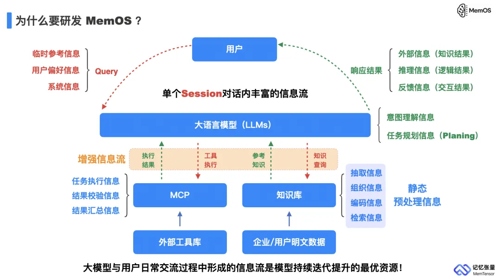
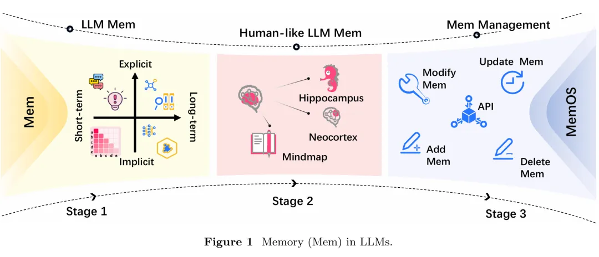
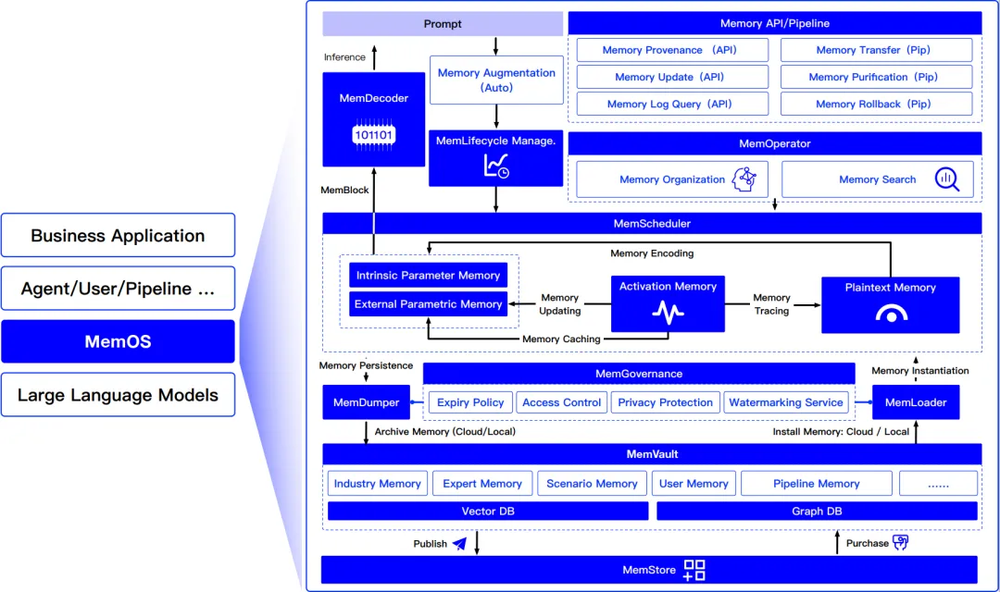
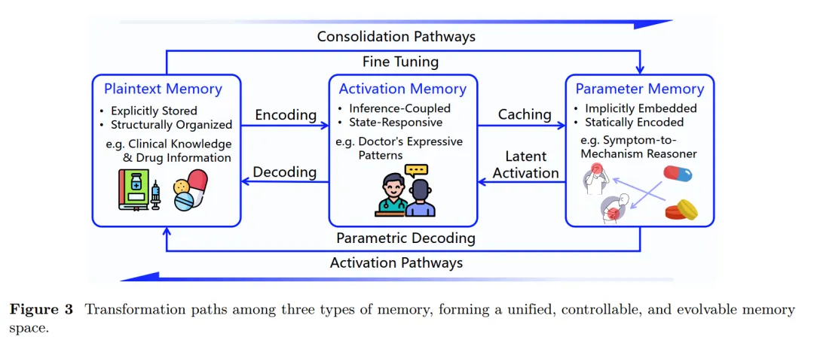
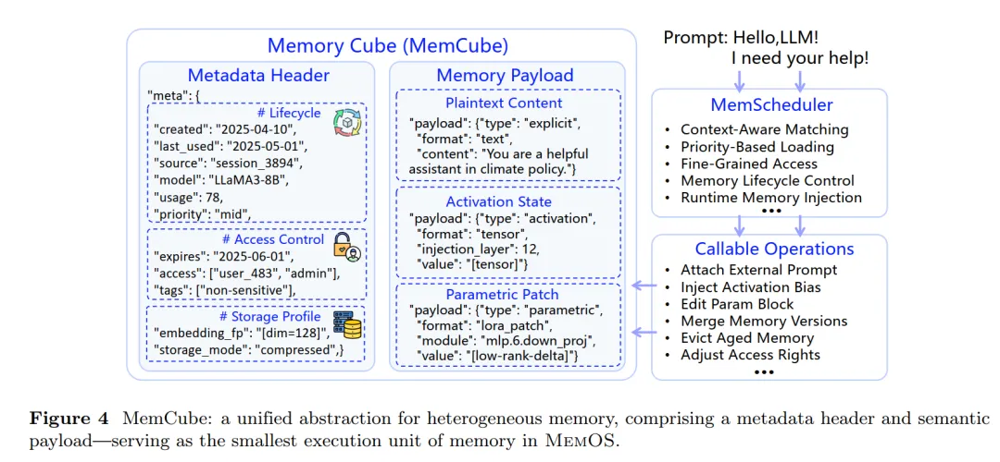
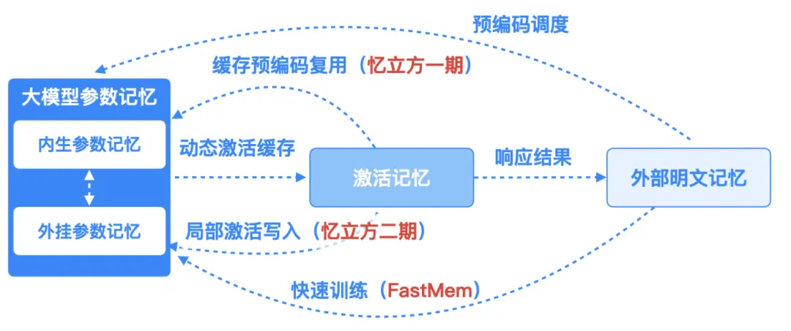
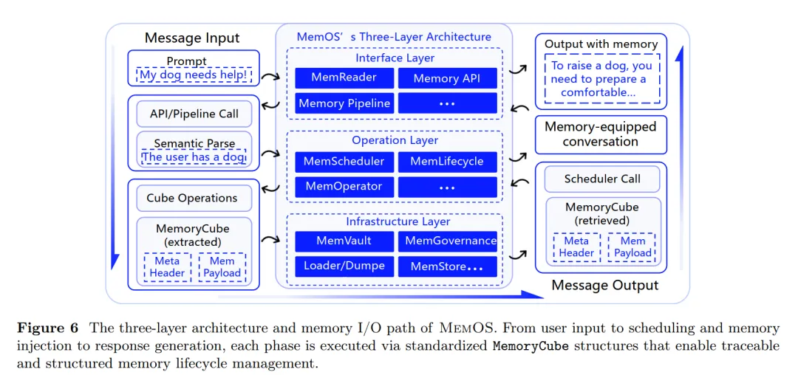
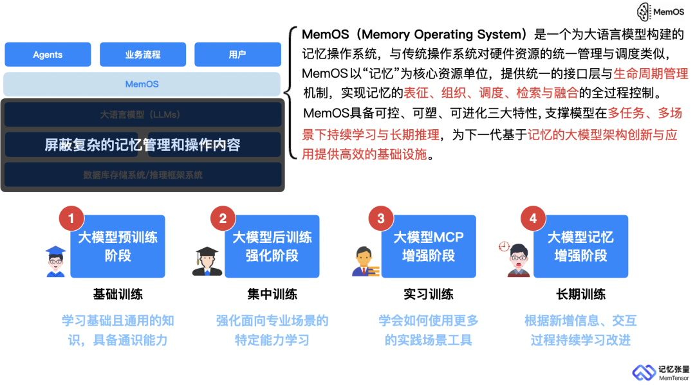

# 资源

论文标题：MemOS: An Operating System for Memory-Augmented Generation (MAG) in Large Language Models

联合单位：MemTensor（记忆张量）、上海交通大学、中国人民大学、中国电信研究院

论文地址（Short Version）：https://arxiv.org/pdf/2505.22101

代码开源地址：https://github.com/MemTensor/MemOS （相关技术报告已于2025年05月28日在Arxiv发布，由于第一版工程量较大，为了保障开源社区的使用体验，将在7月进行全面开源，并力求打造成工业级记忆操作系统框架）

# 问题提出

大语言模型（LLMs）已成为通往通用人工智能（AGI）之路的重要基础设施，然而在支持稳健记忆能力方面，仍面临难以解释、更新或迁移等根本性挑战。当前主流的LLMs架构严重依赖两类“短效记忆”：一是参数记忆，将知识固化在庞大的模型权重中，不仅更新困难，也缺乏可追溯性；二是激活记忆，如KV缓存，仅在单次推理会话中有效，无法跨轮保持上下文。这种记忆机制导致模型“看得懂、答得出，却记不住、改不了、学不快”。在这种背景下，赋予LLMs以真正的记忆能力，逐渐成为研究热点。

目前，关于LLMs记忆机制的研究已从早期的定义与探索阶段，发展到了类人记忆的涌现阶段，试图借鉴人类对记忆的组织和检索方式，并将其引入LLMs体系中。然而，现有技术构建的各类记忆多以临时性文本的形式注入LLMs，缺乏统一、结构化的管理机制。一些工作尝试通过提供API接口来支持记忆操作，但大多仍停留在对明文记忆的简单增删改查，尚未覆盖记忆的完整生命周期，包括生成、组织、使用和演化等关键环节。更为重要的是，当前的LLMs在推理过程中难以协同管理多种类型的记忆，如参数记忆、激活记忆与明文记忆。

这一结构性缺陷在多个实际应用场景中表现得尤为明显：

- 上下文丢失：对话中早期设定的规则或偏好（如语气、代码风格）在多轮交互后常被遗忘，行为难以保持一致；
- 知识版本冲突：RAG 检索到的新旧内容共存，缺乏优先级与演化机制，模型易陷入语义冲突；
- 个性记忆缺失：模型无法沉淀用户偏好与互动轨迹，导致每次生成都“从零开始”；
- 平台间无法迁移：用户在一个应用中积累的记忆无法在另一个系统中复用，形成“记忆孤岛”。

近期，由记忆张量（上海）科技有限公司牵头，上海交通大学、中国人民大学、中国电信研究院的研究团队联合发布了一项研究 —— MemOS：一套面向 LLM 构建的类操作系统级别的记忆管理与调度框架。该系统首次以“操作系统”的视角将记忆设定为 LLM 的核心资源，覆盖从表示结构、生命周期治理到多类型融合的全链路记忆管理，填补了当前语言模型在“结构化、持久性、自适应记忆能力”上的关键空白。

# 原理

MemOS：让大模型记得住、调得动、用得稳的“记忆基础设施”

随着大语言模型向多轮对话、规划决策、个性化代理等更高阶任务场景扩展，模型的“记忆能力”正成为决定其长期智能行为与持续适应能力的关键指标。而当前主流架构在记忆层面普遍存在“弱结构、弱管理、弱融合”的系统短板，导致模型知识更新成本高、行为状态不可持续、用户偏好难以积累。

为打破这些系统性瓶颈，MemOS 提出一种新的范式转变：将“记忆”从模型运行的隐性副产物，上升为具备生命周期、调度策略与结构统一性的“核心资源”，并围绕该资源构建统一抽象与操作系统式的治理机制。

**记忆分类：参数、激活与明文记忆**

在 MemOS 中，记忆不仅是信息的存储，更被视为模型感知、理解与行动的持续性底座。为支撑大语言模型在多任务、多场景下的长期演化，MemOS 将记忆系统性划分为三类核心类型：参数记忆（Parametric Memory）、激活记忆（Activation Memory） 和 明文记忆（Plaintext Memory）。三者在表示结构、生命周期与调用方式上各具特点，构成了智能体多层次认知系统的结构性基础。

**1. 参数记忆（Parametric Memory）**
参数记忆是 LLM 在预训练或微调过程中，通过大规模语料学习并固化于模型权重中的长期知识形态。其表现形式为前馈层、注意力层中的参数矩阵，可在推理时无需外部检索即可直接参与生成，具有即时调用、高频访问、延迟低等优点。

在 MemOS 中，参数记忆不仅承载了通用语言能力和常识性知识，还支持模块化注入机制，如通过 LoRA 等轻量方法加载领域特定模块（例如法律、医疗插件），实现按需组合与参数复用。它构成了 LLM 零样本能力、通用推理与多任务迁移的“能力基座”，可被视作模型的“长期神经结构”。

**2. 激活记忆（Activation Memory）**
激活记忆是指模型在推理过程中产生的瞬时性认知状态，包括 KV cache、隐藏层激活、注意力权重等中间张量结构。它通常用于维持上下文连续性、对话一致性与行为风格控制，在多轮交互与任务执行中扮演“工作记忆”的角色。

MemOS 将激活记忆抽象为可调度资源，支持按需唤醒、延迟卸载与结构变换。例如，某些上下文状态可以被压缩为“半结构化记忆片段”用于未来复用，也可以在任务级别转化为参数化模块，支持短期记忆的长期化演进。这一机制为模型行为一致性、风格保持与状态持续性提供了基础。

**3. 明文记忆（Plaintext Memory）**
明文记忆是系统外部提供的、可显式管理的结构化知识形态，通常以文档、提示模板、图结构或用户规则等形式存在。它具备编辑性、可共享性与治理友好性，适合存储需要频繁修改、可审计或多方协同使用的信息。

在 MemOS 中，明文记忆可用于动态生成推理上下文、个性化偏好注入、多代理协作共享等场景，成为连接人类输入与模型认知的关键桥梁。系统为其配备了版本管理、调用追踪与权限控制机制，使之成为支持知识外化与智能行为治理的基础设施。

MemCube：抽象记忆的统一“执行单元”
为实现三类记忆的统一调度与融合操作，MemOS 提出标准化的记忆封装结构 —— MemCube。它不是简单的容器，而是具备自描述性、自管理能力的“记忆原子单元”，在模型生命周期中承担着状态追踪、行为调控和资源调度的核心角色。

每一个 MemCube 由三部分构成：

- 元数据头：包括创建时间、来源标识、语义标签、权限等级、生命周期设定等，用于支持记忆的溯源、筛选与治理；
- 语义负载：承载实际知识内容或中间状态（如结构化知识、激活状态片段、KV 模块等），是推理时的核心信息依据；
- 行为指标：自动记录访问频率、上下文相关性、使用反馈等信息，为后续记忆替换、压缩、升级等演化决策提供依据。

基于 MemCube 的设计，系统可以实现从“静态加载”到“按需调度”的记忆使用模式转变，也支持记忆形态间的路径性转换，例如：

- 明文 ➜ 激活：频繁使用的任务规则可转化为激活模板，避免重复解码；
- 激活 ➜ 参数：稳定的行为模式可蒸馏为权重模块，提升调用效率；
- 参数 ➜ 明文：低频使用的老旧知识外化存储，以备审计或人工更新。

这使得 MemOS 的记忆系统具备“生长、替换与重构”的能力，从而真正支持 LLM 在动态任务中持续演化。

操作系统式架构：接口、调度与存储的三层协同

为支持多类型记忆的统一表示、任务感知调度与生命周期管理，MemOS 构建了一套类操作系统的三层体系架构。该架构分别对应记忆系统的输入解析、行为执行与系统支撑三个层面，旨在实现高效、可控、可扩展的记忆运行机制。

接口层（Interface Layer）：该层提供标准化的 Memory API，用于统一接收和解析来自用户、模型或调度模块的操作请求，将自然语言或半结构化输入映射为结构化的记忆操作指令（如查询、插入、更新、删除、回溯等）。其中，MemReader 模块具备语义理解能力，可自动识别记忆调用意图、提取关联参数，并组织成可执行的操作流水线，为下层调度与管理模块提供结构化支撑。

操作层（Operation Layer）：作为系统的控制核心，该层负责记忆的动态调度、生命周期管理与结构化组织。MemScheduler 基于任务上下文、用户状态或历史行为，采用语义匹配或标签绑定等策略选择适用的记忆单元进入推理路径。MemLifecycle 建模记忆状态迁移过程，支持激活、冻结、归档等多阶段演化，并提供版本管理与回滚能力。MemOperator 则构建多层索引与语义图结构，提升大规模记忆集合的检索与组合效率。

基础设施层（Infrastructure Layer）：该层提供记忆系统的底层支撑，包括持久化存储、安全治理与跨平台迁移。MemVault 负责高效存储结构化与非结构化记忆；MemGovernance 实现权限控制、审计追踪与敏感信息标注，确保系统合规性。MemStore 作为开放式记忆资产平台，支持记忆单元的注册、发布、订阅与共享，实现跨模型、跨智能体的记忆迁移与协同推理。

整个执行链路以 MemCube 为最小调度单元，确保从接收指令、唤醒记忆，到响应生成的全过程均在可控、可追踪、可进化的框架中运行。

从“生成器”到“智能体”：模型能力的结构性跃迁
在传统的语言模型范式中，模型本质上是一个被动响应的生成器——它接受输入，基于静态参数和上下文进行一次性推理，然后清空状态、重置记忆。这种设计虽能支持强大的通用生成能力，但在面对复杂任务协作、个性化交互或长期知识演化时，往往力不从心。

MemOS 的提出正在推动这一范式向前演化。通过引入结构化记忆建模、多形态融合机制与类操作系统的资源调度框架，MemOS 使大语言模型具备了三种关键能力：

- 持续感知过去（记住什么）：系统性沉淀历史交互、任务状态与知识上下文；
- 策略化忘却（忘掉什么）：通过生命周期控制与使用频率调度淘汰冗余信息；
- 动态重组经验（如何迁移与复用）：支持在新任务、新平台中快速激活、融合已有知识。

这一架构的引入，不仅显著提升了模型的适应性（对任务变化的快速响应）、一致性（跨轮行为稳定性）与协同性（多模型协作能力），也标志着 LLM 正从“语言处理单元”向“认知智能体”转型，具备了长期状态建模、行为塑形与自主演化的结构性基础。

# 展望未来：从智能体到“记忆生态系统”

当每一个 MemOS 实例成为一个具备结构化记忆能力的智能体时，我们不难想象下一步的图景：多个智能体之间如何交换记忆？不同模型如何复用行为经验？用户能否“携带记忆”在平台间无缝迁移？

研究团队在此基础上提出一个更具前瞻性的目标：构建一个去中心化的记忆生态系统（Memory Ecosystem），其核心支点是一个通用的 Memory Interchange Protocol（MIP），即记忆互操作协议。

这个生态系统将支持以下关键能力：

- 长期状态建模与持续学习：模型可不断吸收、更新和优化已有知识，不再依赖频繁微调；
- 用户画像沉淀与行为一致性：实现跨轮次、跨任务的个性化记忆绑定，支持行为一致响应；
- 跨模型、跨平台的记忆迁移与复用：支持用户在多个模型或平台间“携带记忆”，提升连续性与体验一致性；
- 记忆资产的治理与协同演化：引入版本控制、权限管理与审计机制，支撑记忆资源在多主体、多角色下的安全共建与协作更新。
- 在这一生态中，记忆将不再是“模型私有”，而是变成一种可管理、可共享、可交易的智能资产单元，推动 AI 系统从“自闭式大模型”向“互通式智能网络”进化。

总结：记忆范式将定义下一代智能基础设施

图：从Pre-train Scaling 到Post-train Scaling，再到Test-time Scaling，下一个模型能力增强的突破点在于Memory-train Scaling的持续性学习，让模型在交互过中基于记忆形成长期个性化的能力提升。

随着大模型的发展逐渐进入“规模边际收益递减”的阶段，业界对参数规模和训练数据的依赖已触及成本和性能的平衡临界点。此时，从数据/参数中心转向“记忆中心”的范式转型，正成为模型能力跃迁的关键突破口。MemOS 作为首个将“记忆”纳入系统级调度与治理的大模型基础设施，提供了从记忆单元抽象（MemCube）、生命周期控制、跨类型融合，到跨平台迁移与合规治理的全链路支撑框架。

它不仅解决了当前 LLM 记忆碎片化、状态不可持续与知识不可治理的问题，更在系统架构层面为下一代 AGI（通用人工智能）提供了“能记住、会理解、可持续进化”的运行底座。

未来的语言模型不再是“沉默的大脑”，而将是有记忆、有个性、有行为一致性的长期智能体。而这一进化的起点，正是对“记忆”的重新定义。

# 参考

[1] 记忆张量联合上海交大等提出首个面向大模型记忆管理的操作系统框架MemOS, https://mp.weixin.qq.com/s/BwWsc8iuvkYIzLg2s1ZGMQ