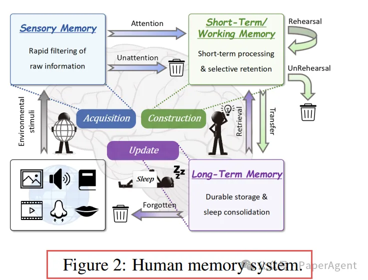
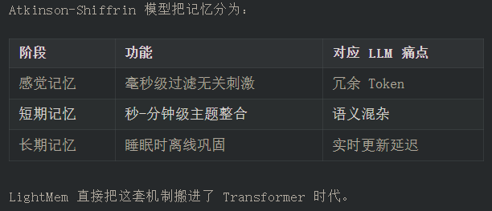
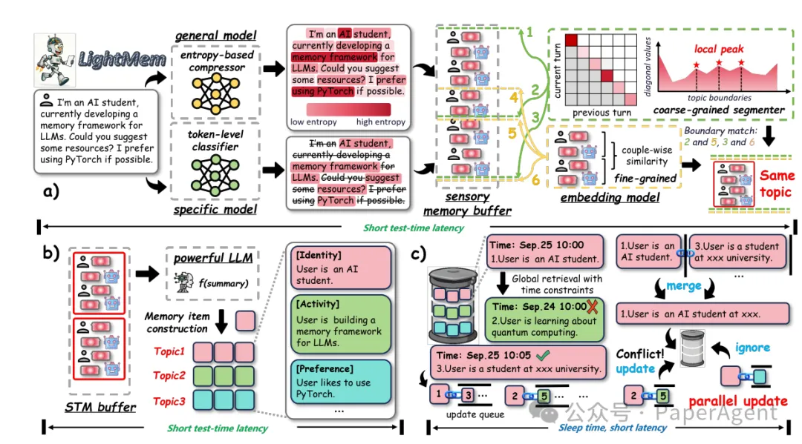
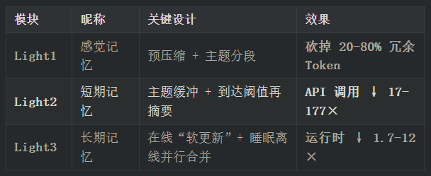
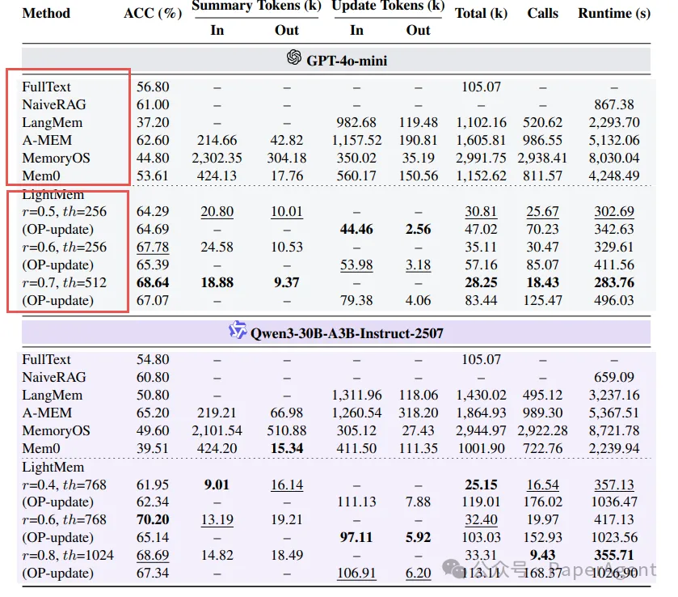

LightMem: Lightweight and Efficient Memory-Augmented Generation
浙江大学 & 新加坡国立大学  
https://arxiv.org/html/2510.18866
https://github.com/zjunlp/LightMem

LightMem 架构：三盏“灯”点亮高效记忆

4. 核心技术拆解
4.1 Light1：预压缩 + 主题分段
图 4(a)：不同压缩率下 QA 准确率几乎不变，token 先砍一半图片

做法：

用 LLMLingua-2 给每轮对话打“保留概率”。
动态阈值 τ = 百分位(r)，只保留信息量最大的 token。
压缩率 r=0.6 时，输入 token ↓ 40 %，准确率不掉。
4.2 Light2：主题级短期记忆
缓冲结构：{topic, [user_i, model_i]}
到达 Token 阈值后，一次性调用 LLM 生成摘要 → 入库。
相比“逐轮摘要”，主题纯度↑ → 摘要幻觉↓，图 4(c) 显示去掉该模块 ACC 掉 6%。
4.3 Light3：睡眠期离线合并
在线阶段只做“追加写”，零延迟。
离线阶段并行执行“读-改-写”：
每条记忆维护一个更新队列 𝒬(e_i)，仅与更高时间戳的条目合并，可批量并行，总延迟从 O(N) → O(1)。

# 参考

[1] LightMem用3招重新设计了LLM的记忆，结果出乎意料, https://mp.weixin.qq.com/s/OkhdTQYmdqo_r7iub94rJg