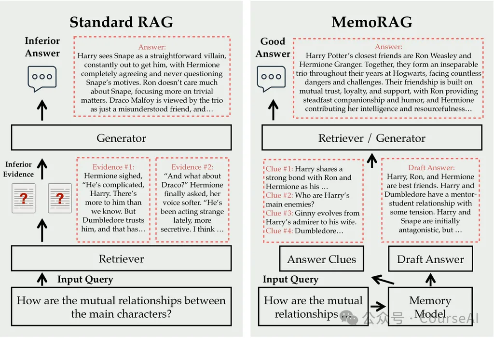
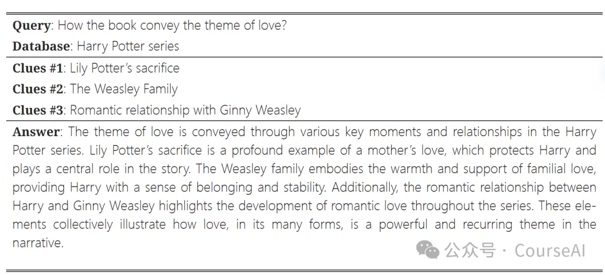
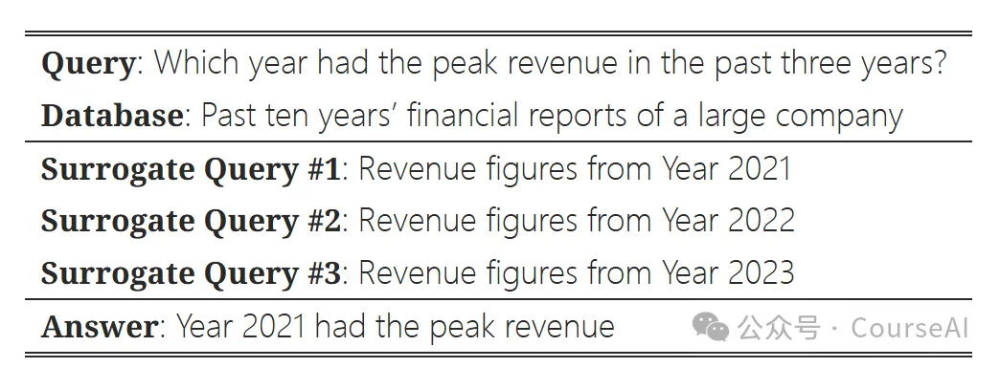
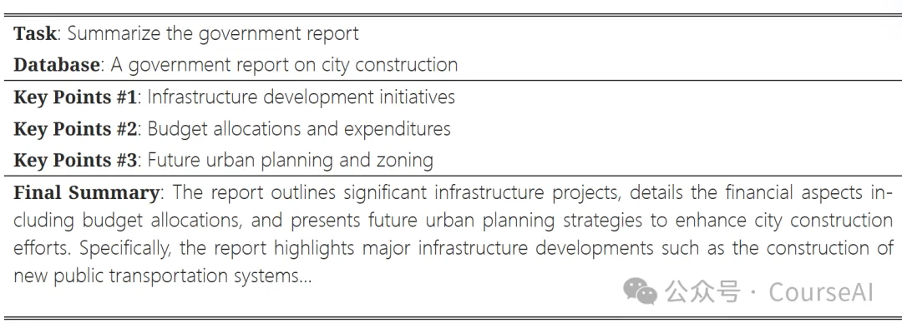
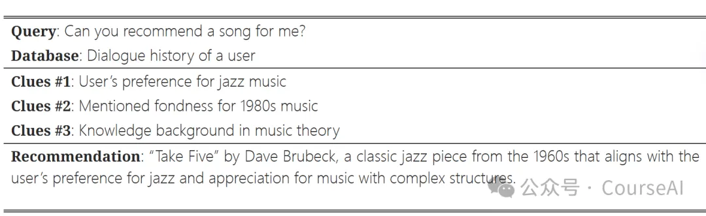
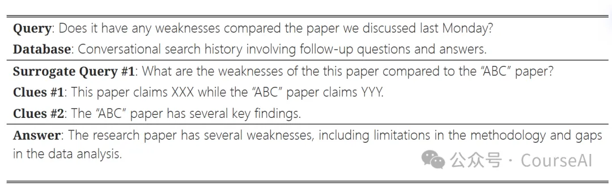

# 1. 资源

https://arxiv.org/pdf/2409.05591

https://github.com/qhjqhj00/MemoRAG

https://huggingface.co/TommyChien

# 2. 原理

标准的RAG输入的query语义太隐晦，难以准确地定位必要的证据，导致答案不太准确
MemoRAG在整个数据库上构建了一个全局内存。当给出查询时，MemoRAG 首先回忆相关线索，使有用的信息能够被检索，从而得出精确和全面的答案。

能解决的问题
传统RAG的弊端：无法建立完善的上下文关系。例如：无法书籍中角色的的关联关系，就无法在回答问题时给出有效的推断
MemoRAG为了找到隐藏的上下文关系
在传统RAG上添加了一个记忆模块用于生成检索的线索。
这些线索本质上一个轻量级的LLM基于数据库压缩表示（记忆）生成出来草拟的答案
生成的线索可能存在虚假的信息，但是明确地揭示了给定任务的潜在信息需求（或者上下文关系）
最后使用这些线索作为新的query,检索数据库必要的知识，利用重量级的LLM进行增强生成答案。
MemoRAG的主要贡献
根据query,利用轻量级的LLM充当记忆模块，记忆缓存超过LLM本身长度的上下文知识，用于生成能够理解query的线索
根据线索,利用重量级的LLM,重新检索数据库，生成精准的答案
线索是如何生成的
首先，利用query，检索数据库得到上下文
其次，利用轻量级的LLM（切记必须是能处理超长上下文的语言模型）作为记忆模块，压缩检索得到的上下文，到LLM可以接受的长度，生成线索。例如：
摘要任务：生成的线索包含从上下文中提取的关键点或概念，这些概念对于组装连贯且准确的摘要至关重要。
问答任务：输入查询比较隐晦，生成的线索就必须是明确和消歧。
作者发布了两个记忆模块memorag-qwen2-7b-inst 和 memorag-mistral-7b-inst，它们分别基于 Qwen2-7B-Instruct 和 Mistral-7B-Instruct-v0.2在实际应用当中memorag-mistral-7b-inst 在上下文长度高达 150K token时表现良好，而 memorag-qwen2-7b-inst 在上下文长度高达 600K token时有良好的表现

超出LLM长度的知识是如何压缩的
检索到的上下文的总长度，超过了LLM接受的最大长度。MemoRAG设计了一个内存模块：

假设LLM能工作的上下文窗口长度为L, 通过注意力机制将原始的token，转化成k个内存token，这里的k远小于L的长度
k个内存token被记忆后，原始token的KV缓存就被丢弃,相当于人类记忆的遗忘
在经过n个上下文窗口之后（这里的n相当于召回的上下文的总长度除以LLM能接受的长度的次数）,memoRAG就会逐步上下文替换成内存的token，缓存起来，这样就压缩了上下文的知识。
可以解决的业务场景
意图不明确的query
难点：用户没有表达出明确的意图，需要更深层次的语境理解和推理
MemoRAG根据压缩知识的记忆模块，能够推断出隐式查询的潜在意图，通过生成分阶段的答案，例如更具体的答案线索，MemoRAG 弥合了隐式信息需求和检索过程之间的差距。

应对复杂问题的查询
难点：复杂的问题通常需要跨多个步骤将有效的信息联合起来
记忆模块压缩的知识，能将数据库中多个步骤的相关信息连接并整合在一起。通过生成指导检索互联数据点的暂存答案，MemoRAG 有效地管理了多跳查询的复杂性。

信息聚合
难点：对长篇文档进行摘要，需要能够将大量非结构化数据压缩成简洁连贯的输出。传统RAG依赖于检索离散的信息片段，而没有机制有效地将这些片段组合并总结成全面的概述。
memoRAG对长文本进行摘要时，记忆模块捕获和综合数据集中的关键点，生成中间阶段的答案，这些答案代表了内容的必要元素，然后用于从原始内容中检索详细信息。所有这些信息都被聚合起来，以生成最终的摘要。

个性化推荐
难点：个性化需求的信息通常是模糊的，受用户角色影响大，而传统RAG通常依赖通用的相关信息，拿不到用户个性化数据
利用记忆模块存储的全局信息，来分析和理解用户的对话历史，识别和利用关键线索，例如用户的音乐偏好、知识背景、年龄以及可以从过去交互中推断出的其他相关因素。生成高度个性化的推荐。

终身对话搜索
难度：传统RAG难以处理多轮对话中上下文意图在不断变化的情况
memoRAG利用记忆模块，能够存储多轮对话的完整知识，能填补在每轮对话过程中空白的语义空间。例如：他吃饭了吗？ 没有上下文知识，就理解不了他指的是谁。

# 参考

[1] 1.2kStar RAG2.0具备超长记忆，实现全局检索, https://mp.weixin.qq.com/s?__biz=MzkzNjgwNzMwNQ==&mid=2247484067&idx=1&sn=9e6424b297894207efbe4f988926e514&scene=21&poc_token=HEAIEGmjt13Xn5b4qVa1X5NnEL_g2mB-F4D0qhBB