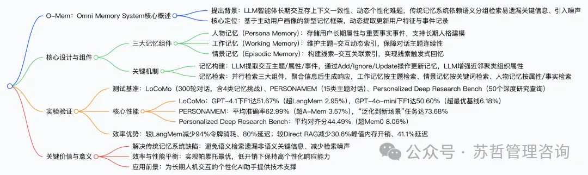
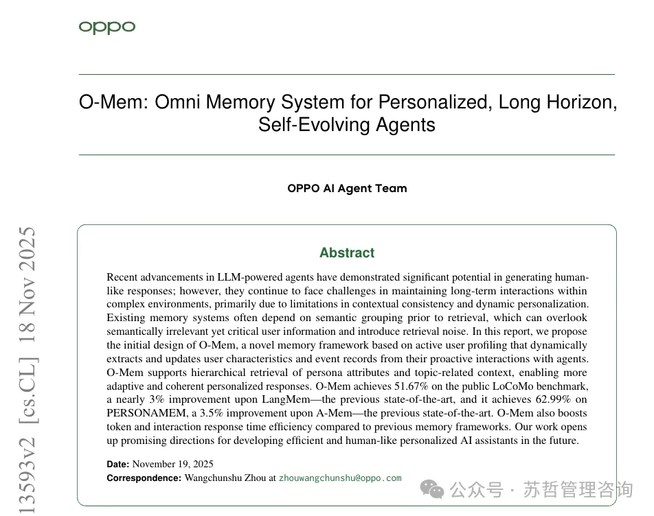
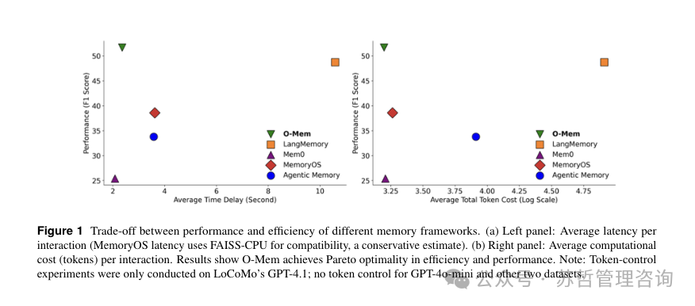
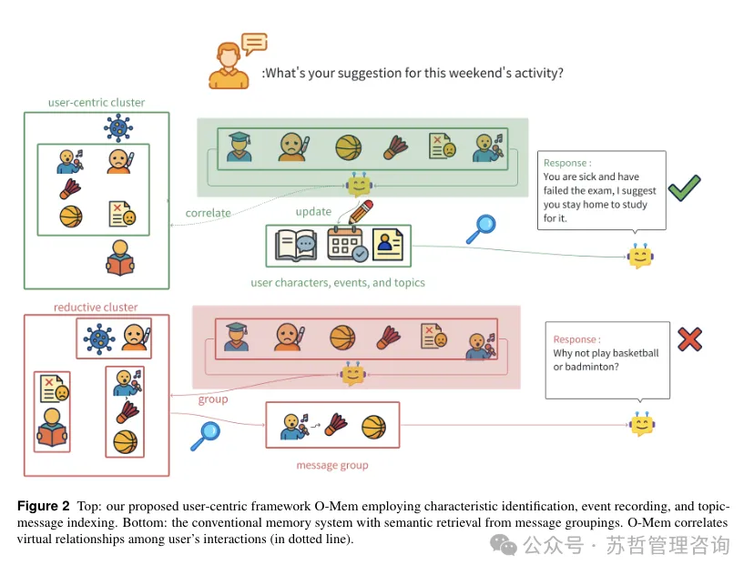
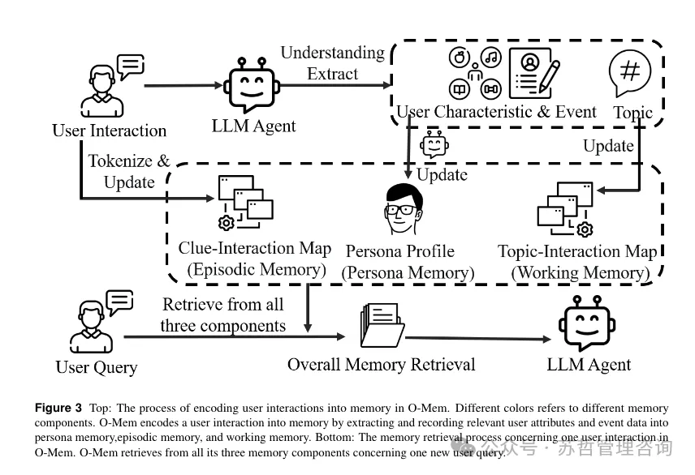
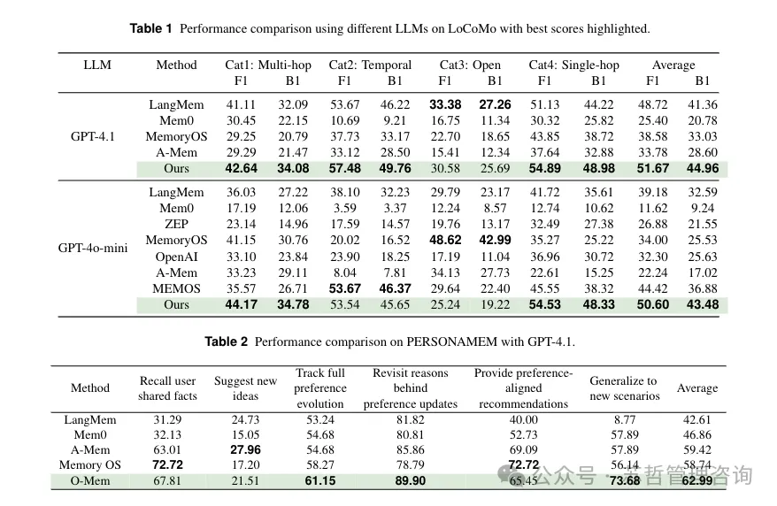
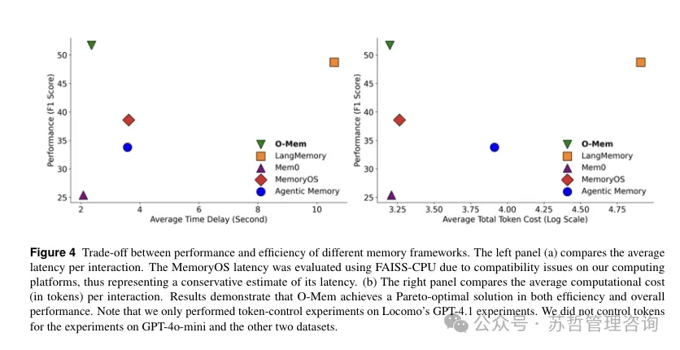
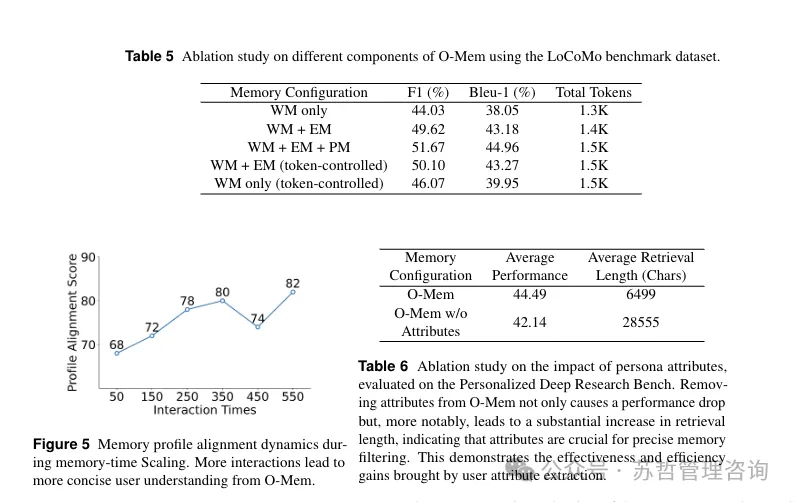

# 1. 资源

OPPO AI Agent Team 提出O-Mem—— 一种基于主动用户画像的新型记忆框架，旨在解决 LLM 驱动智能体在复杂环境中长期交互的上下文一致性与动态个性化难题。它通过从用户主动交互中动态提取和更新用户特征与事件记录，支持人物属性和主题相关上下文的分层检索，在公开基准测试中表现优异：在 LoCoMo 基准上达51.67%（较此前最优 LangMem 提升近 3%），在 PERSONAMEM 上达62.99%（较此前最优 A-Mem 提升 3.5%），同时相比以往记忆框架，在Token消耗和交互响应时间效率上均有提升，为开发高效、类人个性化 AI 助手提供了新方向。

# 2. 原理

一、研究背景与问题提出
LLM 智能体的局限
虽能生成类人响应，但在复杂环境中长期交互中，存在上下文一致性缺失和动态个性化不足的问题，无法持续适配用户需求变化。
传统记忆系统的缺陷
依赖 “语义分组后检索” 模式，易遗漏语义无关但关键的用户信息（如用户健康状况、日程等影响决策的背景）；
分组检索架构会引入检索噪声，导致需从多个分组冗余检索，降低响应效果并增加 LLM 推理的延迟与令牌消耗。
二、O-Mem 框架核心设计
1. 三大核心记忆组件
记忆组件
功能定位
技术特点
Persona Memory（人物记忆）	
存储用户长期属性（
\(P_a\)
）和重要事实事件（
\(P_f\)
），构建整体用户画像
用 LLM 提取属性 / 事件，通过 Add/Ignore/Update 操作维护一致性；用 LLM 增强近邻聚类（构建近邻图、连通分量分析）组织重复属性
Working Memory（工作记忆）	
维护 “主题 - 交互” 动态索引（
\(M_t\)
），捕捉当前交互的主题上下文
自动将交互索引到 LLM 识别的主题下，依赖精准主题检测实现更新
Episodic Memory（情景记忆）	
构建 “线索 - 交互” 关联索引（
\(M_w\)
），实现线索触发式回忆
对交互分词，用独特性过滤器（优先稀有关键词）筛选线索，统计驱动关联检索
2. 记忆构建与检索流程
记忆构建流程
对第
i
次用户交互
\(u_i\)
，用 LLM 提取主题
\(t_i\)
、属性
\(a_i\)
、事件
\(e_i\)
（公式 1）；
更新
\(M_t\)
（新增
\(t_i\)
对应交互
i
）和
\(M_w\)
（新增交互分词后每个关键词对应交互
i
）；
对
\(e_i\)
，用 LLM 决策 Add/Ignore/Update 操作，更新
\(P_f\)
；对
\(a_i\)
，用 LLM 决策操作并通过近邻聚类更新
\(P_a\)
。
记忆检索流程
并行检索：工作记忆检索相关主题交互（
\(R_{working}\)
）、情景记忆检索目标线索交互（
\(R_{episodic}\)
）、人物记忆检索相关属性 / 事实（
\(R_{persona}\)
）；
聚合生成：合并检索结果
\(R=R_{working} \oplus R_{episodic} \oplus R_{persona}\)
，用 LLM 基于
R
和
\(u_i\)
生成最终响应（公式 12）。
三、实验设计与结果
1. 实验基础信息
实验要素
详情
测试基准
1. LoCoMo：300 轮平均对话，含 Multi-hop、Temporal、Open、Single-hop 4 类任务；2. PERSONAMEM：15 类主题用户 - LLM 对话；3. Personalized Deep Research Bench：50 个源自真实用户的深度研究查询
评估指标
1. LoCoMo：F1、BLEU-1；2. PERSONAMEM：多选题准确率；3. Personalized Deep Research Bench：目标对齐、内容对齐（LLM-as-judge 评分）
对比基线
开源框架：A-Mem、MemoryOS、Mem0、LangMem；商业框架：ZEP、Memos、OpenAI（结果源自原文献）
实现细节
嵌入模型：all-MiniLM-L6-v2；硬件：2 台 A800 GPU；LLM 选择：LoCoMo 用 GPT-4.1 和 GPT-4o-mini，其余用 GPT-4.1
2. 核心性能结果
（1）LoCoMo 基准性能（GPT-4.1）
方法
Multi-hop（F1）
Temporal（F1）
Open（F1）
Single-hop（F1）
平均 F1
平均 BLEU-1
LangMem
41.11
53.67
33.38
51.13
48.72
41.36
Mem0
30.45
10.69
16.75
30.32
25.40
20.78
MemoryOS
29.25
37.73
22.70
43.85
38.58
33.03
A-Mem
29.29
33.12
15.41
37.64
33.78
28.60
O-Mem	42.64	57.48	30.58	54.89	51.67	44.96
（2）PERSONAMEM 基准性能（GPT-4.1）
方法
回忆用户共享事实
提出新想法
追踪偏好演变
回顾偏好更新原因
提供偏好对齐建议
泛化到新场景
平均准确率
LangMem
31.29
24.73
53.24
81.82
40.00
8.77
42.61
Mem0
32.13
15.05
54.68
80.81
52.73
57.89
46.86
A-Mem
63.01
27.96
54.68
85.86
69.09
57.89
59.42
MemoryOS
72.72
17.20
58.27
78.79
72.72
56.14
58.74
O-Mem	67.81	21.51	61.15	89.90	65.45	73.68	62.99
（3）效率对比结果
对比对象
F1（%）
平均令牌消耗
峰值内存开销（MB）
延迟（秒）
Direct RAG
50.25
2.6K
33.16
4.01
O-Mem	51.67	1.5K	22.99	2.36
LangMem（最优基线）
48.72
80K
-
10.8
O-Mem	51.67	1.5K
（减少 94%）
-
2.4
（减少 80%）
四、研究价值与意义
技术突破
突破传统 “语义分组检索” 局限，通过主动用户画像和分层检索，实现更精准的个性化响应，解决长期交互的上下文一致性问题。
效率优势
实现性能与效率的帕累托最优，在提升准确率的同时，大幅降低令牌消耗、内存开销和响应延迟，具备实际部署价值。
应用前景
：为开发长期人机交互的个性化 AI 助手提供新范式，可应用于深度研究辅助、日常对话助手等场景。
五、关键问题Q&A
问题 1：O-Mem 相比传统记忆系统（如 LangMem、A-Mem），在核心设计上的差异化优势是什么？
答案：O-Mem 的核心差异化优势体现在设计逻辑和检索机制两方面：

设计逻辑：传统系统（如 LangMem、A-Mem）依赖 “存储交互→语义分组→检索分组” 的被动模式，易遗漏非语义关键信息（如用户健康状况）；O-Mem 采用主动用户画像驱动，从交互中动态提取用户属性、事件并更新，将每次交互作为迭代用户建模的机会，构建动态、多维度的用户上下文，而非依赖静态历史交互嵌入。
检索机制：传统系统多为单一语义检索（如 A-Mem 的链表分组检索、LangMem 的语义分组检索），易引入噪声；O-Mem 支持分层并行检索—— 人物记忆检索用户属性 / 事实（保障个性化根基）、工作记忆检索主题相关交互（保障对话连贯性）、情景记忆检索线索关联事件（保障细节准确性），三者并行聚合后生成响应，兼顾全面性与精准性。
问题 2：O-Mem 在效率（令牌消耗、延迟、内存）上的具体优化效果如何？这些优化源于哪些设计选择？
答案：### 1. 具体优化效果（基于 LoCoMo 基准与 Direct RAG、LangMem 对比）

效率指标
与 Direct RAG 对比
与 LangMem（最优基线）对比
Token消耗
从 2.6K 降至 1.5K（减少 42.3%）
从 80K 降至 1.5K（减少 94%）
响应延迟
从 4.01 秒降至 2.36 秒（减少 41.1%）
从 10.8 秒降至 2.4 秒（减少 80%）
峰值内存开销
从 33.16MB 降至 22.99MB（减少 30.6%）
-
2. 优化源于两大核心设计选择
并行检索架构
不同于 A-Mem 等 sequential（串行）检索（粗粒度到细粒度的级联检索），O-Mem 对三大记忆组件进行一次性并发检索，减少检索步骤耗时，提升整体效率。
精简记忆表征
传统系统（如 MemoryOS）存储原始交互或密集向量映射（每块内存需向量存储，单用户占 30MB），O-Mem 存储蒸馏后的结构化表征（用户属性、主题 - 线索索引），单用户仅需近 3MB 存储；同时，人物记忆的属性聚类减少冗余信息，降低令牌传输与处理成本。
问题 3：O-Mem 在 PERSONAMEM 基准的 “泛化到新场景” 和 “回顾偏好更新原因” 任务中表现突出（分别达 73.68%、89.90%），这反映出其在用户理解上的哪些核心能力？
答：这两项任务的优异表现，集中反映 O-Mem 在用户理解上的动态进化能力和深度归因能力两大核心优势：

动态进化能力（对应 “泛化到新场景” 任务 73.68%）
传统系统（如 A-Mem、MemoryOS）依赖静态历史交互检索，难以适配用户新场景需求（泛化准确率仅 56%-58%）；O-Mem 通过主动用户画像迭代（每次交互更新属性 / 事件，用近邻聚类整合重复属性），构建随交互动态完善的用户认知，能将用户长期偏好（如 “避免剧烈运动”）迁移到新场景（如 “广州篮球活动”），实现场景泛化。
深度归因能力（对应 “回顾偏好更新原因” 任务 89.90%）
传统系统（如 LangMem）仅能检索用户偏好结果（如 “喜欢室内活动”），无法关联偏好更新的触发事件；O-Mem 的情景记忆（Episodic Memory） 记录 “线索 - 事件” 关联（如 “大腿受伤→偏好从户外转向室内”），结合人物记忆的事实记录（“医生建议休息 2 个月”），能精准追溯偏好变化的因果关系，因此在回顾偏好更新原因时准确率显著高于 A-Mem（85.86%）和 LangMem（81.82%）。

# 参考

[1] O-Mem：个性化长期交互自进化智能体全部记忆系统, https://mp.weixin.qq.com/s/7-jtx-EX8XMFl9y1FRKMlw