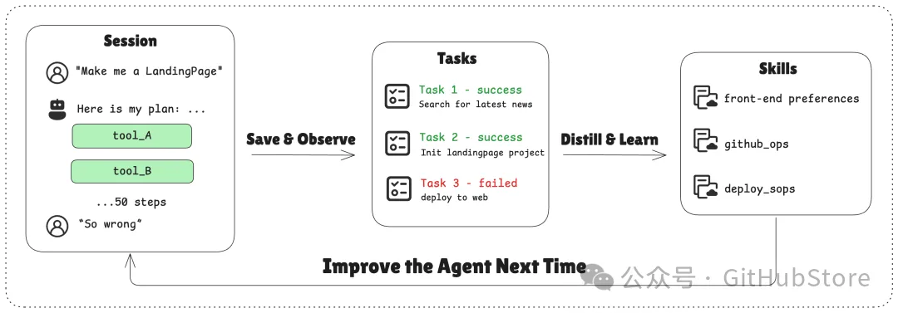

https://github.com/memodb-io/Acontext/blob/main/readme/zh/README.md

Acontext 是一个上下文数据平台，它：

存储 上下文和工件
观察 代理任务和用户反馈。
通过将经验（SOP）收集到长期记忆中，实现代理自我学习。
提供本地仪表板来查看消息、任务、工件和经验。



存储、观察和学习

我们正在构建它，因为我们相信 Acontext 可以帮助您：

构建更具可扩展性的代理产品
提高代理成功率并减少运行步骤
这样您的代理可以更加稳定，并为用户提供更大的价值。

🌲 核心概念
Session - 一个对话线程，支持多模态消息存储。
Task Agent - 后台 TODO 代理，收集任务的状态、进度和偏好。
Disk - 用于代理工件的文件存储。
Space - 一个类似 Notion 的代理 Space，用于存储学习的技能。
Experience Agent - 后台代理，用于提炼、保存和搜索技能。
它们如何协同工作

```text
┌──────┐    ┌────────────┐    ┌──────────────┐    ┌───────────────┐
│ User │◄──►│ Your Agent │◄──►│   Session    │    │ Artifact Disk │
└──────┘    └─────▲──────┘    └──────┬───────┘    └───────────────┘
                  │                  │
                  │         ┌────────▼────────┐
                  │         │ Observed Tasks  │
                  │         └────────┬────────┘
                  │                  │
                  │         ┌────────▼────────┐
                  │         │  Space (learn)  │
                  │         └────────┬────────┘
                  │                  │
                  └──────────────────┘
                  技能指导代理
```

您的代理技能看起来像：

```json
{
    "use_when": "star a repo on github.com",
    "preferences": "use personal account. star but not fork",
    "tool_sops": [
        {"tool_name": "goto", "action": "goto github.com"},
        {"tool_name": "click", "action": "find login button if any. login first"},
        ...
    ]
}
```

代理经验将存储在结构化的 Space 中，包含文件夹、页面和块。例如：

```text
/
└── github/ (folder)
    └── GTM (page)
        ├── find_trending_repos (sop block)
        └── find_contributor_emails (sop block)
    └── basic_ops (page)
        ├── create_repo (sop block)
        └── delete_repo (sop block)
    ...
```

# 参考

[1] 国人打造！效果直逼 Manus！专为 Agent 设计的 Memory 项目, https://mp.weixin.qq.com/s/FHhTUDT9SQxQC-zdFfUpag