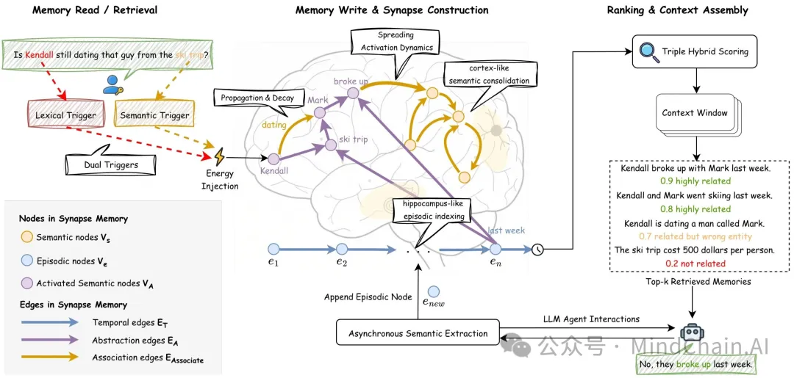

📌 一句话总结：
本工作提出 SYNAPSE，一种受认知科学启发的智能体长期记忆架构，通过“扩散激活（Spreading Activation）”而非纯向量相似度进行检索，显著提升 LLM Agent 在长时序、多跳与因果推理场景下的记忆一致性与鲁棒性。 
🔍 背景问题：
当前主流的 RAG 与智能体记忆方法普遍隐含一个“搜索假设”——历史记忆是否相关，完全由其与当前查询的语义相似度决定。
但在真实对话与长期智能体任务中，关键线索往往语义上不相似、结构上却高度相关（如时间、因果、共现关系），这导致三类核心失败模式：
1️⃣ 语义相似但逻辑无关的“误召回”；
2️⃣ 需要跨事件、跨时间的多跳推理无法完成；
3️⃣ 面对不存在实体或对抗式提问时容易产生“记忆幻觉”。
💡 方法简介：
SYNAPSE 将智能体记忆从“向量库”重构为一个统一的情景–语义图（Unified Episodic-Semantic Graph），并在其上运行类人脑的激活动力学：
双层记忆建模：将每轮对话作为情景节点（episodic），周期性抽象出概念级语义节点（semantic），并通过时间边、抽象边、关联边形成可推理结构；
扩散激活检索机制：查询不再只是“命中相似文本”，而是向图中注入能量，由相关节点沿结构路径传播激活，从而自动唤醒“桥接节点”；
侧抑制 + 时间衰减：通过竞争机制抑制干扰节点，并利用时间衰减保证时间一致性，避免旧记忆污染当前判断；
三信号混合排序：融合语义相似度、激活强度与图结构先验（PageRank），同时兼顾局部上下文与全局重要性；
不确定性感知拒答机制：当整体激活能量不足时主动拒答，从机制层面抑制记忆型幻觉。
📊 实验结果：
在 LoCoMo 长期对话记忆基准上，SYNAPSE 全面刷新 SOTA：
综合 F1 达到 40.5，较强基线提升 +7.2；
多跳推理准确率提升最高 23%，显著缓解“逻辑断裂”问题；
对抗式查询拒答 F1 高达 96.6%，几乎消除记忆幻觉；
平均每次查询仅使用 ~800 tokens，相比全上下文方法节省 95% token 成本，在效率与性能之间建立新的 Pareto 前沿。 
📂 论文原文：
https://arxiv.org/abs/2601.02744
✨ 一句话点评：
SYNAPSE 清晰地指出：**长期智能体记忆的关键不在“存得更多”，而在“能否沿结构想起真正相关的过去”——当检索从相似度升级为动力学推理，Agent 才真正具备了“回忆”的能力。

# 参考

[1] Synapse：让智能体“想起”因果，而不是只“搜到”相似, https://mp.weixin.qq.com/s/idjrW2qwogN0pagcxp1iBw