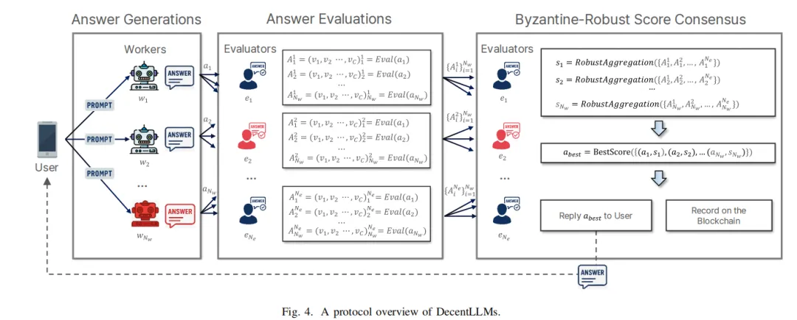
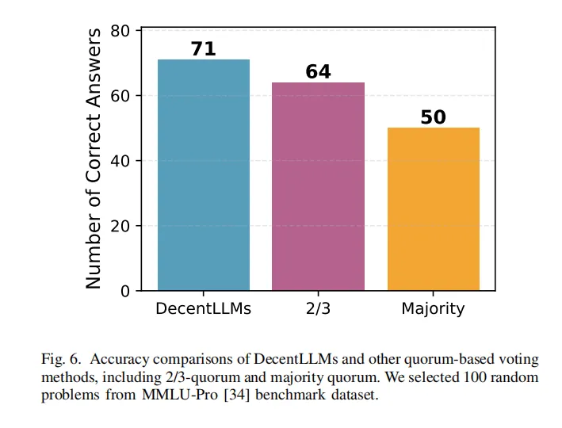
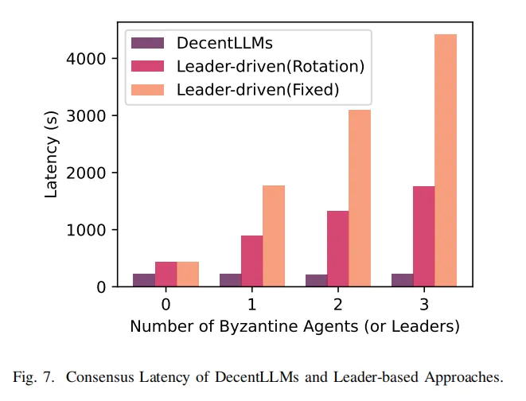
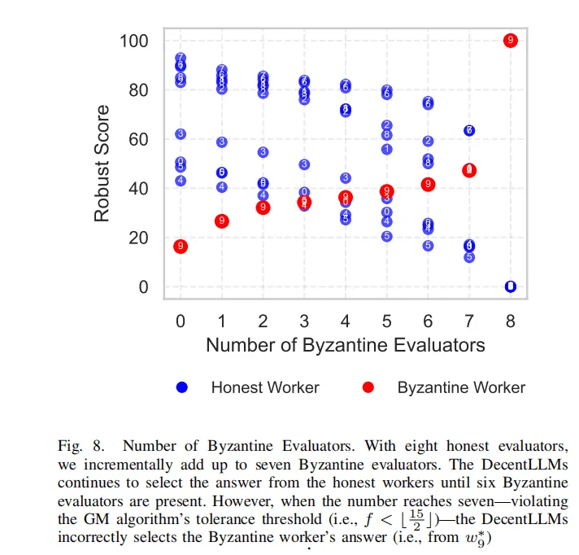

# 1. 资源

论文：Byzantine-Robust Decentralized Coordination of LLM Agents
- Yongrae Jo, Chanik Park 等
- Pohang University of Science and Technology
- https://arxiv.org/abs/2507.14928v1

本文提出了一种名为 DecentLLMs 的去中心化、无领导者的多智能体共识框架。该框架通过让工作智能体并行生成答案、评估智能体独立评分，并使用抗拜占庭的几何中位数算法聚合分数，有效解决了传统领导者驱动方法在面对恶意（拜占庭）智能体时存在的高延迟和答案质量不佳的问题。实验证明，DecentLLMs 在提升答案准确性和保持共识延迟稳定性方面表现卓越，为在对抗性环境中构建安全、高效的 LLM 协作系统提供了新范式。

# 2. 研究目的

本研究聚焦于如何在开放环境中协调多个大型语言模型（LLM）智能体。核心研究内容是设计并实现一个去中心化、无领导者的共识系统，使其能够抵御恶意（拜占庭）行为，同时确保最终输出答案的质量和达成共识的效率，从而替代现有易受攻击的领导者驱动模型。

随着 LLM 多智能体系统被部署到区块链等开放的点对点网络中，它们变得极易受到恶意（拜占庭）智能体的攻击。这些恶意智能体可以故意破坏协作过程，导致系统产出劣质答案或增加共识延迟。现有的抗拜占庭系统大多采用领导者驱动架构，但这本身就是一个弱点，因为攻击者可以集中攻击领导者，从而严重影响整个系统的性能。

- 去中心化共识机制： 传统的拜占庭容错系统多采用领导者驱动的共识协议，这些协议虽然能确保安全性，但存在固有的性能瓶颈和单点故障风险：领导者可能成为攻击目标，且其处理能力限制了整个系统的吞吐量和延迟。为了消除这种中心化依赖，提高系统的弹性和扩展性，DecentLLMs设计了一种无领导者协议。
- 并行答案评估： 在一个多智能体系统中，如果评估过程是串行的或集中式的，将会成为严重的性能瓶颈。通过让所有评估智能体独立且同时对所有提交的答案进行评分，DecentLLMs能够最大限度地利用分布式计算的优势。 这种并行处理机制是实现低延迟共识的关键，使得系统能够快速整合多方意见，并有效缩短了从任务下发到最终共识达成的时间。
- 几何中位数算法聚合评分： 在存在拜占庭智能体的环境中，简单的平均值或多数投票机制很容易被恶意智能体操纵（例如，通过给出极端高分或低分）。几何中位数是一种强大的鲁棒性统计量，它能够有效抑制异常值的影响，即便是少数恶意智能体试图通过提交极其偏离的评分来破坏共识，GM也能提供一个更稳定、更接近真实值的中心趋势。这使得DecentLLMs在面对恶意评分攻击时，能够更准确地识别和选择出最优的答案，从而保证了共识的质量和系统的拜占庭容错能力。

# 3. 解决方案
1. 去中心化架构
   - 工作智能体并行生成： 多个工作智能体并行独立地调用各自的LLM实例生成答案，旨在减少共识延迟并提高答案多样性和质量。即使恶意工作智能体生成错误答案，大量的独立答案增加了系统后期通过评估识别并忽略这些错误答案的几率。
   - 评估智能体独立评估： 多个评估智能体并行独立地对所有工作智能体生成的答案进行质量评估，基于多个维度生成评分向量。评估的独立性防止了恶意评估智能体直接影响其他评估智能体的判断。

2. 拜占庭容错的聚合算法：
   - 几何中值算法：系统采用几何中值算法来聚合评估智能体给出的评分。该算法通过最小化与所有输入评分向量的欧几里得距离之和来确定最优解，从而有效抵御恶意评分对最终结果的操纵，确保选出高质量的答案。GM算法在此发挥核心作用，确保即使在部分评估智能体是拜占庭的情况下（即它们试图通过提供异常分数来操纵结果），最终的聚合分数仍然能准确反映诚实评估者的集体判断，从而保证了最终共识的质量和系统的拜占庭容错能力。

3. 三阶段协议流程：
   - 答案生成： 用户广播问题，工作智能体并行接收并独立生成答案，随后将答案广播给所有评估智能体。
   - 答案质量评估： 评估智能体独立地接收所有答案，并根据预设的质量标准对每个答案进行详细评分，生成对应的评分向量。
   - 拜占庭容错的评分共识：评估智能体之间通过拜占庭可靠广播协议安全地共享各自的评分向量。之后，所有评估智能体独立应用几何中值算法对共享评分进行聚合，最终选择得分最高的答案作为系统的最终输出。

# 4. 实验结果
准确性对比
- 实验目的：比较 DecentLLMs 与传统法定人数投票方法在答案选择上的准确性。
- 实验方法：在 MMLU-Pro 数据集上进行测试，对比 DecentLLMs、2/3 法定人数投票和多数投票三种方法选出正确答案的数量。
- 实验结果：DecentLLMs 的准确率为 71%，显著优于 2/3 法定人数投票（64%）和多数投票（50%）。这证明了通过评估所有可用答案并选择最优者，能够有效提升最终输出的质量。

共识延迟对比
- 实验目的：评估在存在拜占庭领导者的情况下，DecentLLMs 相较于领导者驱动方法的延迟表现。
- 实验方法：模拟在拜占庭代理数量从 0 增加到 3 的情况下，DecentLLMs 与两种领导者驱动（固定和轮换）协议的共识延迟。
- 实验结果：DecentLLMs 的共识延迟始终保持在约 221 秒的稳定水平。相比之下，两种领导者驱动方法的延迟随着拜占庭领导者数量的增加几乎呈线性增长。

拜占庭弹性评估
- 实验目的：验证 DecentLLMs 在面对越来越多恶意评估者时的稳健性。
- 实验方法：在一个包含 8 个诚实评估者的系统中，逐步增加拜占庭评估者的数量（从 0 到 7），观察系统最终选择的答案来源。
- 实验结果：系统成功地选择了诚实工作者的答案，直到拜占庭评估者的数量达到了几何中值算法的容错上限（6个）。当拜占庭评估者数量增加到 7 个，超过容错阈值时，系统错误地选择了拜占庭工作者的答案。这证明了该方法的稳健性是可预测且可靠的。

# 5. 结
本文成功设计并实现了一个名为 DecentLLMs 的去中心化多智能体系统。通过采用无领导者共识方法，让工作智能体并行生成答案，评估智能体利用抗拜占庭的几何中位数算法进行评分和选择，该系统有效克服了传统领导者驱动协议在面对恶意攻击时的高延迟和低答案质量等核心缺陷。实验评估充分证明了 DecentLLMs 在提升答案准确性、共识效率和系统稳健性方面的显著优势，为未来构建安全可靠的去中心化 AI 协作系统提供了重要的理论和实践依据。

# 参考

[1] 多智能体协作的未来！去中心化 LLM 智能体无惧拜占庭，比你想象的更强大、更安全！https://mp.weixin.qq.com/s/jITgo1LXvK5mmxU06g-7Cw