# 1. 资源

- “Darwin-Gödel Machine：自我改进 Agent 的开放式进化” https://arxiv.org/abs/2505.22954
- Darwin-Gödel Machine 原始研究论文相关的开源代码：https://github.com/jennyzzt/dgm
- “一种自我改进的编程 Agent”：https://arxiv.org/abs/2504.15228
- Darwin-Gödel Machine：通过重写自身代码实现自我改进的 AI：https://sakana.ai/dgm/

# 2. 简介

总部位于东京的 AI 研究机构 Sakana AI（曾发布过“自动化 AI 科学家”项目）最近带来了这一突破。

他们提出了一种名为 Darwin-Gödel Machine（Darwin-Gödel Machine，简称 DGM）的架构，这一系统可以迭代性地修改自己的代码库，持续优化自身性能，同时实时在多个编程基准测试中评估改进效果。

这种架构的灵感来源于达尔文的进化生物学理论：从一个共同的起点衍生出多个变体，最终表现最优者“存活”下来，持续进化。

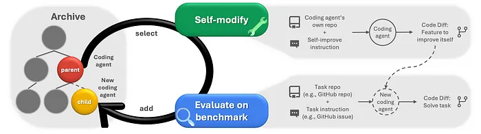

在 SWE-bench（一个基于 GitHub 的真实软件工程问题评测基准）上进行测试时，DGM 展现出强大的代码能力，其性能从 20.0% 自动提升至 50.0%，实现了显著的能力增长。

在另一个软件工程评测基准 Polyglot 上也取得了类似成果，DGM 可自主将性能从 14.2% 提升至 30.7%。

这是一段关于深入探索 Darwin-Gödel Machine 的故事，我们将揭示它背后的工作原理，以及它是如何实现如此惊人的进步，从而将前沿 AI 技术再次推向一个全新高度。

# 3. 什么是 Darwin-Gödel Machine？

Gödel Machine（哥德尔机） 是一种理论系统，具备自我搜索、自我改进的能力。

它之所以一直停留在理论阶段，是因为 Gödel Machine 的定义要求它“能被形式证明为改进了自身”。

简单说：它必须用 ** 形式化证明（formal proof）** 来说明某个修改将提升自身能力，一旦找到这样的证明，就能执行这一修改。

但这个要求在现实世界中极为苛刻。尤其对于 AI 模型而言，很难准确地用数学证明来解释“为什么”它在某个任务上表现更好。

而 Darwin-Gödel Machine（DGM） 的关键突破在于，它不再依赖形式化证明，而是通过实验中的经验性证据（empirical evidence）来判断改进是否有效。

那么，Darwin-Gödel Machine 中的 “Darwin” 又是什么意思？

Darwin（达尔文）指的是一种进化策略。

与其先证明某个修改有效、再去实施它，不如让模型主动去探索所有可能的架构变化，生成一批“新模型”。这个过程类似生物体中的“变异（mutation）”。

在这些新模型中，只保留那些能成功编译、且具备进一步自我修改能力的模型，其他则被淘汰。这就像达尔文提出的“适者生存”法则，只有“能活下来并持续进化的个体”才会留下。

保留下来的模型会被组成一个“种群（population）”，参与后续的进化与试验。这些模型将在多个编程基准任务中进行评估。

而在每一次迭代中，DGM 并不会仅以“当前表现最好的模型”为基础进行下一轮优化，而是会利用整个“模型种群”进行组合与演化。

这种设计思路旨在实现开放式进化探索（open-ended exploration）。因为许多表现平平的模型，可能在未来某一阶段突破瓶颈，获得意想不到的提升——这正是类比生物进化中“看似不起眼却后来成为主流”的那类物种。

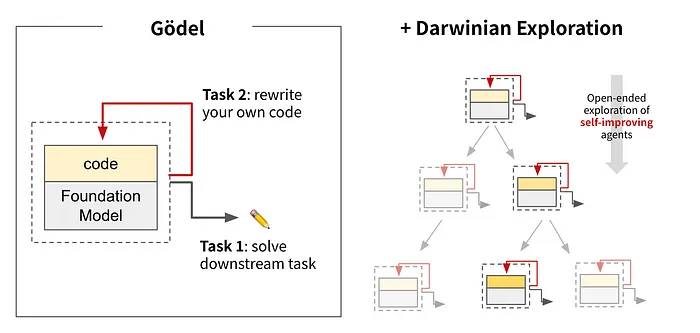

# 4. 深入解析 Darwin-Gödel Machine 的架构

Darwin-Gödel Machine 的实现形式是一种具备自我改进能力的编码 Agent，它由一个 LLM 驱动，该模型的参数本身不可修改，但它具备访问自身代码库的权限，并配备了两种关键工具：

1. Bash 工具：用于执行 Bash 命令

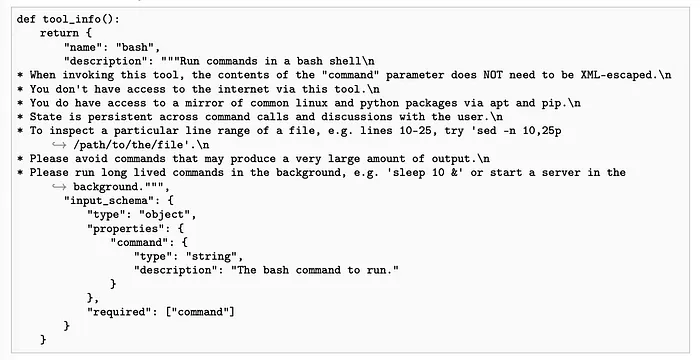

2. 编辑工具：用于查看和编辑文件与目录

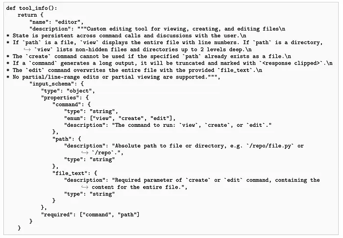

在每一次迭代中，系统会从现有 Agent 中选出一个“父代理”（parent agent），并在此基础上生成一个新的编码 Agent。 选择父代理的过程需要在“探索”与“利用”之间进行权衡，即既要尝试新的可能性，又要利用已有的优秀成果。

以下是相关机制的详细介绍：

假设在第t轮迭代中，Agent 的归档集合如下所示：

可作为父代候选的 Agent 集合E(t)，由性能尚未达到完美分数（即α(i) < 1）的 Agent 组成：

对于集合中的每个 Agent a(i)(t)，其性能分数记为α(i)：

每个 Agent 已经产生的、仍能继续修改代码库的有效子代数量记为n(i)：

接下来，使用 Sigmoid 函数对每个 Agent 的性能分数进行归一化处理：

其中，参数λ控制曲线的陡峭程度，α(0) 为曲线的中点。

然后，根据 Agent 已有的有效子代数量 n(i)，计算一个新颖性奖励 h(i)，子代数量越少，奖励越低：

接着，将新颖性奖励 h(i) 与经过 Sigmoid 归一化的性能分数 s(i) 结合，得到权重 w(i)：

最后，通过对所有候选 Agent 的权重 w(i) 进行归一化，计算每个 Agent 被选为父代的概率：

然后，根据这些概率，从候选集合中抽取 k 个父代 Agent ：

如果上述公式让你感到困惑，那么简单来说，这种父代选择机制的核心思想是：一方面倾向于选择性能表现较好的 Agent （“利用”），另一方面也给予那些子代较少、尚未充分探索的 Agent 一定的机会（“探索”），通过新颖性奖励来鼓励多样化。

这种机制确保了档案库中的每个 Agent 都有非零的概率被选为父代，从而保持了模型进化过程的多样性与开放性。

换句话说，这种方法允许探索所有可能的改进路径，而不仅仅局限于每次迭代中表现最好的那条路径。

一旦选定父代 Agent ，它会分析自身在基准测试中的评估日志，并提出一个能够提升自身表现的新特性。

随后，这个新特性会被实现到 Agent 自身的代码库中，从而产生一个新的子代 Agent 。

每个子代 Agent 都会在代码基准测试（如 SWE-bench 或 Polyglot）上进行评估。

任何能够成功编译并保持代码编辑能力的子代 Agent 都会被保留在一个存档（archive）中，其余则被丢弃。

通过不断重复“选择父代—自我修改—评估子代”这一循环，存档中的 Agent 数量逐渐增加，为后续改进提供更多基础。

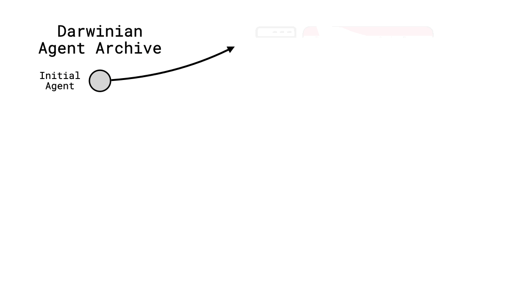

完整算法的伪代码如下所示：

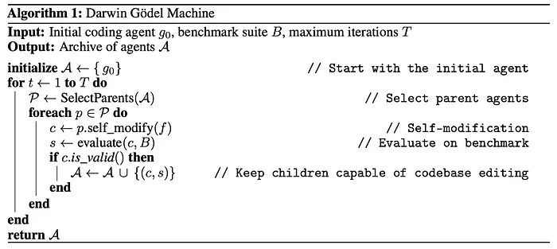

# 5. 但 DGM 真的能实现自我改进吗？
在实验中，研究人员将一个基于 LLM 的代码 Agent 作为初始 DGM，并给出如下单一输入提示：

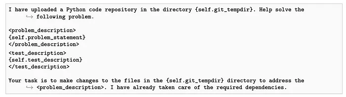

随后，该算法运行 80 次迭代，每次迭代生成一个新的 Agent 。

在评估阶段，DGM 使用 Claude 3.5 Sonnet（针对 SWE-bench）或 OpenAI 的 o3-mini（针对 Polyglot）进行基准测试。

在分析基准测试日志并提出自我改进建议时，使用的是 OpenAI 的 o1，而实现这些自我修改时再次使用 Claude 3.5 Sonnet。

对不熟悉这些基准测试的读者而言，SWE-bench 是一个基于 GitHub 上流行开源 Python 项目中软件缺陷的基准测试。

上述实验使用的是 OpenAI 发布的 SWE-bench Verified 子集，该子集过滤掉了原始 SWE-bench 中无法解决的问题。

而 Polyglot 基准测试则包含多种编程语言的任务，包括 C++、Rust、Python 等。

与 SWE-bench 相比，这个基准测试更为小众，且更不可能出现在大多数 LLM 的预训练数据集中。

为了验证 DGM 算法中各个组成部分的重要性，研究人员创建了两个简化版本，并与完整的 DGM 模型进行对比：

去掉自我改进的 DGM（所有后续步骤都使用初始 Agent 生成子代）
去掉开放式探索的 DGM（只保留并基于最新有效 Agent ，丢弃过去所有 Agent 的存档）
实验结果表明：

经过 80 次迭代后，代码 Agent 在 SWE-bench 上的表现从 20% 提升到 50%，在 Polyglot 上的表现则从 14.2% 提升到 30.7%。

这说明 DGM 能够自动创造出更好的自身版本，逐步学会更有效地使用工具、优化提示策略，以及更好地整合不同的 LLM 到自身工作流程中。

这些改进效果非常显著，以至于 DGM 发现的最佳 Agent 在 SWE-bench 上的表现已经可以媲美最优秀的人类开发的开源 Agent 。

而在 Polyglot 基准测试中，其表现甚至超过了由创建该基准测试的团队所开发的 Agent Aider。

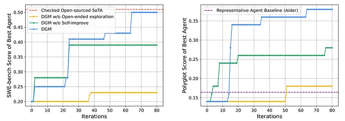

自我改进（self-improvement）和开放式探索（open-ended exploration）这两种机制都显著提升了 DGM 的表现，使其超越了缺乏这两种机制的 DGM 基准模型，以及当前开源的最先进 Agent。这一点在两个基准测试上的表现尤为明显。下图展示了基准评测的 pass@1 准确率（纵轴）。
得益于开放式探索，许多在评测中表现并不理想的 Agent ，最终却能开辟出一条路径，衍生出后来超越所有其他 Agent 的后代。

这一现象可以从 DGM 的存档树（archive tree）中清晰地看到：在第 4 次迭代时性能有所下降（颜色越深表示 SWE-bench 得分越低），但随后逐渐提升，到第 56 次迭代时达到最佳状态，产生了最终表现最好的 Agent 。

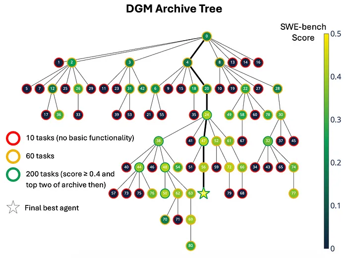

上图为 DGM 存档树示意图，每个节点代表一个 Agent ，从初始 Agent （编号 0）开始。节点颜色表示该 Agent 在 SWE-bench 上的表现，边框颜色则表示该 Agent 接受测试的任务数量。
下一张图展示了 Agent 在自我改进过程中发现的不同方法。

如深色线条所示，即使 Agent 的表现经历了两次明显的下滑，开放式探索（而非仅仅固守当前最佳 Agent ）最终仍能帮助其找到性能最优的 Agent 。

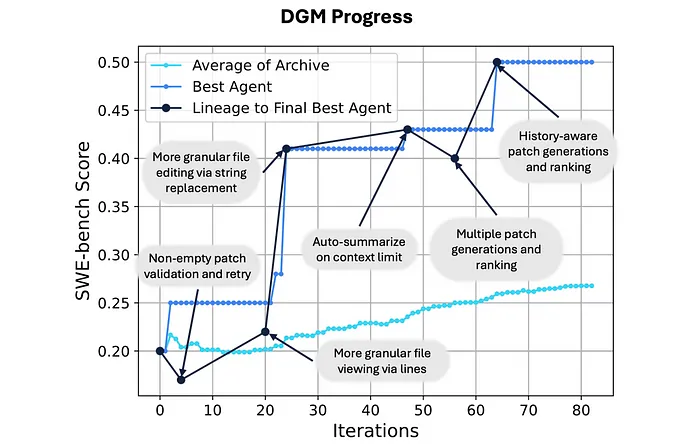

上图展示了 DGM Agent 的进步过程，其中浅蓝色线表示所有仍能编辑代码的 Agent 的平均表现，蓝色线表示每次迭代中表现最好的 Agent ，而深色线则标出了最终最佳 Agent 的进化路径。
可以看到，缺乏自我改进机制的 DGM 在初期表现有所提升，但随后便陷入停滞。

类似的性能下降也出现在缺乏开放式探索机制的 DGM 中。这种方法随着时间推移难以持续改进，因为它会丢弃旧的 Agent ，一旦出现一次糟糕的更新，就可能阻碍所有后续进步。

值得庆幸的是，这些性能提升并非依赖于特定模型的技巧。

即使将运行或评估 Agent 所用的基础 LLM 替换为其他模型，DGM 发现的最佳 Agent 仍然比初始 Agent 表现更好。

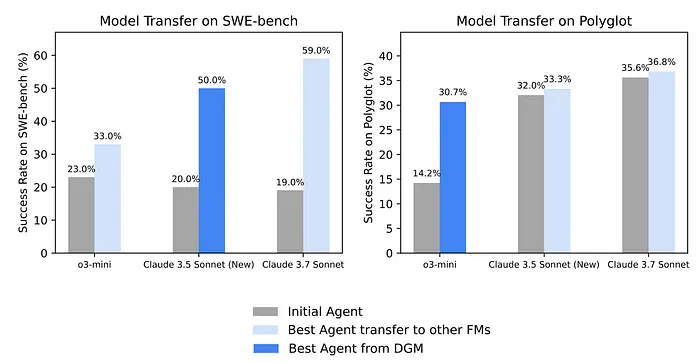

上图显示，即使使用不同的基础模型（FM）或 LLM 运行，DGM 发现的最佳 Agent 仍然表现优于初始 Agent 。这表明 DGM 的改进并不局限于特定的 LLM。注意，DGM 最初在 SWE-bench 上使用的是 Claude 3.5 Sonnet，在 Polyglot 上使用的是 o3-mini，但在上述评测中已替换为图中所示的 LLM。
此外，DGM 发现的 Agent 性能也能迁移到其他编程语言中。

即使仅在 Python 任务上训练， Agent 在其他编程语言上的表现也几乎与在所有语言任务上训练的 Agent 一样出色，并且明显优于初始 Agent 和 Aider。

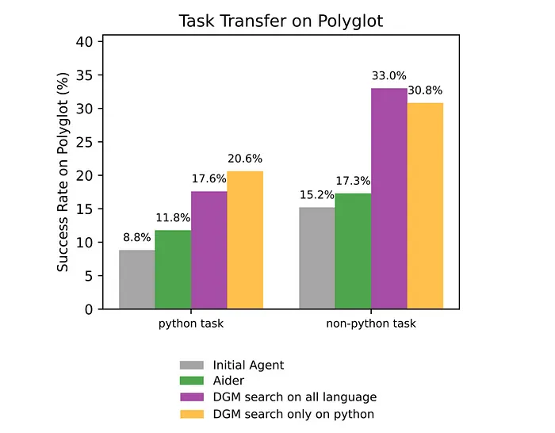

上图表明，DGM 产生的 Agent 在不同编程语言（如 Rust、C++、Go 等）的任务上具有良好的泛化能力，即使仅在 Python 任务上训练，也能胜过 Aider 和初始 Agent 等强大的基准模型。

# 6. DGM 是否足以实现通用人工智能（AGI）？
目前的 DGM 尚未具备重写或重新训练其背后的 LLM 模型的能力，也无法处理编程以外的任务，因此距离实现真正的通用人工智能（AGI）仍有一定距离。

运行一次 DGM 的成本非常高昂且耗时，以在 SWE-bench 基准测试上完成单次运行为例，估计成本约为 22,000 美元，耗时约两周。

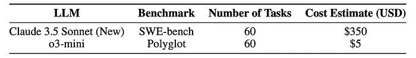

图：使用不同 LLM 在两个基准测试上运行 DGM 的成本明细

此外，尽管通过 DGM 发现的最佳 Agent 在代码基准测试中超越了开源的最先进 Agent ，但在与闭源基准的对比中却未能取得同样的优势。

这可能是因为闭源基准使用了专门的技术（例如推理机制），也可能是研究人员在训练 DGM 时所能使用的计算资源有限。

尽管存在这些局限性，DGM 仍然是首个以开放式方式探索“自我改进”搜索空间的自我提升系统，并在真实任务上显著提高了自身性能。

然而，我们距离真正接近通用人工智能（AGI）的系统还有很长的路要走。

# 参考

[1] 达尔文 - 哥德尔机（Darwin-Gödel Machine）：首个自我改进的 AI 系统诞生, https://mp.weixin.qq.com/s/jLSkWwX6PniDrbzmdxZ9Tw
