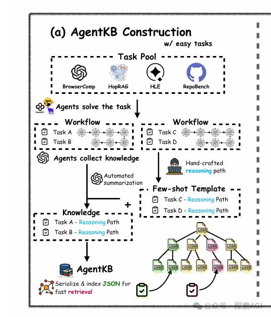
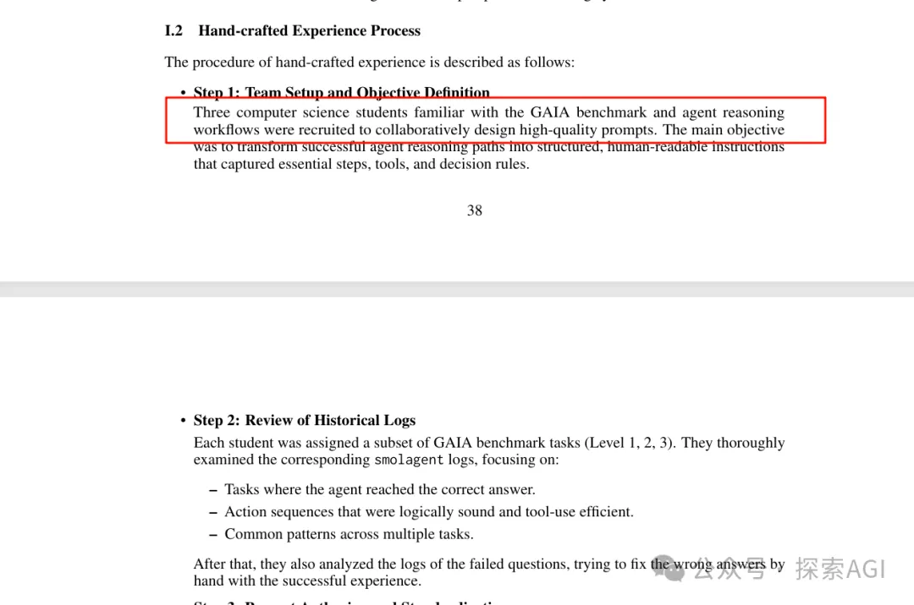
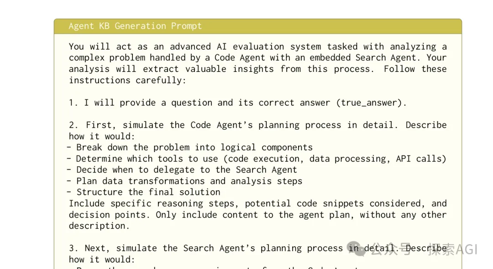
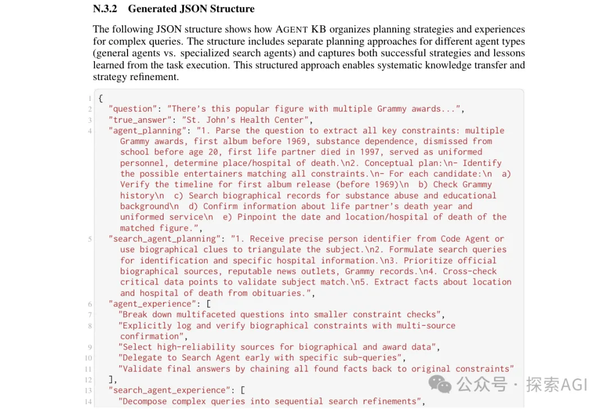
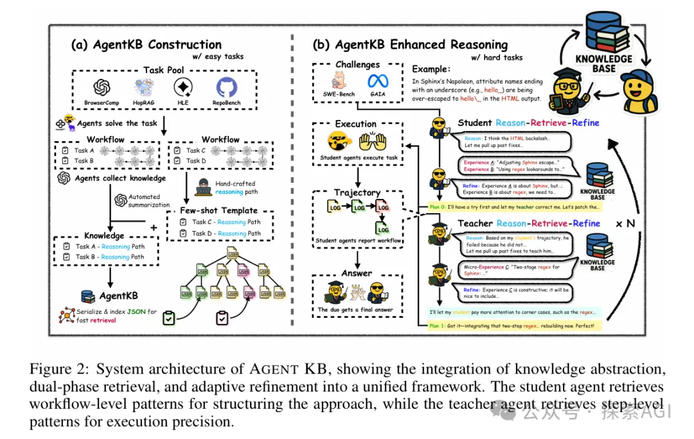
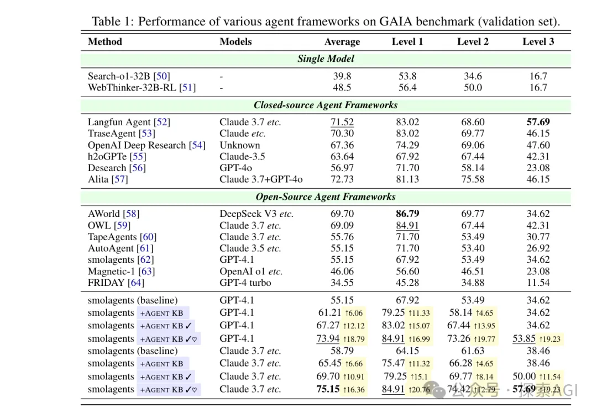

# 1. 资源

- GitHub地址: https://github.com/OPPO-PersonalAI/Agent-KB
- Paper地址：https://arxiv.org/pdf/2507.06229

一个优秀的 Agent 系统，最重要的能力是：如何让它能随着用户使用越多，变得越来越强。 这是 Agent 时代的数据飞轮。

最近，由谷歌DeepMind、微软研究院、OppO 等机构的大佬们开源了 AGENT KB 项目。

表面上看，它提供了一套酷炫的“师徒模式”工作流，能让Agent性能暴涨。

但是，这个项目真正的颠覆性，不在于那个工作流，而在于它提出并实现了一个更核心的概念：一个可以被所有Agent继承、分享和共同建设的“AI经验库”。

今天我们就来深度拆解一下，为什么说“沉淀经验”才是AI Agent的下一个进化奇点。

# 2. 真正的核心资产
过去，我们评估一个Agent，看的是它的实时推理能力。

但是如果一个Agent系统面对重复的错误，重复犯错，始终鼓励搜索，经验无法传承。

那似乎在未来会丧失核心竞争力。

一个 可积累、可复利的知识资产库，可以决定整个Agent生态的能力上限。但最关键的问题是，这个“经验库”如何构建？又如何让它比原始日志更有价值？

# 3. 从“原始日志”到“结构化经验”的构建流程

这部分我觉着是 AGENT KB 项目的精华所在。他们设计了一套人工指导下的AI自动化提炼流程。

整个过程大致分三步：

第一步：收集海量执行日志
系统首先从各种来源（如网页浏览、代码修复等任务）收集了海量的原始Agent执行日志。这些是未经加工的埋点数据，包含了成功和失败的各种细节。

第二步：注入专家智慧
研究人员并没有直接让AI去学习这些杂乱的日志。相反，他们先手动分析了一部分失败的案例，总结出常见的错误模式和正确的解决方法。

构建出一份人工总结的“避坑指南”，做成高质量的 few-shot 范例。

这个阶段是人工介入的，找了一些计算机专业熟悉GAIA和Agentic的学生，完成这个步骤。

第三步：大规模生产经验

有了“避坑指南”之后，他们用LLM作为“经验生成器”。这个生成器会读取一条原始日志，同时参考那些few-shot 范例，然后自动提炼和抽象，最终输出一条结构化的、可复用的经验。

原文有非常详细的prompt，而且代码是开源的。

输出的经验不是简单的文本，而是一个包含 {问题模式, 解决方案, 上下文, 任务难度} 等字段的结构化数据。

通过这套流程，AGENT KB 实现了高质量经验的规模化生产，为构建一个真正有用的“集体大脑”奠定了基础。

# 4. 经验库应用
好，现在我们知道了这个经验库是如何构建的，那么它又是如何被高效利用的呢？

原文本质上是一个经过精心设计的、用来高效利用这个“经验库”的Multi-Agent应用范式。

这里的设计比较复杂，有点偏炼丹，不是特别具备参考意义，所以简单说一下。

它把对知识的调用分成了两个层次：

学生Agent： 接到新任务时，从“经验库”里检索宏观的、流程性的经验，用来搭建整体方案。比如说，“解决这类问题大概分几步，每一步用什么工具”。
老师Agent： 在学生执行遇到困难时介入，从“经验库”里检索微观的、针对性的经验，进行精确指导。比如说，“处理某个API时，参数要保留三位小数”、“遇到这个报错时，应该先检查网络连接”。

# 5. 四、1+1 > 2 的性能飞跃
当“可进化的经验资产”遇上“高效的执行引擎”，结果就是惊人的性能飞跃。

论文中的实验数据非常有说服力：

在最具挑战性的 GAIA Level 3 任务上，Claude-3.7 的成功率从 38.46% 飙升至 57.69%！
在 GAIA 中等难度任务上，GPT-4.1 的成功率也从 53.49% 提升到了 73.26%！

这证明了，Agent能力的巨大提升，来源于“高质量经验资产”和“高效执行引擎”的协同效应。

# 6. 最后

AGENT KB这个项目，给我们带来的最大启发，还是如何构建出可以持续沉淀、不断进化的结构化经验库。

这可能才是AI Agent持续进化的关键一步。

# 参考

[1] 性能暴涨50%！谷歌、微软、OPPO 联手开源Agent “经验炼金术”, https://mp.weixin.qq.com/s/DyCFQtNqdNdIFdUZwOSyDw