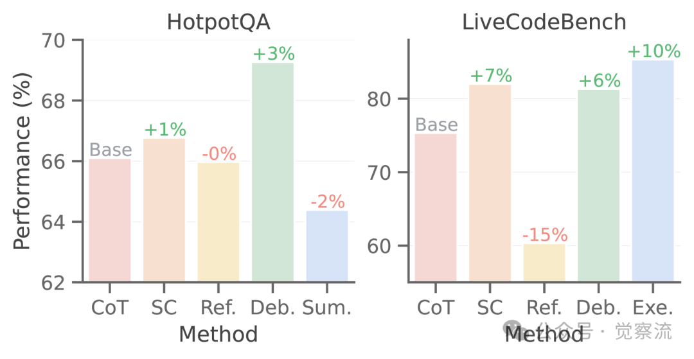

# 1. 资源

Multi-Agent Design: Optimizing Agents with Better Prompts and Topologies.

https://arxiv.org/html/2502.02533v1

通过自动化优化prompt和拓扑结构，Mass 框架显著提升了多智能体系统的性能。优化后的多智能体系统在数学问题求解任务中，准确率达到 78.8%，在多跳问答任务中 F1 分数达到 74.3%，显著优于其他方法。Mass 框架为复杂任务的解决提供了新的思路。

# 2. 多智能体系统的设计挑战

Mass 框架示意图
多智能体系统（MAS）的设计并不简单，它涉及到很多复杂的问题。首先，智能体的功能需要通过 prompt 来定义，这些 prompt 就像是给智能体下达的指令，告诉它们该做什么、怎么做。但是，设计一个好的 prompt 可不是件容易的事儿，因为智能体对 prompt 非常敏感，稍微改一下prompt，性能可能就会有天壤之别。这就像是给一个人下指令，如果指令不清楚或者有歧义，那这个人可能就会做得乱七八糟。所以有句戏言，prompt是智能体本体，哈哈

其次，智能体之间的拓扑结构（topologies）也很重要。拓扑结构就像是智能体之间的连接方式，决定了它们怎么协作、怎么交流。不同的拓扑结构会对系统的整体性能产生很大的影响。比如说，有的拓扑结构可以让智能体们并行工作，有的则可以让它们串行工作。这就像是在一个团队里，有的人负责不同的任务，有的人则需要按照一定的顺序来完成任务。

# 3. Mass 框架：自动化优化多智能体系统

不同优化方法的性能对比

为了解决这些设计挑战，研究者们提出了一个叫 Mass 的框架。这个框架的核心思想是通过自动化的方式来优化prompt和拓扑结构，从而提升多智能体系统的性能。Mass 框架分为三个阶段：

1. 块级提示词优化（Block-level Prompt Optimization）：在这个阶段，研究者们会对每个智能体的功能prompt进行优化。他们会先给每个智能体一个初始的prompt，然后通过一些优化算法来调整prompt，让智能体在特定任务上的表现更好。这就像是给每个人一个初始的任务指令，然后根据他们的表现来调整指令，让他们能更好地完成任务。具体步骤如下：

• 初始智能体优化：对初始智能体 a0 进行提示优化，使用提示优化器 𝒪 生成优化后的提示 a0*。

a0* = 𝒪𝒟(a0)

其他智能体优化：对设计空间中的其他智能体模块 ai 进行优化，条件是已优化的初始智能体 a0*。
ai* = 𝒪𝒟(ai | a0*)
• 计算影响力：存储每个优化后的智能体模块的验证性能，并计算其相对于初始智能体的影响力 Iai。
Iai = ℰ(ai*) / ℰ(a0*)
2. 工作流拓扑优化（Workflow Topology Optimization）：在这个阶段，研究者们会对智能体之间的拓扑结构进行优化。他们会尝试不同的拓扑结构，看看哪种结构能让智能体们协作得更好。这就像是在一个团队里，尝试不同的人员安排和协作方式，看看哪种方式能让团队的效率更高。具体步骤如下：

• 选择概率计算：根据影响力 Iai 计算每个智能体模块的选择概率 pa。
pa = Softmax(Iai, t)
• 拓扑结构搜索：在设计空间中搜索有效的拓扑结构，拒绝无效配置，并限制预算 B。
𝒲c ← (ai*(⋅), ai+1*(⋅), ...)
• 存储和评估：存储每个拓扑结构的评估结果，并提出新的拓扑结构进行评估。
ℰ𝒟(𝒲c)
• 选择最佳拓扑：在所有评估的拓扑结构中选择性能最佳的拓扑结构 𝒲c*。
𝒲c* = argmaxc∈𝒞 ℰ𝒟(𝒲c)
3. 工作流级prompt优化（Workflow-level Prompt Optimization）：在这个阶段，研究者们会对整个工作流中的prompt进行进一步优化。他们会根据智能体之间的协作情况，调整prompt，让智能体们能更好地理解彼此的角色和任务。这就像是在一个团队里，根据每个人的工作情况，调整任务指令，让每个人都能更好地发挥自己的作用。具体步骤如下：
 

全局提示优化：对最佳拓扑结构 𝒲c* 进行提示优化，生成最终优化的多智能体系统 𝒲*。

𝒲* = 𝒪𝒟(𝒲c*)

Mass 优化过程示例

# 实验结果：Mass 框架的显著优势

不同拓扑结构的性能对比

研究者们在多个任务上对 Mass 框架进行了实验，包括数学问题求解、多跳问答、代码生成等。实验结果显示，Mass 优化后的多智能体系统在各项任务中的表现都优于现有的手动设计和自动化设计方法。

比如说，在数学问题求解任务中，Mass 优化后的系统准确率达到了 78.8%，显著高于其他方法。在多跳问答任务中，Mass 优化后的系统也表现出色，F1 分数达到了 74.3%。这些结果表明，Mass 框架能够显著提升多智能体系统的性能，为复杂任务的解决提供了有力支持。

 

Mass 优化阶段的性能变化

# 未来展望：多智能体系统的优化与发展

Mass 框架的提出，为多智能体系统的设计与优化提供了新的思路。通过自动化优化prompt和拓扑结构，Mass 框架不仅提升了系统的性能，还降低了设计的复杂性。未来，随着研究的深入，Mass 框架有望在更多领域得到应用，为复杂任务的解决提供更加高效和智能的解决方案。

比如说，在自动驾驶汽车中，多智能体系统可以用来协调车辆之间的通信和协作，从而提高行驶的安全性和效率。在智能客服中，多智能体系统可以用来处理复杂的客户问题，提供更加精准和高效的服务。这些应用场景都对多智能体系统的设计和优化提出了更高的要求，而 Mass 框架正好可以满足这些需求。

# 参考

[1] 多智能体系统优化新突破：Mass 框架引领智能协作新思路, https://mp.weixin.qq.com/s/I6Ytuda1-EvktpOiS0B9rA