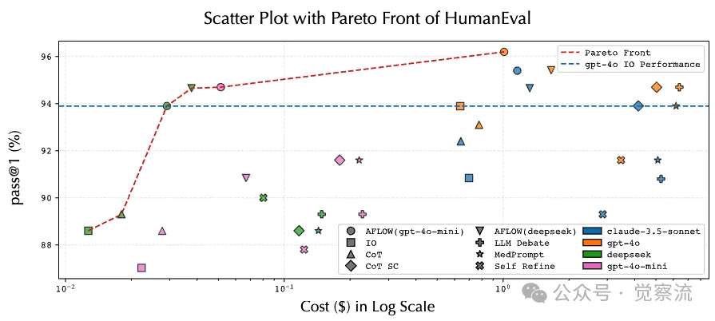

# 1. 资源

- AFlow: Automating Agentic Workflow Generation
  - https://arxiv.org/pdf/2410.10762
- MetaGPT
  - https://github.com/geekan/MetaGPT/blob/main/examples/aflow/README.md 

在AI的世界里，工作流的优化一直是个难题。但如今，AFLOW的出现为我们带来了新的方法。它不仅能够自动优化工作流，还能让小型模型在特定任务上超越大型模型，同时显著降低推理成本。AFLOW通过蒙特卡洛树搜索（MCTS）技术，系统地探索和优化LLM的工作流。在多个基准数据集上的实验结果表明，AFLOW能够自动发现和优化工作流，显著提高了任务执行的性能。

# 2. 问题

大型语言模型（LLM）已经成为解决复杂任务的强大工具。无论是代码生成、数据分析，还是决策制定和问题解答，LLM都展现出了惊人的潜力。然而，要充分发挥这些模型的能力，背后需要精心设计的工作流（workflow）来指导它们的行动。简单来说，工作流就像是给AI下达的一系列详细指令，告诉它如何一步步完成任务。

但问题来了：设计这些工作流需要一定的人力和时间，这严重限制了LLM在新领域的应用速度和效率。为了解决这个问题，研究人员们在探索如何自动化生成和优化这些工作流。一项名为AFLOW的研究成果引起了关注。它通过一种创新的方法，让AI能够自动探索和优化工作流，极大地提高了效率和性能。

# 3. 原理

**AFLOW是什么？**

AFLOW（Automated Flow Optimization）是一个基于蒙特卡洛树搜索（Monte Carlo Tree Search，MCTS）的框架，专门用来自动化生成和优化AI工作流。它的核心思想是将工作流表示为一系列相互连接的节点（每个节点代表一个LLM的操作），并通过代码来定义这些节点之间的逻辑关系和依赖性。这样一来，整个工作流就变成了一个巨大的搜索空间，AFLOW的任务就是在这个空间中找到最优的工作流配置。

**AFLOW工作原理**

AFLOW的核心目标是通过自动化的方式，优化大型语言模型（LLM）的工作流。它将工作流优化问题重新定义为一个搜索问题，并利用蒙特卡洛树搜索（MCTS）算法来高效地探索和优化工作流。以下是AFLOW工作原理的详细步骤：

1. 问题定义与初始化
    在AFLOW中，工作流被表示为一系列的节点（Node），每个节点代表LLM的一个操作，节点之间的边（Edge）定义了这些操作之间的逻辑关系和依赖性。例如，一个节点可能包含以下参数：

   - 模型（Model）：指定调用的LLM。
   - 提示（Prompt）：输入给LLM的任务描述。
   - 温度（Temperature）：控制LLM输出的随机性。
   - 输出格式（Format）：如JSON、XML等。

    初始化阶段，AFLOW从一个简单的模板工作流开始，这个模板提供了一个基本的框架，包括LLM节点的调用和预定义的操作符（Operator）。这些操作符是预定义的节点组合，代表常见的智能体操作，例如“生成（Generate）”、“审查（Review）”、“投票（Ensemble）”等。

2. 蒙特卡洛树搜索（MCTS）的四个核心步骤
   AFLOW通过MCTS算法迭代优化工作流，主要包括以下四个步骤：

  （1）选择（Selection）

   在选择阶段，AFLOW使用“软混合概率选择机制”来选择一个节点进行扩展。这种机制结合了均匀概率分布和基于分数的加权概率分布，以平衡探索（探索新的可能性）和利用（利用已知的有效路径），避免陷入局部最优解。具体公式如下：
    
   

   （2）扩展（Expansion）
    在扩展阶段，AFLOW使用LLM作为优化器，根据选定节点的经验生成新的工作流。优化器会根据现有工作流的执行结果，调整节点的提示词（Prompt）或修改节点之间的连接关系（如添加、删除或调整边）。例如，优化器可能会尝试为某个节点添加一个“审查”操作符，以提高工作流的准确性和可靠性。

   （3）评估（Evaluation）
    生成新的工作流后，AFLOW会直接执行该工作流，并通过评估函数计算其性能分数。为了获得更准确的反馈，AFLOW会在验证集上多次运行工作流，计算平均分和标准差。评估函数的选择取决于任务类型，例如：

   - 对于数学问题求解任务，评估函数可能是解题的准确率。
   - 对于代码生成任务，评估函数可能是代码的准确率或通过率。
  
   （4）反向传播（Backpropagation）
   评估完成后，工作流的性能信息会被反向传播到MCTS的树结构中，用于更新节点的得分，并指导未来的搜索迭代。如果某个新生成的工作流表现更好，其对应的节点和路径会被赋予更高的分数，从而在后续迭代中被优先选择。

    

3. 终止条件
为了避免在优化达到极限后，继续执行不必要的迭代，AFLOW设定了一个早期停止机制。如果在连续几轮中，分数优先的前k个工作流没有显著提升，则认为优化已经收敛，迭代过程会自动停止。

4. 如何评估一个工作流是否优化到极限？
AFLOW通过以下机制判断工作流是否优化到极限：

- 早期停止机制：如果在连续几轮中，分数优先的前k个工作流没有显著提升，则认为优化已经收敛，迭代过程会自动停止。
- 性能评估：通过多次运行工作流并计算平均性能分数，确保结果的稳定性和可靠性。如果性能分数在多次迭代中保持稳定，则说明工作流已经接近最优。
5. 实现AFLOW的关键点
如果你希望自己实现AFLOW，以下是几个关键点：

1. 定义节点和操作符
根据你的任务需求，定义好节点的参数（如模型、提示、温度、输出格式）和操作符（如生成、审查、投票等）。这些是构建工作流的基础。
2. 搭建MCTS框架
实现MCTS的四个核心步骤：选择、扩展、评估和反向传播。你可以参考现有的MCTS实现，或者直接使用AFLOW的开源代码。
3. 选择合适的评估函数
根据你的任务目标，定义一个明确的评估函数。例如，对于代码生成任务，评估函数可以是代码的准确率；对于问答任务，可以是回答的准确性和相关性。
4. 迭代优化
通过多次迭代，不断调整工作流的结构和参数，直到达到满意的性能或满足终止条件。

6. AFLOW的应用领域
AFLOW不仅适用于数学问题求解，还可以广泛应用于以下领域：

- 代码生成：通过优化工作流，自动生成高质量的代码，提高开发效率。
- 自然语言处理：如问答系统、文本生成等任务，通过优化工作流提高模型的准确性和响应速度。
- 数据分析：优化数据处理和分析流程，提高数据处理效率和准确性。
- 决策支持系统：通过优化工作流，为复杂的决策问题，提供更准确的建议和解决方案。

# AFLOW的优势
AFLOW的出现，为AI工作流的自动化优化提供了新方法。它不仅展示了AI在自我优化方面的潜力，还为未来的AI应用提供了更高效、更经济的解决方案。以下是AFLOW的主要优势：

- 效率提升：通过自动化的搜索和优化，AFLOW大大减少了人工设计工作流的时间和精力。实验表明，AFLOW在多个基准数据集上的表现都优于手动设计的方法，平均性能提升了5.7%。

 成本降低：AFLOW不仅能够优化工作流，还能让较小的模型在特定任务上超越大型模型的性能，同时显著降低推理成本。例如，在HumanEval数据集上，AFLOW优化的工作流可以让小型模型以4.55%的成本达到与GPT-4相当的性能。

• 广泛的适用性：AFLOW不仅适用于特定的任务或模型，还能在不同的领域和模型之间迁移。实验中，AFLOW生成的工作流在多种模型上都展现出了良好的性能，这表明其优化策略具有很强的泛化能力。

# 参考

[1] AFLOW：用AI优化AI，开启高效工作流的新篇章, https://mp.weixin.qq.com/s?__biz=Mzk2NDA0MzcxNw==&mid=2247484342&idx=1&sn=d48c452aa793a414bba78d29fb8291a7&scene=21&poc_token=HCJ-oWij0jpVgMPkyOKC4-WpysCAkBgLsxgpAeRl