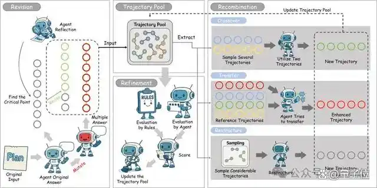
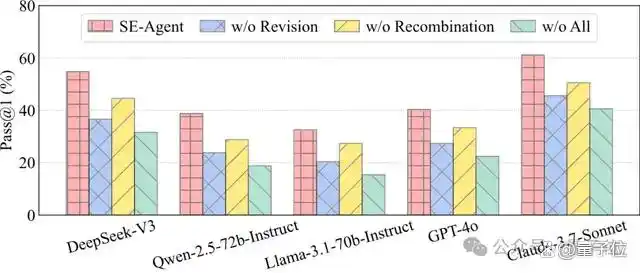
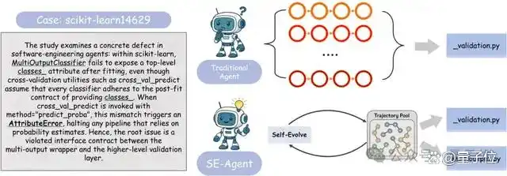
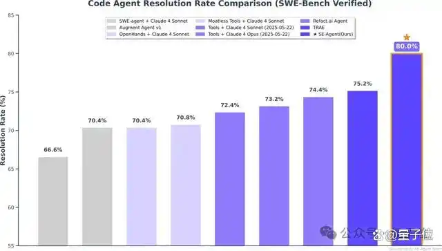

# 1. 资源

- 论文标题： SE-Agent: Self-Evolution Trajectory Optimization in Multi-Step Reasoning with LLM-Based Agents
- 论文链接： https://arxiv.org/pdf/2508.02085
- 开源代码： https://github.com/JARVIS-Xs/SE-Agent

本论文团队还创立了学术组织QuantaAlpha，成员来自北大、中科院、CMU等，旨在探索智能和引领前沿。我们将在CodeAgent、AgentRL等方向持续产出高质量的研究。主页：https://quantaalpha.github.io

# 2. 原理

突破多步推理瓶颈，让Claude-3.7-Sonnet解题成功率暴增20.6%。

在SWE-Bench Verified上刷新开源框架SOTA！

中科院、清华大学、阶跃星辰等提出SE-Agent，一个创新的自进化（Self-Evolution）框架。

它不再满足于简单地“多想几次”，而是让智能体学会系统性地修订、重组与精炼其整个思考过程，通过多轨迹间的相互启发与对抗，探索更广阔、更多样化的解决方案空间。

随着Claude 4模型的发布，SE-Agent的性能被推向新的高度：在SWE-Bench Verify上，它取得了高达80%的Top-1 Resolution Rate，再次刷新了领域纪录。

这充分证明该框架可以随着基础模型升级而不断进步。

核心思想：从“独立尝试”到“集体进化”
大语言模型（LLM）驱动的智能体在处理复杂推理和工具使用方面展现了惊人的潜力，尤其是在软件工程等需要多步骤交互的任务上。然而，现有方法（如蒙特卡洛树搜索
MCTS）常常陷入困境：它们将每次的解决尝试（即“轨迹”）视为独立事件，忽视了不同解决方案路径之间的内在联系，导致思维固化，难以跳出局部最优解。
通俗来说，传统智能体就像一群各自为战的士兵，虽然人数众多，但缺乏协同。SE-Agent则引入了“进化”的视角，将每一次解决问题的完整路径（轨迹）视为一个“物种”，通过三大核心操作，让这些“物种”在一个“生态系统”中迭代进化，优胜劣汰。

SE-Agent的三大进化算子：
1、修订（Revision）-深度自省与定向改进
生成初始多样性：首先，通过多样的规划策略和可控的“突变”，生成一个包含不同解题思路的初始轨迹池，确保进化的起点足够丰富。
反思与修正：随后，智能体对每一条初始轨迹进行“复盘”，分析其优缺点、逻辑断点和潜在的改进空间，然后进行有针对性的修正，消除逻辑不一致和冗余推理，完成个体的自我完善。
2、重组（Recombination）-跨轨迹的“杂交”与学习
这是SE-Agent最具创新性的部分。它不再将轨迹视为孤岛，而是促进它们之间的“知识共享”。
交叉融合（Crossover）：识别并提取不同轨迹中的高效片段（例如，一个轨迹擅长定位问题，另一个擅长编写修复代码），然后将这些“优势基因”组合起来，创造出全新的、更强大的混合轨迹。
知识迁移（Transfer Learning）：将成功轨迹中的关键策略和洞见，系统性地“嫁接”到其他表现较差的轨迹上，实现“差生”向“优等生”的学习。
3、精炼（Refinement）-多维评估与优化选择
在每一轮进化后，SE-Agent会通过一个多维度评估函数（综合考量任务完成度、推理质量和效率）对所有新旧轨迹进行打分。
精英选择：保留得分最高的“精英”轨迹，同时通过策略性选择确保轨迹的多样性，避免所有方案趋同。这个过程不断迭代，直到找到能够稳健解决问题的最优解。
在最具挑战性的代码基准上实现 SOTA
研究团队以SWE agent作为我们的Baseline，在公认极具挑战性的SWE-bench Verified基准（包含500个真实GitHub问题）上对SE-Agent进行了全面评测。结果显示，SE-Agent在所有测试的LLM上都实现了显著的性能提升。
开源模型表现（Pass@1）：
DeepSeek-V3：从31.6%提升至54.8%（+73%相对提升）
Qwen-2.5-72B：从18.8%提升至38.8%（+106%相对提升）
Llama-3.1-70B：从15.4%提升至32.6%（+112%相对提升）
闭源模型表现（Pass@1）：
GPT-4o：从22.4%提升至40.4%（+80%相对提升）
Claude-3.7-Sonnet：从40.6%提升至61.2%（+51%相对提升）

值得注意的是，SE-Agent在Claude-3.7-Sonnet上达到了61.2%的首次尝试成功率，这创造了开源智能体框架在SWE-bench Verified上的最佳性能记录。消融实验进一步证明，修订和重组两大模块对于框架的成功至关重要。
核心优势与技术突破
SE-Agent的成功源于对现有智能体范式的几大核心突破：
1、真正的解决方案多样性：不同于传统方法仅在表面表达上有所不同，SE-Agent通过轨迹级干预，生成本质上不同的解决路径，大幅扩展了候选解决方案空间。
2、跨轨迹协同智能：SE-Agent充分利用轨迹间的丰富相互依赖关系和潜在协同效应，实现了集体智慧的最大化，突破了单一智能体的认知局限。
3、高效进化收敛：相比传统遗传算法，SE-Agent通过结构化的进化机制，能在显著更少的进化周期内实现高质量结果。
4、模型无关的即插即用：SE-Agent作为一个独立的优化模块，可与现有智能体框架无缝集成，在多种 LLM 上都展现出一致的、强大的性能提升。
案例研究：SE-Agent如何跳出思维定势？
在一个scikit-learn的真实Bug修复案例中，传统智能体的问题显露无遗。

传统智能体（上图）：所有尝试都紧盯报错信息出现的_validation.py文件，提出的修复方案几乎是“换汤不换药”的重复，始终无法触及问题的根源，导致测试失败。
SE-Agent（下图）：通过轨迹的重组与进化，SE-Agent强迫自己探索了完全不同的方向。它跳出了最初报错的文件，成功定位到根源在于multioutput.py文件缺少了一个关键字段的写入。最终，通过一行代码的根本性修复，完美通过了所有测试。
这个案例生动地说明了SE-Agent如何通过在轨迹层面进行演化，有效避免了“隧道视野”，从而发现那些隐藏更深、也更为关键的解决方案。
结论与技术影响
SE-Agent的提出，为提升LLM智能体的复杂推理能力提供了一个全新的、高效的范式。其重要影响在于：
1、开创了轨迹级优化范式：从传统的参数调整转向系统性的推理路径操作，为智能体能力提升提供了新的理论基础。
2、验证了集体智慧机制：证明了通过跨轨迹学习实现智能体群体智慧的有机融合，是突破单一智能体认知瓶颈的有效途径。
3、构建了自进化智能系统：为实现能够持续自我改进的智能体系统铺平了道路。
展望未来，研究团队计划将SE-Agent的自进化思想扩展到更广泛的路径搜索问题中，例如强化学习策略发现、具身智能规划等，为通往更强大、更鲁棒的通用人工智能持续贡献力量。

# 3. 实验

# 参考

[1] 突破Claude-4编程上限！自进化Agent框架拿下新SOTA，已开源，https://mbd.baidu.com/newspage/data/landingsuper?context=%7B%22nid%22%3A%22news_9804148183228609953%22%7D&n_type=1&p_from=3