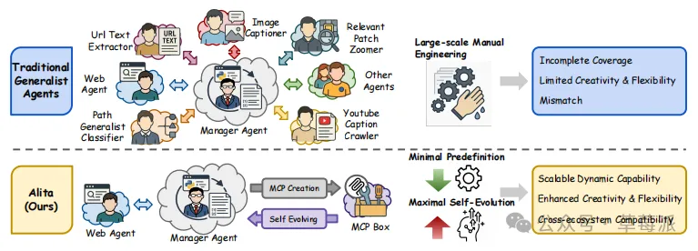
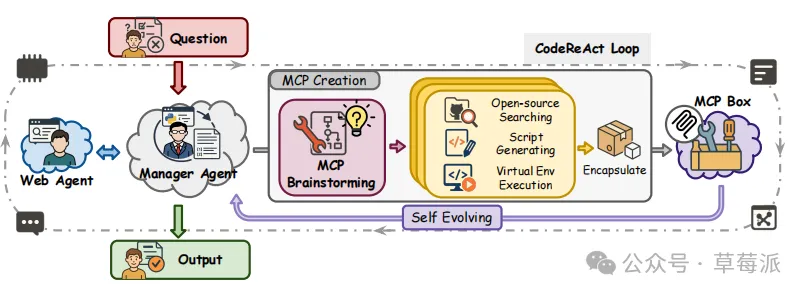

ALITA: GENERALIST AGENT ENABLING SCALABLE AGENTIC  REASONING WITH MINIMAL  PREDEFINITION AND MAXIMAL  SELF-EVOLUTION           简称Alita

Alita是今年5月由普林斯顿、清华大学等团队联合发表的一篇论文。

Alita 是一个通用Agent，只有一个核心组件Web Agent，它的核心逻辑是 “最小化预定义，最大化自进化”。

什么意思呢？

最小预定义：仅配备Web Agent作为核心能力。

最大自进化：Agent自主构建外部能力，通过生成任务相关的MCP从开源资源中扩展。

Alita与传统的Agent系统的区别从下面的图中可以看出来。

传统的通用智能体，为了应对各种场景，开发者恨不得把所有能想到的工具都塞进去——网页搜索、PDF读取、图像处理……导致系统极其臃肿，且永远无法覆盖所有场景。

Alita只有一个核心组件，缺什么，它自己来生成。

Alita是怎么实现的呢？

我们可以通过下面这张图来举一个例子。

现在有一个任务，需要提取YouTube 视频里的特定字幕信息。

Alita 发现自己根本没有下载 YouTube 字幕的工具。于是Alita 启动了它的 “MCP 创作循环” ：

第一步，头脑风暴 。Alita 思考：“我需要一个能爬取 YouTube 字幕的工具。”于是定义这个工具需要什么输入和输出 。

第二步，去搜索。它操控 Web Agent 去 GitHub 上搜索开源库，发现了一个叫youtube-transcript-api的开源库。

第三步，现场造工具 。Alita 阅读了这个库的文档，然后现场写了一段 Python 代码，创建了一个全新的工具。

第四步，测试与封装。它在一个隔离环境里运行代码，测试成功后，将这个新工具封装成一个 MCP（模型上下文协议），存入自己的武器库（MCP Box）。

就这样，Alita 不仅完美解决了当下的问题，而且下次再遇到类似任务时，它直接就能从武器库里掏出这个工具复用。

通过 Alita 我们看到了 AI Agent 进化的一个分水岭：

传统的 Agent：是打工人。给它铲子，它就挖坑；没铲子，它就歇着。

自进化Agent：是合伙人。给它目标，它发现没铲子，会自己去铁匠铺学打铁，造一把铲子，甚至造一台挖掘机，把活干完。

未来的智能体，将不再受限于人类开发者的想象力，它们将自己定义边界。

# 参考

[1] 没铲子就自己打铁---自进化Agent：从工具调用到工具创造, https://mp.weixin.qq.com/s/MjKmB-hL4V08aynhIfgjQA